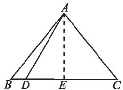
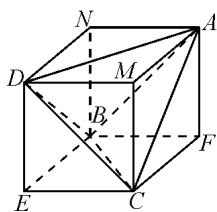

# 关注“构造思想”在解题中的活用

# ● 江苏省常熟市浒浦高级中学 张文景

数学中的“构造思想”，是指在观察、分析的基础上，灵活构造适当的数学模型，进而找出解决问题的方法，其具有直观性、灵活性、构造性、可行性和思维的多样性等特点。在解题教学中，有意识地加强学生对“构造思想”的理解与运用，不仅有利于提高学生的数学学习能力，而且有利于拓展学生的数学思维能力 $^{[1]}$ 。

# 1 构造等差数列,巧解题

一般地,遇到形如 $a_{n+1}=\frac{a_{n}}{1+\lambda a_{n}}(\lambda\neq0)$ 型递推式,可通过两边取倒数变形,获得数列 $\left\{\frac{1}{a_{n}}\right\}$ 是首项为 $\frac{1}{a_{1}}$ ,且公差为 $\lambda$ 的等差数列.

例 1 在数列 $\{a_{n}\}$ 中，已知 $a_{1}=1, a_{n+1}=\frac{a_{n}}{1+2a_{n}}$ ，求数列 $\{a_{n}\}$ 的通项公式.

分析: 对递推式 $a_{n+1}=\frac{a_{n}}{1+2a_{n}}$ 两边取倒数, 得 $\frac{1}{a_{n+1}}=\frac{1+2a_{n}}{a_{n}}=\frac{1}{a_{n}}+2$ , 进而移项变形得 $\frac{1}{a_{n+1}}-\frac{1}{a_{n}}=2$ (常数). 所以, 数列 $\left\{\frac{1}{a_{n}}\right\}$ 是首项为 $\frac{1}{a_{1}}=1$ , 且公差为 2 的等差数列.

于是，可得 $\frac{1}{a_n} = 1 + 2(n - 1) = 2n - 1.$

故所求 $a_{n}=\frac{1}{2n-1}.$

评注:本题求解关键在于三点.一是对数列递推式“取倒数”变形;二是根据等差数列的定义,灵活构造等差数列;三是灵活运用等差数列的通项公式,巧解题.

# 2 构造等比数列,巧解题

数列求通项时,遇到形如 $a_{n+1}=p\cdot a_{n}+q$ (常数 $p\neq0,1$ ) 型递推式, 可通过“同加”(注意“同加”的规律: $\frac{q}{p-1}$ ), 构造等比数列加以巧妙求解.

例 2 已知数列 $\{a_{n}\}$ 中， $a_{1}=1, a_{n}=2a_{n-1}+3$ $(n\geqslant2$ ，且 $n\in N^{*})$ ，求 $a_{n}$ .

分析:对递推式两边都加上3,得 $a_{n}+3=2a_{n-1}+3+3=2(a_{n-1}+3)$ .又由 $a_{1}+3=4\neq0$ ,得 $a_{n-1}+3\neq0$ ,

从而 $\frac{a_n + 3}{a_{n - 1} + 3} = 2(n\geqslant 2$ ，且 $n\in \mathbf{N}^*$

于是，数列 $\{a_{n} + 3\}$ 是首项为4，且公比为2的等比数列.

所以，可得 $a_{n} + 3 = 4\cdot 2^{n - 1} = 2^{n + 1}$

故所求 $a_{n} = 2^{n + 1} - 3.$

评注:上述求解的关键是先利用“同加”变形,构造等比数列;再灵活运用等比数列的通项公式,巧解题.

# 3 构造函数,巧解题

处理函数与不等式的交汇问题时,若题设中给出了与导数有关的不等式,则往往需要考虑导数的运算法则,先灵活构造新函数,再根据新函数的单调性加以巧解.

例 3 已知 $f(x)$ 为定义在 $(-∞,+∞)$ 上的可导函数，且 $f(x)<f'(x)$ 对于任意 $x\in R$ 恒成立，则（）.

A. $f(2)>\mathrm{e}^{2}f(0),f(100)<\mathrm{e}^{100}f(0)$   
B. $f(2)<\mathrm{e}^{2}f(0),f(100)>\mathrm{e}^{100}f(0)$   
C. $f(2)>\mathrm{e}^{2}f(0),f(100)>\mathrm{e}^{100}f(0)$   
D. $f(2) < \mathrm{e}^{2} f(0), f(100) < \mathrm{e}^{100} f(0)$

分析:设函数 $F(x)=\frac{f(x)}{\mathrm{e}^{x}}$ ，则求导得 $F'(x)=\frac{f'(x)-f(x)}{\mathrm{e}^{x}}$ 。因为 $f(x)<f'(x)$ ，所以 $\frac{f'(x)-f(x)}{\mathrm{e}^{x}}>0$ ，即 $F'(x)>0$ ，从而函数 $F(x)$ 在 $(-∞,+∞)$ 上单调递增。

于是当 x > 0 时， $F(x) > F(0)$ ，即 $\frac{f(x)}{\mathrm{e}^{x}} > \frac{f(0)}{\mathrm{e}^{0}} = f(0)$ ，所以 $f(x) > \mathrm{e}^{x} f(0)$ .

从而，可得 $f(2) > \mathrm{e}^{2} f(0)$ ， $f(100) > \mathrm{e}^{100} f(0)$ .

故答案选C.

评注:从目标问题出发,通过观察各选项所给不等式的外在结构特点,很容易想到构造函数,进而灵活运用函数的单调性解决问题.

# 4 构造向量,巧解题

一般地，遇到“之积之和”形式的代数式，可考虑数量积运算公式 $\vec{a} \cdot \vec{b} = x_1x_2 + y_1y_2$ ，先灵活构造两个向量，再利用向量不等式- $|\vec{a} | |\vec{b}| \leqslant \vec{a} \cdot \vec{b} \leqslant$

$\left|\vec{a}\right|\left|\vec{b}\right|$ 加以求解.

例4 求函数 $f(x) = 3\sqrt{1 - x} + \sqrt{3 + 4x}$ 的最大值.

分析: 因为 $f(x)=3\cdot\sqrt{1-x}+2\cdot\sqrt{x+\frac{3}{4}}$ ，所以可构造 $\vec{a}=(3,2),\vec{b}=(\sqrt{1-x},\sqrt{x+\frac{3}{4}})$ .

于是， $f(x) = \vec{a}\cdot \vec{b}\leqslant |\vec{a} ||\vec{b}| = \sqrt{13}\times \sqrt{\frac{7}{4}} =$ $\frac{\sqrt{91}}{2}$ ，当且仅当 $\vec{a} = \overrightarrow{\lambda b} (\lambda >0)$ ，即 $\left\{ \begin{array}{ll}3 = \lambda \sqrt{1 - x},\\ 2 = \lambda \sqrt{x + \frac{3}{4}}, \end{array} \right.$ 亦即 $x = -\frac{11}{52}$ （此时 $\lambda = \frac{2\sqrt{91}}{7})$ 时，不等式取等号.

故当 $x=-\frac{11}{52}$ 时，函数 $f(x)$ 取得最大值 $\frac{\sqrt{91}}{2}$ .

评注:上述解法中需关注两点:一是如何根据函数表达式,灵活构造向量;二是利用向量不等式求解最值问题时,必须具体考查不等式取等号的条件是什么.

# 5 构造直角三角形,巧解题

处理有关解三角形的问题时,我们往往关心的是正、余弦定理在解题中的灵活运用.实际上,有不少这样的解三角形问题,往往可通过构造直角三角形巧妙获解 $^{[2]}$ .

例 5 在 $\triangle ABC$ 中， $AB = AC = 2, BC = 2\sqrt{3}$ ，点 D 在 BC 边上， $\angle ADC = 45^{\circ}$ ，则 AD 的长度等于 \_\_\_\_.

分析: 如图 1, 作 $AE \perp BC$ , 垂足为 E, 则由 AB = AC 知 E 为 BC 中点. 于是, $EC = \frac{1}{2} BC = \sqrt{3}$ , 又 AC = 2, 所以

text_image

A
B D E C

图1

$$
A E = \sqrt {A C ^ {2} - E C ^ {2}} = \sqrt {2 ^ {2} - (\sqrt {3}) ^ {2}} = 1.
$$

从而，在 Rt△ADE 中，由 AE=1，∠ADE=45°，可得 $AD=\sqrt{2}$ .

评注:①结合 AB=AC 或 $\angle ADC=45^{\circ}$ ，本题应作 BC 边上的高；②本题如果不作辅助线，则应综合运用正、余弦定理解题，整个过程相对较繁！

# 6 构造直线和圆,巧解题

一般地, 设 d 表示圆心到直线的距离, r 表示圆的半径, 则直线与圆有公共点(即相切或相交) $\Leftrightarrow d \leqslant r$ . 灵活运用这一结论, 可顺利解决许多貌似与直线和圆无关的数学问题, 往往巧妙之极, 真的令人拍案叫绝!

例 6 （2014·浙江卷）已知实数 a, b, c 满足 $a +$ $b+c=0,a^{2}+b^{2}+c^{2}=1$ ，则 a 的最大值是 \_\_\_\_.

解析: 因为 $a + b + c = 0, a^{2} + b^{2} + c^{2} = 1$ ，所以点 $(b, c)$ 不但在直线 $x + y + a = 0$ 上，且也在圆 $x^{2} + y^{2} = 1 - a^{2}$ 上，即直线与圆有公共点 $(b, c)$ 。所以 $\frac{|a|}{\sqrt{2}} \leqslant \sqrt{1 - a^{2}}$ ，即 $|a| \leqslant \sqrt{2(1 - a^{2})}$ ，两边平方化简得 $a^{2} \leqslant \frac{2}{3}$ ，所以 $|a| \leqslant \frac{\sqrt{6}}{3}$ 。故所求 a 的最大值是 $\frac{\sqrt{6}}{3}$ 。

评注:本题结合直线方程 $ax + by + c = 0$ 和圆的标准方程 $(x - a)^{2} + (y - b)^{2} = r^{2}$ 的外在结构特征,很容易想到利用已知方程的几何意义,去构造直线和圆,巧解题.

# 7 构造特殊的几何体,巧解题

由于长方体和正方体是特殊的立体图形,它们均具有许多特殊的性质,所以分析、解决有关三棱锥(即四面体)的问题时,往往可通过构造长方体或正方体加以巧妙求解.

例 7 已知三棱锥 A-BCD 的所有棱长都为 $\sqrt{2}$ ，则该三棱锥外接球的体积是 \_\_\_\_.

分析: 如图 2, 构造正方体 ANDM-FBEC, 则因为三棱锥 A-BCD 的所有棱长都为 $\sqrt{2}$ , 所以该正方体的棱长为 1, 从而该正方体的外接球半径为 $\frac{\sqrt{3}}{2} \times 1 = \frac{\sqrt{3}}{2}$ .

text_image

Geometric diagram of a cube with labeled vertices and internal points, used for spatial geometry problems.

图 2

又注意到三棱锥 A-BCD 的图 2
外接球就是该正方体的外接球, 所以三棱锥 A-BCD 的外接球半径为 $\frac{\sqrt{3}}{2}$ . 故该三棱锥外接球的体积 V = $\frac{4}{3}\pi\left(\frac{\sqrt{3}}{2}\right)^{3} = \frac{\sqrt{3}}{2}\pi.$

评注:一般地,若遇到四面体的对棱长相等,则可通过构造长方体巧妙求解;若遇到四面体的所有棱长均相等,则可通过构造正方体巧妙求解.若一个三棱锥的三条侧棱两两互相垂直,侧棱长分别为a,b,c,则通过构造长方体模型,易知该三棱锥的外接球半径为 $\frac{1}{2}\sqrt{a^{2}+b^{2}+c^{2}}$ .

不难发现,关注“构造思想”在解题中的灵活运用,有利于等价转化目标问题,有利于变换角度看透问题的本质,有利于培养学生在数学抽象方面的核心素养 $^{[3]}$ !

# 参考文献：

[1]朱海玲.运用构造思想提升高中生数学解题效率[J].广西教育,2018(22):159-160.  
[2]崔道永.例谈函数单调性中的“构造思想”[J].上海中学数学,2012(3):21-23.  
[3]许红卫.妙用构造思想巧解高中数学[J].吉林教育,2010(34):68.Z