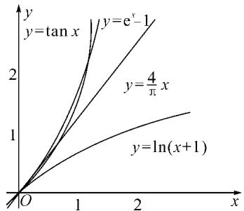

# 创新解题方法 培养创新能力

——以一道比较大小的选择压轴题为例

# ●湖北随州二中 操厚亮

《普通高中数学课程标准(2017年版)》提出“四能”，即发现问题、提出问题、分析问题、解决问题的能力的总目标。数学中的创新往往始于问题，发现问题是创新的基础。数学家们常说：发现问题往往比结论更重要。因此，教师应适时、适度引导学生发现、提出一些数学问题，进而分析和解决问题，培养学生的数学学科核心素养和创新能力。

# 1 试题呈现

(2022 广东广州高三开学考试第 8 题) 设 $a = \ln 1.1$ , $b = \mathrm{e}^{0.1} - 1$ , $c = \tan 0.1$ , $d = \frac{0.4}{\pi}$ , 则 ( ).

$$
\mathrm{A}. a <   b <   c <   d
$$

$$
\mathrm{B}. a <   c <   b <   d
$$

$$
\mathrm{C}. a <   b <   d <   c
$$

$$
\mathrm{D}. a <   c <   d <   b
$$

# 2 观察发现问题,不断创新解法,培养创新能力

# 2.1 观察发现 1

观察四个数,不难发现 0.1 这个数高频出现,可以尝试构造函数,自变量 x 在包含 0.1 的一个区间内,如果这些函数在该区间内大小关系确定,那么在 x=0.1 处的函数值大小关系也确定.这体现了数学中的一种共性与个性的关系,一般与特殊的数学思想方法.

解法一:构造函数+放缩法.

设 $a(x)=\ln(x+1)$ , $b(x)=\mathrm{e}^{x}-1$ , $c(x)=\tan x$ , $d(x)=\frac{4}{\pi}x$ ，易得 $a(0)=b(0)=c(0)=d(0)$ .

①设 $y=d(x)-b(x)=\frac{4}{\pi}x-e^{x}+1$ ，则由 $y'=\frac{4}{\pi}-e^{x}=0$ ，得 $x=\ln\frac{4}{\pi}$ 。所以 $y=d(x)-b(x)$ 在 $(-∞, \ln\frac{4}{π})$ 上单调递增。

因为 $\left(\frac{4}{\pi}\right)^{10} > \left(\frac{4}{3.2}\right)^{10} = \left(\frac{5}{4}\right)^{10} = \left(\frac{25}{16}\right)^{5} > \left(\frac{24}{16}\right)^{5} =$ $\left(\frac{3}{2}\right)^{5} > \mathrm{e}$ , 即 $\left(\frac{4}{\pi}\right)^{10} > \mathrm{e}$ , 故 $10\ln \frac{4}{\pi} > 1$ .

故 $d(0.1) - b(0.1) > d(0) - b(0) = 0$ ，即 $d > b$

②设 $y = b(x) - c(x) = \mathrm{e}^x - 1 - \tan x$ ，则 $y' = \mathrm{e}^x - \frac{1}{\cos^2 x} = \frac{\mathrm{e}^x \cos^2 x - 1}{\cos^2 x}$ . 设 $f(x) = \mathrm{e}^x \cos^2 x - 1$ ，则

$$
f ^ {\prime} (x) = \mathrm{e} ^ {x} (\cos^ {2} x - \sin 2 x)
$$

$$
= \mathrm{e} ^ {x} (- \sin^ {2} x - \sin 2 x + 1).
$$

设 $g(x)=x-\sin x$ ，则 $g'(x)=1-\cos x\geqslant0$ ，从而 $g(x)=x-\sin x$ 为增函数.

所以 $x \in [0, 0.1]$ 时， $g(x) \geqslant g(0) = 0$ ，即 $x \geqslant \sin x$ .

故 $f'(x) \geqslant \mathrm{e}^x (-x^2 - 2x + 1) = \mathrm{e}^x [-(x + 1)^2 + 2]$ ，当 $x \in [0, 0.1]$ 时 $f'(x) > 0, f(x) = \mathrm{e}^x \cos^2 x - 1$ 为增函数，有 $f(x) \geqslant \mathrm{e}^x \cos^2 0 - 1 = 0$ ，从而当 $x \in [0, 0.1]$ 时， $y = b(x) - c(x)$ 为增函数。

故 $b(0.1) - c(0.1) > b(0) - c(0) = 0$ ，即 $b > c$

③设 $y=c(x)-a(x)=\tan x-\ln(x+1)$ ，则 $y'=\frac{1}{\cos^{2}x}-\frac{1}{x+1}=\frac{x+\sin^{2}x}{(x+1)\cos^{2}x}$ ，易得当 $x\in(0,0.1)$ 时， $y'>0$ ，故 $c(0.1)-a(0.1)>c(0)-a(0)=0$ ，即 c>a.

综上， $d>b>c>a$ .

# 2.2 观察发现 2

由解法一不难发现,上述构造的这些函数是常见的函数,借助图象,观察图象的上下关系进而比较数值间的大小关系,优化解法一则得下面的解法二.

解法二: 图象+构造函数+放缩法.

line

| x    | y=tan x | y=e^x-1 | y=4/π x | y=ln(x+1) |
| ---- | ------- | ------- | ------- | --------- |
| 0    | 0       | 0       | 0       | 0         |
| 1    | ~1.5    | ~2.0    | ~1.0    | ~0.5      |
| 2    | ~3.0    | ~4.0    | ~1.5    | ~0.8      |

图 1

如图 1,0<x< $\frac{\pi}{4}$ 时，有 $\ln(x+1)<x<\tan x<\frac{4}{\pi}x$ .

设 $f(x)=\sin x-(e^{x}-1)\cos x$ ，则

$$
f (0) = 0, f ^ {\prime} (x) = \left(\mathrm{e} ^ {x} - 1\right) (\sin x - \cos x).
$$

所以 $x \in \left(0, \frac{\pi}{4}\right)$ 时， $f'(x) < 0$ ，从而 $f(x) < 0$ 。

于是 $\tan x < e^{x} - 1$ .

设 $h(x) = \frac{4}{\pi} x - \mathrm{e}^x + 1$ ，则 $h'(x) = \frac{4}{\pi} - \mathrm{e}^x$ ，当 $x \in \left(0, \ln \frac{4}{\pi}\right)$ 时， $h(x)$ 单调递增.

又 $\ln \frac{4}{\pi} > 1 - \frac{\pi}{4} > 0.1$ ，则 $h(0.1) > h(0) = 0$ .

所以 $e^{0.1}-1<\frac{0.4}{\pi}.$

故 $a < c < b < d$ .

# 2.3 观察发现 3

由解法二不难发现,这些构造的函数图象比较相似,接近幂函数在区间 $(0,1)$ 上的图象,由此联想泰勒展公式的功能,可以借助泰勒展开式来估算.

解法三:由 $\ln(1+x)=x-\frac{x^{2}}{2}+\frac{x^{3}}{3}+o(x^{3})$ ，可得

$$
a = \ln (1 + 0. 1) \approx 0. 1 - \frac {0 . 0 1}{2} <   0. 1.
$$

由 $\mathrm{e}^x = 1 + x + \frac{x^2}{2!} + o(x^2)$ ，得 $b = \mathrm{e}^{0.1} - 1\approx 1 + 0.1+$ $\frac{0.01}{2} -1 = 0.1 + \frac{0.01}{2}\approx 0.1055.$

由 $\tan x = x + \frac{x^3}{3} + o(x^3)$ ，得 $c = \tan 0.1 \approx 0.1 + \frac{0.001}{3} = 0.1003$ .

又 $d = \frac{0.4}{\pi} > 0.12$ ，所以 $d > b > c > a$ .

评:本题还可以用 $[2,2]$ 阶帕德逼近来比较大小,但帕德逼近相对泰勒展开式来讲是一种精度更高的分式函数逼近,此处略去.有兴趣的读者可自行研究.

# 2.4 观察发现 4

继续观察构造的这些函数的图象,不难发现,这些函数在0处的函数值均相同,不同的是其增长速度快慢有别.那么通过增长速度的快慢比较大小是一种创新的解法,到此完美突破难点.

解法四:研究函数在 x=0 处的增长速度,通过增长速度快慢比大小.

设 $f(x)=\ln(1+x)$ ，则 $a=f(0.1)$ .

设 $g(x)=\mathrm{e}^{x}-1$ ，则 $b=g(0.1)$ .

设 $h(x)=\tan x$ ，则 $c=h(0.1)$ .

设 $k(x)=\frac{4}{\pi}x$ ，则 $d=k(0.1)$ .

又 $f(0)=g(0)=h(0)=k(0)$ ,

$$
f ^ {\prime} (0) = g ^ {\prime} (0) = h ^ {\prime} (0) = 1 <   k ^ {\prime} (0) = \frac {4}{\pi},
$$

所以 $d$ 最大.

又 $f''(0) \leqslant h''(0) \leqslant g''(0)$ , 所以 $a < c < b$ .

综上可知， $d>b>c>a$ .

# 3 巩固提高

(1)(2022年高考Ⅰ卷第7题)设 $a=0.1e^{0.1}$ , $b=\frac{1}{9}$ , $c=-\ln0.9$ , 则().

A.a<b<c

B. c < b < a

C. c < a < b

D. $a < c < b$

(2)(2021年高考乙卷第8题)设 $a=2\ln1.01,b=\ln1.02,c=\sqrt{1.04}-1$ ，则().

A.a<b<c

B. $b<c<a$

C. c < a < b

D. $c < a < b$

(3)(德州市2021年三月模拟考试题)若 $x+y-1=e^{x}+2\ln\frac{y}{2}$ ，其中x>2,y>2，则下列结论一定成立的是().

A.2x>y

B. $2e^{\frac{x}{2}}>y$

C.x>y

D. $2e^{x}>y$

答案:(1)C;(2)B;(3)D.

# 4 结束语

众所周知，比较大小的试题每年高考都有出现，尤其是近两年，精度越来越高，难度越来越大，方法越来越灵活多样。作差、作商、插值，以及简单的构造函数利用单调性比较已经不能解决变化着的新问题。如何快速突破此类问题刻不容缓，必备基本功除了不等式的性质、基本不等式，还需要熟悉常见的不等式，如，糖水不等式、对数糖水不等式、泰勒展开式（函数不等式：切线放缩、曲线放缩等），了解帕德逼近等知识。对本道题而言，容易想到的方法是构造函数作差求最值比较大小，体现了一般到特殊的思想方法，对用导数的方法研究最值和计算求解能力要求较高，而用泰勒展开式和帕德逼近来估算的话，思维降维了，但站位较高，这些都是高等数学里的知识。但通过函数在某点处的增长速度来比较大小确实是一种创新解法，学生易接受。

在函数与导数教学与学习的过程中,对一些难题,应微专题分析,引导学生观察发现问题,不断创新解题方法,进而培养学生的探究与创新精神. Z