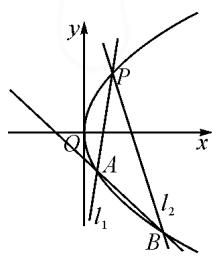
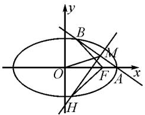
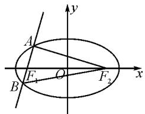
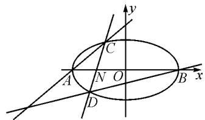

# 基于核心素养的解题反思

——以一道解析几何题为例

●广东省珠海市斗门第一中学 骆晓梅  
●广东省中山市华侨中学 付中华

摘要: 在高三复习中, 学生需要解大量的题目, 因而常常陷入题海战术. 作为教师, 需要积极引导, 教会学生如何进行解题后的反思和总结, 提高题目的利用价值, 以实现举一反三的目的, 起到事半功倍的效果, 从而提高学生的解题能力, 发展学生的核心素养. 本文中以一道解析几何题为例, 进行了探讨.

关键词:高三复习;解题反思;核心素养

在高三复习中,教师应如何引导学生解题反思总结,充分发挥题目的价值,提高教学效率,提升学生的解题能力,发展学生的核心素养?本文中以一道解析几何题为例,进行了探讨.

# 1 试题及解答

原题 已知动圆 E 经过定点 $D(1,0)$ ，且与直线 x = -1 相切，设动圆圆心 E 的轨迹为曲线 C.

(1)求曲线 C 的方程；  
(2)设过点 $P(1,2)$ 的直线 $l_{1}, l_{2}$ 分别与曲线 C 交于 A, B 两点，直线 $l_{1}, l_{2}$ 的斜率存在，且倾斜角互补，证明：直线 AB 的斜率为定值.

解析:(1) $y^{2}=4x$ (解答过程略).

(2)证法一:如图1,由题可知直线 $l_{1},l_{2}$ 的斜率互为相反数,且不为0.设直线 $l_{1}$ 的方程为 $y=k(x-1)+2(k\neq0)$ , $A(x_{1},y_{1}),B(x_{2},y_{2})$ .

text_image

y
P
Q
A
l₁
l₂
B

由 $\left\{\begin{aligned}y&=k(x-1)+2,\\ y^{2}&=4x,\end{aligned}\right.$ 得

$$
\begin{array}{c} k ^ {2} x ^ {2} - (2 k ^ {2} - 4 k + 4) x + \\ (k - 2) ^ {2} = 0. \end{array}
$$

于是 $x_{1} \times 1 = \frac{(k - 2)^{2}}{k^{2}}$ ，即 $x_{1} = \frac{(k - 2)^{2}}{k^{2}}$ .

同理 $x_{2}=\frac{(-k-2)^{2}}{(-k)^{2}}=\frac{(k+2)^{2}}{k^{2}}$ .

所以 $x_{1} + x_{2} = \frac{2k^{2} + 8}{k^{2}}, x_{1} - x_{2} = \frac{-8k}{k^{2}} = \frac{-8}{k}$ .

$$
\begin{array}{r l} & {\text {故} y _ {1} - y _ {2} = k (x _ {1} - 1) + 2 - [ - k (x _ {2} - 1) + 2 ] =} \\ & {k (x _ {1} + x _ {2}) - 2 k = k \bullet \frac {2 k ^ {2} + 8}{k ^ {2}} - 2 k = \frac {8}{k}.} \end{array}
$$

所以 $k_{AB} = \frac{y_1 - y_2}{x_1 - x_2} = -1$ ，即直线 $AB$ 的斜率为定

值-1.

证法二: 易知直线 AB 的斜率存在且不为 0. 设直线 AB 的方程为 $y = kx + b$ , $A(x_{1}, y_{1})$ , $B(x_{2}, y_{2})$ .

由 $\left\{ \begin{array}{l} y = kx + b, \\ y^2 = 4x, \end{array} \right.$ 得 $k^2 x^2 + (2kb - 4)x + b^2 = 0$ ，则

$$
x _ {1} + x _ {2} = \frac {- 2 k b + 4}{k ^ {2}}, x _ {1} x _ {2} = \frac {b ^ {2}}{k ^ {2}}.
$$

所以 $\frac{y_1 - 2}{x_1 - 1} +\frac{y_2 - 2}{x_2 - 1} = \frac{kx_1 + b - 2}{x_1 - 1} +\frac{kx_2 + b - 2}{x_2 - 1} =$ $2k + \frac{(k + b - 2)(x_1 + x_2 - 2)}{x_1x_2 - (x_1 + x_2) + 1} = 0.$

将 $x_{1}+x_{2}$ 与 $x_{1}x_{2}$ 表达式代入上式解得 k=-1，故直线 AB 的斜率为定值 -1。

以上两种证法是学生在解题中出现的最常见的方法,也是通性通法.看似平常的题目和解法,但其背后却有许多地方值得我们好好反思研究.

# 2 对解法的反思

# 2.1 对几何条件代数化的反思

本题中是将倾斜角互补转化为了斜率和为 0. 将题目中的几何关系, 准确地转化为代数关系, 常常是解题的关键. 而恰当的转化, 常常能优化解题过程. 比如两直线垂直, 可以转化为斜率之积为 -1, 也可以转化为向量数量积为 0, 前者需要保证两直线的斜率都存在, 否则需要分类讨论, 后者优势明显. 有时候, 可能需要进行比较复杂的转化.

例 1 设椭圆 $\frac{x^{2}}{a^{2}} + \frac{y^{2}}{3} = 1 (a > \sqrt{3})$ 的右焦点为 F，右顶点为 A，已知 $\frac{1}{|OF|} + \frac{1}{|OA|} = \frac{3e}{|FA|}$ ，其中 O 为原点，e 为椭圆的离心率.

(1)求椭圆的方程；  
(2)如图2,设过点A的直线l与椭圆交于点B(B

不在 x 轴上), 垂直于 l 的直线与 l 交于点 M, 与 y 轴交于点 H, 若 $BF \perp HF$ , 且 $\angle MOA \leqslant \angle MAO$ , 求直线 l 斜率的取值范围.

text_image

y
B
M
O
F
A
x
H

图 2

解析:(1) $\frac{x^{2}}{4}+\frac{y^{2}}{3}=1$ (解答过程略).

(2) 易知 $A(2,0), F(1,0)$ . 设直线 $l: y = k(x - 2) (k \neq 0)$ , 且联立 $\frac{x^2}{4} + \frac{y^2}{3} = 1$ , 解得 $B(\frac{8k^2 - 6}{4k^2 + 3}, \frac{-12k}{4k^2 + 3})$ . 设 $H(0, y_H)$ , 则有 $\overrightarrow{HF} = (1, -y_H), \overrightarrow{BF} = (\frac{9 - 4k^2}{4k^2 + 3}, \frac{12k}{4k^2 + 3})$ .

由 $BF \perp HF$ ，可得 $\overrightarrow{BF} \cdot \overrightarrow{HF} = 0$ .

即 $\frac{9 - 4k^2}{4k^2 + 3} -\frac{12ky_H}{4k^2 + 3} = 0$ ，解得 $y_{H} = \frac{9 - 4k^{2}}{12k}$

直线 MH 的方程为 $y = -\frac{1}{k}x + \frac{9 - 4k^{2}}{12k}$ ，与直线 l 的方程联立，解得 $x_{M} = \frac{20k^{2} + 9}{12(k^{2} + 1)}$ .

在 $\triangle MAO$ 中，由 $\angle MOA \leqslant \angle MAO$ ，得 $|MA| \leqslant |MO|$ ，则 $x_{M} \geqslant 1$ ，即 $\frac{20k^2 + 9}{12(k^2 + 1)} \geqslant 1$ .

解得 $k \leqslant -\frac{\sqrt{6}}{4}$ , 或 $k \geqslant \frac{\sqrt{6}}{4}$ . 所以直线 $l$ 斜率的取值范围是 $(- \infty, -\frac{\sqrt{6}}{4}] \cup [\frac{\sqrt{6}}{4}, +\infty)$ .

本题中，将 $BF \perp HF$ 转化为 $\overrightarrow{BF} \cdot \overrightarrow{HF} = 0$ . 条件 $\angle MOA \leqslant \angle MAO$ 有多种转化方式，如 $\tan \angle MOA \leqslant \tan \angle MAO, k_{MO} \leqslant -k_{MA}, |MA| \leqslant |MO|, x_M \geqslant 1$ 等，而利用 $x_M \geqslant 1$ 则优势非常明显.

# 2.2 对设直线方程形式的反思

一般情况下,学生最常设的直线方程形式为点斜式或斜截式,但也常常忽略了对直线的斜率进行判断或讨论.很多时候,如果可以判断或已经知道直线经过x轴上的点 $(t,0)$ ,特别是斜率可以不存在但是不为0时,则可设直线方程为 $x=my+t$ ,既可以避免分类讨论,又可以简化后期的书写量与运算量,提高运算速度和准确度.原题若采用 $x=my+t$ ,则证题过程要简洁很多.

原题第(2)问的第三种证法如下.

证法三: 易知直线 AB 的斜率不为 0. 设直线 AB 的方程为 $x = my + t$ ，联立 $y^{2} = 4x$ ，得 $y^{2} - 4my - 4t = 0$ 。设 $A(x_{1}, y_{1})$ ， $B(x_{2}, y_{2})$ ，则 $y_{1} + y_{2} = 4m$ 。由题意可得 $k_{1} + k_{2} = 0$ ，即 $\frac{y_{1} - 2}{x_{1} - 1} + \frac{y_{2} - 2}{x_{2} - 1} = \frac{y_{1} - 2}{\frac{y_{1}^{2}}{4} - 1} + \frac{y_{2} - 2}{\frac{y_{2}^{2}}{4} - 1} =$

$$
\frac {4}{y _ {1} + 2} + \frac {4}{y _ {2} + 2} = \frac {4 (y _ {1} + y _ {2} + 4)}{(y _ {1} + 2) (y _ {2} + 2)} = \frac {4 (4 m + 4)}{(y _ {1} + 2) (y _ {2} + 2)} = 0.
$$

所以 m = -1，即直线 AB 的斜率为定值 -1。

例 2 已知椭圆 $C: \frac{x^{2}}{a^{2}} + \frac{y^{2}}{b^{2}} = 1 (a > b > 0)$ 的左、右焦点分别为 $F_{1}, F_{2}$ ，离心率为 $\frac{2\sqrt{5}}{5}$ ， $F_{1}$ 为圆 $x^{2} + y^{2} + 4x + 3 = 0$ 的圆心.

(1)求椭圆 C 的方程;

(2)如图3,设过点 $F_{1}$ 的直线l与C交于A,B两点,求 $\triangle ABF_{2}$ 面积的最大值.

解析: $(1)\frac{x^{2}}{5}+y^{2}=1$ （解答过程略）.

text_image

A
B
F₁ O F₂
x
y

图 3

(2) 易知直线 l 的斜率不为
0. 设 $l: x = my - 2, A(x_{1}, y_{1}), B(x_{2}, y_{2})$ . 由 $\left\{\begin{aligned}x&=my-2,\\ x^{2}&+5y^{2}=5,\end{aligned}\right.$ 得 $(m^{2}+5)y^{2}-4my-1=0$ ，则

$$
y _ {1} + y _ {2} = \frac {4 m}{m ^ {2} + 5}.
$$

于是 $y_{1}y_{2} = -\frac{1}{m^{2} + 5}, |y_{1} - y_{2}| = \sqrt{(y_{1} + y_{2})^{2} - 4y_{1}y_{2}} = \frac{2\sqrt{5}\sqrt{m^{2} + 1}}{m^{2} + 5}.$

所以， $S=\frac{1}{2}\left|F_{1}F_{2}\right|\left|y_{1}-y_{2}\right|=\frac{4\sqrt{5}\sqrt{m^{2}+1}}{m^{2}+5}.$

令 $\sqrt{m^2 + 1} = t(t\geqslant 1)$ ，则 $m^2 = t^2 -1$

于是 $S = \frac{4\sqrt{5}t}{t^2 + 4} = \frac{4\sqrt{5}}{t + \frac{4}{t}} \leqslant \frac{4\sqrt{5}}{2\sqrt{4}} = \sqrt{5}$ ，当且仅当 $t = \frac{4}{t}$ ，即 $t = 2$ ，亦即 $m = \pm 1$ 时， $S$ 取得最大值 $\sqrt{5}$ .

本题中,如果设 $l: y = k(x + 2)$ (斜率存在时),则有 $\left|AB\right| = \frac{2\sqrt{5}(k^{2} + 1)}{5k^{2} + 1}$ , 点 $F_{2}$ 到直线 AB 的距离为 $d = \frac{4|k|}{\sqrt{k^{2} + 1}}$ , $S = \frac{1}{2}|AB|d = \frac{4\sqrt{5}\sqrt{(k^{2} + 1)k^{2}}}{5k^{2} + 1}$ , 中间的运算过程相对复杂,后续的运算对学生来讲也非常困难.

# 2.3 对消元方法的反思

原题第(2)问的证法一、二中，利用了点在直线上消去了 $y_{1},y_{2}$ .证法三中，可以利用点在直线上消去 $x_{1},x_{2}$ ，但考虑到抛物线方程的特殊性，利用点在曲线上消去了 $x_{1},x_{2}$ ，则显得更方便快捷.在实际解题时，需要灵活地考虑.另一方面，三种解法中均是消去了 $x_{1},x_{2},y_{1},y_{2}$ 得到关于参数k（或m）的表达式，如果直接消去 $x_{1},x_{2},y_{1},y_{2}$ 不方便时，则也可以考虑消去

参数 k(或 m).

例3 设椭圆 $E: \frac{x^2}{a^2} + \frac{y^2}{b^2} = 1 (a > b > 0)$ 的右焦点是 $(\sqrt{3}, 0)$ ，离心率是 $\frac{\sqrt{3}}{2}$ .

(1)求椭圆 E 的标准方程；

(2)如图4,设椭圆E的左、右顶点分别是A,B,过定点N(-1,0)的直线与椭圆E交于C,D两点(与点A,B不重合),证明:直线AC,BD的交点的横坐标为定值.

text_image

y
C
A N O B x
D

图4

解析:(1) $\frac{x^{2}}{4}+y^{2}=1$ (解答过程略).

(2) 易知 CD 的斜率不为 0. 设 CD: x = my - 1, $C(x_{1}, y_{1}), D(x_{2}, y_{2})$ .

由 $\left\{\begin{aligned}x&=my-1,\\ x^{2}&+4y^{2}=4,\end{aligned}\right.$ 得 $(m^{2}+4)y^{2}-2my-3=0.$

于是 $y_{1} + y_{2} = \frac{2m}{m^{2} + 4},y_{1}y_{2} = -\frac{3}{m^{2} + 4}$ ，则

$$
2 m = - \frac {3 (y _ {1} + y _ {2})}{y _ {1} y _ {2}}.
$$

易得 $AC: y = \frac{y_{1}}{x_{1} + 2}(x + 2) = \frac{y_{1}}{my_{1} + 1}(x + 2)$ .

同理可得 $BD:y = \frac{y_2}{my_2 - 3} (x - 2).$

联立两直线方程, 得 $x=\frac{4my_{1}y_{2}-6y_{1}+2y_{2}}{3y_{1}+y_{2}}=\frac{-6(y_{1}+y_{2})-6y_{1}+2y_{2}}{3y_{1}+y_{2}}=-4.$

即直线 AC, BD 的交点的横坐标为定值 -4.

本题中，不能利用韦达定理直接消去 $y_{1}, y_{2}$ ，而消去 $m$ 则能顺利化简。本题也可以先利用韦达定理消去 $y_{1}y_{2}$ ，再利用 $y_{1} = \frac{2m}{m^{2} + 4} - y_{2}$ 消去 $y_{1}$ ，也能够顺利化简。

# 3 对新的解题方法的探索反思

对于原题第(2)问,由 $k_{1}+k_{2}=0$ , 可以联想到韦达定理, 从而探索构建关于 k 的二次方程. 通过坐标系的平移, 可以使点 P 为坐标原点, 则斜率可以表示为 $k=\frac{y}{x}$ , 转而探索构建关于 x, y 的齐次方程, 得到下面的证法.

证法四：设 $\left\{ \begin{array}{l} x' = x - 1, \\ y' = y - 2, \end{array} \right.$ 则 $\left\{ \begin{array}{l} x = x' + 1, \\ y = y' + 2. \end{array} \right.$ 代入 $y^2 = 4x$ ，得 $(y' + 2)^2 = 4(x' + 1)$ ，即 $y'^2 + 4(y' - x') = 0$ .

设直线 AB 方程为 $x' = my' + t$ ，则 $\frac{x' - my'}{t} = 1$ .
由 $y'^{2}+4(y'-x')\frac{x'-my'}{t}=0$ ，整理得

$$
(t - 4 m) y ^ {\prime 2} + 4 (m + 1) x ^ {\prime} y ^ {\prime} - 4 x ^ {\prime 2} = 0.
$$

即 $(t-4m)\frac{y'^{2}}{x'^{2}}+4(m+1)\frac{y'}{x'}-4=0.$

设直线 $l_{1}, l_{2}$ 的斜率分别为 $k_{1}, k_{2}$ ，则 $k_{1} + k_{2} = -\frac{4(m + 1)}{t - 4m} = 0$ ，则 $m = -1$ .

故直线 AB 方程为 $x' = -y' + t$ ，于是 $x - 1 = -y + 2 + t$ ，即 $y = -x + t + 3$ ，所以直线 AB 的斜率为定值 -1。

从解答过程来看,如果设直线 AB 方程为 $mx' + ny' = 1$ , 利用“1”的代换将方程齐次化则更加自然. 同时发现, 如果两直线斜率之和或积为定值, 本方法都适用.

# 4 对原题目的反思拓展

原题目中斜率之和为常数 0 时, 直线 AB 的斜率是一个定值. 如果斜率之和是一个非零的常数 p, 直线 AB 有特定的性质吗? 如果斜率之积为一个非零的常数 q, 直线 AB 有特定的性质吗?

由上面证法四，得 $k_{1} + k_{2} = -\frac{4(m + 1)}{t - 4m} = p, t = (4 - \frac{4}{p})m - \frac{4}{p}, x' = my' + (4 - \frac{4}{p})m - \frac{4}{p}, x - 1 = m(y - 2) + (4 - \frac{4}{p})m - \frac{4}{p}$ .

故直线 AB 方程为 $x-(1-\frac{4}{p})=m(y+2-\frac{4}{p})$ .

所以, 直线 AB 过定点 $\left(1-\frac{4}{p}, -2+\frac{4}{p}\right)$ .

由证法四可知 $k_{1}k_{2}=\frac{-4}{t-4m}=q$ ，则 $t=4m-\frac{4}{q}$ ，于是直线 AB 的方程为 $x'=my'+4m-\frac{4}{q}$ ，即 $x-1=m(y-2)+4m-\frac{4}{q}$ ，整理得 $x-(1-\frac{4}{q})=m(y+2)$ ，所以直线 AB 过定点 $(1-\frac{4}{q},-2)$ .

如果将抛物线改为椭圆、双曲线,或者改变点 P 的坐标,依然有类似的结论.具体则由学生自行探究.

在复习时,学生不应是为了做题而做题,教师不是为了讲题而讲题.作为教师,需要深挖题目背后的价值,让一道题充分发挥其应有的价值.指导学生学会反思、学会总结,引导学生举一反三,促进学生的深度学习,提升思维能力,落实核心素养.Z