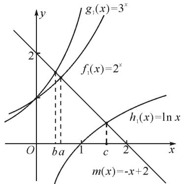

# 幂指对大小比较四妙招

# ●江苏省镇江市丹徒高级中学 邱红英 吴海军

摘要:与幂指对有关的比较大小题型逐渐成为高考单选题的考查热点,往往以压轴题出现,这就要求考生能够根据题目特点,灵活使用相应方法,如:单调性法、中间量法、构造法、几何法、估算法等,进行大小的快速比较.

关键词: 比较大小; 构造函数; 数形结合; 估算

# 1 妙招一: 引入媒介, 巧取中间值

例 1 设 $a=\log_{3}2, b=\log_{5}3, c=\frac{2}{3}$ ，则（）.

A.a<c<b

B.a<b<c

C.b<c<a

D. $c < a < b$

解析：由 $a = \log_32 = \log_3\sqrt[3]{8} < \log_3\sqrt[3]{9} = \frac{2}{3}, b = \log_53 = \log_5\sqrt[3]{27} > \log_5\sqrt[3]{25} = \frac{2}{3}, c = \frac{2}{3}$ ，得 $a < c < b$ 。

故选：A.

方法提炼:本题为异底异真对数式大小比较,优先利用中间量法求解,其中间量可选择 $c=\frac{2}{3}$ 这个常数.本题也可以用比差法进行大小比较.(通性通法:单调性、比较法).

# 2 妙招二：构造函数,单调性比大小

例 2 （2022 新高考I卷，7）设 $a=0.1e^{0.1}, b=\frac{1}{9}$ ， $c=-\ln0.9$ ，则（）.

A.a<b<c

B. $c<b<a$

C. c < a < b

D.a<c<b

解析: 设 $f(x)=\ln(1+x)-x(x>-1)$ .

求导, 得 $f'(x)=\frac{1}{1+x}-1=-\frac{x}{1+x}$ .

当 $x \in (-1,0)$ 时， $f'(x) > 0$ ;

当 $x \in (0, +\infty)$ 时， $f'(x) < 0$ .

所以，函数 $f(x)=\ln(1+x)-x$ 在 $(-1,0)$ 上单调递增，在 $(0,+\infty)$ 上单调递减.

于是 $f(\frac{1}{9}) < f(0) = 0$ ，即 $\ln \frac{10}{9} - \frac{1}{9} < 0$ .

故 $\frac{1}{9}>\ln\frac{10}{9}=-\ln0.9$ ，即b>c.

又 $f(-\frac{1}{10}) < f(0) = 0$ ，所以 $\ln \frac{9}{10} + \frac{1}{10} < 0$ .

故 $\frac{9}{10}<e^{-\frac{1}{10}}$ ，从而 $\frac{1}{10}e^{\frac{1}{10}}<\frac{1}{9}$ ，即a<b.

设 $g(x)=xe^{x}+\ln(1-x)(0<x<1)$ .

则 $g'(x)=(x+1)\mathrm{e}^{x}+\frac{1}{x-1}=\frac{(x^{2}-1)\mathrm{e}^{x}+1}{x-1}.$

令 $h(x)=\mathrm{e}^{x}(x^{2}-1)+1,0<x<1$ , 则 $h'(x)=\mathrm{e}^{x}\cdot(x^{2}+2x-1)$ .

当 $0 < x < \sqrt{2} - 1$ 时， $h'(x) < 0$ ，函数 $h(x)$ 单调递减；当 $\sqrt{2} - 1 < x < 1$ 时， $h'(x) > 0$ ，函数 $h(x)$ 单调递增.

又 $h(0) = 0$ ，所以当 $0 < x < \sqrt{2} - 1$ 时， $h(x) < 0$ 此时 $g'(x) > 0$ ，函数 $g(x)$ 单调递增.

所以 $g(0.1) > g(0) = 0$ ，即 $0.1e^{0.1} > -\ln 0.9$ .

所以 a > c.

故选:C.

例 3 （2021 全国乙卷理,12）设 $a=2\ln1.01, b=\ln1.02, c=\sqrt{1.04}-1$ ，则（）.

A.a<b<c

B.b<c<a

C.b<a<c

D. $c<a<b$

解析: 由 $a=2\ln1.01=\ln1.0201, b=\ln1.02$ ，可得 a>b.

令 $f(x)=2\ln(1+x)-(\sqrt{1+4x}-1)$ , 0<x<1,
令 $\sqrt{1+4x}=t$ ，则 $1<t<\sqrt{5}$ ， $x=\frac{t^{2}-1}{4}$ .

于是 $g(t)=2\ln(t^{2}+3)-t+1-2\ln4$ ，则

$$
g ^ {\prime} (t) = \frac {4 t}{t ^ {2} + 3} - 1 = \frac {4 t - t ^ {2} - 3}{t ^ {2} + 3}
$$

$$
= - \frac {(t - 1) (t - 3)}{t ^ {2} + 3} > 0.
$$

所以 $g(t)$ 在 $(1,\sqrt{5})$ 上单调递增，从而

$$
g (t) > g (1) = 2 \ln 4 - 1 + 1 - 2 \ln 4 = 0.
$$

故 $f(x)>0$ , 可得 a>c.

同理，令 $h(x) = \ln (1 + 2x) - (\sqrt{1 + 4x} - 1)$ ，再令 $\sqrt{1 + 4x} = t$ ，则 $1 < t < \sqrt{5}$ ，且 $x = \frac{t^2 - 1}{4}$ .

由 $\varphi(t) = \ln\left(\frac{t^2 + 1}{2}\right) - t + 1 = \ln\left(t^2 + 1\right) - t + 1 -$

$\ln 2$ , 得 $\varphi'(t) = \frac{2t}{t^2 + 1} - 1 = \frac{-(t-1)^2}{t^2 + 1} < 0$ , 从而 $\varphi(t)$ 在 $(1, \sqrt{5})$ 上单调递减, 则有 $\varphi(t) < \varphi(1) = 0$ . 所以 $h(x) < 0$ , 可得 $c > b$ , 因此 $a > c > b$ .

故选：B.

方法提炼:本组题目难度较大,关键在于将各个值中的共同的量用变量替换,构造函数,利用导数研究相应函数的单调性,进而比较大小.这样的问题,凭借近似估值计算往往是无法解决的.

# 3 妙招三: 数形结合, 交点定大小

例 4 a, b, c 依次表示函数 $f(x)=2^{x}+x-2$ , $g(x)=3^{x}+x-2$ , $h(x)=\ln x+x-2$ 的零点，则 a, b, c 的大小顺序为().

$$
\mathrm{A.} c <   b <   a
$$

$$
\mathrm{B}. a <   b <   c
$$

$$
\mathrm{C}. a <   c <   b
$$

$$
\mathrm{D}. b <   a <   c
$$

解法1:代数法.由基本函数的单调性 $f(x), g(x)$ ， $h(x)$ 在各自定义域上均是增函数.因此对于 $f(x)=2^{x}+x-2$ ，由 $f(\frac{1}{2})=\sqrt{2}+\frac{1}{2}-2<0, f(1)=2+1-2=1>0$ ，知函数 $f(x)$ 在 $\left(\frac{1}{2},1\right)$ 上有唯一的零点，即 $a\in(\frac{1}{2},1)$ ；对于 $g(x)=3^{x}+x-2$ ，由 $g(\frac{1}{2})=\sqrt{3}+\frac{1}{2}-2>0, g(0)=1+0-2=-1<0$ ，可知函数 $g(x)$ 在 $(0,\frac{1}{2})$ 上有唯一的零点，即 $b\in(0,\frac{1}{2})$ ；对于 $h(x)=\ln x+x-2$ ，由 $h(1)=\ln 1+1-2=-1<0, h(2)=\ln 2>0$ ，可知函数 $h(x)$ 在 $(1,2)$ 上有唯一的零点，即 $c\in(1,2)$ .所以b<a<c.故选：D.

解法 2: 几何法. 因为 a, b, c 分别是函数 $f(x) = 2^{x} + x - 2$ , $g(x) = 3^{x} + x - 2$ , $h(x) = \ln x + x - 2$ 的零点. 所以 a, b, c 分别是函数 $f_{1}(x) = 2^{x}$ , $g_{1}(x) = 3^{x}$ , $h_{1}(x) = \ln x$ 与 $m(x) = -x + 2$ 图象交点的横坐标. 由图 1 可得 b < a < c. 故选: D.

text_image

y
g₁(x)=3ˣ
f₁(x)=2ˣ
h₁(x)=ln x
m(x)=-x+2
O b a 1 c 2 x

图 1

方法提炼:指数、对数型超越函数零点大小的比较,利用转化与化归、函数与方程、数形结合思想,将零点问题转化为函数图象的交点问题,通过作图进行大小比较.这种几何法的解题速度比较快.

# 4 妙招四:应考绝招,代值求大小

例 5 已知 $a=\log_{0.2}0.02, b=\log_{6}60, c=\ln6$ ，则下列选项正确的是（）.

$$
\mathrm{A}. b <   a <   c
$$

$$
\mathrm{B}. a <   c <   b
$$

$$
\mathrm{C.} c <   b <   a
$$

$$
\mathrm{D.} c <   a <   b
$$

解法 1: 由 $a=\log_{0.2}0.02=1-\log_{0.2}10=1+\log_{5}10$ ， $b=\log_{6}60=1+\log_{6}10>1+\log_{6}6=2$ ，及 $\log_{5}10>\log_{6}10$ ，得 a>b>2。又 $c=\ln6<\ln e^{2}=2$ ，则 c<b<a。故选：C.

解法 2::代值近似计算.

$$
a = \log_ {0. 2} 0. 0 2 = \log_ {5} 5 0 = \frac {\ln 2}{\ln 5} + 2 \approx \frac {0 . 7 0}{1 . 6 0} + 2 \approx 2. 4 4,
$$

$b=\log_{6}60=1+\frac{\ln2+\ln5}{\ln6}\approx1+\frac{2.30}{1.80}\approx2.28,c=\ln6\approx$ 1.80, 所以 c<b<a. 故选: C.

方法提炼:我们在题目中常见含有 $\ln 2, \ln 3, \ln 5$ 等值的大小比较问题,有时还是单选压轴题,如果能记住常见的这些对数值,就可以独辟蹊径,很快得出结论.

常用必备对数值有：

$\ln 2\approx0.70,\ln 3\approx1.10,\ln \pi\approx1.14,\ln 5\approx1.60,$ $\ln 6\approx1.80,\ln 7\approx1.95.$

# 5 方法总结

由以上各例可知,指、对、幂大小比较的常用方法有:

(1)底数相同,指数不同时,如 $a^{x_{1}}$ 和 $a^{x_{2}}$ , 利用指数函数 $y=a^{x}$ 的单调性比较大小.  
(2)指数相同,底数不同时,如 $x_{1}^{\alpha}$ 和 $x_{2}^{\alpha}$ , 利用幂函数 $y = x^{\alpha}$ 的单调性比较大小.  
(3)底数相同,真数不同时,如 $\log_{a}x_{1}$ 和 $\log_{a}x_{2}$ ,利用对数函数 $y=\log_{a}x$ 的单调性比较大小.  
(4) 底数、指数、真数都不同时，寻找中间变量 0,1 或者其他能判断大小关系的中间量，借助中间量进行大小关系的判定.  
(5)转化为两函数图象交点的横坐标.   
(6)估算法.

常用对数值有：

$$
\ln 2 \approx 0. 7 0;
$$

$$
\ln 3 \approx 1. 1 0;
$$

$$
\ln \pi \approx 1. 1 4;
$$

$$
\ln 5 \approx \frac {\ln 4 + \ln 6}{2} = \frac {2 \ln 2 + \ln 6}{2} \approx \frac {1 . 4 0 + 1 . 8 0}{2} = 1. 6 0;
$$

$$
\ln 6 = \ln 2 + \ln 3 \approx 1. 8 0;
$$

$$
\ln 7 \approx \frac {\ln 6 + \ln 8}{2} \approx \frac {1 . 8 0 + 2 . 1 0}{2} = 1. 9 5.
$$

希望大家在实际应用时灵活应变,选择最佳途径以达到事半功倍的效果.Z