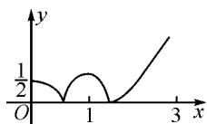
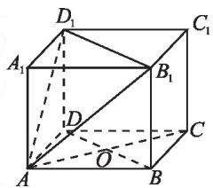
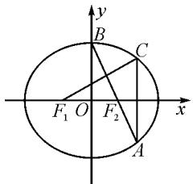

# 应用解题策略 提升解题质量

# 山东省泰安长城中学 朱付菊

高考数学试题题型多变,灵活性强,部分学生对数学有畏难情绪,影响学习的积极性.但若掌握好解题策略,树立起学习的信心,数学这一难关也可以被攻破.基于此,笔者结合历年真题进行剖析,以期师生在复习时可以有针对性地选择合适的解题策略进行训练,以此提升解题能力.

# 1 公式法

公式法可谓是数学解题中最直接、最高效的策略之一，在高考选择题和填空题中占有较大的比重，因此要重视概念、公式、定理等基础知识的积累，扎实的基础是高考制胜的法宝.

例 1 已知复数 $z=(5+2\mathrm{i})^{2}$ (i 为虚数单位)，则 z 的实部为 \_\_\_\_.

考点: 复数的基本概念.

解析: $z=(5+2i)^{2}=25+20i+4i^{2}=25-4+20i=21+20i$ . 故实部为 21.

例 2 在各项均为正数的等比数列 $\{a_{n}\}$ 中， $a_{2}=1, a_{3}=a_{5}+2a_{4}$ ，则 $a_{6}$ 的值为 \_\_\_\_.

考点:等比数列的通项公式.

解析:设公比为 q，因为 $a_{2}=1$ ，则由 $a_{8}=a_{6}+2a_{4}$ 得 $q^{6}=q^{4}+2q^{2}$ ，即 $q^{4}-q^{2}-2=0$ ，解得 $q^{2}=2$ ，所以 $a^{2}q^{4}=4$ 。故 $a_{6}=4$ 。

以上两个题目均为高考填空题,其直接考查的就是基本概念、公式和定理的应用.另外,分析历年高考试卷也容易发现,填空题、选择题及解答题中的一些小问题大多可以直接套用公式进行求解,可见,公式法在解题中占有重要地位.为了让学生应用好公式法,教师应引导学生熟练掌握教材中所涉及的概念和公式,同时要关注概念的外延和公式的变形,以让学生在遇到涉及公式、概念等问题时可以一眼识破,从而恰当应用、灵活求解.

# 2 分类讨论法

分类讨论是高考的重要考点之一,其主要考查学生思维的严谨性,在解此类问题时必须从整体出发,着眼于问题的本质,通过分步实施使问题更加简单、具体.

例 3 已知 a, b 是实数, 1 和 -1 是函数 $f(x) = x^{3} + ax^{3} + bx$ 的两个极值点. 设函数 $g(x)$ 的导函数 $g'(x) = f(x) + 2$ , 求 $g(x)$ 的极值点.

分析:由已知容易求得 a=0, b=-3, 因此 $f(x)=x^{3}-3x$ .

由 $g'(x)=f(x)+2=x^{3}-3x+2=(x-1)^{2}\cdot(x+2)=0$ ，解得 $x_{1}=x_{2}=1, x_{3}=-2$ 。接下来求 $g(x)$ 的极值点时需要对 x 进行分类讨论，即 x<-2, -2<x<1, x>1。当 -2<x<1，或 x>1 时， $g'(x)>0$ ，而 x<-2 时， $g'(x)<0$ ，故可以分成两类进行讨论。

在解决一些综合性问题,尤其是一题多问的题目时,往往需要综合考虑各种限定条件,从而通过分类讨论一一求解.为了让学生形成分类讨论意识,使思维更加缜密,教师在日常教学中可以选择典型性的例习题引导学生发散性地思考问题,从而优化学生数学思维.

# 3 数形结合法

数形结合在数学中的地位是毋庸置疑的,将文字转化为图形或图象可使问题更加直观,使解题更加高效.

例 4 已知 $f(x)$ 是定义在 R 上且周期为 3 的函数，当 $x \in [0, 3]$ 时， $f(x) = \left|x^{2} - 2x + \frac{1}{2}\right|$ ，若函数 $y = f(x) - a$ 在区间 $[-3, 4]$ 上有 10 个互不相同的零点，则实数 a 的取值范围是 \_\_\_\_.

解析: 根据已知不难作出 $f(x)=\left|x^{2}-2x+\frac{1}{2}\right|$ , $x\in[0,3]$ 的图象, 如图 1 所示. 结合图象可知 $f(0)=\frac{1}{2}$ , 进而找到解题的

  
图 1

突破口，当 $x = 1$ 时， $f(x)_{\text{极大}} = \frac{1}{2}$ ，且 $f(3) = \frac{7}{2}$ . 方程 $f(x) - a = 0$ 在 $x \in [-3, 4]$ 上有10个互不相等的零点，即函数 $y = f(x)$ 的图象与直线 $y = a$ 在 $[-3, 4]$ 上有10个交点. 由于函数 $f(x)$ 的周期为3，因此直线 $y = a$ 与函数 $f(x) = \left|x^{2} - 2x + \frac{1}{2}\right|$ 在 $[0, 3]$ 上应有4个交点，则有 $a \in \left(0, \frac{1}{2}\right)$ .

本题所考查的内容为函数图象的交点问题,解题时若不能结合图象进行分析,将举步维艰.将已知转化为图象,结合图象进行分析,解题也就变得水到渠成了.

在解此类题目时,学生首先应有数形结合意识并可以根据已知准确地绘制图象,故学生的作图能力是解决数形结合问题的关键.为提升学生作图能力应重视日常训练,让学生熟练掌握各种图象或图形,进而可以高效地将文字语言转化为图形语言.高考数形结合题目大多为函数问题,因此在复习函数时,应着重训练学生根据已知条件将函数表达式转化为函数图象,进而使学生在解决此类问题时可以得心应手.

# 4 添加辅助线法

添加辅助线是解答几何问题的常用方法,辅助线往往可以成为已知通往未知的桥梁,通过合理的添加不仅可以让已知条件更加清晰,而且可有效降低求解难度,提高解题效率.

例 5 已知长方体ABCD-A₁B₁C₁D₁中，AB = AD = 3 cm, AA₁ = 2 cm，则四棱锥A-BB₁D₁D的体积为\_\_\_\_。

解析：若要求四棱锥 $A-BB_{1}D_{1}D$ 的体积，则需要知道其底面积及高.根据已知AB=$AD = 3\mathrm{cm}$ ，可知四边形ABCD为正方形，则 $BD =$ $3\sqrt{2}$ ，故四边形 $BB_{1}D_{1}D$ 的面积 $S = 3\times 2\sqrt{2} = 6\sqrt{2}$ .求解四棱锥的高成为本题的关键.显然求四棱锥的高需要添加辅助线.根据图形特点和已有经验，连结AC交BD于O，如图2.因为 $BB_{1}\bot$ 平面积ABCD，所以 $AC\bot BB_{1}$ .又 $AC\bot BD$ ， $DB\cap BB_{1} = B$ ，所以 $AC\bot$ 平面 $BB_{1}DD_{1}$ ，即AO的长是点A到平面 $BB_{1}DD_{1}$ 的距离.由 $AC = BD = 3\sqrt{2}$ ，可得 $AO = \frac{3\sqrt{2}}{2}$ 所以 $V_{A - BB_1D_1D} =$ $\frac{1}{3}\times 6\sqrt{2}\times \frac{3\sqrt{2}}{2} = 6(\mathrm{cm}^3).$

text_image

D₁
A₁
B₁
C₁
D
O
A
B

图2

本题虽然考查学生对锥体体积的认识,但解题的关键为添加辅助线,在高考几何题目求解时添加辅助线为常用策略.恰当地添加辅助线往往可以将题目中隐含的信息显现出来,进而帮助学生顺利求解.因此,添加辅助线可谓是几何证明的重点,学生要充分结合已知条件和图形特点,通过观察、分析合理添加,以此作为题目的突破口,提高解题效率和准确率.

# 5 渐进法

高考题有一定的难度,尤其后面的综合题目,其不像选择、填空题那样,可以一目了然地知道题目所要考查的考点,在求解时需要逐层分析,不断推进,故解决此类问题时不能一蹴而就.学生首先要树立解题的信心,通过多角度分析将问题进行分解拆分,转化为可以触手可及的小问题,从而在解决简单问题后,通过联想、转化找到解决综合题目的突破口,进而顺利求解.然而通过对高考试卷的分析,发现在解决综合题目时,大多数学生容易出现思维障碍,主要原因有两个:其一是知识不够系统化,不能找到知识点间的联系,进而影响了迁移;其二是学生常产生此类题目较难的心理暗示,分析问题时急于求成,故限制了思维的发展,从而影响了解题准确率.

例 6 如图 3, 在平面直角坐标系 xOy 中, $F_{1}, F_{2}$ 分别为椭圆 $\frac{x^{2}}{a^{2}} + \frac{y^{2}}{b^{2}} = 1 (a > b > 0)$ 的左、右焦点, 顶点 B 的坐标为 $(0, b)$ , 连接并延长 $BF_{2}$ 使之与椭圆交于点 A, 过点 A 作 x 轴的垂线交椭圆于另一点 C, 连接 $F_{1}C$ .

text_image

y
B
C
F₁ O F₂ x
A

图3

(1) 若点 C 的坐标为 $\left(\frac{4}{3}, \frac{1}{3}\right)$ ，且 $BF_{2} = \sqrt{2}$ ，求椭圆的方程；  
(2) 若 $F_{1}C \perp AB$ ，求椭圆离心率 e 的值.

解析:(1)根据已知可得 $F_{2}(c,0)$ , $B(0,b)$ ，因此 $\left|BF_{2}\right|=\sqrt{b^{2}+c^{2}}=a=\sqrt{2}$ . 将点 C 的坐标代入方程，求得 b=1. 所以椭圆方程为 $\frac{x^{2}}{2}+y^{2}=1$ .

(2) 直线 $BF_{2}$ 的方程为 $\frac{x}{c} + \frac{y}{b} = 1$ ，与椭圆方程联立可以求得点 A 的坐标为 $\left(\frac{2a^{2}c}{a^{2}+c^{2}}, -\frac{b^{3}}{a^{2}+c^{2}}\right)$ ，则 C 的坐标为 $\left(\frac{2a^{2}c}{a^{2}+c^{2}}, \frac{b^{3}}{a^{2}+c^{2}}\right)$ 。由 $k_{F_{1}C} = \frac{b^{3}}{3a^{2}c + c^{3}}$ ， $k_{AB} = -\frac{b}{c}$ ， $F_{1}C \perp AB$ ，得 $k_{F_{1}C} \cdot k_{AB} = \frac{b^{3}}{2a^{2}c + c^{3}} \cdot \left(-\frac{b}{c}\right) = -1$ ，即 $b^{4} = 3a^{2}c^{2} + c^{4}$ ，化简得 $\frac{c^{2}}{a^{2}} = \frac{1}{5}$ 。所以 $e = \frac{c}{a} = \frac{1}{2}$ 。

本题为一个逐层深入的渐进题,首先将 $BF_{2}$ 的方程与椭圆方程联立进而得到点 A 与点 C 的坐标,进而根据 $F_{1}C \perp AB$ 得到椭圆的离心率 e.

此类问题为高考的常见题型,前面的小问题较为基础,因此学生在解题时要保证基础题的准确率,进而保障后面问题的顺利求解.为了更好地解决此类问题,需要按章节、模块进行教学,从而使学生宏观地把握相关知识点,进而由浅入深地联想逐层击破难点,提升学生综合知识的应用能力.

总之,好的策略需要好的实践,在教学中要引导学生从题目出发,根据实际考查内容合理地选择策略,通过不断尝试和拓展,提升解题能力.同时也要注意,各个解题策略并非孤立存在,将其有机结合往往会获得更多惊喜.Z