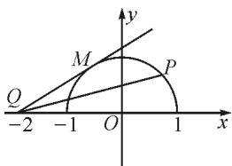

# 注重逻辑推理 提升学习能力

# ●湖北省宜昌市第一中学 孙红波

逻辑推理是数学核心素养的重要内容之一,是实现终身学习发展目标的重要保障,其贯穿于数学的产生和发展之中.推理不仅在数学学习中有着重要的应用,在其他学科及生产生活中也有着重要的应用,只有合理地推理才能在区别和联系中找到新思路,进而为新领域的探究提供前提和保障.笔者就学习过程中如何培养和发展学生的推理能力谈了几点教学策略,供参考!

# 1 在完善认知的过程中培养

众所周知,学习过程是动态变化的,而学生的认知结构也会随着学习过程的变化而变化,学生的认知往往会随着学习内容的不断深入而逐渐趋于完善.在教学过程中,教师切勿急于求成,要让学生多经历知识生成的过程,让学生将切身经历抽象为知识体系,从而促进个体认知结构的建构与完善.同时,在认识结构的建立和完善过程中要注意数学思想方法的渗透,为学生创设良好的推理环境,引导学生在完善认知的过程中培养和发展逻辑推理能力,促进解题能力提升.

例 1 讨论函数 $y = ax + \frac{b}{x} (a > 0, b > 0)$ 的单调性.

对于例1,首先,引导学生讨论函数 $y = x + \frac{1}{x}$ 的单调性,从简单的、特殊的函数出发更便于学生找到解题的突破口.函数 $y = x + \frac{1}{x}$ 的定义域为 $\{x \mid x \neq 0\}$ ,任取 $x_{1} < x_{2}$ ,由于 $f(x_{2}) - f(x_{1}) = x_{2} + \frac{1}{x_{2}} - x_{1} - \frac{1}{x_{1}} = (x_{2} - x_{1})(1 - \frac{1}{x_{1}x_{2}})$ ,而 $x_{2} - x_{1} > 0$ ,因此需要讨论 $1 - \frac{1}{x_1x_2}$ 的符号,这样就把定义域分为 $(-\infty, -1]$ , $[-1, 0)$ , $(0, 1]$ , $[1, +\infty)$ 四个区间.

若 $0 < x_{1} < x_{2} \leqslant 1$ ，则 $0 < x_{1}x_{2} < 1$ ，所以 $f(x_{2}) - f(x_{1}) < 0$ ，即 $f(x_{2}) < f(x_{1})$ ，从而函数 $f(x)$ 在 $(0,1]$ 上单调递减；同理可得， $f(x)$ 在 $[1, +\infty)$ 上单调递增；在 $(- \infty, -1]$ 上单调递增；在 $[-1,0)$ 上单调递减。

完成函数 $y = x + \frac{1}{x}$ 单调性的探究后, 在此基础

上思考 $y=x+\frac{b}{x}$ 的单调性. 引导学生理解并掌握 $y=x+\frac{1}{x}$ 及 $y=x+\frac{b}{x}$ 这两个函数单调性的推理过程后，让学生独立完成函数 $y=ax+\frac{b}{x}(a>0,b>0)$ 单调性的推理，以此培养学生自主学习能力及逻辑推理能力.

评注:为了帮助学生突破 a, b 参数的干扰, 先从特例入手, 让学生先推理函数 $y = x + \frac{1}{x}$ 的单调性, 通过逐层递进的演绎推理方法, 让学生从简单、熟悉的内容出发, 从而有效降低问题难度, 消除学生的畏难情绪, 使推理过程更符合学生的思维发展进程, 更有助于提高学生的学习积极性. 同时, 逐层递进的教学模式有助于学生深入了解知识的形成过程. 另外, 这样 “小坡度” 的层层递进也有助于提升全员的参与度, 让学困生也能有所收获, 从而实现全员、全面发展的目标.

# 2 在归纳类比中发展

数学知识间往往存在着千丝万缕的联系,很多数学知识前后紧密衔接,前面学习的内容及学习经验往往是学习和掌握新知的基础.在教学中,对于相似或相近的内容要用理性的思维去观察、分析和探究,进而使数学经验和数学思想在联系中得以推广,在区别中得以深化.因此,在教学中应关注学生类比归纳意识的培养,让学生在类比归纳中掌握新知识、新技能,从而促进学生学习能力提升.

例 2 设 $\{a_{n}\}$ 是等比数列, 首项为 $a_{1}$ , 公比为 q, 求 $\{a_{n}\}$ 的通项公式.

对于例 2, 依据学情可知, 学生知晓等比数列概念, 理解并掌握等差数列通项公式的推理过程, 因此, 在等比数列 $\{a_{n}\}$ 通项公式的推理过程中可以借鉴前面已有的经验, 通过归纳类比完成新知的建构.

设 $\{b_{n}\}$ 是等差数列，首项是 $b_{1}$ ，公差是 $d$ ，则

$$
b _ {2} = b _ {1} + d;
$$

$$
b _ {3} = b _ {2} + d = b _ {1} + 2 d;
$$

$$
b _ {4} = b _ {3} + d = b _ {1} + 3 d;
$$

$$
\dots \dots
$$

$$
b _ {n - 1} = b _ {n - 2} + d = b _ {1} + (n - 2) d;
$$

归纳: $b_{n}=b_{n-1}+d=b_{1}+(n-1)d.$

类比等比数列 $\{a_{n}\}$ ，首项为 $a_1$ ，公比为 $q$ ，则有

$$
a _ {2} = a _ {1} q;
$$

$$
a _ {3} = a _ {2} q = a _ {1} q ^ {2};
$$

$$
a _ {4} = a _ {3} q = a _ {1} q ^ {3};
$$

$$
\dots \dots
$$

$$
a _ {n - 1} = a _ {n - 2} q = a _ {1} q ^ {n - 2}.
$$

归纳: $a_{n}=a_{n-1}q=a_{1}q^{n-1}$ .

这样,通过归纳推理,轻松推导出了等比数列的通项公式.

评注:在教学中,选择相近或相似的教学内容引导学生运用类比的方法进行推理,符合学生的认知水平.通过类比不仅巩固了旧知,而且通过旧知的迁移提升了学生学习的信心,有利于学生的长远发展.在应用类比推理时,教师可以让学生独立完成,引导学生自我推理、自我归纳,从而在发展学生逻辑推理能力的同时,培养学生的自主学习能力.

# 3 在多角度思维中深化

逻辑推理能力的培养是一个长期而复杂的过程，它与数学知识的学习过程不同，数学知识也许可以靠强化练习来巩固和提升，而逻辑推理能力的培养却不能依赖于强化训练。逻辑推理的关键在于学生对问题本质的把握，进而便于学生更加理性和全面地思考问题，为此，在数学教学中要引导学生善于多角度观察和分析问题，借助多元化思维厘清知识点间的联系，认清问题的本质。

例 3 求函数 $y=\frac{\sqrt{1-x^{2}}}{x+2}$ 的值域.

解析: 函数式可写成 $y=\frac{\sqrt{1-x^{2}}-0}{x-(-2)}$ , $x\in[-1,1]$ ,故 $y$ 可视为连接两点 $P(x, \sqrt{1 - x^2}), Q(-2,0)$ 直线的斜率. 当 $x$ 在 $[-1, 1]$ 上变化时，点 $P$ 的轨迹为半圆 $C_P: x^2 + y^2 = 1 (y \geqslant 0)$ ，如图1所示。直线 $MQ$ 是过点 $Q(-2,0)$ 与半圆 $C_P$ 相切的直线，易知 $k_{OQ} \leqslant k_{PQ} \leqslant k_{QM}$ 。易求得 $k_{OQ} = 0, k_{QM} = \frac{\sqrt{3}}{3}$ ，故函数 $y = \frac{\sqrt{1 - x^2}}{x + 2}$ 的值域为 $\left[0, \frac{\sqrt{3}}{3}\right]$ 。

评注: 求函数 $y=\frac{\sqrt{1-x^{2}}}{x+2}$ 值域的方法并不唯一, 大多数学生在求值域时习惯于从代数角度出发, 例如换元法、不等式法、单调性法等, 而本题打破常规方法

text_image

y
M
P
Q
-2 -1 O 1 x

图 1

的束缚,从几何角度去分析.引导学生从全新的角度解读题设信息,应用数形结合思想将代数知识与几何图形进行衔接,这样,学生的思维更加发散,视野更加宽阔,对同一问题的解读也会更加全面和深刻,从而潜移默化地培养学生的逻辑推理能力.

# 4 在分类讨论中应用

在解题中由于参数、图形位置不确定，或数学概念、定理、性质中因一些特定限制条件产生一些不确定的情形，使我们在研究这些“不确定”因素时需要进行分类讨论。然分类标准的确定及分类讨论过程的实施需要学生具备严谨的逻辑分析和逻辑推理能力，这样才能有效避免因分类不当而造成错解。为此，在培养学生分类意识的同时也是发展学生的逻辑推理能力，进而使二者相辅相成，共同发展。

例 4 已知集合 $A=\{(x,y)\mid x^{2}+mx-y+2=0,x\in\mathbf{R}\}$ ， $B=\{(x,y)\mid x-y+1=0,0\leqslant x\leqslant2\}$ . 若 $A\cap B\neq\varnothing$ ，求实数 m 的取值范围.

解析:由 $\left\{\begin{aligned}x^{2}+mx-y+2=0,\\ x-y+1=0,\end{aligned}\right.$ 得

$$
x ^ {2} + (m - 1) x + 1 = 0.
$$

因为 $A \cap B \neq \emptyset$ ，所以 $x^{2} + (m - 1)x + 1 = 0$ 在区间 $[0, 2]$ 上至少有一个实数解.

由 $\Delta = (m - 1)^2 - 4 \geqslant 0$ ，得 $m \geqslant 3$ ，或 $m \leqslant -1$ .

当 $m \geqslant 3$ 时，由 $x_{1} + x_{2} = -m + 1 < 0, x_{1}x_{2} = 1$ ，可知方程的两根 $x_{1}, x_{2}$ 为负，不符合要求。

当 $m \leqslant -1$ 时，由 $x_{1} + x_{2} = -m + 1 > 0, x_{1}x_{2} = 1$ ，可知方程两根 $x_{1}, x_{2}$ 为互为倒数的正根，所以必有一根在区间 $(0,1]$ 内，从而方程至少有一个根在区间 $[0,2]$ 内.

综上,实数 m 的取值范围是 $(-∞,-1]$ .

评注:应用分类讨论思想解决问题需要学生具备一定的分析和推理能力,只有这样才能做到分类明确,不容易因分类重复或缺失而造成错解.因此,在教学过程中,教师应有针对性地选择一些分类题目,在培养学生分类意识的同时,促进学生逻辑推理能力的提升.

总之,逻辑推理能力的培养不是一蹴而就的,需要教师在教学中不断地引导和渗透.同时,在教学过程中要锻炼学生的多角度观察和多角度分析能力,让学生具备一定的总结概括能力,从而在观察、分析、总结、归纳中挖掘出问题的本质规律,掌握解决问题的一般方法,从而在发现和解决问题中锻炼和发展学生的逻辑思维能力,促进学习能力的提升.Z