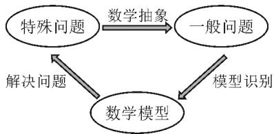
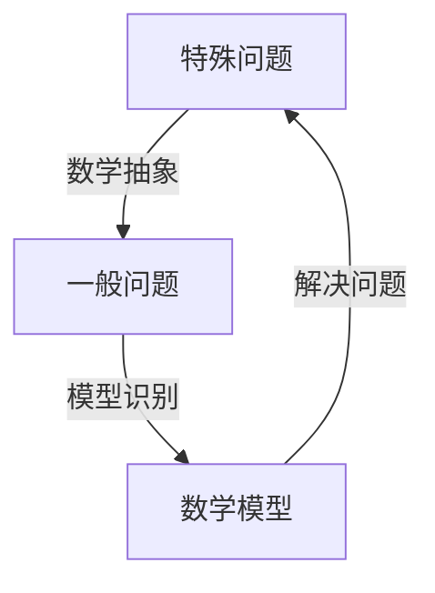
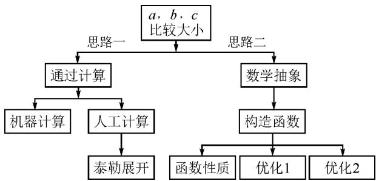
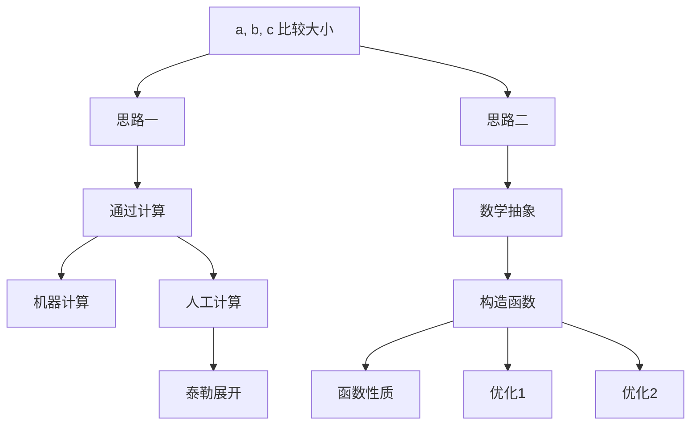

讲题比赛特等奖获奖论文之十一：

# 用数学抽象解高考试题

——以 2022 全国新高考Ⅰ卷第 7 题为例

●江苏省泰州市姜堰区罗塘高级中学 王光华  
●江苏省泗洪县第一高级中学 孟 泰

摘要: 将具体的、特殊的问题抽象成一般意义的数学问题, 并通过与该数学问题对应的数学模型加以解决.

关键词: 数学抽象; 比较大小; 思维导图

2022年高考数学全国新高考I卷普遍认为是最难的.而选择题第7题又是这份试卷难题的代表.

题目 设 $a=0.1e^{0.1}, b=\frac{1}{9}, c=-\ln 0.9$ ，则（）.

A.a<b<c

B. $c < b < a$

C. c < a < b

D. $a < c < b$

# 1 题目的高等数学背景分析

其实这道题并不难,我们只要在计算器上分别算出 a, b, c 的值就一见分晓,大小立见.

本题也可以利用泰勒展开式估算其大小,但属于高等数学范畴,普通高中不作要求,有的同学估计没学.因而我们必须另辟蹊径,寻找适合高中生的解题办法.

# 2 解题的一般化思路理解

先看下面这个问题：

$4 \times 3^{4} + 1$ 是合数吗？经计算， $4 \times 3^{4} + 1 = 325$ ，再对325进行分解， $325 = 25 \times 13$ ，所以 $4 \times 3^{4} + 1$ 是合数。如果将3改为2022，那么 $4 \times 2022^{4} + 1$ 为合数吗？很显然，运用上述方法，运算量大，分解有难度。

因此要换一种思路,这个思路就是抽象.我们将数字3,2022等数抽象为字母 $m(m>1,m\in\mathbb{N})$ ,问题就抽象为“ $4m^{4}+1$ 是合数吗”.此时我们很容易想到数学上处理代数式的“因式分解”.

$$
\begin{array}{r l} & {\text {事实上}, 4 m ^ {4} + 1 = 4 m ^ {4} + 4 m ^ {2} + 1 - 4 m ^ {2} = (2 m ^ {2} +} \\ & {1) ^ {2} - 4 m ^ {2} = (2 m ^ {2} + 1 + 2 m) (2 m ^ {2} + 1 - 2 m).} \end{array}
$$

因而 $4m^{4}+1$ 为合数.此时只要令 m=2022, 就知道 $4 \times 2022^{4} + 1$ 为合数.

这就是抽象的神奇之处 $^{[1]}$ !

在这里,我们先将特殊的数式抽象为具有一般性的代数式,通过模式识别,运用多项式的理论——因式分解,从而解决了这个“ $4 \times 2022^{4} + 1$ 为合数吗?”

现实世界有很多具体的、特殊的问题.我们就要把它们抽象成一般性的数学问题,然后通过模型识别,寻找解决数学问题的数学模型,从而解决具体的、特殊问题 $^{[2]}$ .具体思维策略如图1所示：

flowchart

图 1 思维策略

例如:周期现象通过抽象,可以用三角模型解决;随机现象通过抽象,可以用概率统计解决;大小现象通过抽象,可以用函数性质解决.

# 3 基于数学抽象策略的问题解决

注意到三个数 a, b, c 的共性特征: $a = 0.1 e^{0.1}$ , $b = \frac{1}{9} = \frac{0.1}{1 - 0.1}$ , $c = -\ln 0.9 = -\ln (1 - 0.1)$ .

将 0.1 记为 x(抽象), 构造函数:

$$
f (x) = x \mathrm{e} ^ {x}, g (x) = \frac {x}{1 - x}, h (x) = - \ln (1 - x).
$$

此时可以通过研究上述三个函数,利用函数单调性比较大小,这是高中常用的方法.

(1)先研究 a 与 b 的大小

由于 $f(x) - g(x) = x\left(\mathrm{e}^{x} - \frac{1}{1 - x}\right), x \in (0,1)$ ，因此构造函数 $\varphi(x) = \mathrm{e}^{x} - \frac{1}{1 - x}, x \in (0,1)$ .

于是 $\varphi'(x)=\mathrm{e}^{x}-\frac{1}{(1-x)^{2}}=\frac{\mathrm{e}^{x}(1-x)^{2}-1}{(1-x)^{2}}$ ，导函数的分母大于零. $\varphi'(x)$ 分子的符号怎么办？

令 $u(x)=\mathrm{e}^{x}(1-x)^{2}-1$ ，求导，可得 $u'(x)=\mathrm{e}^{x}\cdot(x^{2}-1)$ 。当 $x\in(0,1)$ 时， $u'(x)=\mathrm{e}^{x}(x^{2}-1)<0$ ，则 $u(x)=\mathrm{e}^{x}(1-x)^{2}-1$ 在 $(0,1)$ 单调递减。

所以 $u(x)=\mathrm{e}^{x}(1-x)^{2}-1<u(0)=0$ ，从而当 $x\in(0,1)$ 时， $\varphi'(x)=\frac{\mathrm{e}^{x}(1-x)^{2}-1}{(1-x)^{2}}<0.$

于是 $\varphi (x) = \mathrm{e}^{x} - \frac{1}{1 - x}$ 在(0,1)单调递减，则

$$
\varphi (0. 1) <   \varphi (0) = 0.
$$

所以 $e^{0.1}<\frac{1}{1-0.1}$ . 即 a<b.

(2)再研究 a 与 c 的大小

令 $m(x) = x\mathrm{e}^{x} - [-\ln (1 - x)] = x\mathrm{e}^{x} + \ln (1 - x),x\in (0,1)$ ，则

$$
m ^ {\prime} (x) = (x + 1) \mathrm{e} ^ {x} - \frac {1}{1 - x} = \frac {(1 - x ^ {2}) \mathrm{e} ^ {x} - 1}{1 - x},
$$

其分母恒大于零,只需判断分子符号,因此构建函数 $v(x)=(1-x^{2})\mathrm{e}^{x}-1,x\in(0,1)$ .

所以 $v'(x)=(1-2x-x^{2})\mathrm{e}^{x}>0$ 在 $(0,0.25)$ 上恒成立.

(关键在于选择恰当区间来卡 0.1 即可.)

于是 $v(x)$ 在区间 $(0,0.25)$ 上单调递增.

所以 $v(x)=(1-x^{2})\mathrm{e}^{x}-1>v(0)=0$ ,

$$
m ^ {\prime} (x) = \frac {(1 - x ^ {2}) \mathrm{e} ^ {x} - 1}{1 - x} > 0,
$$

对 $\forall x\in(0,0.25)$ 恒成立.

所以 $m(x)=$ 在 $(0,0.25)$ 上单调递增，从而 $m(0.1)>m(0)=0$ ，即 $0.1e^{0.1}>-\ln0.9$ 。故 a>c 。结合 a<b，a>c ，可知 c<a<b 。

# 4 解题过程的再优化

数学解题追求大道至简,能否将解题过程简化呢?我们还可以优化以上解题过程.

构造函数优化 1: 先考察 a, b 的大小. 令 $f(x) = x \mathrm{e}^{x} = \frac{x}{\mathrm{e}^{-x}}, g(x) = \frac{x}{1 - x}$ .

由于这两个函数解析式的分子相同,因此只要比较分母大小.根据指数切线不等式 $e^{x} \geqslant x + 1$ ,有 $e^{-x} \geqslant -x + 1$ ,当且仅当 x = 0 时等号成立,记 $x \in (0,1)$ .

所以 $e^{-x}>-x+1>0,\frac{1}{e^{-x}}<\frac{1}{1-x}$ ，从而 $\frac{x}{e^{-x}}<\frac{x}{1-x}$ . 令 x=0.1，可得 a<b.

再考察 b, c 的大小关系.

令 $g(x)=\frac{x}{1-x}=-1+\frac{1}{1-x}, h(x)=\ln\frac{1}{1-x}.$

由对数切线不等式 $\ln x \leqslant x - 1$ ，可知当 $x \in [0,1]$ 时， $h(x) = \ln \frac{1}{1 - x} \leqslant \frac{1}{1 - x} - 1g(x)$ ，当且仅当 $x = 0$ 时等号成立。

对于 x=0.1，则 $h(0.1)<g(0.1)$ ，有 c<b。

a 与 c 的大小同上, 不难看到其运算量较大, 能否将 a 与 c 的大小比较进行优化呢?

构造函数优化 2: 利用指数切线不等式 $e^{x} \geqslant x + 1$ ，有 $e^{0.1} > 0.1 + 1 = 1.1$ .

所以 $a=0.1e^{0.1}>0.1\times1.1=0.11.$

而 $c = -\ln 0.9$ 如何处理呢?

考察对数平均不等式: 当 a > 0, b > 0, 且 $a \neq b$ 时, 有 $\sqrt{ab} < \frac{a - b}{\ln a - \ln b} < \frac{a + b}{2}$ .

当 $x > 1$ 时，有 $\sqrt{x \cdot \frac{1}{x}} < \frac{x - \frac{1}{x}}{\ln x - \ln \frac{1}{x}}$ ，化简可得 $2\ln x < x - \frac{1}{x}$ .

由此可构造函数 $G(x)=2\ln x-x+\frac{1}{x},x>1$ ，则 $G'(x)=\frac{2}{x}-1-\frac{1}{x^{2}}=-\frac{(x-1)^{2}}{x^{2}}<0.$

所以 $G(x)$ 在 $(1, +\infty)$ 上单调递减，从而 $G(x) < G(1) = 0$ ，即 $2 \ln x < x - \frac{1}{x}$ 。令 $x = \frac{10}{9}$ ，得 $\ln \frac{10}{9} < \frac{1}{2} \left( \frac{10}{9} - \frac{9}{10} \right) = \frac{19}{180} < 0.11$ 。

因此， $c=-\ln0.9<0.11<a$ ，即c<a。

综上 c<a<b.

# 5 思路方法的课本寻根

我们再向教材寻根:通过所给具体数值的特征,抽象出一般性的函数,再根据函数的性质比较具体数值的大小,这在教材中是常见的.例如苏教版必修一第145页的例2.

比较 $\log_{2}3.4$ 与 $\log_{2}3.8$ 的大小.

解: 考察对数函数 $y=\log_{2}x$ .

因为 $2 > 1$ ，所以 $y = \log_2x$ 在 $(0, + \infty)$ 上是增函数.

又因为 0<3.4<3.8，所以 $\log_{2}3.4<\log_{2}3.8$ .

从教材给出的例题可以看到,根据所给数据的特征,找出他们的共性特征(同底数、同指数、同真数等),找出他们的相异特征(底数不同、指数不同、真数不同等),构建相应的函数,利用函数的单调性来比较所给数据的大小.

那么数的大小比较问题是否一定运用上述思维策略,即先通过数学抽象,再寻找数学模型来解决呢?

上述高考题的分析,其具体思维导图如图2所示.

flowchart

图2

综上,思路一通过计算比较大小,虽然思路简单,但受高考及能力限制,不是行之有效.而思路二则是通过观察特殊数的特征抽象出一般意义的函数,利用模型函数的单调性,从而解决了数的大小比较问题.

(下转第21页)

高效,还可以增强学生的民族自豪感和社会责任感,提升文化自信.

# 3.3 “学史崇德”, 数学史是德育价值的重要体现

《普通高中数学课程标准(2017年版2020年修订)》指出：“数学是人类文化的重要组成部分。数学课程应适当反应数学的历史、应用和发展趋势，数学对推动社会发展的作用，数学的社会需求，社会发展对数学发展的推动作用，数学科学的思想体系，数学的美学价值，数学家的创新精神。”历史上，数学家为了论证某个结论通常会花费大量的时间，经历巨大的困难与挫折，但是他们依然孜孜不倦，上下求索，这种精神是值得学习的。

# 3.4 “学史力行”, 数学史是高考评价的重要形式

教育部考试中心发布的《中国高考评价体系》由“一核”“四层”“四翼”组成，其中“四翼”指高考的考查要求为“基础性、综合性、应用性、创新性”。数学文化是高考的热点，数学史是数学文化的重要组成部分。数学史正是反映了“应用性、创新性”的考查要求，因此在教学中，教师应力所能及地介绍数学史中的问题，这不仅符合高考的要求，而且有利于学生数学素养的提升。

# 4 结束语

数学史融入课堂教学可以让课堂更加生动、有趣，激发学生的好奇心。按照一定的主线，将数学知识与相关数学史结合，不断提出驱动性问题，从而促使学生层层递进，一步一步深入探索数学知识。这样，数学史把对知识的感知、理解、巩固、应用融为一体，很好地呈现了知识的生成过程，加深学生对知识的理解。学生在学习知识的同时感受前人的智慧，努力培养自己的务实和理性精神，从而不断地提升数学素养。

# 参考文献：

[1]M.克莱因.古今数学思想(第一册)[M].张理京,张锦炎,译.上海:上海科学出版社,1979.  
[2]吕增锋,解烈军.HPM视角下的数学单元教学设计——以“数列”为例[J].中学数学,2020(21):14-16.  
[3]许可雄.HPM视角下的高中数学项目化学习支架设计——以《导数概念的诞生》为例[J].福建基础教育研究,2021(7):51-53.Z

# (上接第8页)

再如:已知三个实数 $a=\frac{\ln2}{3}$ , $b=\frac{\ln3}{8}$ , $c=\frac{1}{e^{2}-1}$ ，则三个数的大小为().

$$
\begin{array}{l} \mathrm{A}. c > a > b \\ \mathrm{B}. a > c > b \\ \mathrm{C}. a > b > c \\ \mathrm{D}. c > b > a \\ \end{array}
$$

思路分析:通过观察三个数的特征,统一形式为

$$
a = \frac {\ln 2}{3} = \frac {1}{2} \cdot \frac {\ln 2 ^ {2}}{2 ^ {2} - 1}, b = \frac {\ln 3}{8} = \frac {\ln 3}{3 ^ {2} - 1} = \frac {1}{2} \cdot
$$

$\frac{\ln 3^{2}}{3^{2}-1}, c=\frac{\ln e}{e^{2}-1}=\frac{1}{2}\cdot\frac{\ln e^{2}}{e^{2}-1}$ ，故通过数学抽象函数实现同构， $f(x)=\frac{\ln x}{x-1}, x\in[4,9]$ .

于是 $f^{\prime}(x) = \frac{x - 1 - x\ln x}{x(x - 1)^{2}}.$ 令 $g(x) = x - 1 - x\ln x, x \in [4,9]$ .

又 $g'(x) = -\ln x < 0$ 恒成立，所以 $g(x)$ 在 [4,9] 上单调递减，从而 $g(x) < g(4) = 3 - 4\ln 4 < 0$ .

所以 $f'(x)<0$ ，即函数 $f(x)=\frac{\ln x}{x-1}$ 在 [4,9] 上单调递减，因此 $f(4)>f(\mathrm{e}^{2})>f(3^{2})$ .

故 $a > c > b$ ，答案选：A.

再例如 2021 年全国卷乙卷理科第 12 题：

设 $a=2\ln1.01, b=\ln1.02, c=\sqrt{1.04}-1$ ，则（）.

$$
\mathrm{A}. a <   b <   c
$$

$$
\mathrm{B}. b <   c <   a
$$

$$
\mathrm{C}. b <   a <   c
$$

$$
\mathrm{D}. c <   a <   b
$$

思路分析:从三个数字特征来看,不妨将0.01抽象成变量x,则

$$
a = 2 \ln 1. 0 1 = 2 \ln (1 + 0. 0 1) \rightarrow 2 \ln (1 + x),
$$

$$
b = \ln 1. 0 2 \rightarrow \ln (1 + 2 x),
$$

$$
c = \sqrt {1 . 0 4} - 1 \rightarrow \sqrt {1 + 4 x} - 1.
$$

令 $f(x)=2\ln(1+x)-(\sqrt{1+4x}-1)$ , 0<x<1.

令 $\sqrt{1 + 4x} = t$ ，则 $1 < t < \sqrt{5}$ ，且 $x = \frac{t^2 - 1}{4}$

故由 $g(t)=2\ln\left(\frac{t^{2}+3}{4}\right)-t+1=2\ln\left(t^{2}+3\right)-t+1-2\ln4$ , 可得

$$
g ^ {\prime} (t) = \frac {4 t}{t ^ {2} + 3} - 1 = \frac {4 t - t ^ {2} - 3}{t ^ {2} + 3} = - \frac {(t - 1) (t - 3)}{t ^ {2} + 3} > 0,
$$

从而 $g(t)$ 在 $(1,\sqrt{5})$ 上单调递增.

所以由 $g(t) > g(1) = 2 \ln 4 - 1 + 2 \ln 4 = 0.$

因此 $f(x)>0$ ，可得 a>c。

同理令 $h(x)=\ln(1+2x)-(\sqrt{1+4x}-1)$ .

再令 $\sqrt{1+4x}=t$ ，则 $1<t<\sqrt{5}$ ，且 $x=\frac{t^{2}-1}{4}$ .

所以由 $\varphi(t)=\ln(\frac{t^{2}+1}{2})-t+1=\ln(t^{2}+1)-t+1-\ln2$ ，可得 $\varphi'(t)=\frac{2t}{t^{2}+1}-1=\frac{-(t-1)^{2}}{t^{2}+1}<0.$ 所以 $\varphi(t)$ 在 $(1,\sqrt{5})$ 上单调递减，则有 $\varphi(t)<\varphi(1)=0.$

于是 $h(x)<0$ , 即 c>b ，从而 a>c>b 。故选：B。

基于 2022 年高考试题特点, 可以看出数学抽象是高考必考查的核心素养, 为此在平时学习中我们要:

学会用抽象的眼光观察数学，

学会用抽象的思维思考数学，

学会用抽象的语言表达数学.

# 参考文献：

[1] 孟泰. 数学抽象的两层次与两面性 [J]. 数学通讯, 2021(4): 9-11.

[2] 张金良. 解密数学抽象 探索教学策略 [J]. 数学通报, 2019(8): 23-26. Z