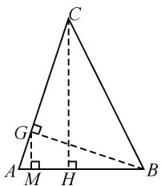
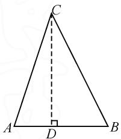

# 2023 年新高考 I 卷第 17 题的多解、溯源、变式

# 广东省开平市第一中学 余双宁

高考真题是命题专家集体智慧的结晶,既具有选拔功能,又对教学起着导向作用.教师只有深入研究高考真题,才能提高教学效益.下面是笔者对2023年新高考Ⅰ卷第17题的一些思考,与大家交流.

# 1 考题再现

(2023年全国高考数学新高考Ⅰ卷第17题)已知在 $\triangle ABC$ 中,已知 $A+B=3C,2\sin(A-C)=\sin B$ .

(1) 求 $\sin A$ ;   
(2) 设 AB=5，求 AB 边上的高.

这是一道解三角形与三角函数综合的解答题,突出考查解三角形的基本知识和转化与化归思想,考查三角函数的基本关系式和化简变形,考查学生的逻辑推理、数学运算、数学建模等核心素养,是一道具有研究价值的好题.

# 2 解法探究

# 2.1 第(1)小题的解法

第(1)问考查三角函数的基本关系式和化简变形,可从多角度入手求解.基本策略是变角、变名、变结构,逐步化简三角关系式,求出 $\sin A$ .

解: 由 $A + B + C = \pi, A + B = 3C$ , 得

$$
A + B = \frac {3 \pi}{4}, C = \frac {\pi}{4}.
$$

根据 $2\sin (A - C) = \sin B$ ，得

$$
2 \sin \left(A - \frac {\pi}{4}\right) = \sin \left(\frac {3 \pi}{4} - A\right).
$$

整理得 $\sin A = 3\cos A$ .

结合 $\sin^2 A + \cos^2 A = 1, A \in (0, \pi)$ ，可得 $\sin A = \frac{3\sqrt{10}}{10}$ .

评注:如何处理 $A + B = 3C$ 和 $2\sin(A - C) = \sin B$ 是难点,灵活运用三角形内角和公式以及两角和(差)的三角公式是解题的关键.

# 2.2 第(2)小题的解法

对于解三角形中的“三线”问题,通常有“边化角”与“角化边”两个变形方向,根据题设条件与目标进行分析,容易想到三角形高的定义.

解法 1: 正弦定理 + 解三角形.

由正弦定理, 得 $\frac{BC}{\sin A} = \frac{AB}{\sin C}$ , 则

$$
B C = \frac {A B}{\sin C} \cdot \sin A = 3 \sqrt {5}.
$$

因为 $\sin A > \sin C$ ，所以 A > C。

由(1)得 $\sin A = 3\cos A$ ，则 $\cos A = \frac{\sqrt{10}}{10}$ .

所以 $\sin B=\sin(A+C)=\frac{2\sqrt{5}}{5}.$

由正弦定理, 得 $\frac{AC}{\sin B} = \frac{AB}{\sin C}$ , 则

$$
A C = \frac {A B}{\sin C} \cdot \sin B = 2 \sqrt {1 0}.
$$

设 AB 边上的高为 h，则 $h = AC \cdot \sin A = 2\sqrt{10} \times \frac{3\sqrt{10}}{10} = 6$ ，所以 AB 边上的高为 6.

解法 2: 正弦定理 + 三角函数.

由 $\tan A = 3 > 0$ ，得 $\frac{\pi}{4} < A < \frac{\pi}{2}$ 则 $\cos A = \frac{\sqrt{10}}{10}$

所以 $\sin B = \sin (A + C) = \frac{2\sqrt{5}}{5}$ .

由正弦定理, 得 $\frac{AC}{\sin B} = \frac{AB}{\sin C}$ , 则

$$
A C = \frac {A B}{\sin C} \cdot \sin B = 2 \sqrt {1 0}.
$$

设 AB 边上的高为 h，则 $h = AC \cdot \sin A = 2\sqrt{10} \times \frac{3\sqrt{10}}{10} = 6$ ，故 AB 边上的高为 6.

解法 3: 正弦定理 + 面积法.

由 $\tan A = 3 > 0$ ，得 $\frac{\pi}{4} < A < \frac{\pi}{2}$ 则 $\cos A = \frac{\sqrt{10}}{10}$

所以 $\sin B = \sin (A + C) = \frac{2\sqrt{5}}{5}$ .

由正弦定理, 得 $\sin A : \sin B : \sin C = BC :$

$$
A C: A B = \frac {3 \sqrt {1 0}}{1 0}: \frac {2 \sqrt {5}}{5}: \frac {\sqrt {2}}{2}.
$$

结合 AB=5，可得 $AC=2\sqrt{10}$ ， $BC=3\sqrt{5}$ .

设 AB 边上的高为 h，则 $S_{\triangle ABC} = \frac{1}{2} AB \cdot h = \frac{1}{2} AC \cdot BC \cdot \sin C = 15$ ，解得 h = 6.

故 AB 边上的高为 6.

评注:根据题设条件与目标进行分析,容易想到高的定义,再联想三角形面积公式,借助算两次的思想和方程思想,将问题化繁为简.

解法 4: 几何法 + 等面积法.

由(1)知 $\tan A = 3\tan C$ . 如图1所示, 过点 B 作 $BG \perp AC$ , 垂足为 G, 过点 G 作 $GM \perp AB$ , 垂足为 M, 过点 C 作 $CH \perp AB$ , 垂足为 H.

设 AG = x，则 BG = CG = 3x，
于是 $|AB|=\sqrt{10}x=5$ ，得 $x=\frac{\sqrt{10}}{2}$ .

text_image

Geometric diagram of triangle ABC with perpendiculars from C to AB at M and H, and a dashed line from G to AB.

图1

由 $S_{\triangle AGB}=\frac{1}{2}AG\cdot BG=\frac{1}{2}AB\cdot GM$ ，可得

$$
G M = \frac {3}{5} x ^ {2} = \frac {3}{2}.
$$

由 AC=4AG，可得 CH=4GM=6。

解法 5: 三角恒等变换 + 几何法.

由(1)知 $\tan A=3$ ，结合 $A+B+C=\pi$ ，可得

$$
\tan B = - \tan (A + C) = - \frac {\tan A + \tan C}{1 - \tan A \tan C} = 2.
$$

如图 2, 过点 C 作 $CD \perp AB$ , 垂足为 D. 设 CD = h, 则

$$
\begin{array}{c} {{| A B | = | A D | + | D B | =  \frac {h}{\tan A} +}} \\ {{ \frac {h}{\tan B} =  \frac {h}{3} +  \frac {h}{2} = 5, \text {解得} h = 6.}} \end{array}
$$

text_image

C
A D B

图2

故 AB 边上的高为 6.

解法 6: 三角恒等变换法.

由(1)知 $\tan A=3$ . 如图2, 过点 C 作 $CD \perp AB$ 于点 D, 设 AD=m, 则 CD=3m.

由正弦定理, 得 $\frac{BC}{\sin A} = \frac{AB}{\sin C}$ .

所以 $BC=\frac{AB}{\sin C}\cdot\sin A=3\sqrt{5}$ .

在 Rt△BDC 中， $BD^{2}+CD^{2}=BC^{2}$ ，则

$$
(5 - m) ^ {2} + 9 m ^ {2} = 4 5.
$$

解得 m=2.

故 AB 边上的高为 6.

评注:根据题设条件与目标进行分析,容易想到高的定义,巧妙利用数形结合及方程思想,将问题化繁为简.

# 3 问题溯源

高考试题是高考复习中必备的课程资源,寻找高考数学试题的生长点、命题背景,探究题源,挖掘命题的"题根",有利于把握高考命题的风向标,选择或命制相似的题目进行针对性的训练,能够有效提升对解题思想的理解,同时对提高复习效率有很大的意义.问题的条件(在 $\triangle ABC$ 中, $A+B=3C$ , $2\sin(A-C)=\sin B$ )是该题最大的亮点.看到这道题,笔者认为该题是2004年高考全国Ⅱ卷数学理科第17题的“翻版”.

溯源 1 （2004 年高考全国Ⅱ卷理科第 17 题）已知锐角三角形 ABC 中， $\sin(A+B)=\frac{3}{5}$ ， $\sin(A-B)=\frac{1}{5}$ .

(1) 求证: $\tan A = 2\tan B$ ;   
(2) 设 AB=3，求 AB 边上的高.

解:(1)(详解略).

(2) 由 $A + B \in \left(\frac{\pi}{2}, \pi\right)$ , $\sin(A + B) = \frac{3}{5}$ , 可得 $\cos(A + B) = -\frac{4}{5}$ , 则 $\tan(A + B) = -\frac{3}{4}$ , 即 $\frac{\tan A + \tan B}{1 - \tan A \tan B} = -\frac{3}{4}$ .

又 $\tan A = 2\tan B$ ，解得 $\tan A = 2 + \sqrt{6},\tan B = \frac{2 + \sqrt{6}}{2}.$

设 AB 边上的高为 h，则 $\frac{h}{\tan A} + \frac{h}{\tan B} = 3$ ，解得 $h = 2 + \sqrt{6}$ .

溯源 2 （2016 年新课标Ⅲ卷数学理科第 8 题）在 $\triangle ABC$ 中， $B=\frac{\pi}{4}$ ，BC 边上的高等于 $\frac{1}{3}BC$ ，则 $\cos A$ 等于（）.

A. $\frac{3\sqrt{10}}{10}$ B. $\frac{\sqrt{10}}{10}$ C. $-\frac{\sqrt{10}}{10}$ D. $-\frac{3\sqrt{10}}{10}$

解: 设 $\triangle ABC$ 中角 A, B, C 对应的边分别为 a, b, c, $AD \perp BC$ 于点 D, $\angle DAC = \theta$ .

因为在 $\triangle ABC$ 中， $B=\frac{\pi}{4}$ ，AD=h= $\frac{1}{3}$ BC= $\frac{a}{3}$ ，
所以 $BD = AD = \frac{a}{3}, CD = \frac{2a}{3}.$

在 Rt△ADC 中, 有

$$
\cos \theta = \frac {A D}{A C} = \frac {\frac {a}{3}}{\sqrt {\left(\frac {a}{3}\right) ^ {2} + \left(\frac {2 a}{3}\right) ^ {2}}} = \frac {\sqrt {5}}{5}.
$$

所以 $\sin\theta=\frac{2\sqrt{5}}{5}$ .

(下转第63页)

设 $h(x)=3x-\frac{\sin x}{\cos^{3}x}-\sin 2x$ ，则 $h'(x)=3-\frac{3-2\cos^{2}x}{\cos^{4}x}-2\cos 2x=\frac{-4\cos^{6}x+5\cos^{4}x+2\cos^{2}x-3}{\cos^{4}x}$ .

令 $t=\cos^{2}x$ ，则 $t\in(0,1)$ .

令 $F(t) = -4t^{3} + 5t^{2} + 2t - 3$ ，则

$$
F ^ {\prime} (t) = - 1 2 t ^ {2} + 1 0 t + 2 = 2 (1 - t) (6 t + 1).
$$

当 $t \in (0,1)$ 时， $F'(t) > 0$ ，则 $F(t)$ 在 $(0,1)$ 上单调递增。所以当 $t \in (0,1)$ 时， $F(t) < F(1) = 0$ ，即当 $x \in \left(0, \frac{\pi}{2}\right)$ 时， $-4\cos^6 x + 5\cos^4 x + 2\cos^2 x - 3 < 0$ ，从而 $h'(x) < 0$ 。

所以 $h(x)$ 在 $\left(0, \frac{\pi}{2}\right)$ 上单调递减. 故当 $\left(0, \frac{\pi}{2}\right)$ 时, $h(x) < h(0) = 0$ , 即 $f(x) < \sin 2x$ .

综上，a 的取值范围是 $(-∞,3]$ .

点评:本题是三角函数与导数的综合,作为压轴题,难度很大,彰显了综合要求.端点效应为分类讨论解题提供了参数的分界点.当然本题解法灵活多样,可从不同角度思考转化.

类似可以利用端点效应的高考题还很多,比如:

(1)(2023全国乙卷·理)已知函数 $f(x)=\left(\frac{1}{x}+a\right)\cdot\ln(1+x)$ .若函数 $f(x)$ 在 $(0,+\infty)$ 单调递增，求a的

取值范围.

(2)(2023 全国甲·文)已知函数 $f(x)=ax-\frac{\sin x}{\cos^{2}x}, x \in \left(0, \frac{\pi}{2}\right)$ .

(i) 当 a=1 时, 讨论 $f(x)$ 的单调性;  
(ii) 若 $f(x)+\sin x<0$ ，求 a 取值范围.  
(3)(2022 新高考Ⅱ卷·22·节选)已知函数 $f(x)=xe^{ax}-e^{x}$ . 设 $n\in N^{*}$ ，证明： $\frac{1}{\sqrt{1^{2}+1}}+\frac{1}{\sqrt{2^{2}+2}}+\cdots+\frac{1}{\sqrt{n^{2}+n}}>\ln(n+1)$ .

需要指出的是,利用端点效应求出的范围仅是必要条件,不一定是充分条件,还应代入验证.对于无法直接求函数最值的不等式恒成立问题,以及无法应用参数分离的函数不等式恒成立问题,可考虑端点效应.有时候用端点效应得出的结果并非是最终答案,典型的例子比如2020年全国Ⅰ卷第21题.那么何时才能用端点效应呢?文中前面指出的端点效应的两个命题的条件很重要,要注意检验.在实际解题中切不可过分依赖此类解法,虽然此类解法具备优越性,但也不是万能的.只有当常规解法无从下手时,它才是我们尝试选择作为打开突破口的手段.Z

# (上接第60页)

故 $\cos A = \cos\left(\frac{\pi}{4} + \theta\right) = \cos\frac{\pi}{4}\cos\theta - \sin\frac{\pi}{4} \cdot \sin\theta = \frac{\sqrt{2}}{2} \times \frac{\sqrt{5}}{5} - \frac{\sqrt{2}}{2} \times \frac{2\sqrt{5}}{5} = -\frac{\sqrt{10}}{10}$ . 故选: C.

通过上面的例子可以看出,在强调命题改革的今天,通过改编、创新等手段来赋予往年高考真题新的生命,已成为高考命题的一种新趋势.因此,在高考复习的过程中务必要注意对往年高考真题进行变式训练,做到探索变式,丰富成果,对解题思路进行内化、深化探索,总结升华;把握其实质、掌握其规律、规范其步骤.

# 4 拓展变式

对于这道有价值的高考试题,我们不能满足于仅给出其解法,还应该充分挖掘其价值,可以通过适当改变试题的条件或求解目标,对其进行变式,并将有些问题推广到一般情况,这对高考复习备考是很有意义的.

案例 典型“三线”问题及其变形

问题 在 $\triangle ABC$ 中,已知 AB=5,AC=8,BC=

12, D 为线段 BC 上一点.

(1) 若 D 为线段 BC 的中点, 求 AD 的长;  
(2) 若 AD 平分 $\angle BAC$ ，求 AD 的长；  
(3) 若 $AD \perp BC$ ，求 AD 的长.

评注:从典型问题和基础问题出发,对问题进行变形,可使得研究由浅入深、知识不断得以巩固、核心素养能力得以提升.这种研究问题的形式有助于对知识的学习和巩固.

# 5 教学启示

对于一道典型的高考真题从多个角度对其剖析，充分挖掘其价值。通常可以思考如下问题：你能用多种方法求解这个问题吗？这个问题的命题意图是什么？改变条件或求解目标，这些方法还适用吗？这个问题能否推广到一般情形？等等。只有真正弄清这个问题的来龙去脉，把握其各种变化，在遇到新问题时我们才能做到灵活处理，随机应变。“磨刀不误欢柴工”，高三复习与其盲目刷题，不如多回归“典型”，在典型的问题和情境中提高数学素养和能力，提高高三复习的效率，这样的复习不失为高效的复习。Z