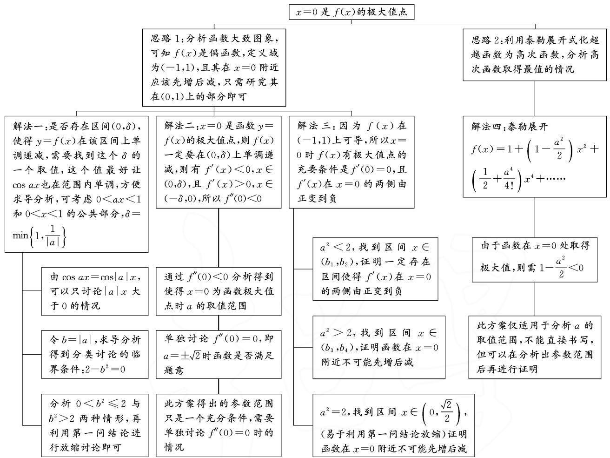
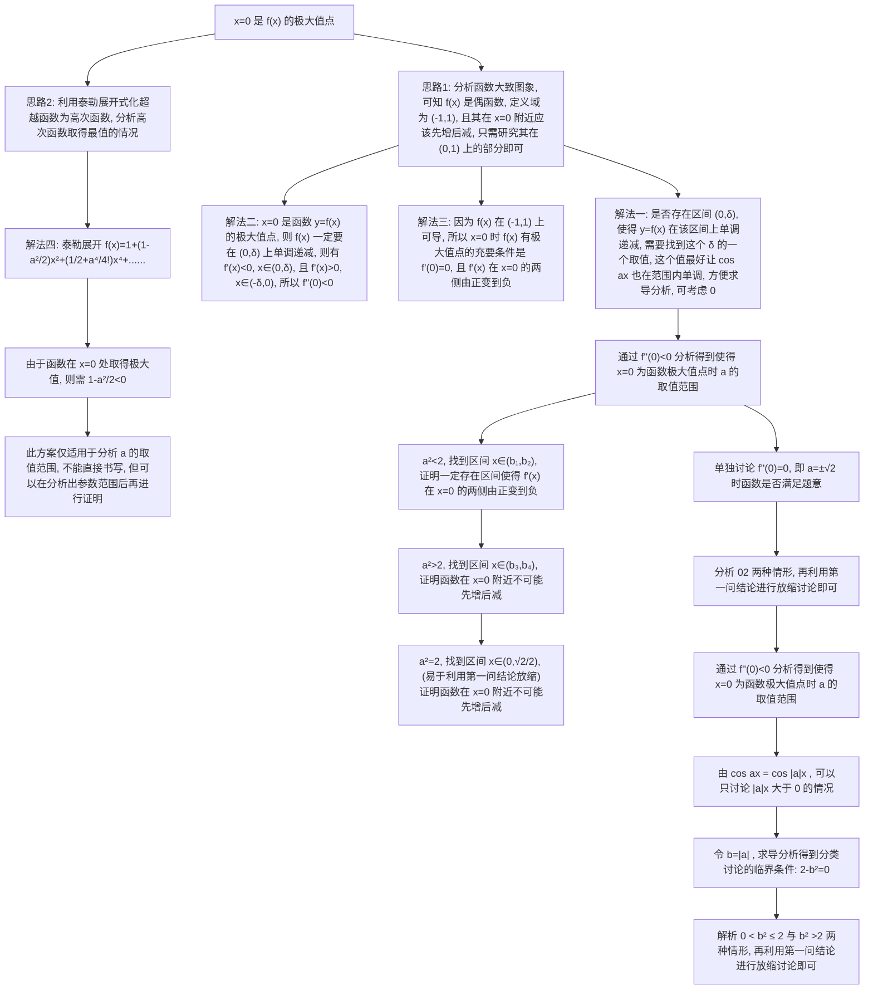

# 2023年讲题比赛获奖论文之十四：

# 2023 年新高考全国Ⅱ卷第 22 题探究

# 重庆市江北巴川量子学校 姜砚达

题目 (1) 证明: 当 $0 < x < 1$ 时, $x - x^2 < \sin x < x$ ;

(2)已知函数 $f(x) = \cos ax - \ln (1 - x^2)$ ，若 $x = 0$ 是 $f(x)$ 的极大值点，求 $a$ 的取值范围.

# 1 试题目标

命题考查点: 利用导数证明不等式, 已知极值点求参数范围, 与三角函数相关的导数.

思想方法: 函数与方程思想、数形结合思想、分类与整合思想、化归与转化思想.

能力要求: 抽象概括、推理论证.

页练习的第1题：

利用函数的单调性,证明下列不等式,并通过函数图象直观验证: $\sin x<x,x\in(0,\pi)$ .

此不等式非常重要,建议学生积累不等式链“ $\sin x<x<\tan x,x\in\left(0,\frac{\pi}{2}\right)$ ”,会证明该不等式,并能应用该不等式进行简单放缩.

# 3 试题分析

本题的思维导图如图 1 所示.

# 2 试题来源

本题第(1)问源于新教材选择性必修第二册第97

flowchart

图1

# 4 解题过程

(1) 解析: 构建 $F(x) = x - \sin x, x \in (0,1)$ ，则 $F'(x) = 1 - \cos x > 0$ 对 $\forall x \in (0,1)$ 恒成立，则 $F(x)$ 在 $(0,1)$ 上单调递增，可得 $F(x) > F(0) = 0$ ，所以可得 $x > \sin x, x \in (0,1)$ .

构建 $G(x)=\sin x-(x-x^{2})=x^{2}-x+\sin x,$ $x\in(0,1)$ ，则 $G'(x)=2x-1+\cos x, x\in(0,1)$ .

构建 $g(x)=G'(x)$ , $x\in(0,1)$ ，则 $g'(x)=2-\sin x>0$ 对 $\forall x\in(0,1)$ 恒成立，于是 $g(x)$ 在 $(0,1)$ 上单调递增，得 $g(x)>g(0)=0$ ，即 $G'(x)>0$ 对 $\forall x\in(0,1)$ 恒成立。于是 $G(x)$ 在 $(0,1)$ 上单调递增，可得 $G(x)>G(0)=0$ ，所以 $\sin x>x-x^{2}$ , $x\in(0,1)$ 。

综上所述: $x-x^{2}<\sin x<x$ .

# (2) 解法一: 常规解法.

根据题意结合偶函数的性质可知，只需要研究 $f(x)$ 在 $(0,1)$ 上的单调性，求导，分类讨论 $0 < a^2 < 2$ 和 $a^2 \geqslant 2$ ，结合(1)中的结论放缩，根据极大值的定义分析求解.令 $1 - x^2 > 0$ ，得 $-1 < x < 1$ ，即函数 $f(x)$ 的定义域为 $(-1,1)$ .若 $a = 0$ ，则 $f(x) = 1 - \ln (1 - x^2)$ ， $x \in (-1,1)$ .因为 $y = -\ln u$ 在定义域内单调递减， $u = 1 - x^2$ 在 $(-1,0)$ 上单调递增，在 $(0,1)$ 上单调递减，则 $f(x) = 1 - \ln (1 - x^2)$ 在 $(-1,0)$ 上单调递减，在 $(0,1)$ 上单调递增，所以 $x = 0$ 是 $f(x)$ 的极小值点，不合题意.故 $a \neq 0$ .

当 $a \neq 0$ 时，令 $b = |a| > 0$ ，可以缩小讨论范围，且方便利用第(1)问结论进行放缩.

因为 $f(x) = \cos ax - \ln (1 - x^2) = \cos (|a|x) - \ln (1 - x^2) = \cos bx - \ln (1 - x^2)$ ，且

$$
\begin{array}{c} f (- x) = \cos (- b x) - \ln [ 1 - (- x) ^ {2} ] = \\ \cos b x - \ln (1 - x ^ {2}) = f (x). \end{array}
$$

所以函数 $f(x)$ 在定义域内为偶函数, 换元后函数仍是偶函数, 此处给出简单证明.

由题意，可得 $f^{\prime}(x) = -b\sin bx - \frac{2x}{x^{2} - 1}, x \in (-1,1)$ .

由 $f^{\prime}(x) = -b\sin bx - \frac{2x}{x^{2} - 1} > -b^{2}x - \frac{2x}{x^{2} - 1} =$ $\frac{x(b^2x^2 + 2 - b^2)}{1 - x^2}$ ，发现 $2 - b^{2}\geqslant 0$ 时导函数恒大于零，所以可以以此为分析依据对参数进行讨论，之后就顺理成章了.

(i) 当 $0 < b^2 \leqslant 2$ 时，取 $m = \min \left\{\frac{1}{b}, 1\right\}, x \in (0, m)$ ，则 $bx \in (0, 1)$ ，由(1)可得 $f'(x) = -b \sin bx - \frac{2x}{x^2 - 1} > -b^2 x - \frac{2x}{x^2 - 1} = \frac{x(b^2 x^2 + 2 - b^2)}{1 - x^2}$ .

又 $b^{2}x^{2} > 0,2 - b^{2}\geqslant 0,1 - x^{2} > 0$ ，所以 $f^{\prime}(x)>$ $\frac{x(b^2x^2 + 2 - b^2)}{1 - x^2} >0$ ，即当 $x\in (0,m)\subseteq (0,1)$ 时， $f^{\prime}(x) > 0$ ，则 $f(x)$ 在 $(0,m)$ 上单调递增.结合偶函数的对称性可知， $f(x)$ 在 $(-m,0)$ 上单调递减.故 $x = 0$ 是 $f(x)$ 的极小值点，不合题意.

(ii) 当 $b^2 > 2$ 时，取 $x \in \left(0, \frac{1}{b}\right) \subseteq (0, 1)$ ，则 $bx \in (0, 1)$ .

结合(1)，可得 $f'(x) = -b \sin bx - \frac{2x}{x^{2} - 1} < -b(bx - b^{2}x^{2}) - \frac{2x}{x^{2} - 1} = \frac{x}{1 - x^{2}} (-b^{3}x^{3} + b^{2}x^{2} + b^{3}x + 2 - b^{2})$ .

构建 $h(x) = -b^{3}x^{3} + b^{2}x^{2} + b^{3}x + 2 - b^{2}, x \in \left(0, \frac{1}{b}\right)$ ，则有 $h'(x) = -3b^{3}x^{2} + 2b^{2}x + b^{3}, x \in \left(0, \frac{1}{b}\right)$ ，且 $h'(0) = b^{3} > 0, h'\left(\frac{1}{b}\right) = b^{3} - b > 0$ ，可知 $h'(x) > 0$ 对 $\forall x \in \left(0, \frac{1}{b}\right)$ 恒成立，所以 $h(x)$ 在 $\left(0, \frac{1}{b}\right)$ 上单调递增。又 $h(0) = 2 - b^{2} < 0, h\left(\frac{1}{b}\right) = 2 > 0$ ，所以 $h(x)$ 在 $\left(0, \frac{1}{b}\right)$ 内存在唯一的零点 $n \in \left(0, \frac{1}{b}\right)$ 。当 $x \in (0, n)$ 时，则 $h(x) < 0$ ，且 x > 0, $1 - x^{2} > 0$ ，则 $f'(x) < \frac{x}{1 - x^{2}} (-b^{3}x^{3} + b^{2}x^{2} + b^{3}x + 2 - b^{2}) < 0$ ，即当 $x \in (0, n) \subseteq (0, 1)$ 时， $f'(x) < 0$ ，则 $f(x)$ 在 $(0, n)$ 上单调递减。结合偶函数的对称性可知， $f(x)$ 在 $(-n, 0)$ 上单调递增。所以 x = 0 是 $f(x)$ 的极大值点，符合题意。

综上，当 $b^2 > 2$ ，即 $a^2 > 2$ ，亦即 $a > \sqrt{2}$ 或 $a < -\sqrt{2}$ 时，符合题意.

故 $a$ 的取值范围为 $(- \infty, -\sqrt{2}) \cup (\sqrt{2}, + \infty)$ .

# 解法二: 极值的第二充分条件.

由 $f'(x)=-a\sin ax+\frac{1}{1-x}-\frac{1}{1+x}$ ,

$$
f ^ {\prime \prime} (x) = - a ^ {2} \cos a x + \frac {1}{(1 - x) ^ {2}} + \frac {1}{(1 + x) ^ {2}},
$$

可得 $f'(0)=0, f''(0)=-a^{2}+2$ . 所以当 $a^{2}<2$ 时， $f''(0)>0$ ，此时 x=0 不是 $f(x)$ 的极大值点；当 $a^{2}>2$ ，即 $a>\sqrt{2}$ 或 $a<-\sqrt{2}$ 时， $f''(0)<0$ ，此时 x=0 是 $f(x)$ 的极大值点. 这里令 $f''(0)=-a^{2}+2<0$ ，解出参数的范围，此仅为充分条件，仍需讨论 $f''(0)=0$ 时的参数取值是否成立.

若 $a = \pm \sqrt{2}$ ，则 $f^{\prime}(x) = -\sqrt{2}\sin \sqrt{2} x + \frac{2x}{1 - x^{2}}.$ 当

$0 < x < \frac{\sqrt{2}}{2}$ 时， $f'(x) > -\sqrt{2} \cdot \sqrt{2} x + 2x = 0$ ，注意到 $f'(x)$ 是奇函数，所以 $-\frac{\sqrt{2}}{2} < x < 0$ 时 $f'(x) < 0$ 。所以 $a = \pm \sqrt{2}$ 时， $x = 0$ 是 $f(x)$ 的极小值点。

此处利用第(1)问的结论“ $x > \sin x, x \in (0,1)$ ”进行放缩，容易发现不合题意.

综上， $a$ 的取值范围为 $(- \infty, -\sqrt{2}) \cup (\sqrt{2}, + \infty)$ .

极值的第二充分条件: 若 $\exists x_{0} \in [a, b]$ , $f'(x_{0}) = 0$ , 且 $f''(x_{0}) \neq 0$ , 则 $f''(x_{0}) < 0$ 时, y = f(x) 在 $x_{0}$ 处取得极大值, $f''(x_{0}) > 0$ 时, $y = f(x)$ 在 $x_{0}$ 处取得极小值.

证明: 若 $f''(x_{0})<0$ ，则有

$$
\lim _ {x \rightarrow x _ {0}} \frac {f ^ {\prime} (x) - f ^ {\prime} \left(x _ {0}\right)}{x - x _ {0}} = \lim _ {x \rightarrow x _ {0}} \frac {f ^ {\prime} (x)}{x - x _ {0}} <   0,
$$

即 $\exists \delta > 0$ ，当 $x \in (x_0 - \delta, x_0 + \delta)$ 时， $\frac{f'(x)}{x - x_0} < 0$ .

因此当 $x < x_{0}$ 时， $f'(x) > 0$ ，当 $x > x_{0}$ 时， $f'(x) < 0$ 。

故 $f(x)$ 在 $x = x_0$ 取得极大值.

同理可证 $f''(x_{0})>0$ 的情形.证毕.

解法三: 分析导函数在极值点两侧的正负变化情况.

因为 $f(x)$ 在 $(-1, 1)$ 上可导，所以 $x = 0$ 是 $f(x)$ 有极大值点的充要条件是 $f'(0) = 0$ ，且 $f'(x)$ 在 $x = 0$ 的两侧由正变到负. 由 $f'(x) = -a\sin ax + \frac{1}{1 - x} - \frac{1}{1 + x}, f''(x) = -a^2\cos ax + \frac{1}{(1 - x)^2} + \frac{1}{(1 + x)^2}$ ，可得 $f'(0) = 0, f''(0) = -a^2 + 2.$

当 $a^2 < 2$ 时， $f''(0) > 0$ ，所以存在区间 $(b_1, b_2) \subseteq (-1, 1)(b_1 < 0 < b_2)$ ，有 $f''(x) > 0, x \in (b_1, b_2)$ .

所以在区间 $(b_{1}, b_{2})$ 上 $f'(x)$ 单调递增. 又因为 $f'(0) = 0$ , 所以 $f'(x)$ 在 $(b_{1}, b_{2})$ 上由负变到正, 故 $a^{2} < 2$ 不符合题意.

当 $a^{2}>2$ 时， $f''(0)<0$ ，所以存在区间 $(b_{3},b_{4})\subseteq(-1,1)(b_{3}<0<b_{4})$ ，有 $f''(x)<0,x\in(b_{3},b_{4})$ .

所以在区间 $(b_{3},b_{4})$ 上 $f'(x)$ 单调递减.又因为 $f'(0)=0$ ，所以 $f'(x)$ 在 $(b_{3},b_{4})$ 上由正变到负，故 $a^{2}>2$ 满足题意.

当 $a^{2}=2$ 时，取区间 $D=\left(0,\frac{\sqrt{2}}{2}\right)\subseteq(0,1)$ ，由第(1)问可知，当 $x\in D$ 时， $\sin\sqrt{2}x<\sqrt{2}x$ ，所以 $-\sqrt{2}\times\sin\sqrt{2}x>-2x$ ，故 $f'(x)>-2x+\frac{2x}{1-x^{2}}=\frac{2x^{3}}{1-x^{2}}>0$ ， $x\in D$ ，即 $f'(x)$ 在 x=0 的右侧为正，不符合题意，所以 $a^{2}=2$ 不符合题意.

综上，a 的取值范围为 $(-∞, -\sqrt{2}) ∪ (\sqrt{2}, +∞)$ .

解法四:泰勒展开式.

由泰勒展开式,可得

$$
\cos a x = 1 - \frac {(a x) ^ {2}}{2 !} + \frac {(a x) ^ {4}}{4 !} - \dots \dots ,
$$

$$
\ln \left(1 - x ^ {2}\right) = - x ^ {2} - \frac {x ^ {4}}{2} + \dots \dots ,
$$

则 $f(x)=\cos ax-\ln(1-x^{2})=1+\left(1-\frac{a^{2}}{2}\right)x^{2}+\left(\frac{1}{2}+\frac{a^{4}}{4!}\right)x^{4}+\cdots$ . 由于 x=0 为极大值且 $f(0)=1$ ,
则需 $1 - \frac{a^{2}}{2} < 0$ ，解得 $a < -\sqrt{2}$ 或 $a > \sqrt{2}$ .

泰勒展开式在局部分析时功效显著,而极值恰好就是一个局部特征.

此方案仅适用于分析 a 的取值范围,不能直接书写,可以用此方法推断出参数范围后再进行证明.

若学生具备凹凸函数、泰勒展开式等高等数学的知识,解答此类题目会较为容易.这也给我们今后的中学数学教学带来了一些启示,教学中可以适当补充一些《数学分析》的知识,以应对难度日益增加的高考.

# 5 试题拓展

(I)(2018全国卷Ⅲ第21题)已知函数 $f(x)=(2+x+ax^{2})\ln(1+x)-2x$ .  
(1) 若 a=0，证明：当 -1<x<0 时， $f(x)<0$ ；当 x>0 时， $f(x)>0$ 。  
(2) 若 x=0 是 $f(x)$ 的极大值点, 求 a.

分析:本题两问都可以用常规解法解答.对于第(1)问,求导,利用函数单调性证明即可;对于第(2)问,分 $a\geqslant0$ 和a<0进行讨论,构造函数 $h(x)=\frac{f(x)}{2+x+ax^{2}}$ ,讨论 $h(x)$ 的性质即可得到a的范围.其中第(2)问还可以利用极值的第三充分条件和泰勒展开求解.

(Ⅱ)(2021年乙卷第10题)设 $a\neq0$ ，若x=a为函数 $f(x)=a(x-a)^{2}(x-b)$ 的极大值点，则().

A.a<b

B.a>b

C. $ab < a^2$

D. $ab > a^{2}$

扫码看具体解析.

# 6 试题价值

新课程标准中对导数在函数中的应用提出的要求是：“借助函数图象，了解函数在某点取得极值的必要条件

  
扫码看解析

和充分条件。”本题深入贯彻了课标要求，考查了极值点的充分条件，此部分的内容新教材涉及不多，且解答此类问题需要部分高等数学知识，这也提醒了教师在之后的教学中需要渗透部分必要的高等数学思想，利用这些思想可以帮助我们解出题目中要求的参数范围，进而再用高中数学的基本方法证明此范围的充要性，这也对今后学生的数学抽象和逻辑推理核心素养提出了更高的要求. Z