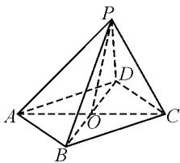
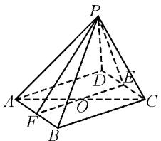
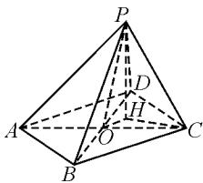

# 2023 年高考数学全国甲卷理科题 11 的探究\*

# ● 江苏省张家港市沙洲中学 杜文正

摘要: 立体几何综合应用问题的解题思维视角往往多变, 切入点众多, 是全面考查基础知识与基本能力等方面的一个重要场所. 结合一道高考立体几何题的展示, 以多个思维视角的切入来解题, 剖析巧妙的技巧方法与策略应用, 指导高考复习备考.

关键词: 立体几何; 四棱锥; 面积; 向量; 三余弦定理

历年高考数学立体几何试题是基于数学课程标准,借助立体几何中的基础知识与基本能力等,合理创设立体几何模型,结合各形式问题的设置来巧妙命题,考查“三维”空间问题与“二维”平面问题的联系与转化,要求学生具备数形结合意识与空间想象能力等,能够利用正确的数学图形语言来描述、分析,并借助几何直观,以及合理逻辑推理与数学运算等来解决问题.

# 1 真题呈现

高考真题 （2023年高考数学全国甲卷理科·11）在四棱锥 P-ABCD 中，底面 ABCD 为正方形，AB=4, PC=PD=3, $\angle PCA=45^{\circ}$ ，则 $\triangle PBC$ 的面积为（）.

A. $2\sqrt{2}$

B. $3\sqrt{2}$

C. $4\sqrt{2}$

D. $5\sqrt{2}$

此题以四棱锥为立体几何模型,借助底面的边长、部分侧棱长以及一个对应角等已知条件的设置,利用数据信息来合理确定唯一的立体几何模型,进而求解该四棱锥中的一个相关侧面三角形的面积.利用“三维”空间设置,解决“二维”平面问题,实现不同维度之间的联系与转化.

而在实际解决此类立体几何问题时,可以单纯以几何形式的视角,结合相关几何逻辑推理与数学运算等来分析与求解;也可以借助空间向量的视角,结合向量的运算等来化归与转化;还可以从空间几何的一些相关“二级结论”或相关的定理、公式等的视角,结合立体几何模型所满足的条件直接利用相关定理、公式等来巧妙应用.不同的思维视角,巧妙合理切入,都可以很好达到目的,巧妙解决问题.

# 2 真题破解

方法 1: 几何法 1.

解析: 连接 AC, BD 交于点 O, 连接 PO, 则 O 为 AC, BD 的中点, 如图 1 所示.

因为底面 ABCD 为正方形，AB=4，所以 AC=BD= $4\sqrt{2}$ ，则 DO=CO= $2\sqrt{2}$ .

text_image

Geometric diagram of a pyramid with labeled vertices and internal points, used in spatial geometry problems.

图1

又 $PC = PD = 3$ ，所以 $\triangle PDO\cong \triangle PCO$ ，则 $\angle PDO = \angle PCO.$

又 PC=PD=3, AC=BD=4 $\sqrt{2}$ ，所以 $\triangle PDB\cong\triangle PCA$ ，则 PA=PB.

在 $\triangle PAC$ 中， $PC=3,AC=4\sqrt{2},\angle PCA=45^{\circ}$ ，于是根据余弦定理可得 $PA^{2}=AC^{2}+PC^{2}-2AC\cdot PC\cos\angle PCA=32+9-2\times4\sqrt{2}\times3\times\frac{\sqrt{2}}{2}=17$ ，则 $PA=\sqrt{17}$ ，所以 $PB=\sqrt{17}$ .

在 $\triangle PBC$ 中， $PC=3,PB=\sqrt{17},BC=4$ ，由余弦定理可得

$$
\cos \angle P C B = \frac {P C ^ {2} + B C ^ {2} - P B ^ {2}}{2 P C \times B C} = \frac {9 + 1 6 - 1 7}{2 \times 3 \times 4} = \frac {1}{3}.
$$

又 $0 < \angle PCB < \pi$ ，所以

$$
\sin \angle P C B = \sqrt {1 - \cos^ {2} \angle P C B} = \frac {2 \sqrt {2}}{3}.
$$

所以 $\triangle PBC$ 的面积为 $S = \frac{1}{2} PC \cdot BC \sin \angle PCB = \frac{1}{2} \times 3 \times 4 \times \frac{2\sqrt{2}}{3} = 4\sqrt{2}$ . 故选择答案: C.

方法 2: 几何法 2.

解析: 分别取 CD, AB 的中点 E, F, 连接 PE, PF, EF, 如图 2 所示.

因为 PC = PD，所以 $PE \perp CD$ ，而底面 ABCD 为正方形，所以 $EF \perp CD$ 。

text_image

Geometric diagram of a pyramid with labeled vertices and internal points, used in spatial geometry problems.

图2

又 $PE \cap EF = E$ ，所以 $CD \perp$ 平面 PEF。

而 $AB \parallel CD$ ，所以 $AB \perp$ 平面 PEF。结合 $PF \subset$ 平面 PEF，可得 $AB \perp PF$ 。

又 F 为 AB 的中点, 则 PA = PB.

在 $\triangle PAC$ 中， $PC = 3, AC = 4\sqrt{2}, \angle PCA = 45^{\circ}$ ，于是根据余弦定理可得 $PA^{2} = AC^{2} + PC^{2} - 2AC \cdot PC\cos \angle PCA = 32 + 9 - 2 \times 4\sqrt{2} \times 3 \times \frac{\sqrt{2}}{2} = 17$ ，故 $PA = \sqrt{17}$ ，则有 $PB = PA = \sqrt{17}$ .

在 $\triangle PBC$ 中， $PC=3,PB=\sqrt{17},BC=4$ ，由余弦定理可得

$$
\cos \angle P C B = \frac {P C ^ {2} + B C ^ {2} - P B ^ {2}}{2 P C \times B C} = \frac {9 + 1 6 - 1 7}{2 \times 3 \times 4} = \frac {1}{3}.
$$

又 $0 < \angle PCB < \pi$ ，所以

$$
\sin \angle P C B = \sqrt {1 - \cos^ {2} \angle P C B} = \frac {2 \sqrt {2}}{3}.
$$

所以 $\triangle PBC$ 的面积为 $S = \frac{1}{2} PC \cdot BC \sin \angle PCB = \frac{1}{2} \times 3 \times 4 \times \frac{2\sqrt{2}}{3} = 4\sqrt{2}$ . 故选择答案: C.

解后反思:根据几何法,合理将立体几何中的“三维”问题降维处理,通过平面几何的“二维”思维来分析与求解对应的边与角问题,是解决立体几何问题中比较常用的技巧思维.借助降维处理,将立体几何问题通过平面几何中的解三角形等知识来分析与应用,空间想象,直观处理.

方法 3: 向量法.

解析: 连接 AC, BD 交于点 O, 连接 PO, 则 O 为 AC, BD 的中点, 如图 1 所示(方法 1 中的图).

因为底面 ABCD 为正方形, AB = 4, 所以 AC = BD = $4\sqrt{2}$ .

在 $\triangle PAC$ 中， $PC=3,AC=4\sqrt{2},\angle PCA=45^{\circ}$ ，于是根据余弦定理可得 $PA^{2}=AC^{2}+PC^{2}-2AC\cdot$

$$
P C \cos \angle P C A = 3 2 + 9 - 2 \times 4 \sqrt {2} \times 3 \times \frac {\sqrt {2}}{2} = 1 7.
$$

所以 $PA = \sqrt{17}$ .

又根据余弦定理可以得到 $\cos\angle APC=\frac{PA^{2}+PC^{2}-AC^{2}}{2PA\times PC}=\frac{17+9-32}{2\times\sqrt{17}\times3}=-\frac{\sqrt{17}}{17}.$

所以 $\overrightarrow{PA} \cdot \overrightarrow{PC} = PA \cdot PC\cos \angle APC = \sqrt{17} \times 3 \times \left(-\frac{\sqrt{17}}{17}\right) = -3.$

不妨设 PB=m， $\angle BPD=\theta.$

由于 $\overrightarrow{PO} = \frac{1}{2} (\overrightarrow{PA} +\overrightarrow{PC}) = \frac{1}{2} (\overrightarrow{PB} +\overrightarrow{PD})$ ，则有 $(\overrightarrow{PA} +\overrightarrow{PC})^2 = (\overrightarrow{PB} +\overrightarrow{PD})^2.$

所以 $\overrightarrow{PA}^2 +\overrightarrow{PC}^2 +2\overrightarrow{PA}\cdot \overrightarrow{PC} = \overrightarrow{PB}^2 +\overrightarrow{PD}^2+$ $2\overrightarrow{PB}\cdot \overrightarrow{PD}$ ，即

$$
1 7 + 9 + 2 \times (- 3) = m ^ {2} + 9 + 2 \times 3 \times m \cos \theta ,
$$

整理可得 $m^{2}+6m\cos\theta-11=0$ .

在 $\triangle PBD$ 中，由余弦定理可得 $BD^{2}=PB^{2}+PD^{2}-2PB\cdot PD\cos\angle BPD$ ，即 $32=m^{2}+9-2\times m\times3\cos\theta$ ，即 $m^{2}-6m\cos\theta-23=0$ 。

所以 $2m^{2}-34=0$ ，解得 $m=PB=\sqrt{17}$ .

在 $\triangle PBC$ 中， $PC=3,PB=\sqrt{17},BC=4$ ，由余弦定理可得

$$
\cos \angle P C B = \frac {P C ^ {2} + B C ^ {2} - P B ^ {2}}{2 P C \times B C} = \frac {9 + 1 6 - 1 7}{2 \times 3 \times 4} = \frac {1}{3}.
$$

又 $0 < \angle PCB < \pi$ ，所以

$$
\sin \angle P C B = \sqrt {1 - \cos^ {2} \angle P C B} = \frac {2 \sqrt {2}}{3}.
$$

所以 $\triangle PBC$ 的面积为 $S = \frac{1}{2} PC \cdot BC \sin \angle PCB = \frac{1}{2} \times 3 \times 4 \times \frac{2\sqrt{2}}{3} = 4\sqrt{2}$ . 故选择答案: C.

解后反思:根据空间向量的线性关系构建相关的关系式,借助向量的数量积公式以及解三角形中的余弦定理等构建对应三角形中边与角的关系,为进一步分析与求解提供条件.借助向量的运算思维,可以利用数学运算来回避逻辑推理,对于解决一些立体几何中的计算问题有奇效.

方法 4: 三余弦定理法.

解析: 设 $AC \cap BD = O$ ，过点 P 作 $PH \perp$ 平面 ABCD，垂足为 H，连接 OH, CH，如图 3 所示。因为 PC = PD，所以点 H 在 CD 的中垂线上，从而 $OH \parallel BC$ 。

而底面 ABCD 为正方形, 可得 $\angle BCA = \angle DCA = 45^{\circ}$ .

text_image

Geometric diagram of a pyramid with labeled vertices and internal points, used in spatial geometry problems.

图 3

在 $\triangle PDC$ 中，PC=PD=3，CD=AB=4，所以

$$
\cos \angle P C D = \frac {P C ^ {2} + C D ^ {2} - P D ^ {2}}{2 P C \times C D} = \frac {9 + 1 6 - 9}{2 \times 3 \times 4} = \frac {2}{3}.
$$

设 $\angle OCH=\theta$ ，利用三余弦定理可得

$$
\cos \angle P C H \cdot \cos (4 5 ^ {\circ} - \theta) = \cos \angle P C D = \frac {2}{3},
$$

(下转第98页)

由②一①，整理得圆 $C_{1}$ 与圆 $C_{2}$ 公切线

$$
l _ {2}: 3 x + 4 y - 5 = 0.
$$

连心线 $C_{1}C_{2}$ 的方程为 $y=\frac{4}{3}x$ ，联立直线 $l_{1}$ 与连心线 $C_{1}C_{2}$ 的方程得 $\left\{\begin{aligned}x&=-1,\\ y&=\frac{4}{3}x,\end{aligned}\right.$ 解得 $\left\{\begin{aligned}x&=-1,\\ y&=-\frac{4}{3},\end{aligned}\right.$ 则直线 $l_{1}$ 与连心线 $C_{1}C_{2}$ 的交点为 $D\left(-1,-\frac{4}{3}\right)$ . 显然公切线 $l_{1}$ 与圆 $C_{1}$ 相切于点 $E(-1,0)$ . 设公切线 $l_{3}$ 与圆 $C_{1}$ 相切于点 $F(x,y)$ ，因为 $\angle DEC_{1}=\angle DFC_{1}=90^{\circ}$ ，所以 D,E, $C_{1}$ ,F 四点共圆. 设四边形 $DEC_{1}F$ 的外接圆的圆心为 $O_{1}$ ，半径为 R，则 $O_{1}$ 为线段 $DC_{1}$ 的中点，半径 $R=\frac{1}{2}|DC_{1}|$ .

所以 $O_{1}\left(-\frac{1}{2},-\frac{2}{3}\right)$ ，且

$$
R = \frac {\sqrt {(- 1) ^ {2} + \left(- \frac {4}{3}\right) ^ {2}}}{2} = \frac {5}{6}.
$$

因此圆 $O_{1}$ 的方程为 $\left(x+\frac{1}{2}\right)^{2}+\left(y+\frac{2}{3}\right)^{2}=\frac{25}{36}$ .
联立圆 $O_{1}$ 与圆 $C_{1}$ 的方程，可得

$$
\left\{ \begin{array}{l} \left(x + \frac {1}{2}\right) ^ {2} + \left(y + \frac {2}{3}\right) ^ {2} = \frac {2 5}{3 6}, \\ x ^ {2} + y ^ {2} = 1, \end{array} \right.
$$

解得 $\left\{\begin{aligned}x&=\frac{7}{25},\\ y&=-\frac{24}{25},\end{aligned}\right.$ 或 $\left\{\begin{aligned}x&=-1,\\ y&=0.\end{aligned}\right.$

所以 $F\left(\frac{7}{25}, -\frac{24}{25}\right)$ .

又因为 $l_{3}$ 也经过点 $D\left(-1, -\frac{4}{3}\right)$ ，所以公切线 $l_{3}: 7x - 24y - 25 = 0$ .

点评:求直线与圆的切点坐标可转化为解圆 $O_{1}$ 与圆 $C_{1}$ 构成的方程组,则方程组的解就是切点坐标,从而求出切线方程. Z

(上接第95页)

$$
\cos \angle P C H \cdot \cos \theta = \cos 4 5 ^ {\circ} = \frac {\sqrt {2}}{2}.
$$

由以上两式相除，可得 $\frac{\cos(45^{\circ}-\theta)}{\cos\theta}=\frac{2\sqrt{2}}{3}$ ，即 $\frac{\frac{\sqrt{2}}{2}(\cos\theta+\sin\theta)}{\cos\theta}=\frac{2\sqrt{2}}{3}$ ，解得 $\tan\theta=\frac{1}{3}$ .

又利用三余弦定理可得

$$
\cos \angle P C H \cdot \cos (4 5 ^ {\circ} + \theta) = \cos \angle P C B,
$$

$$
\cos \angle P C H \cdot \cos \theta = \cos 4 5 ^ {\circ} = \frac {\sqrt {2}}{2}.
$$

由以上这两式相除可得 $\frac{\cos(45^{\circ}+\theta)}{\cos\theta}=\frac{\cos\angle PCB}{\frac{\sqrt{2}}{2}}$ ,

即 $\frac{\frac{\sqrt{2}}{2} (\cos \theta - \sin \theta)}{\cos \theta} = \sqrt{2} \cos \angle PCB$ ，解得 $\cos \angle PCB = \frac{1}{2} (1 - \tan \theta) = \frac{1}{3}$ .

又 $0 < \angle PCB < \pi$ ，所以

$$
\sin \angle P C B = \sqrt {1 - \cos^ {2} \angle P C B} = \frac {2 \sqrt {2}}{3}.
$$

所以 $\triangle PBC$ 的面积为 $S = \frac{1}{2} PC \cdot BC \sin \angle PCB = \frac{1}{2} \times 3 \times 4 \times \frac{2\sqrt{2}}{3} = 4\sqrt{2}$ . 故选择答案: C.

解后反思:根据立体几何中的三余弦定理来解决对应边之间的三角函数关系时,关键在于构建线面垂直关系,并利用线面垂直所对应的不同角之间的关系来合理构建三角函数关系式.三余弦定理(又叫最小值定理)作为一个课外拓展知识点,适用于立体几何中求解平面斜线与平面内直线所成的最小角问题,在解决一些空间角的综合应用问题中有奇效.

# 3 变式拓展

变式 在四棱锥 P-ABCD 中, 底面 ABCD 为正方形, AB = 4, PC = PD = 3, $\angle PCA = 45^{\circ}$ , 则该四棱锥 P-ABCD 的体积为 \_\_\_\_.

解析: 参照原高考真题的不同思维视角, 进一步加以分析与求解, 可得该四棱锥 P-ABCD 的高为 h=2, (方法 2 可在 $\triangle PEF$ 中求高, 方法 4 在 $\tan\theta$ 的求值基础上确定 $\cos\angle PCH$ 的值后再求高等.)

所以该四棱锥 P-ABCD 的体积 $V=\frac{1}{3}Sh=\frac{1}{3}\times4^{2}\times2=\frac{32}{3}$ . 故填答案: $\frac{32}{3}$ .

# 4 教学启示

此类立体几何的综合应用问题,严格遵循《普通高中数学课程标准(2017年版2020年修订)》,借助空间几何场景的设置,非常好地验证与落实立体几何模块知识的重点与难点,强化数学是研究数量关系和空间形式的学科,通过数形结合的思想方法建立“数”与“形”的双向联系,全面考查考生的“四基”,合理开拓并发展数学思维,不落俗套,不照搬现成模式,有效回避题海战术,合理发展学生数学思维与数学能力等. Z