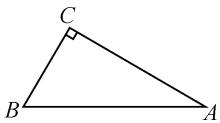
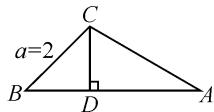

# 2024 年高考数学新高考Ⅱ卷第 15 题的探究

# ● 广西南宁市第十四中学 周竹兰

解三角形的基本应用问题,是综合解三角形与三角函数这些主干知识的一个基本考查点,也是高考数学的一个重要考查点.此类问题,往往依托初中平面几何图形的应用场景,联系起高中的解三角形、三角函数等相关知识,合理构建初、高中阶段知识的联系与应用,同时也交汇高中数学中的函数与方程、平面向量等其他相关知识,充分落实新课标中“在知识交汇点处命题”的高考基本指导思想,备受各方关注.

# 1 真题呈现

高考真题 记 $\triangle ABC$ 的内角 $A, B, C$ 的对边分别为 $a, b, c$ , 已知 $\sin A + \sqrt{3} \cos A = 2$ .

(1) 求 A;   
(2) 若 $a=2,\sqrt{2}b\sin C=c\sin 2B$ ，求 $\triangle ABC$ 的周长.

# 2 问题剖析

此题依托解三角形这一主干知识,结合三角函数、平面几何等相关知识的交汇与融合,通过三角函数中的三角恒等变换公式、解三角形中的正余弦定理等的转化与变形,实现问题的转化与变形,得以求解三角形中对应的角与三角形的周长问题.

第(1)问依托题设条件中三角形内角满足“ $\sin A + \sqrt{3}\cos A = 2$ ”，合理联想并应用相关的三角函数思维、函数与方程思维、构造思维等来分析与处理，实现角A的大小的求解.  
第(2)问,在第(1)问的基础上确定三角形的一个内角的具体值,并结合该内角的对边长度,以及相应的三角函数方程“ $\sqrt{2}b\sin C=c\sin 2B$ ”,进一步求出三角形的另一个内角,从解三角形中的正弦定理思维与平面几何中的直观思维来分析与求解,进而确定三角形的周长.

总体来说,该解三角形的基本应用问题,属于基本考题,难度中等,大部分考生都能有所突破与收获.在实际分析与求解过程中,要注意答题过程中逻辑推理的严谨性、数学运算的正确性等.

# 3 真题破解

# 3.1 第(1)问的解答

(1)三角函数思维

解法 1: 辅助角公式法. 由 $\sin A + \sqrt{3} \cos A = 2$ , 可

得 $\frac{1}{2}\sin A + \frac{\sqrt{3}}{2}\cos A = 1$ ，即 $\sin \left(A + \frac{\pi}{3}\right) = 1.$ 由 $A \in (0, \pi)$ ，可得 $A + \frac{\pi}{3} \in \left(\frac{\pi}{3}, \frac{4\pi}{3}\right)$ ，所以 $A + \frac{\pi}{3} = \frac{\pi}{2}$ ，解得 $A = \frac{\pi}{6}$ .

解法 2: 同角三角函数基本关系式法. 由 $\sin A + \sqrt{3} \cos A = 2$ ，结合平方关系 $\sin^{2}A + \cos^{2}A = 1$ ，消去 $\sin A$ 并整理可得 $4\cos^{2}A - 4\sqrt{3}\cos A + 3 = 0$ ，则有 $(2\cos A - \sqrt{3})^{2} = 0$ ，解得 $\cos A = \frac{\sqrt{3}}{2}$ ，而 $A \in (0, \pi)$ ，所以 $A = \frac{\pi}{6}$ .

(2) 导数思维

解法3: 极值点法. 设 $f(x)=\sin x+\sqrt{3}\cos x, x\in(0,\pi)$ ，则有 $f(x)=2\sin\left(x+\frac{\pi}{3}\right), x\in(0,\pi)$ . 显然当 $x=\frac{\pi}{6}$ 时， $f(x)_{\max}=2$ . 而 $f(A)=\sin A+\sqrt{3}\cos A=2=2\sin\left(A+\frac{\pi}{3}\right), f(x)_{\max}=f(A)$ ，在开区间 $(0,\pi)$ 上取到最大值，于是 x=A 必定是极值点，由 $f'(A)=0=\cos A-\sqrt{3}\sin A$ ，得 $\tan A=\frac{\sqrt{3}}{3}$ . 而 $A\in(0,\pi)$ ，所以 $A=\frac{\pi}{6}$ .

(3)构造思维

解法 4: 向量数量积公式法. 设平面向量 $a = (1, \sqrt{3})$ , $b = (\sin A, \cos A)$ ，结合条件可得 $a \cdot b = \sin A + \sqrt{3} \cos A = 2$ . 由向量的数量积公式，可得 $a \cdot b = |a||b| \cos \langle a, b \rangle = 2 \cos \langle a, b \rangle$ ，则 $2 \cos \langle a, b \rangle = 2$ ，即 $\cos \langle a, b \rangle = 1$ ，此时 $\langle a, b \rangle = 0$ ，即向量 a, b 同向.

由向量共线条件, 可得 $\frac{\sin A}{1} = \frac{\cos A}{\sqrt{3}}$ , 即 $\tan A = \frac{\sqrt{3}}{3}$ , 而 $A \in (0, \pi)$ , 所以 $A = \frac{\pi}{6}$ .

解法 5: 构造法. 构造如图 1 所示的 $\triangle ABC$ ，其中 C 为直角，令 $a=1, b=\sqrt{3}$ ，利用勾股定理可得 $c=\sqrt{a^{2}+b^{2}}=2$ . 结合已知条件 $\sin A + \sqrt{3}\cos A = 2$ ，即 $\cos B + \sqrt{3}\cos A = 2$ ，满足三角形的射影定理 $a\cos B + b\cos A = c$ .

  
图1

利用三角函数的定义, 可知 $\sin A = \frac{a}{c} = \frac{1}{2}$ , 又因为 $A \in \left(0, \frac{\pi}{2}\right)$ , 所以 $A = \frac{\pi}{6}$ .

点评:根据题设条件中的三角函数方程求解对应角的大小,解法1中的辅助角公式法与解法2中的同角三角函数基本关系式法,是依托三角函数方程的常规方法,要么转化为正弦型函数,要么转化为一元二次方程,都是基本的突破口与应用.这也是考生在考场中最容易想到的两种基本技巧方法.

解法 3 中的极值点法, 回归三角函数方程的方程本质, 依托三角函数的内涵, 借助函数与导数的应用来解决解三角形问题; 而解法 4 中的向量数量积公式法以及解法 5 中的构造法, 都是构造思维在解三角形问题中的应用, 依托三角函数方程的结构特征, 或从 “数” 的基本属性视角来合理构造, 或从 “形” 的几何特征视角来直观构造, 都能很好实现问题的突破与求解.

# 3.2 第(2)问的解答

解法1: 正弦定理法. 由 $\sqrt{2} b \sin C = c \sin 2B$ , 根据正弦定理可得 $\sqrt{2} \sin B \sin C = \sin C \sin 2B$ , 结合二倍角公式有 $\sqrt{2} \sin B \sin C = 2 \sin C \sin B \cos B$ . 而 $\sin B \neq 0, \sin C \neq 0$ , 可得 $\sqrt{2} = 2 \cos B$ , 即 $\cos B = \frac{\sqrt{2}}{2}$ , 而 $B \in \left(0, \frac{\pi}{2}\right)$ , 所以 $B = \frac{\pi}{4}$ .

而 $A = \frac{\pi}{6}$ ，可得 $C = \pi - A - B = \frac{7\pi}{12}$ .

而 a=2，结合正弦定理 $\frac{a}{\sin A}=\frac{b}{\sin B}=\frac{c}{\sin C}$ ，即 $\frac{2}{\frac{1}{2}}=\frac{b}{\frac{\sqrt{2}}{2}}=\frac{c}{\frac{\sqrt{6}+\sqrt{2}}{4}}$ ，解得 $b=2\sqrt{2}, c=\sqrt{6}+\sqrt{2}$ .

所以 $\triangle ABC$ 的周长为 $a+b+c=2+\sqrt{6}+3\sqrt{2}$ .

解法 2: 几何法. 由(1)知 A=$\frac{\pi}{6}$ ，而 a=2。如图 2 所示，过点 C
作 $CD \perp AB$ ，交 AB 于点 D。由$\sqrt{2}b\sin C=c\sin 2B$ ，得 $\sqrt{2}b\sin C=2c\sin B\cos B$ ，则有 $\sqrt{2}\left(\frac{1}{2}\cdot2b\sin C\right)=2\left(\frac{1}{2}\cdot2c\sin B\right)\cdot\cos B$ 。结合三角形的面积公式有 $\sqrt{2}S=2S\cos B$ ，则 $\cos B=\frac{\sqrt{2}}{2}$ ，而 $B\in\left(0,\frac{\pi}{2}\right)$ ，所以可得 $B=\frac{\pi}{4}$ 。利用图形直观可知， $|CD|=a\sin B=\sqrt{2}$ ， $|BD|=a\cos B=\sqrt{2}$ 。而 $|CD|=b\sin A=\frac{1}{2}b=\sqrt{2}$ ，可得 $b=2\sqrt{2}$ ，则有 $|AD|=b\cdot$

  
图2

$\cos A = \sqrt{6}$ .

所以 $\triangle ABC$ 的周长为 $a+b+c=2+\sqrt{6}+3\sqrt{2}$ .

点评:在第(1)问的基础上确定三角形的一个内角值,进而结合该已知内角的对边长度以及相应的三角函数方程来求解三角形的周长.解法1中的正弦定理法,是解决此类问题的常规方法,依托三角恒等变换公式的合理变形与转化,并通过正弦定理分别求解各相应的边长,得以求解三角形的周长.

而解法 2 中的几何法, 是依托解三角形问题的“形”的几何特征, 通过图形直观, 结合三角形的面积公式、直角三角形中的勾股定理等来分段处理与分析求解, 回避解三角形中的正弦定理等的应用, 使得数学运算更加简捷有效.

# 4 变式拓展

基于原高考真题,保留题设条件与应用创设,同时保留第一小问,而在第二小问中,改变原来求解“ $\triangle ABC$ 的周长”为求解“ $\triangle ABC$ 的面积”,实现问题的变式应用.

变式 记 $\triangle ABC$ 的内角 $A, B, C$ 的对边分别为 $a, b, c$ , 已知 $\sin A + \sqrt{3} \cos A = 2$ .

(1) 求 A;

(2) 若 $a=2,\sqrt{2}b\sin C=c\sin 2B$ ，求 $\triangle ABC$ 的面积.

解析:(1) $A=\frac{\pi}{6}$ (过程略).

(2) 同以上高考真题中第(2)问的解法 1, 解得 $B = \frac{\pi}{4}$ , $C = \frac{7\pi}{12}$ .

而 a=2，结合正弦定理 $\frac{a}{\sin A}=\frac{b}{\sin B}$ ，即 $\frac{2}{\frac{1}{2}}=\frac{b}{\frac{\sqrt{2}}{2}}$ ，解得 $b=2\sqrt{2}$ .

所以 $\triangle ABC$ 的面积 $S = \frac{1}{2} ab\sin C = \sqrt{3} + 1$ .

# 5 教学启示

解决解三角形中的基本综合应用问题,合理寻觅并挖掘对应关系式的结构特征与题设条件,解题往往基于解三角形思维、三角函数思维、平面几何思维等,解题的关键在于合理进行恒等变形与转化,借助解题经验的积累与技巧方法的应用,选取行之有效的数学思维方法与对应的技巧策略.

特别在解决一些比较复杂的解三角形中的基本综合应用问题,经常借助函数与方程、函数与导数、平面几何性质、不等式等相关知识,实现三角形中基本元素的值(边、角、周长、面积等)以及相关元素的最值(或取值范围)问题的求解,从而有效养成良好的数学思维品质,提升数学解题能力,拓展数学应用与创新思维.Z