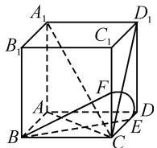
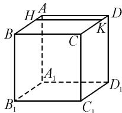
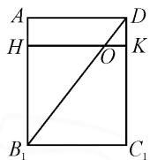
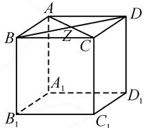
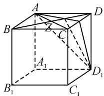
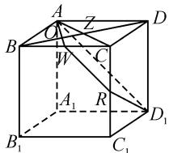

# 一道高中数学典型例题的素养分析及命题启示

# 浙江省嘉善县嘉善高级中学 李建良

《普通高中数学课程标准(2017年版2020年修订)》强调:数学运算素养是学生解决数学问题的基础,逻辑推理素养是学生分析问题和得出结论的关键,直观想象素养则帮助学生将抽象的数学概念具体化.这三种素养相互依托,共同构成学生全面解决问题的能力,是数学教育中的重要目标和考查重点.

# 1 典型例题及解析

题目 （多选题）已知正方体 $ABCD-A_{1}B_{1}C_{1}D_{1}$ 的棱长为 2, O 是空间中的一动点，下列结论正确的是（）.

A. 若点 O 在正方形 $DCC_{1}D_{1}$ 内部, 异面直线 $A_{1}B_{1}$ 与 OB 所成角为 $\theta$ , 则 $\theta$ 的取值范围为 $\left(\frac{\pi}{4}, \frac{\pi}{2}\right)$   
B. 若点 O 在正方形 $DCC_{1}D_{1}$ 内部，且 $|OB|=\sqrt{5}$ ，则点 O 的轨迹长度为 $\frac{1}{4}\pi$   
C. 若 $\overrightarrow{AO} = \frac{1}{4}\overrightarrow{AB} + \lambda\overrightarrow{AD} (0 \leqslant \lambda \leqslant 1)$ ，则 $B_{1}O + OD$ 的最小值为 $\sqrt{13}$   
D. 若 $\overrightarrow{AO} = \lambda \overrightarrow{AB} + (1 - \lambda) \overrightarrow{AD} (0 \leqslant \lambda \leqslant 1)$ ，平面 $OAD_{1}$ 截正方体 $ABCD - A_{1}B_{1}C_{1}D_{1}$ 所得截面面积的最大值为 $4\sqrt{3}$

解析:对于选项 A, 当 O 与 C 重合时, $\theta$ 取最大值 $\frac{\pi}{2}$ , 当 O 与 D 重合时, $\theta$ 取最小值 $\frac{\pi}{4}$ , 由于 O 在正方形 $DCC_{1}D_{1}$ 内部, 因此 $\theta$ 的取值范围为 $\left(\frac{\pi}{4}, \frac{\pi}{2}\right)$ , 故选项 A 正确.

对于选项 B, 由于 $\left|OB\right|=\sqrt{5}$ ，则点 O 在以点 B 为球心，半径为 $R=\sqrt{5}$ 的球面上，又点 O 在正方形 $DCC_{1}D_{1}$ 内部，所以点 O 在平面 $DCC_{1}D_{1}$ 与球面相交的圆上，若 E, F 分别是 CD, $CC_{1}$ 上的点，且 CE=

$$
C F = 1, \text {   此时   } B E = B F = \sqrt {5}.
$$

由图1知， $O$ 在 $\widehat{EF}$ 上，即 $O$ 的轨迹是以 $C$ 为圆心，1为半径的四分之一圆弧上，所以点 $O$ 轨迹的长度为 $\frac{1}{4} \times 2\pi = \frac{1}{2}\pi$ ，故选项B错误.

  
图1

对于选项 C, 如图 2, 在 AB 上取点 H, 使得 $\overrightarrow{AH} = \frac{1}{4}\overrightarrow{AB}$ , 在 CD 上取点 K, 使得 $\overrightarrow{DK} = \frac{1}{4}\overrightarrow{DC}$ .

text_image

H A
B C D
A₁ K
B₁ C₁ D₁

  
图2

由 $\overrightarrow{AO} = \frac{1}{4}\overrightarrow{AB} +\lambda \overrightarrow{AD}$ ，可得 $\overrightarrow{AO} -\overrightarrow{AH} = \lambda \overrightarrow{AD}$ ，即 $\overrightarrow{HO} = \lambda \overrightarrow{AD}$ ，所以点 $O$ 是线段HK上一点，将平面 $HKC_1B_1$ 沿HK展开至与平面AHKD共面，此时 $AB_{1} = AH + B_{1}H = 3$ ，当 $B_{1},O,D$ 三点共线时， $B_{1}O + OD$ 取得最小值 $\sqrt{13}$ ，故选项C正确.

对于选项 D, 根据 $\overrightarrow{AO} = \lambda \overrightarrow{AB} + (1 - \lambda) \overrightarrow{AD} (0 \leqslant \lambda \leqslant 1)$ ，得 $\overrightarrow{AO} - \overrightarrow{AD} = \lambda (\overrightarrow{AB} - \overrightarrow{AD})$ ，即 $\overrightarrow{DO} = \lambda \overrightarrow{DB}$ ，又 $0 \leqslant \lambda \leqslant 1$ ，可知 O 是线段 BD 上一点。如图 3，连接 AC，与 BD 交于点 Z.

当 O 与 D 重合时, 平面 $OAD_{1}$ 与平面 $ADD_{1}A_{1}$ 重合, 不符合题意.

当 O 在线段 DZ（不含点 D）上时，平面 $OAD_{1}$ 截正方体 AB-CD- $A_{1}B_{1}C_{1}D_{1}$ 所得截面为三角形，如图 4，当 O 与 Z 重合时，此时截面为 $\triangle ACD_{1}$ ，截面面积最大，三边长均为 $2\sqrt{2}$ ，故截面面积最大值为 $\frac{\sqrt{3}}{4}\times(2\sqrt{2})^{2}=2\sqrt{3}$ .

当 O 在线段 BZ（不含点 B, Z）上时，如图 5，延长 AO 并与 BC 交于点 W，作 $WR \parallel AD_{1}$ 并与 $CC_{1}$ 交于点 R，则截面为等腰梯形 $AWRD_{1}$ . 设 BW = x，则有 $AW = D_{1}R = \sqrt{4 + x^{2}}$ , $WR = \sqrt{2}(2 - x)$ ,梯形 $AWRD_{1}$ 的高 $h=\sqrt{A\ W^{2}-\frac{(AD_{1}-WR)^{2}}{4}}=$

text_image

A
B
Z
C
D
A₁
B₁
C₁
D₁

图3

text_image

A
B
C
D
A₁
B₁
C₁
D₁

图 4

text_image

A
O
W
C
D
B
A₁
R
D₁
B₁
C₁

图5

$\sqrt{4+\frac{1}{2}x^{2}}$ ，梯形的面积为 $\frac{1}{2}(AD_{1}+WR)\cdot h=\frac{(4-x)\sqrt{8+x^{2}}}{2}<4\sqrt{2}$ ，当O与B重合时，截面为矩形 $ABC_{1}D_{1}$ ，面积为 $4\sqrt{2}$ ，故平面 $OAD_{1}$ 截正方体 $ABCD-A_{1}B_{1}C_{1}D_{1}$ 所得截面积的最大值为 $4\sqrt{2}$ ，故选项D错误.

故选: AC.

# 2 例题素养分析

# 2.1 数学运算素养的考查与培养

该题通过复杂的空间几何关系和向量运算,考查学生的数学运算素养.A选项要求学生计算异面直线 $A_{1}B_{1}$ 与OB所成的角度,这需要学生掌握向量夹角的计算公式,并在空间几何背景下正确应用.B选项涉及点O在平面 $DCC_{1}D_{1}$ 内部的运动轨迹,需要应用平面几何和圆的知识,计算特定条件下的轨迹长度.C选项要求学生分析向量组合关系,计算点到线段最小距离,这需要对向量基本运算及其在几何中的应用有深刻理解.D选项涉及平面与正方体的截面面积计算,要求学生通过代数运算得出最大面积.

# 2.2 逻辑推理素养的考查与培养

该题对逻辑推理素养的考查体现在要求学生从已知条件推导出合理的数学结论。A选项中，学生需要推断点 $O$ 在特定区域内时，异面直线所成角的范围，这涉及空间位置关系的分析与逻辑推理。B选项通过给出特定条件要求学生推导轨迹长度，考查学生能否将复杂的空间位置关系转化为已知的几何模型进行计算。C选项通过向量表达式考查最小距离问题，学生需要通过合理的推理步骤分析出距离的最优解。D选项则要求学生在平面与立体几何之间进行转化，通过合理的推理和运算得出截面面积的最大值。

# 2.3 直观想象素养的考查与培养

试题涉及正方体及其内部的点、线、面关系,要求学生具备强大的空间想象能力.A选项涉及异面直线所成角度的空间关系,学生需要在脑海中构建出相应的几何模型并直观理解角度范围.B选项要求学生想象点O在特定平面内的运动轨迹,并结合几何性质确定长度.C选项考查了学生对向量关系的空间理解,学生需要在头脑中直观地想象向量的组合变化及其在几何空间中的位置关系.D选项要求学生通过直观想象理解平面截立方体的截面形状和大小,最终通过计算得出面积最大值.通过这些问题,学生能够逐步形成对于空间几何的直观理解,从而提高解决空间问题的能力.

# 3 试题命制启示

# 3.1 命题设计应融合多元化的运算情境,提升学生的数学运算能力

在试题设计中,应注重将多种数学运算情境融合到一个综合性问题中,以此促进学生在复杂情境下的运算能力提升.例如,在空间几何问题中,可以设计包含向量运算、距离计算和面积求解等多步骤的计算任务,让学生在多个运算环节中不断巩固和提升自己的数学运算技能.通过这种多元化的运算任务,学生不仅能够掌握不同运算方法之间的相互关系,还能提高在复杂问题中灵活运用多种运算技能的能力.命题者应注意在问题设计中适当增加运算难度,并鼓励学生在解题过程中主动选择和应用合适的运算工具,提高运算的效率和准确性,从而更好地培养学生的数学运算能力.

# 3.2 命题设计应强化逻辑推理的层次性,引导学生构建严密的思维链条

试题设计中应注重逻辑推理任务的层次性,逐步引导学生在解题过程中构建严密的思维链条.例如,通过设置多步推理的题目,学生在每一步推理过程中都能清晰地理解和掌握各个条件之间的逻辑关系,从而最终得出正确的结论,培养学生在多步骤推理中保持思维连贯性的能力.在命题过程中,命题人还应考虑到推理过程中的逻辑严密性和合理性,避免出现过于简单或缺乏思维挑战的题目,确保学生在推理过程中能够不断深化对问题的理解和分析.这种层次性的推理设计,有助于培养学生在面对复杂问题时能够有条不紊地进行分析和推导,最终形成系统的解题思路.

# 3.3 命题设计应注重空间想象力的锻炼,通过直观几何任务培养学生的空间感知能力

在试题设计中,应强化空间想象力的锻炼,通过设计需要直观想象的几何任务,培养学生的空间感知能力.命题者应设计一些需要构建几何模型或理解空间位置关系的情境,鼓励学生通过直观的几何构想来解决问题.这种设计不仅能够提升学生的空间感知能力,还能帮助他们在解题过程中形成清晰的空间结构理解.此外,可以通过引入动态几何情境,促使学生在思考过程中不断调整和优化自己的空间直观模型,从而更好地理解几何关系和空间结构.命题过程中,应尽量避免纯粹依赖公式推导的题目,而是通过增强几何问题的直观性和空间感,促使学生能够在实际操作中提升自己的空间想象能力,这对提高学生的几何直观素养具有重要意义.Z