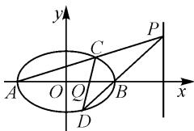

# 一道高考解析几何压轴题的探究

# ● 武汉市第二十三中学 何红梅

# 1 题目呈现

(2020 全国卷) 已知 A, B 分别为椭圆 $E: \frac{x^{2}}{a^{2}} + y^{2} = 1 (a > 1)$ 的左、右顶点，G 为 E 的上顶点， $\overrightarrow{AG} \cdot \overrightarrow{GB} = 8, P$ 为直线 l: x = 6 上的动点，PA 与 E 的另一交点为 C, PB 与 E 的另一交点为 D.

(1) 求 E 的方程；  
(2) 证明: 直线 CD 过定点.

# 2 题目剖析

第(1)问直接运用题目条件可求出 E 的方程:

由椭圆方程 $E:\frac{x^{2}}{a^{2}}+y^{2}=1(a>1)$ ，可得 $A(-a,0)$ ， $B(a,0)$ ， $G(0,1)$ ，则 $\overrightarrow{AG}=(a,1)$ ， $\overrightarrow{GB}=(a,-1)$ .

所以 $\overrightarrow{AG}\cdot\overrightarrow{GB}=a^{2}-1=8$ ，得 $a^{2}=9$ 。

故椭圆 E 方程为 $\frac{x^{2}}{9} + y^{2} = 1$ .

第(2)问,证明直线过定点可用如下方法:

（i）联立直线与圆锥曲线方程，利用直接法算出直线 CD 方程，找出定点；也可以先设出直线 CD 方程，再根据题目条件算出定点.  
(ii) 圆曲不联立, 证明直线过定点.

# 3 第(2)问的探究

# 3.1 思维角度 1: 联立之直接法

如图 1, 设出点 P, 写出直线 AP 和 BP 方程, 分别与椭圆联立求出点 C, D, 然后写出直线 CD, 从而计算出直线 CD 过定点. 由于此方法比较常规, 证明过程只作简要说明.

text_image

y
C
P
A O Q B x
D

图1

简证: 设 $P(6, y_{0})$ ，则 $AP: y = \frac{y_{0}}{9}(x + 3)$ 。联立直线 AP 与椭圆的方程，由 $(-3) \cdot x = \frac{9y_{0}^{2} - 81}{y_{0}^{2} + 9}$ ，可得 $x = \frac{-3y_{0}^{2} + 27}{y_{0}^{2} + 9}$ ，将其代入直线 AP 的方程中，可得 y =

$\frac{6y_{0}}{y_{0}^{2}+9}$ ，所以点 $C\left(\frac{-3y_{0}^{2}+27}{y_{0}^{2}+9},\frac{6y_{0}}{y_{0}^{2}+9}\right)$ .

同理,可得点 D 的坐标为 $\left(\frac{3y_{0}^{2}-3}{y_{0}^{2}+1},\frac{-2y_{0}}{y_{0}^{2}+1}\right)$ .

所以当 $y_{0}^{2} \neq 3$ 时，可知 $CD: y = \frac{4y_{0}}{3(3 - y_{0}^{2})} \left( x - \frac{3}{2} \right)$ ，则直线 CD 过定点 $\left( \frac{3}{2}, 0 \right)$ .

当 $y_{0}^{2}=3$ 时，直线 CD 方程为 $x=\frac{3}{2}$ .

综上, 直线 CD 过定点 $\left(\frac{3}{2}, 0\right)$ .

# 3.2 思维角度 2: 联立之韦达定理法

设出直线 CD 方程, 然后根据题目条件计算出直线 CD 过定点. 此思路消参过程中会出现 $x_{1}y_{2}$ 和 $x_{2}y_{1}$ , 直接运用韦达定理消参比较困难, 可利用椭圆相关性质转化直线斜率的表达式, 最终利用韦达定理消参.

证明:设直线 CD 的方程为 $x=my+n, C(x_{1},y_{1})$ , $D(x_{2},y_{2})$ . 联立直线 CD 和椭圆 E 的方程, 可以得到 $(9+m^{2})y^{2}+2mny+n^{2}-9=0$ , 则

$$
y _ {1} + y _ {2} = \frac {- 2 m n}{9 + m ^ {2}}, y _ {1} y _ {2} = \frac {n ^ {2} - 9}{9 + m ^ {2}}.
$$

直线 $AP$ 方程为 $y = \frac{y_1}{x_1 + 3} (x + 3)$ ，直线 $BP$ 方程为 $y = \frac{y_2}{x_2 - 3} (x - 3)$ .

由椭圆的性质可得 $k_{AD} \cdot k_{BP} = -\frac{b^2}{a^2}$ , 即 $\frac{y_2}{x_2 - 3} = -\frac{x_2 + 3}{9y_2}$ , 则直线 $BP$ 方程为 $y = -\frac{x_2 + 3}{9y_2}(x - 3)$ . 联立直线 $AP$ 和直线 $BP$ , 得 $\frac{y_1}{x_1 + 3}(x + 3) = \frac{x_2 + 3}{-9y_2}(x - 3)$ .

由 $x = 6$ ，可得 $-27y_{1}y_{2} = (3 + x_{1})(3 + x_{2})$ ，即

$$
(2 7 + m ^ {2}) y _ {1} y _ {2} + m (n + 3) \left(y _ {1} + y _ {2}\right) + (n + 3) ^ {2} = 0.
$$

整理, 得 $(27 + m^{2})(n^{2} - 9) - 2m(n + 3)mn + (n + 3)^{2}(m^{2} + 9) = 0$ , 解得 $n = \frac{3}{2}$ .

故直线 $CD$ 的方程为 $x = my + \frac{3}{2}$ , 直线 $CD$ 过定

点 $\left(\frac{3}{2},0\right)$ .

# 3.3 思维角度 3: 圆曲不联立之对偶式法

对于出现 $x_{1}y_{2}$ 和 $x_{2}y_{1}$ 不好直接运用韦达定理消参的题型，除思维角度 2 的方法外，通常还可以利用椭圆方程构造关于 $x_{1}y_{2}, x_{2}y_{1}$ 的对偶式，通过圆曲不联立消参.

证明: 设 $C(x_{1}, y_{1})$ , $D(x_{2}, y_{2})$ , CD 过 x 轴上的点 $Q(n, 0)$ .

由 $C, D, Q$ 三点共线，可得 $\frac{y_1}{x_1 - n} = \frac{y_2}{x_2 - n}$ ，即

$$
x _ {1} y _ {2} - x _ {2} y _ {1} = n (y _ {2} - y _ {1}). \tag {①}
$$

由已知条件易得 $x_{1}y_{2} + x_{2}y_{1} = \frac{x_{1}^{2}y_{2}^{2} - x_{2}^{2}y_{1}^{2}}{x_{1}y_{2} - x_{2}y_{1}} =$ $\frac{(9 - 9y_1^2)y_2^2 - (9 - 9y_2^2)y_1^2}{x_1y_2 - x_2y_1} = \frac{9y_2^2 - 9y_1^2}{n(y_2 - y_1)} = \frac{9(y_2 + y_1)}{n},$

再结合①可得

$$
x _ {1} y _ {2} = \frac {1}{2} \left(\frac {9}{n} + n\right) y _ {2} + \frac {1}{2} \left(\frac {9}{n} - n\right) y _ {1}, \tag {②}
$$

$$
x _ {2} y _ {1} = \frac {1}{2} \left(\frac {9}{n} - n\right) y _ {2} + \frac {1}{2} \left(\frac {9}{n} + n\right) y _ {1}. \tag {③}
$$

设 $P(6, y_0)$ ，由 $A, C, P$ 三点共线和 $B, D, P$ 三点共线，可得

$$
\left\{ \begin{array}{l l} { \frac {y _ {1}}{x _ {1} + 3} = \frac {y _ {0}}{9},} \\ { \frac {y _ {2}}{x _ {2} - 3} = \frac {y _ {0}}{3},} \end{array} \right. \text {则} \frac {y _ {2}}{x _ {2} - 3} = \frac {3 y _ {1}}{x _ {1} + 3}.
$$

整理，得 $x_{1}y_{2} + 3y_{2} = 3x_{2}y_{1} - 9y_{1}$

将②和③代入,可得 $\frac{1}{2}\left(\frac{9}{n}+n\right)y_{2}+\frac{1}{2}\left(\frac{9}{n}-n\right)y_{1}+3y_{2}=\frac{3}{2}\left(\frac{9}{n}-n\right)y_{2}+\frac{3}{2}\left(\frac{9}{n}+n\right)y_{1}-9y_{1}$ ，化简得

$$
(4 n ^ {2} + 6 n - 1 8) y _ {2} = (4 n ^ {2} - 1 8 n + 1 8) y _ {1}.
$$

所以 $\left\{\begin{aligned}4n^{2}+6n-18=0,\\ 4n^{2}-18n+18=0,\end{aligned}\right.$ 解得 $n=\frac{3}{2}.$

故直线 CD 过定点 $\left(\frac{3}{2},0\right)$ .

其实,利用思维角度3的方法深入研究,可以得到结论:当点P所在直线l的方程为x=m,椭圆E方程为 $\frac{x^{2}}{a^{2}}+\frac{y^{2}}{b^{2}}=1(a>b>0)$ 时,直线CD所过定点与直线l恰好是极点与极线的关系.

证明: 设 $C(x_{1}, y_{1})$ , $D(x_{2}, y_{2})$ ，直线 CD 交 x 轴于点 $Q(n, 0)$ , $n \neq \pm a$ .

由 $C, D, Q$ 三点共线，可得 $\frac{y_1}{x_1 - n} = \frac{y_2}{x_2 - n}$ ，即

$$
x _ {1} y _ {2} - x _ {2} y _ {1} = n (y _ {2} - y _ {1}). \tag {④}
$$

又容易得到 $x_{1}y_{2} + x_{2}y_{1} = \frac{x_{1}^{2}y_{2}^{2} - x_{2}^{2}y_{1}^{2}}{x_{1}y_{2} - x_{2}y_{1}} =$

$$
\frac {\left(a ^ {2} - \frac {a ^ {2}}{b ^ {2}} y _ {1} ^ {2}\right) y _ {2} ^ {2} - \left(a ^ {2} - \frac {a ^ {2}}{b ^ {2}} y _ {2} ^ {2}\right) y _ {1} ^ {2}}{x _ {1} y _ {2} - x _ {2} y _ {1}} = \frac {a ^ {2} y _ {2} ^ {2} - a ^ {2} y _ {1} ^ {2}}{n \left(y _ {2} - y _ {1}\right)} =
$$

$\frac{a^{2}(y_{2}+y_{1})}{n}$ ，再结合④式可得

$$
x _ {1} y _ {2} = \frac {1}{2} \left(\frac {a ^ {2}}{n} + n\right) y _ {2} + \frac {1}{2} \left(\frac {a ^ {2}}{n} - n\right) y _ {1}, \tag {⑤}
$$

$$
x _ {2} y _ {1} = \frac {1}{2} \left(\frac {a ^ {2}}{n} - n\right) y _ {2} + \frac {1}{2} \left(\frac {a ^ {2}}{n} + n\right) y _ {1}. \tag {6}
$$

设 $P(m, y_{0})$ ，由 A, C, P 三点共线和 B, D, P 三

点共线，得 $\left\{\begin{aligned}\frac{y_{1}}{x_{1}+a}&=\frac{y_{0}}{m+a},\\\frac{y_{2}}{x_{2}-a}&=\frac{y_{0}}{m-a}.\end{aligned}\right.$

所以 $\frac{y_2}{x_2 - a} = \frac{m + a}{m - a} \cdot \frac{y_1}{x_1 + a}$ , 即

$$
\begin{array}{c} (m - a) x _ {1} y _ {2} + a (m - a) y _ {2} = (m + a) x _ {2} y _ {1} - \\ a (m + a) y _ {1}. \end{array}
$$

将⑤⑥代入，整理得 $[mn^2 + a(m - a)n - a^3]y_2 = [mn^2 - a(m + a)n + a^3]y_1$

所以 $\left\{ \begin{array}{l} mn^2 + a(m - a)n - a^3 = 0, \\ mn^2 - a(m + a)n + a^3 = 0, \end{array} \right.$ 即

$$
\left\{ \begin{array}{l} (m n - a ^ {2}) (n + a) = 0, \\ (m n - a ^ {2}) (n - a) = 0. \end{array} \right.
$$

解得 $mn=a^{2}$ ，则 $m=\frac{a^{2}}{n}$ .

而由椭圆方程 $\frac{x^2}{a^2} +\frac{y^2}{b^2} = 1(a > b > 0)$ 可得点 $Q(n,0)$ 所对应的极线为 $\frac{x_Qx}{a^2} +\frac{y_Qy}{b^2} = 1$ ，即 $\frac{n\cdot x}{a^2} +$ $\frac{0\cdot y}{b^2} = 1$ ，所以 $x = \frac{a^2}{n} = m$ ，这正是直线 $l$ 的方程.

所以, 直线 CD 所过定点与点 P 所在直线 l 恰好是极点与极线的关系.

这也说明,这道高考题的第(2)问本质是一个椭圆的极点与极线问题.当 x=m 给定时,由 $nm=a^{2}$ , 可得 $n=\frac{a^{2}}{m}$ , 即直线 CD 恒过定点 $Q\left(\frac{a^{2}}{m},0\right)$ .

# 3.4 思维角度 4: 圆曲不联立之曲线系法

由 A, B, C, D 四点中写出曲线系方程和椭圆对比, 从而算出定点.

证明: 设 $P(6, y_{0})$ ，直线 CD 方程为 $x = my + n$ 。因为直线 AC 方程为 $y = \frac{y_{0}}{9}(x + 3)$ ，直线 BD 方程为

$y=\frac{y_{0}}{3}(x-3)$ ，直线AB方程为y=0，所以，过A,B,C,D的曲线系可设为 $(y_{0}x-9y+3y_{0})\cdot(y_{0}x-3y-3y_{0})+\lambda y(x-my-n)=0$ 。与椭圆 $x^{2}+9y^{2}-9=0$ 对比系数，得 $\left\{\begin{aligned}-12y_{0}+\lambda&=0,\\ 18y_{0}-n\lambda&=0,\end{aligned}\right.$ 解得 $n=\frac{3}{2}$ 。

故直线 CD 的方程为 $x=my+\frac{3}{2}$ .

所以直线 CD 过定点 $\left(\frac{3}{2},0\right)$ .

思维角度 3 和思维角度 4 提供的方法, 不仅适用于椭圆, 也适用于其他圆锥曲线, 尤其在证明有关圆锥曲线的极点极线问题 $^{[1-2]}$ 上非常有优势.

# 4 总结

本题主要考查了椭圆性质及方程思想,还考查了计算能力及转化思想、推理论证能力,属于偏难题,其中证明直线过定点是难点,本文中给出了四种思路.直接设点求出相关直线,然后与椭圆方程联立,求出所求直线的方程,进而求出定点;另一个方法是设出所求直线,利用韦达定理算出定点.这两种方法属于常规方法,易于掌握.本文中还提供了另外两种方法,一种是利用椭圆方程构造对偶式,通过圆曲不联立消参,巧妙地优化了计算;另一种是灵活运用二次曲线系方程表示含有公共交点的圆锥曲线,可以快速解答四点共圆、定值定点问题,以及有关斜率问题.在平时教学中,教师应多给学生总结一些解题规律,让学生见到更多的解题方法,开阔思路,提升解题能力.

# 参考文献：

[1] 王慧兴. 强基计划数学备考系列讲座(15)——圆锥曲线的极点、极线基本理论与应用 [J]. 高中数理化, 2023(7): 18-23.  
[2] 沈海英, 王树文. 圆锥曲线的极点与极线——2020 高考北京卷解析试题背景探究 [J]. 中学生数学, 2021(5): 41-42. Z

# (上接第53页)

则 $y_{1} + y_{2} = -\frac{6m}{3m^{2} + 4},y_{1}y_{2} = \frac{-9}{3m^{2} + 4}.$

结合 $x_{1} = my_{1} + 1, x_{2} = my_{2} + 1$ ，得

$$
\begin{array}{l} k _ {P T} k _ {Q T} \\ = \frac {y _ {1} - y _ {0}}{x _ {1} - x _ {0}} \cdot \frac {y _ {2} - y _ {0}}{x _ {1} - x _ {0}} \\ = \frac {y _ {1} y _ {2} - y _ {0} \left(y _ {1} + y _ {2}\right) + y _ {0} ^ {2}}{x _ {1} x _ {2} - x _ {0} \left(x _ {1} + x _ {2}\right) + x _ {0} ^ {2}} \\ = \frac {y _ {1} y _ {2} - y _ {0} \left(y _ {1} + y _ {2}\right) + y _ {0} ^ {2}}{m ^ {2} y _ {1} y _ {2} + m \left(1 - x _ {0}\right) \left(y _ {1} + y _ {2}\right) + x _ {0} ^ {2} - 2 x _ {0} + 1} \\ = \frac {- 9 + 6 m y _ {0} + y _ {0} ^ {2} (3 m ^ {2} + 4)}{3 m ^ {2} \left(x _ {0} ^ {2} - 4\right) + 4 \left(x _ {0} - 1\right) ^ {2}}. \\ \end{array}
$$

所以，当 $y_{0}=0$ 且 $x_{0}^{2}-4=0$ 时，此时，点 T 为椭圆的左、右顶点， $k_{PT}k_{QT}$ 为定值.

若 $T(-2,0)$ ，则 $k_{PT}k_{QT}=-\frac{1}{4}$ ; 若 $T(2,0)$ ，则 $k_{PT}k_{QT}=-\frac{9}{4}$ .

法二(极点极线): 如图 3, 设椭圆的右顶点为 B, 连接 AQ, BP.

根据题意, 可得 $\frac{k_{AQ}}{k_{BP}} = \frac{1}{3}$ , $k_{AP}k_{BP}=-\frac{3}{4}$ ，则 $k_{AP}k_{AQ}=-\frac{1}{4}$ .

同理, 可得 $k_{BP}k_{BQ}=-\frac{9}{4}$ .

text_image

y
A
O
F
B
x
P
Q

图3

所以，若 $T(-2,0)$ ，则 $k_{PT}k_{QT}=-\frac{1}{4}$ ；若 $T(2,0)$ ，则 $k_{PT}k_{QT}=-\frac{9}{4}$ .

# 5 实测情况

本题满分 12 分, 每小题 6 分, 全班共 52 人参加测试, 用时 15 分钟, 平均得分为 4.2 分, 满分仅有 2 人. 第(1)问大多数学生选择设直线方程解答, 少有学生抓住对称性特征通过设点解答问题; 第(2)问学生能完成一些运算, 但大多数不能坚持下去, 还有一部分学生无法分析斜率之积的算式, 找出定值需要满足的条件.

# 6 命题感悟

命题是为选拔人才服务,因此所命试题要符合课程标准要求,体现高中数学的育人价值和学科价值,培养科学精神和创新意识.

命题要精选素材,好的素材是命制好试题的基础.教材和高考真题是选择好素材的重要依据,对于其中的一些典型问题,应抓住其本质特征,发现变化中的不变性,通过特殊化、替换等思想命制试题,同时兼顾素养导向和能力考查.

命题要符合学情.命题要考虑到不同知识对应核心素养的考查内容及水平要求,符合学生的实际认知能力,通过一定的情境,融合相应的数学知识,注重基础性和应用性,兼顾综合性和创新性,难度恰当,尽量做到入口宽、方法多样.Z