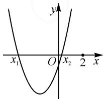
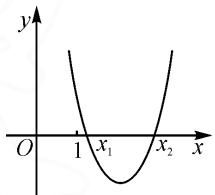
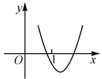
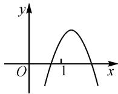
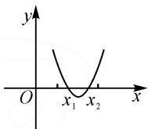
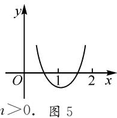
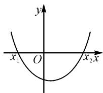

# 二次函数的图象性质与零点分布

# ● 新疆维吾尔自治区昌吉州第四中学 万芳

摘要: 涉及二次函数的图象性质与对应的零点分布问题, 是二次函数、二次方程与二次不等式问题中最为常见的一类基本问题. 结合二次函数的图象性质与零点分布情况, 通过不同类型就对应实例的剖析, 挖掘问题的内涵与实质, 归纳解题技巧与策略, 有效指导数学教学与学习.

关键词:二次函数;方程;不等式;图象;性质

二次函数的零点分布问题,往往可以转化为一元二次方程的根的分布问题,利用二次函数的图象与 x 轴的交点情况来直观分析与研究.一般从二次函数所对应的抛物线的开口方向、对称轴位置、判别式 $\Delta$ 的符号以及端点处函数值的符号等方面加以分析与考虑,数形结合,直观分析,实现问题的突破与解决.

1 “ $x_{1}\leqslant x_{2}<k$ ”型

例 1 若函数 $f(x)=x^{2}+(m-2)x+(5-m)$ 有两个小于 2 的不同零点，则实数 m 的取值范围为 \_\_\_\_.

分析:根据题设条件,结合二次函数对应的一元二次方程的判别式正负情况、对称轴的取值范围以及对应函数值的正负等构建不等式组,通过不等式组的求解来确定参数的取值范围问题,实现问题的突破与解决.

解析:依题,如图1所示,可得

$$
\left\{ \begin{array}{l} \Delta = (m - 2) ^ {2} - 4 (5 - m) > 0, \\ - \frac {m - 2}{2} <   2, \\ f (2) = m + 5 > 0. \end{array} \right.
$$

解得 m>4，即实数 m 的取值范围为 $(4,+\infty)$ .

text_image

y
x₁ O x₂ 2 x

图1

故填答案:(4,+∞).

点评:从二次函数的“数”的基本属性巧妙转化为对应图象的“形”的基本特征问题,由“数”转“形”,再由“形”转“数”,合理构建对应的不等式(组),结合不等式(组)的求解来达到目的.这里要注意的是,由“形”转“数”构建不等式(组)时,要全面考虑,恒等转化.

2 “ $k < x_{1} \leqslant x_{2}$ ”型

例 2 若函数 $f(x)=x^{2}-2ax+4$ 的两个零点都大于 1，则实数 a 的取值范围为 \_\_\_\_.

分析:根据题设条件,由二次函数的两个零点都大于1确定对应的二次函数的图象特征,由此构建对应的不等式(组),抓住二次函数对应的一元二次方程的判别式正负情况、对称轴的取值范围以及对应函数值的正负取值等情况来分析与处理.

解析:依题,如图2所示,可得

$$
\left\{ \begin{array}{l} \Delta = (2 a) ^ {2} - 1 6 \geqslant 0, \\ - \frac {- 2 a}{2} > 1, \\ f (1) = 5 - 2 a > 0. \end{array} \right.
$$

text_image

y
O
1 x₁
x₂
x

图2

解得 $2 \leqslant a < \frac{5}{2}$ , 即实数 $a$ 的

取值范围为 $\left[2,\frac{5}{2}\right)$ .

故填答案: $\left[2,\frac{5}{2}\right)$ .

点评: 正确构建二次函数图象的结构特征, 由此通过“数”转“形”, 又由“形”抽象“数”, 合理构建相应的的不等式(组), 恒等变形与转化相应的二次函数、一元二次方程等相关问题, 实现参数取值的求解与应用.

3 “ $x_{1}<k<x_{2}$ ”型

例 3 已知二次函数 $y=(m+2)x^{2}-(2m+4)x+(3m+3)$ 有两个零点，一个大于 1，一个小于 1，则实数 m 的取值范围为 \_\_\_\_.

分析:根据题设条件,结合二次函数的二次项系数的正负取值情况加以分类讨论,并利用对应函数值的正负取值来构建对应的不等式组.合理分类讨论,分析与解决对应参数的取值问题.

解析:如图 3 所示,可分为以下两种情况.

  
图3

第一种情况，有 $\left\{ \begin{array}{l} m + 2 > 0, \\ f(1) < 0, \end{array} \right.$ 解得 $-2 < m < -\frac{1}{2}$ ;

第二种情况，有 $\left\{ \begin{array}{l} m + 2 < 0, \\ f(1) > 0, \end{array} \right.$ 此不等式组无解.

综上分析,可实数 m 的取值范围为 $\left(-2,-\frac{1}{2}\right)$ .

故填答案: $\left(-2,-\frac{1}{2}\right)$ .

点评:在解决含参的二次函数及其相关综合问题时,要考虑二次项系数的正负取值情况,对应二次函数图象的开口方向,以不同形式来确定二次函数图象的结构特征,合理构建对应的不等式(组),实现问题的解决与突破.

# 4 “ $x_{1},x_{2}\in(k_{1},k_{2})$ ”型

例 4 方程 $8x^{2}-(m-1)x+m-7=0$ 两实根都在区间 $(1,3)$ 内，则实数 m 的取值范围为 \_\_\_\_.

分析:根据题设条件,由二次方程的根转化为对应的二次函数的零点问题,综合二次函数的开口方向、相应的判别式的正负、对称轴的取值范围以及区间端点函数值的取值情况等,合理构建相应的不等式(组)来实现参数的分析与求解.

  
图4

解析: 设函数 $f(x)=8x^{2}-(m-1)x+m-7$ ，如图 4 所示，可得

$$
\left\{ \begin{array}{l l} \Delta \geqslant 0, \\ f (1) > 0, \\ f (3) > 0, \\ 1 <   \frac {m - 1}{1 6} <   3, \end{array} \text {即} \left\{ \begin{array}{l l} m \leqslant 9 \text {或} m \geqslant 2 5, \\ m \in \mathbf {R}, \\ m <   3 4, \\ 1 7 <   m <   4 9, \end{array} \right. \right. \text {解得} 2 5 \leqslant m <   3 4.
$$

所以实数 m 的取值范围为 $[25,34)$ .

故填答案：[25,34).

点评:由一元二次方程根的分布情况对应二次函数图象的结构特征,又由相应“形”的特征来构建“数”的基本属性,合理构建相应的不等式(组),实现二者之间的等价转化与合理过渡,“数”与“形”联系,“数”与“形”结合.

# 5 “ $x_{1}\in(k_{1},k_{2})$ 和 $x_{2}\in(k_{3},k_{4})$ ”型

例 5 已知关于 x 的方程 $4x^{2}-2(m+1)x+m=0$ ，若该方程的一根在区间 $(0,1)$ 上，另一根在区间 $(1,2)$ 上，则实数 m 的取值范围为 \_\_\_\_.

分析:根据题设条件,由二次方程的根转化为对应的二次函数的零点问题,通过零点的位置情况,合理构建相应的不等式(组),实现“数”与“形”之间的合理转化与巧妙应用.

解析: 设函数 $f(x)=4x^{2}-2(m+1)x+m$ ，如图 5 所示，可得

$$
\left\{ \begin{array}{l} f (0) = m > 0, \\ f (1) = 4 - 2 (m + 1) + m <   0, \\ f (2) = 4 \times 2 ^ {2} - 2 \times 2 (m + 1) - \end{array} \right.
$$

text_image

y
O
1
x
i>0. 图5

解得 2<m<4，则实数 m 的取值范围为 $(2,4)$ .

故填答案:(2,4).

点评:借助二次方程的根与对应二次函数的零点之间的等价转化,通过函数图象,巧妙实现“数”与“形”之间的转化,恒等变形与应用.

# 6 “ $x_{1}<k_{1}$ 且 $x_{2}>k_{2}$ ”型

例 6 方程 $x^{2}-(m-1)x+m-7=0$ 两根 $x_{1}, x_{2}$ 满足 $x_{1}<-1, x_{2}>2$ ，则实数 m 的取值范围为 \_\_\_\_.

分析:根据题设条件,由二次方程的根转化为对应的二次函数的零点问题,数形结合构建涉及对应函数值的正负取值的不等式组,通过不等式组的求解来

确定对应参数的取值范围,得以转化与解决问题.

解析: 设函数 $f(x)=x^{2}-(m-1)x+m-7$ ，如图6所示，可得 $\left\{\begin{aligned}f(-1)&<0,\\ f(2)&<0,\end{aligned}\right.$ 即

  
图6

$$
\left\{ \begin{array}{l} (- 1) ^ {2} - (m - 1) \times (- 1) + m - 7 <   0, \\ 2 ^ {2} - 2 (m - 1) + m - 7 <   0. \end{array} \right.
$$

解得 $-1 < m < \frac{7}{2}$ ，则实数 m 的取值范围为 $\left(-1, \frac{7}{2}\right)$ .

故填答案: $\left(-1,\frac{7}{2}\right)$ .

点评:借助二次方程的根的取值情况,巧妙转化为对应二次函数的零点问题,构建对应的二次函数及其相应的图象,数形结合加以分析,合理构建对应的不等式组,实现“形”与“数”之间的过渡,“数”“形”结合,合理转化,巧妙应用.

在解决一些相关的二次方程的根或二次函数的零点问题时,巧妙通过二次函数的图象与性质,利用二次函数的零点的分布特征,“数”“形”结合,以“形”的结构特征来转化为对应的“数”的基本属性,合理构建对应的不等式(组),从而实现问题的转化与求解. Z