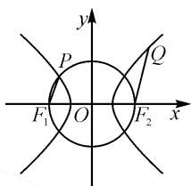

# 关注知识交汇 “圆”来并不简单

# 福建省莆田第四中学 胡丽梅

摘要:基于《中国高考评价体系》提出的综合性的要求,文章从福建省部分地市2023届第一次质检第8题谈起,探析解析几何中几类圆锥曲线与圆交汇的问题,分析求解策略.

关键词: 知识交汇; 圆; 求解策略

研究近几年高考数学试题,不难发现在解析几何的考查中,圆一般出现在选择题或填空题中,经常通过与其他圆锥曲线交汇的形式进行考查.2023届福建省质检第8题即为双曲线与圆交汇的问题,体现了综合性与创新性,是高三复习备考很好的素材.本文中从该题谈起,探析解析几何中几类圆锥曲线与圆交汇问题的求解策略.

# 1 题目呈现

例 双曲线 $C: \frac{y^{2}}{3} - x^{2} = 1$ 的下焦点为 F，过 F 的直线 l 与 C 交于 A, B 两点，若过 A, B 和点 $M(0, \sqrt{7})$ 的圆的圆心在 x 轴上，则直线 l 的斜率为（）.

A. $\pm \frac{\sqrt{10}}{2}$ B. $\pm \sqrt{2}$ C. $\pm 1$ D. $\pm \frac{3}{2}$

本题主要考查圆与双曲线的方程、直线与圆、直线与双曲线的位置关系等基础知识，考查数形结合思想、化归与转化思想、函数与方程思想，考查运算求解能力、空间想象能力，考查逻辑推理、直观想象、数学运算等核心素养.

由于本题涉及圆与双曲线的交汇问题,学生较难通过分析图形特征找到解决问题的切入点;或是未能找到解决问题的较好途径,面对较大的运算量而无从下手.

# 2 解法探究

上述题目有如下几种解法.

解法 1: 因为过点 A, B, M 的圆的圆心在 x 轴上, 所以设圆的方程为 $x^{2} + y^{2} + Dx + F = 0$ . 又因为圆过点 $M(0, \sqrt{7})$ , 所以 F = -7.

设 $A(x_{1},y_{1}), B(x_{2},y_{2})$ .

易知 $x_{1}^{2} + y_{1}^{2} + Dx_{1} - 7 = 0.$ 又 $y_{1}^{2} = 3 + 3x_{1}^{2}$ ，所以 $4x_{1}^{2} + Dx_{1} - 4 = 0.$ 同理 $4x_{2}^{2} + Dx_{2} - 4 = 0.$

所以 $x_{1}, x_{2}$ 为方程 $4x^{2} + Dx - 4 = 0$ 的两根，则 $x_{1}x_{2} = -1$ .

显然 $F(0, -2)$ ，设直线 $l$ 的斜率为 $k$ ，故可设 $l$ 的方程为 $y = kx - 2$ ，代入 $y^{2} = 3 + 3x^{2}$ 得

$$
(k ^ {2} - 3) x ^ {2} - 4 k x + 1 = 0.
$$

于是 $x_{1}x_{2}=\frac{1}{k^{2}-3}.$

所以 $\frac{1}{k^2 - 3} = -1$ ，解得 $k = \pm \sqrt{2}$

故选：B.

评注:分析圆的特征,设圆的一般方程 $x^{2}+y^{2}+Dx-7=0$ , 以 $A(x_{1},y_{1}), B(x_{2},y_{2})$ 两点既在圆上又在双曲线上这一特征寻找解题突破口.先利用圆的性质,得 $x_{1}x_{2}=-1$ ,再根据直线与双曲线的位置关系得到 $x_{1}x_{2}=\frac{1}{k^{2}-3}$ ,从而求得直线 l 的斜率.

解法 2: 设过三点 A, B, M 的圆的圆心为 $(m,0)$ , $A(x_{1},y_{1})$ , $B(x_{2},y_{2})$ .

依题意有 $(m - x_{1})^{2} + y_{1}^{2} = m^{2} + 7$ ，又 $y_{1}^{2} = 3+$ $3x_{1}^{2}$ ，所以

$$
2 x _ {1} ^ {2} - m x _ {1} - 2 = 0. \tag {①}
$$

同理，

$$
2 x _ {2} ^ {2} - m x _ {2} - 2 = 0. \tag {②}
$$

①—②，得

$$
2 \left(x _ {1} + x _ {2}\right) \left(x _ {1} - x _ {2}\right) - m \left(x _ {1} - x _ {2}\right) = 0.
$$

显然 $x_{1}-x_{2}\neq0$ ，所以 $2(x_{1}+x_{2})=m$ 。

①+②，得

$$
2 (x _ {1} ^ {2} + x _ {2} ^ {2}) - m (x _ {1} + x _ {2}) - 4 = 0. \tag {③}
$$

把 $m=2(x_{1}+x_{2})$ 代入③式，得 $x_{1}x_{2}=-1$ .

下同解法1.

评注:本解法类似解法1,分析圆的特征,从圆的标准方程突破,得到 $A(x_{1},y_{1}),B(x_{2},y_{2})$ 两点坐标间的关系,即 $x_{1}x_{2}=-1$ ,后面的思路同解法1.

解法 3: 因为过点 A, B, M 的圆的圆心在 x 轴上, 所以 M 关于原点的对称点 $N(0, -\sqrt{7})$ 也在该圆上.

由 $F(0,-2)$ 及相交弦定理, 得

$$
\left| F A \right| \cdot | F B | = | F M | \cdot | F N | = (\sqrt {7} + 2) (\sqrt {7} - 2) = 3.
$$

设 $A(x_{1},y_{2})$ , $B(x_{2},y_{2})$ ，直线 l 的斜率为 k，则直线 l 的方程为 y=kx-2，代入 $y^{2}=3+3x^{2}$ 得

$$
(k ^ {2} - 3) x ^ {2} - 4 k x + 1 = 0.
$$

于是 $x_{1}x_{2} = \frac{1}{k^{2} - 3}$

依题显然 $x_{1}x_{2} < 0$ ，所以 $\mid x_1x_2\mid = \frac{1}{3 - k^2}$

所以可得 $|FA| \cdot |FB| = (\sqrt{1 + k^2} |x_1|) \cdot (\sqrt{1 + k^2} |x_2|) = (1 + k^2)|x_1x_2| = \frac{1 + k^2}{3 - k^2} = 3.$

解得 $k=\pm\sqrt{2}$ .

故选：B.

评注:根据圆的对称性,得 $N(0,-\sqrt{7})$ 也在该圆上,进而利用相交弦定理得到两条焦半径的乘积,即 $\left|FA\right|\cdot\left|FB\right|=3$ ,又根据弦长公式把 $\left|FA\right|\cdot\left|FB\right|$ 用直线 l 的斜率来表示,从而求得斜率的值.

# 3 变式拓展

# 3.1 椭圆与圆交汇

题1 已知 $A, B$ 分别为椭圆 $C: \frac{x^2}{4} + y^2 = 1$ 的左、右顶点， $P$ 为椭圆 $C$ 上一动点， $PA, PB$ 与直线 $x = 3$ 交于 $M, N$ 两点， $\triangle PMN$ 与 $\triangle PAB$ 的外接圆的周长分别为 $L_1, L_2$ ，则 $\frac{L_1}{L_2}$ 的最小值为（ ）.

A. $\frac{\sqrt{5}}{4}$

B. $\frac{\sqrt{3}}{4}$

C. $\frac{\sqrt{2}}{4}$

D. $\frac{1}{4}$

解:由已知,得 $A(-2,0)$ , $B(2,0)$ . 设 $P(x,y)$ , 则 $k_{PA}=\frac{y-0}{x+2}$ , $k_{PB}=\frac{y-0}{x-2}$ .

所以 $k_{PA} \cdot k_{PB} = \frac{y - 0}{x + 2} \cdot \frac{y - 0}{x - 2} = \frac{y^{2}}{(x + 2)(x - 2)} = \frac{y^{2}}{x^{2} - 4} = \frac{1 - \frac{x^{2}}{4}}{x^{2} - 4} = -\frac{1}{4}.$

设直线 $PA$ 方程为 $y = k(x + 2)$ ，则直线 $PB$ 方程为 $y = -\frac{1}{4k} (x - 2)$ ，根据对称性设 $k > 0$ 。

令 $x = 3$ ，得 $y_{M} = 5k, y_{N} = -\frac{1}{4k}$ ，则 $M(3,5k)$ ， $N\left(3, -\frac{1}{4k}\right)$ .

所以 $MN=5k+\frac{1}{4k}$ .

设 $\triangle PMN$ 与 $\triangle PAB$ 的外接圆的半径分别为 $r_1$ , $r_2$ , 则

$$
2 r _ {1} = \frac {M N}{\sin \angle M P N}, 2 r _ {2} = \frac {A B}{\sin \angle A P B}.
$$

易得 $\sin\angle MPN=\sin\angle APB$ ，则 $\frac{L_{1}}{L_{2}}=\frac{2\pi r_{1}}{2\pi r_{2}}=$

$\frac{r_{1}}{r_{2}}=\frac{MN}{AB}=\frac{5k+\frac{1}{4k}}{4}\geqslant\frac{2\sqrt{5k\cdot\frac{1}{4k}}}{4}=\frac{\sqrt{5}}{4}$ ，当且仅当 $5k=\frac{1}{4k}$ ，即 $k=\frac{\sqrt{5}}{10}$ 时，等号成立.

所以 $\frac{L_{1}}{L_{2}}$ 的最小值为 $\frac{\sqrt{5}}{4}$ .

故选：A.

# 3.2 双曲线与圆交汇

题 2 如图 1, $F_{1}$ , $F_{2}$ 分别是双曲线 $\frac{x^{2}}{a^{2}} - \frac{y^{2}}{b^{2}} = 1 (a > 0, b > 0)$ 的左、右焦点， $P$ 是双曲线与圆 $x^{2} + y^{2} = a^{2} + b^{2}$ 在第二象限的一个交点，点 $Q$ 在双曲线上，且 $\overrightarrow{F_{1}P} = \frac{1}{2}\overrightarrow{F_{2}Q}$ ，则双曲线的离心率为（）.

text_image

y
P
Q
F₁ O F₂ x

图1

A. $\frac{\sqrt{10}}{2}$

B. $\sqrt{2}$

C. $\sqrt{3}$

D. $\frac{\sqrt{17}}{3}$

答案:D.

# 3.3 抛物线与圆交汇

题 3 已知点 $M(0,4)$ ，点 P 在抛物线 $x^{2}=8y$ 上运动，点 Q 在圆 $x^{2}+(y-2)^{2}=1$ 上运动，则 $\frac{PM^{2}}{PQ}$ 的最小值为（）.

A.2

B. $\frac{8}{3}$

C.4

D. $\frac{16}{3}$

答案:C.

《中国高考评价体系》明确指出“四翼”的高考考查要求，即分别从基础性、综合性、应用性、创新性的角度对素质教育的目标进行评价。其中，综合性要求对不同层面的知识、能力、素养能够纵向融会贯通[1]。涉及几个知识交汇的综合问题，往往需要充分结合几个模块的知识，厘清知识的“结合处”，往往是解决这类问题的突破口，如在以上例题中从圆与双曲线的交点处寻求解题突破口。教师在指导学生复习备考可适时引导、归纳。

# 参考文献：

[1]教育部考试中心.中国高考评价体系[M].北京:人民教育出版社,2019.Z