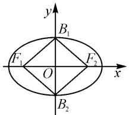
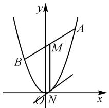

# 圆锥曲线综合探究类题型赏析

# 山东省夏津县第一中学 关德祥

摘要:探究性问题是近年来高考数学中出现的新题型,其中圆锥曲线综合探究类试题包括探究条件、探究结论、创新探究、综合探究等类型,不仅涉及到的知识点多,而且对观察、猜测、分析、类比、转化、计算、证明等能力也有较高的要求,属于分值高、难度大的题型.解决这类问题,要打破常规,灵活运用“数形结合”“大胆假设,小心求证”“从一般到特殊,从特殊到一般”“转化变形”等数学思想与方法.

关键词: 是否存在问题; 对称问题; 向量; 掌握方法

“圆锥曲线与方程”是高中数学(人教 B 版选修 1-1)中重要的学习内容,也是高考的一个重要考点,尤其是涉及到与圆锥曲线有关的位置关系问题、弦长问题、面积问题、对称问题、定点与定值问题、向量问题、存在与否(能否)问题等,多以探究性、综合性的压轴题型出现,分值高,计算量大,是考生失分的重灾区,因此,熟悉这类题型并掌握答题思路与方法就显得非常重要.本文中试图通过与双曲线、椭圆、抛物线相关的典型例题的解法赏析,就这类题型的思路与解法作一初步探讨,仅供参考.

# 1 探究双曲线内直线是否存在的问题

探究双曲线内直线是否存在的问题,属于探究条件的类型,思路是先假设条件成立,再验证结论是否成立,成立则存在,否则不存在 $^{[1]}$ .

例 1 已知双曲线 $x^{2}-\frac{y^{2}}{2}=1$ .

(1) 过点 $A(2,1)$ 的直线 l 与所给双曲线交于两点 $P_{1}, P_{2}$ ，试求线段 $P_{1}P_{2}$ 的中点 P 的轨迹方程.  
(2) 过点 $B(1,1)$ 能否作直线 m，使 m 与所给双曲线交于两点 $Q_{1}, Q_{2}$ ，且 B 是线段 $Q_{1}Q_{2}$ 的中点？试探究：这样的直线是否存在？如果存在，求出它的方程；如果不存在，请说明理由。

解法 1:(1) 根据题意, 设 $P_{1}(x_{1}, y_{1})$ , $P_{2}(x_{2}, y_{2})$ , $P(x, y)$ , 则有

$$
x _ {1} ^ {2} - \frac {y _ {1} ^ {2}}{2} = 1, \tag {①}
$$

$$
x _ {2} ^ {2} - \frac {y _ {2} ^ {2}}{2} = 1. \tag {②}
$$

①—②且因式分解,得

$$
(x _ {1} - x _ {2}) (x _ {1} + x _ {2}) - \frac {1}{2} (y _ {1} - y _ {2}) (y _ {1} + y _ {2}) = 0.
$$

整理得直线 l 的斜率 $k=\frac{2(x_{1}+x_{2})}{y_{1}+y_{2}}=\frac{4x}{2y}=\frac{2x}{y}$ .

因为 P, A 两点在直线 l 上, 所以直线 l 的斜率为 $k = \frac{y - 1}{x - 2}$ , 故 $\frac{2x}{y} = \frac{y - 1}{x - 2}$ .

整理得 $2x^{2}-y^{2}-4x+y=0$ ，即中点 P 的轨迹方程.

(2) 假设直线 m 存在, 那么它的斜率为 $k = \frac{2x}{y} = \frac{2 \times 1}{1} = 2$ , 则直线 m 的方程为 $y - 1 = 2(x - 1)$ , 即 y = 2x - 1, 它与双曲线应该有两个交点.

由 $\left\{\begin{aligned}y=2x-1,\\ x^{2}-\frac{y^{2}}{2}=1,\end{aligned}\right.$ 得 $2x^{2}-4x+3=0$ ，而判别式 $\Delta=16-24<0$ ，该方程无解，这与前面的假设相矛盾，所以这样的直线不存在.

解法 2:(1) 设过点 A 的直线 l 的参数方程为

$$
\left\{ \begin{array}{l l} x = x _ {0} + t \cos \theta , \\ y = y _ {0} + t \sin \theta \end{array} \right. (t \text {为参数}),
$$

其中 $(x_{0},y_{0})$ 是线段 $P_{1}P_{2}$ 的中点P的坐标，将参数方程代入双曲线方程 $x^{2}-\frac{y^{2}}{2}=1$ ，化简得

$$
\begin{array}{r l} & (2 \cos^ {2} \theta - \sin^ {2} \theta) t ^ {2} + 2 (2 x _ {0} \cos \theta - y _ {0} \sin \theta) t + \\ & 2 x _ {0} ^ {2} - y _ {0} ^ {2} - 2 = 0. \end{array} \tag {③}
$$

因为直线 l 与双曲线交于两点 $P_{1}, P_{2}$ ，所以 $2\cos^{2}\theta - \sin^{2}\theta \neq 0$ ，方程③必有两实根。又因为 $(x_{0}, y_{0})$ 是线段 $P_{1}P_{2}$ 的中点坐标，所以 $t_{1} + t_{2} = 0$ ，即 $2x_{0}\cos\theta - y_{0}\sin\theta = 0$ 。结合 l 的参数方程，可得直线 $P_{1}P_{2}$ 的方程为 $2x_{0}(x - x_{0}) - y_{0}(y - y_{0}) = 0$ 。因为直线 $P_{1}P_{2}$ 过点 A(2,1)，所以 $2x_{0}(2 - x_{0}) - y_{0}(1 - y_{0}) = 0$ ，用 x, y 分别代换 $x_{0}, y_{0}$ 即可得所求的轨迹方程为 $2x^{2} - y^{2} - 4x + y = 0$ 。

(2)若存在这样的直线 $m$ ，则当 $x_0 = 1, y_0 = 1$ 时，方程③必有实根，且两根之和仍为零，则 $2\cos \theta - \sin \theta = 0$ ，即 $\sin \theta = 2\cos \theta$ ，代入③得 $-2t^2\cos^2\theta - 1 = 0$ ，此方程显然无实根，这与以上所述相矛盾，所以这样的直线不存在.

解法赏析:本题的第(1)问是求过定点的弦的中点轨迹方程,解法1是运用代入法,解法2是设出直线的参数方程,利用t的意义即 $t_{1}+t_{2}=0$ 来求解,这两种方法是解答此类问题的常用方法.本题的第(2)问是探究“存在与否”的问题,解题的思路是“大胆假设,小心求证”,先假设直线m存在,然后将其转化为方程解的存在性问题来解决.

# 2 探究椭圆中的对称问题

探究椭圆中的对称问题,需要用到对称问题的基本原理:设 $A(x_{1},y_{1})$ , $B(x_{2},y_{2})$ , 若 A, B 两点关于直线 $y=kx+m$ 对称, 则有 $\frac{y_{2}-y_{1}}{x_{2}-x_{1}}=-\frac{1}{k}$ 且 A, B 两点连线的中点在直线 $y=kx+m$ 上, 即若 $x_{0}=\frac{x_{1}+x_{2}}{2}$ , $y_{0}=\frac{y_{1}+y_{2}}{2}$ , 则有 $y_{0}=kx_{0}+m$ . 此类问题还可通过点差法求出中点与斜率之间的关系来解决 $^{[2]}$ .

例 2 如图 1, 椭圆 $G: \frac{x^{2}}{a^{2}} + \frac{y^{2}}{b^{2}} = 1 (a > b > 0)$ 的两个焦点 $F_{1}(-c, 0), F_{2}(c, 0)$ 和顶点 $B_{1}, B_{2}$ 构成面积为 32 的正方形.

text_image

y
B₁
F₁ O F₂ x
B₂

图1

(1)求椭圆 G 的方程.

(2)设斜率 $k(k \neq 0)$ 的直线 l 与椭圆 G 相交于不同的两点 A, B, Q 为 AB 的中点，且 $P\left(0, -\frac{\sqrt{3}}{3}\right)$ . 试探究：A, B 两点能否关于直线 PQ 对称？若能，求出 k 的取值范围；若不能，请说明理由.

解析:(1)因为四边形 $F_{1}B_{1}F_{2}B_{2}$ 为正方形且面积为 32, 所以 c=b, 且 $a^{2}=32$ . 又因为 $a^{2}=b^{2}+c^{2}$ , 所以 $2b^{2}=32, b^{2}=c^{2}=16$ , 故椭圆 G 的方程为 $\frac{x^{2}}{32}+\frac{y^{2}}{16}=1$ .

(2)设直线 l 的方程为 $y=kx+m$ , $A(x_{1},y_{1})$ , $B(x_{2},y_{2})$ . 联立 $\frac{x^{2}}{32}+\frac{y^{2}}{16}=1$ 与 $y=kx+m$ , 得 $\frac{x^{2}}{32}+\frac{(kx+m)^{2}}{16}=1$ , 化简得

$$
\left(\frac {1}{3 2} + \frac {k ^ {2}}{1 6}\right) x ^ {2} + \frac {k m}{8} x + \frac {m ^ {2}}{1 6} - 1 = 0.
$$

所以， $x_{1}+x_{2}=\frac{-\frac{km}{8}}{\frac{1}{32}+\frac{k^{2}}{16}}=\frac{-4km}{1+2k^{2}}.$

由 $\Delta=\left(\frac{km}{8}\right)^{2}-4\left(\frac{1}{32}+\frac{k^{2}}{16}\right)\left(\frac{m^{2}}{16}-1\right)>0$ , 可得 $4\left(\frac{1}{32}+\frac{k^{2}}{16}-\frac{m^{2}}{32\times16}\right)>0$ ，整理得 $m^{2}<32k^{2}+16$ .

若点 A, B 关于直线 PQ 对称，则 $k_{PQ} = -\frac{1}{k}$ .

设 AB 的中点 $Q(x_{0}, y_{0})$ ，则有

$$
x _ {0} = \frac {x _ {1} + x _ {2}}{2} = - \frac {2 k m}{1 + 2 k ^ {2}},
$$

$$
y _ {0} = k x _ {0} + m = k \left(- \frac {2 k m}{1 + 2 k ^ {2}}\right) + m = \frac {m}{1 + 2 k ^ {2}}.
$$

所以 $Q\left(-\frac{2km}{1+2k^{2}},\frac{m}{1+2k^{2}}\right)$ .

由 $k_{PQ} = \frac{\frac{m}{1 + 2k^2} + \frac{\sqrt{3}}{3}}{-\frac{2km}{1 + 2k^2}} = -\frac{1}{k}$ ，解得 $m = \frac{1 + 2k^2}{\sqrt{3}}$ 将 $m = \frac{1 + 2k^2}{\sqrt{3}}$ 代入 $m^2 < 32k^2 + 16$ ，得 $\left(\frac{1 + 2k^2}{\sqrt{3}}\right)^2 < 32k^2 + 16$ ，解得 $-\frac{\sqrt{94}}{2} < k < 0$ 或 $0 < k < \frac{\sqrt{94}}{2}$

故当 $-\frac{\sqrt{94}}{2}<k<0$ 或 $0<k<\frac{\sqrt{94}}{2}$ 时，A，B两点关于直线PQ对称.

解法赏析:本题考查了椭圆中的对称问题,涉及到中点坐标公式和直线斜率公式的灵活应用.第(1)问根据正方形的面积与 $a^{2}=b^{2}+c^{2}$ 的关系即可求得椭圆的方程;第(2)问通过联立椭圆与直线的方程,采用假设的思路,利用根与系数的关系求出m的值,进而求出k的取值范围.

# 3 探究抛物线中与向量相关的问题

探究抛物线中与向量相关的问题,通常是利用向量的坐标运算将向量转化为与坐标有关的代数式,结合代数式的特征和图形的性质选择相应的方法 $^{[3]}$ ;解题的关键是掌握向量关系与几何图形中元素之间关系的等价转化.

例 3 已知抛物线 $C: y = 2x^{2}$ ，直线 $y = kx + 2$ 交抛物线 C 于 A, B 两点，M 是线段 AB 的中点，过 M 作 x 轴的垂线交抛物线 C 于点 N.

(1)证明:抛物线 C 在点 N 处的切线与 AB 平行.

(2)试探究:是否存在实数 k, 使 $\overrightarrow{NA} \cdot \overrightarrow{NB} = 0?$

若存在,求出 k 的值;若不存在,请说明理由.

解析:(1)如图2,设 $A(x_{1},2x_{1}^{2})$ , $B(x_{2},2x_{2}^{2})$ , 把 $y=kx+2$ 代入 $y=2x^{2}$ , 得 $2x^{2}-kx-2=0$ , 则有

$$
x _ {1} + x _ {2} = \frac {k}{2}, x _ {1} x _ {2} = - 1.
$$

text_image

y
A
M
B
O N x

图2

所以 $x_{N}=x_{M}=\frac{x_{1}+x_{2}}{2}=\frac{k}{4}$ ,可知点 N 的坐标为 $\left(\frac{k}{4}, \frac{k^{2}}{8}\right)$ . 因为 $y = 2x^{2}$ ，所以 $y' = 4x$ ，则抛物线在点 N 处的切线的斜率为 $4 \times \frac{k}{4} = k$ .

所以抛物线在点 N 处的切线与 AB 平行.

(2) 假设存在实数 $k$ , 使 $\overrightarrow{NA} \cdot \overrightarrow{NB} = 0$ , 由 (1) 得 $\overrightarrow{NA} = \left(x_{1} - \frac{k}{4}, 2x_{1}^{2} - \frac{k^{2}}{8}\right), \overrightarrow{NB} = \left(x_{2} - \frac{k}{4}, 2x_{2}^{2} - \frac{k^{2}}{8}\right)$ ,

所以 $\overrightarrow{NA} \cdot \overrightarrow{NB} = \left(x_{1} - \frac{k}{4}\right) \left(x_{2} - \frac{k}{4}\right) + \left(2x_{1}^{2} - \frac{k^{2}}{8}\right)$

$$
\left(2 x _ {2} ^ {2} - \frac {k ^ {2}}{8}\right) = \left(x _ {1} - \frac {k}{4}\right) \left(x _ {2} - \frac {k}{4}\right) + 4 \left(x _ {1} ^ {2} - \frac {k ^ {2}}{1 6}\right) \cdot
$$

$$
\left(x _ {2} ^ {2} - \frac {k ^ {2}}{1 6}\right) = \left(x _ {1} - \frac {k}{4}\right) \left(x _ {2} - \frac {k}{4}\right) \left[ 1 + 4 \left(x _ {1} + \frac {k}{4}\right) \cdot \right.
$$

$$
\left(x _ {2} + \frac {k}{4}\right) ] = \left[ x _ {1} x _ {2} - \frac {1}{4} k \left(x _ {1} + x _ {2}\right) + \frac {1}{1 6} k ^ {2} \right] \cdot
$$

$$
\left[ 1 + 4 x _ {1} x _ {2} + k \left(x _ {1} + x _ {2}\right) + \frac {k ^ {2}}{4} \right] = \left(- 1 - \frac {k}{4} \times \frac {k}{2} + \frac {k ^ {2}}{1 6}\right) \cdot
$$

$$
\left[ 1 + 4 \times (- 1) + k \times \frac {k}{2} + \frac {k ^ {2}}{4} \right] = \left(- 1 - \frac {k ^ {2}}{1 6}\right) \left(- 3 + \frac {3}{4} k ^ {2}\right) = 0.
$$

因为 $-1 - \frac{k^2}{16} < 0$ ，所以 $-3 + \frac{3}{4} k^2 = 0$ ，解得 $k = \pm 2$ .

故存在 $k=\pm2$ ，使 $\overrightarrow{NA}\cdot\overrightarrow{NB}=0$ 。

解法赏析:第(1)问利用了导数的几何意义,一般情况下,形如 $y=ax^{2}(a\neq0)$ 的抛物线的切线斜率可用求导方法求解;第(2)问的解题思路是把 $\overrightarrow{NA}\cdot\overrightarrow{NB}=0$ 转化为坐标式,利用根与系数的关系求解.

上述典例只是圆锥曲线综合类探究问题中的几种常见题型，其目的在于“窥一斑而见全貌”，希望通过类似的训练与复习，能够让考生加深对圆锥曲线概念、性质的理解，熟练掌握“设而不求、整体代入、换元设参、因式分解、求导、转化”等求解通法，进而激发学生探究的热情、思维和灵感，达到举一反三的目的。

# 参考文献：

[1]徐春生.例析圆锥曲线中存在型问题[J].中学生数理化：高二数学，2022(Z1):46-47.

[2]徐之财.圆锥曲线探究,思维“五步”构建——以2021年新高考Ⅱ卷圆锥曲线压轴题为例[J].数学教学通讯,2023(6):84-86.

[3]王美莲.真题再现,解析突破,多解探索,教学建议——以2023年高考新课标全国Ⅰ卷“圆锥曲线压轴题”为例[J].数学教学通讯,2023(24):83-85.Z

# (上接第28页)

由结论(3)得 $x_{1}x_{2}=x_{0}^{2}, y_{1}y_{2}=-2px_{0}=-x_{0}$

所以 $\overrightarrow{OA}\cdot\overrightarrow{OB}=x_{1}x_{2}+y_{1}y_{2}=x_{0}^{2}-x_{0}=2$ ，解得 $x_{0}=2$ 或 $x_{0}=-1$ （舍），则 $y_{2}=-\frac{2}{y_{1}}$ .

因为 $S_{\triangle ABO} = \frac{1}{2} x_0(y_1 - y_2) = y_1 + \frac{2}{y_1}, S_{\triangle AFO} = \frac{1}{2} |OF|y_1 = \frac{1}{8} y_1$ ，所以 $S_{\triangle ABO} + S_{\triangle AFO} = \frac{9}{8} y_1 + \frac{2}{y_1} \geqslant 2\sqrt{\frac{9}{8} y_1 \times \frac{2}{y_1}} = 3$ ，当且仅当 $\frac{9}{8} y_1 = \frac{2}{y_1}$ ，即 $y_1 = \frac{4}{3}$ 时取等号.

所以 $\triangle ABO$ 和 $\triangle AFO$ 面积之和的最小值为3.

笔者忍不住夸奖：“在如此短的时间内，沈同学设置了如此典型的例题，不仅用到我们得到的结论，还利用了重要不等式求最值！”学生都向她投去了佩服的目光，这是前进过程中最大的动力。此时已快下课，笔者带领学生简明扼要地总结了本次活动课，并鼓励和肯定学生的积极表现。

# 3 课后思考

通过本次专题讨论课,学生掌握了新知识,解决了新问题,深刻体会到创造的喜悦,富有新意,也是创新意识的表现.在教学过程中,教师要对学生的性格了如指掌,对学生的表现及时给予恰当的肯定和鼓励,哪怕是有些夸张的赞美,也能增强勇于表现的学生的自信心,其他学生看到台上学生的优异表现,表现欲望也更强烈,从而形成良性循环.

作为一名战斗在一线的教育工作者,帮助学生打下扎实的知识基础,形成良好的学习习惯以及探索钻研的精神,让他们对数学学习保持极大的持续的热情,是我们的首要责任.所以,在以后的教学中,还要不断地探索和思考,为学生的创新精神和实践能力打下坚实的基础. Z