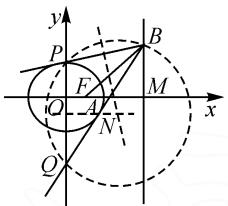
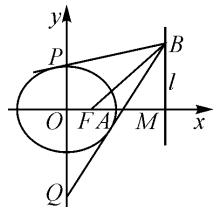

# 存在性判定,思维性应用

# ● 福建省龙海第二中学 黄智坤

摘要: 圆锥曲线中的存在探究性问题是一类全面考查数学知识与数学能力的综合应用问题,通常是高考中的一大热点与难点.结合一道椭圆解答题中存在性探究实例,以创新场景创设,就点的存在性问题加以合理判定与思维性应用,归纳解题技巧方法与策略规律,指导解题研究与复习备考.

关键词: 椭圆; 动点; 切线; 等差数列; 存在

探究性问题通常是高考中备受命题者青睐的一种题型.而圆锥曲线中的探究性问题,更是该模块命题的常见题型之一,以点的存在性、直线的存在性以及参数的存在性等方式来创新设置,通过存在性场景下条件的成立与判断来全面考查并落实数学“四基”,数学知识范围广,解题技巧灵活性大,数学思维性与应用性强.本文中结合一道椭圆解答题的探究,就点的存在性问题加以分析.

# 1 问题呈现

问题 已知椭圆 $C: \frac{x^{2}}{a^{2}} + \frac{y^{2}}{b^{2}} = 1 (a > b > 0)$ 的右焦点为 $F(1,0)$ ，右顶点为 A，直线 l: x = 4 与 x 轴交于点 M，且 $|AM| = a |AF|$ .

(1) 求 C 的方程.

(2) B 为 l 上的动点, 过 B 作 C 的两条切线, 分别交 y 轴于点 P, Q.

(i) 证明: 直线 BP, BF, BQ 的斜率成等差数列.

(ii) $\odot N$ 经过 B, P, Q 三点，是否存在点 B，使得 $\angle PNQ = 90^{\circ}$ ? 若存在，求 $|BM|$ ; 若不存在，请说明理由.

此题以椭圆为问题场景,第(1)问利用椭圆的一些基本点以及对应的数量关系,得以求解椭圆的方程,比较简单,给大部分考生得分的机会;第(2)问的第②小问通过“动点”的引入,利用动点向椭圆引两条切线,先证明对应三条直线的斜率成等差数列,难度中等,给50%左右的考生得分的机会;接下来通过存在性问题的设置来探究,难度有所提升,给一些能力较好的考生以提升与区分的机会.

三个问题的层次设置合理巧妙,层层递进,具有较高的区分度,充分体现了选拔性,是一道非常优秀的高考模拟题.

# 2 问题破解

# 2.1 第(1)问的解析

由 $F(1,0)$ 为右焦点，得 c=1，则 a>1.

因为 $\left|AM\right|=a\left|AF\right|$ ，所以 $\left|4-a\right|=a(a-1)$ .

若 $a \geqslant 4$ ，则 $a - 4 = a(a - 1)$ ，得 $a^{2} - 2a + 4 = 0$ ，无解；若 a < 4，则 $4 - a = a(a - 1)$ ，得 $a^{2} = 4$ 。

所以 $b^{2}=3$ . 因此 C 的方程为 $\frac{x^{2}}{4}+\frac{y^{2}}{3}=1$ .

# 2.2 第(2)问的解析

设 $B(4,t)$ ，易知过 B 且与 C 相切的直线斜率存在，设 l 方程为 $y-t=k(x-4)$ .

联立 $\left\{\begin{aligned}y-t&=k(x-4),\\ \frac{x^{2}}{4}&+\frac{y^{2}}{3}=1,\end{aligned}\right.$ 消去 y, 得

$$
(3 + 4 k ^ {2}) x ^ {2} + 8 k (t - 4 k) x + 4 (t - 4 k) ^ {2} - 1 2 = 0.
$$

由 $\Delta=64k^{2}(t-4k)^{2}-4(3+4k^{2})\left[4(t-4k)^{2}-12\right]=0$ , 得 $12k^{2}-8tk+t^{2}-3=0$

设两条切线 BP, BQ 的斜率分别为 $k_{1}, k_{2}$ , 则

$$
k _ {1} + k _ {2} = \frac {8 t}{1 2} = \frac {2 t}{3}, k _ {1} k _ {2} = \frac {t ^ {2} - 3}{1 2}.
$$

(i) 设 BF 的斜率为 $k_{3}$ ，则

$$
k _ {3} = \frac {t}{4 - 1} = \frac {t}{3} = \frac {1}{2} (k _ {1} + k _ {2}).
$$

所以 $k_{1} + k_{2} = 2k_{3}$ ，即直线 BP, BF, BQ 的斜率成等差数列.

（ii）方法1（数量积法1）：在 $y - t = k_{1}(x - 4)$ 中，令 $x = 0$ ，得 $y_{P} = t - 4k_{1}$ ，所以 $P(0,t - 4k_1)$ .同理，得 $Q(0,t - 4k_2)$ .所以 $PQ$ 的中垂线为 $y = t - 2(k_{1} + k_{2})$ 易得 $BP$ 中点为 $(2,t - 2k_{1})$ ，所以 $BP$ 的中垂线为 $y =$ $-\frac{1}{k_1} (x - 2) + t - 2k_1.$

联立 $\left\{\begin{aligned}y=t-2(k_{1}+k_{2}),\\ y=-\frac{1}{k_{1}}(x-2)+t-2k_{1},\end{aligned}\right.$ 解得点 N 的坐

标为 $(2k_{1}k_{2}+2,t-2(k_{1}+k_{2}))$ .

所以 $\overrightarrow{NP} = (-2k_1k_2 - 2, 2k_2 - 2k_1), \overrightarrow{NQ} = (-2k_1k_2 - 2, 2k_1 - 2k_2)$ .

如图1，要使 $\overrightarrow{NP} \cdot \overrightarrow{NQ} = 0$ 即 $4(k_{1}k_{2} + 1)^{2} - 4(k_{1} - k_{2})^{2} = 0$ 整理得 $|k_{1}k_{2} + 1| = |k_{1} - k_{2}|$ . 而 $|k_{1} - k_{2}| = \sqrt{(k_{1} + k_{2})^{2} - 4k_{1}k_{2}} = \sqrt{\left(\frac{2t}{3}\right)^{2} - 4 \times \frac{t^{2} - 3}{12}} = \frac{\sqrt{t^{2} + 9}}{3}$ .

text_image

y
P
B
F
M
x
Q
A
N
Q'
O'

图1

所以 $\left|\frac{t^{2}-3}{12}+1\right|=\frac{\sqrt{t^{2}+9}}{3}$ ，解得 $t^{2}=7, t=\pm\sqrt{7}$ ，因此 $|BM|=\sqrt{7}$ 。故存在符合题意的点 B，使得 $\overrightarrow{NP}\cdot\overrightarrow{NQ}=0$ ，此时 $|BM|=\sqrt{7}$ 。

方法 2(数量积法 2): 同方法 1 解得 $x_{N}=2k_{1}k_{2}+2$ .

如图1所示，要使 $\overrightarrow{NP} \cdot \overrightarrow{NQ} = 0$ ，则 $\angle PNQ = 90^{\circ}$ 所以 $|x_{N}| = \frac{|PQ|}{2}$ 即 $|k_{1}k_{2} + 1| = |k_{1} - k_{2}|$ .

下同方法 1, 略.

方法 3(夹角公式法): 要使 $\angle PNQ = 90^{\circ}$ ，即 $\angle PBQ = 45^{\circ}$ 或 $135^{\circ}$ ，如图 2. 则 $\left|\tan\angle PBQ\right| = 1$ ，又 $\tan\angle PBQ = \left|\frac{k_{1} - k_{2}}{1 + k_{1}k_{2}}\right|$ ，所以 $\frac{\left|k_{1} - k_{2}\right|}{\left|1 + k_{1}k_{2}\right|} = 1$ .

text_image

y
P
B
l
O F A M x
Q

图2

余略.

方法4（数量积公式法）：要使 $\angle PNQ = 90^{\circ}$ ，即 $\angle PBQ = 45^{\circ}$ 或 $135^{\circ}$ ，如图2所示，则有 $\left|\cos \angle PBQ\right| =$ $\frac{|\overrightarrow{BP}\cdot\overrightarrow{BQ}|}{|\overrightarrow{BP}||\overrightarrow{BQ}|} = \frac{\sqrt{2}}{2}.$ 在 $y - t = k_{1}(x - 4)$ 中，令 $x = 0$ ，得 $y_{P} = t - 4k_{1}$ ，所以 $P(0,t - 4k_1)$ .同理得 $Q(0,t - 4k_2)$

因此 $\overrightarrow{BP}=(-4,-4k_{1}),\overrightarrow{BQ}=(-4,-4k_{2})$ .

所以 $\frac{\overrightarrow{BP} \cdot \overrightarrow{BQ}}{|\overrightarrow{BP}| |\overrightarrow{BQ}|} = \frac{16 + 16k_1k_2}{4\sqrt{1 + k_1^2} \times 4\sqrt{1 + k_2^2}} = \frac{\sqrt{2}}{2}$ .

故 $\sqrt{2}(1 + k_{1}k_{2}) = \sqrt{1 + k_{1}^{2}k_{2}^{2} + k_{1}^{2} + k_{2}^{2}}$ ，即 $2+$ $2k_{1}^{2}k_{2}^{2} + 4k_{1}k_{2} = 1 + k_{1}^{2}k_{2}^{2} + k_{1}^{2} + k_{2}^{2}$ ，整理得

$$
k _ {1} ^ {2} k _ {2} ^ {2} + 6 k _ {1} k _ {2} + 1 = \left(k _ {1} + k _ {2}\right) ^ {2}.
$$

所以 $\left(\frac{t^2 - 3}{12}\right)^2 + 6 \times \frac{t^2 - 3}{12} + 1 = \left(\frac{2t}{3}\right)^2$ ，整理得 $t^4 + 2t^2 - 63 = 0$ ，解得 $t^2 = 7$ 或 $-9$ （舍去）。因此 $t = \pm \sqrt{7}$ ， $|BM| = \sqrt{7}$ 。

故存在符合题意的点 B，使得 $\overrightarrow{NP} \cdot \overrightarrow{NQ} = 0$ ，此时 $|BM| = \sqrt{7}$ .

方法 5(等面积法): 要使 $\angle PNQ = 90^{\circ}$ ，即 $\angle PBQ = 45^{\circ}$ 或 $135^{\circ}$ ，如图 2 所示.

同方法 1, 得 $P(0, t - 4k_{1})$ , $Q(0, t - 4k_{2})$ .

由等面积法，得 $\frac{1}{2} |PQ||x_B| = S_{\triangle PBQ} = \frac{1}{2} |BP|\times$ $|BQ|\times \frac{\sqrt{2}}{2}$ ，即 $\frac{1}{2}|4k_1 - 4k_2|\times 4 = \frac{1}{2}\times 4\sqrt{1 + k_1^2}\times$ $4\sqrt{1 + k_2^2}\times \frac{\sqrt{2}}{2}$ 整理得 $(k_{1} + k_{2})^{2} = k_{1}^{2}k_{2}^{2} + 6k_{1}k_{2} + 1.$

所以 $\left(\frac{2t}{3}\right)^2 = \left(\frac{t^2 - 3}{12}\right)^2 + 6 \times \frac{t^2 - 3}{12} + 1$ ，整理得 $t^4 + 2t^2 - 63 = 0$ ，解得 $t^2 = 7$ 或 $-9$ （舍去）。因此 $t = \pm \sqrt{7}$ ， $|BM| = \sqrt{7}$ 。

故存在符合题意的点 B，使得 $\overrightarrow{NP} \cdot \overrightarrow{NQ} = 0$ ，此时 $|BM| = \sqrt{7}$ .

点评:在解决圆锥曲线中的存在性探究问题时,常用的技巧方法就是转化为直线与圆锥曲线的位置关系等,在此基础上,利用存在性的类型与内容,选用不同的方式与方法来分析与处理.该问题中,对于点的存在性探究,在方法1与方法2中,通过 $\angle PNQ=90^{\circ}$ ,转化为数量积 $\overrightarrow{NP}\cdot\overrightarrow{NQ}=0$ ,通过点的坐标以及数量积的坐标公式来应用;在方法3与方法4中,利用圆心角 $\angle PNQ=90^{\circ}$ 进一步转化为圆周角问题,进而分别利用斜率的夹角公式以及数量积的夹角公式来求解;在方法5中,在转化为圆周角的基础上,利用等面积法,通过面积公式加以转化与应用也是一种非常不错的选择.技巧方法多样,殊途同归.

# 3 教学启示

涉及圆锥曲线中的存在性探究类问题,往往是基于点的存在、直线的存在或参数的存在等形式,结合条件进行合理逻辑推理或数学运算,根据推理结果或运算结果以及问题场景得到一个合情合理的结论,进而对存在性问题作出相应的回答与判断,形成一个基本的解题思维.

其实,涉及圆锥曲线中的存在性探究类问题,无论创设场景与存在性条件如何变化,常见的基本类型主要包括以下几种类型:(1)肯定型,即符合条件的对象必存在;(2)否定型,即具有某种性质的对象不存在;(3)探索型,即是否存在具有某种性质的对象不得而知,通过分析、推理,最终产生结论.

对于圆锥曲线中的存在性探究类问题的解决,以创新开放的形式来合理创设,给问题的设置创设合理的梯度与难度,方便人才教育的培养与选拔,进而有效提高了问题的综合性、应用性以及创新性等,成为更加全面、细致地考查学生的“四基”与“四能”的一种重要方式. Z