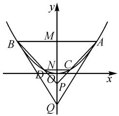

# 巧借特殊思维,妙破解析几何

# 甘肃省白银市第一中学 乔国荣

一般思维与特殊思维是辩证思维模式中的两种方式,二者之间又是辩证统一的.在解决一些客观题时,特别是有确定答案的选择题或填空题时,借助场景应用,合理选用特殊思维,使得一般性问题特殊化,从中寻找分析与研究问题的一般性规律,给问题的突破与求解开拓一个全新的局面.

在处理平面解析几何问题时,借助直线、圆、圆锥曲线等相关曲线的内涵与实质,优化其“数”的基本属性与“形”的结构特征,以特殊思维巧妙切入,借助特殊元素、特殊关系、特殊位置或特殊性质等特殊形式来应用,有时可以简单快捷处理一些相关的平面解析几何问题.

# 1 特殊元素

在平面解析几何中,通过特殊元素的合理应用,如特殊点、特殊线段、特殊角等的确定,化一般为特殊,化“动”为“静”,优化结构与过程,以特殊情况下所确定的结论来回归一般性问题.

例 1 [2024 年江西省赣州市高三(上)期末考试数学试卷] 已知 $A(x_{1}, y_{1})$ , $B(x_{2}, y_{2})$ 是圆 $O: x^{2} + y^{2} = 2$ 上两个不同点. 若 $x_{1}x_{2} + y_{1}y_{2} = -1$ , 则 $x_{1} + x_{2} + y_{1} + y_{2}$ 的取值范围是().

A. $\left[-\frac{\sqrt{2}}{2},\frac{\sqrt{2}}{2}\right]$

B. $[-1,1]$

C. $\left[-\sqrt{2},\sqrt{2}\right]$

D. $[-2,2]$

分析:根据题设条件,通过点与圆的位置关系,结合相应关系式的结构特征,联想并构建对应的平面向量的数量积,确定两向量之间的夹角,而借助特殊思维,通过特殊点的选取,利用代数式的取值情况进行巧妙排除,处理起来更加简单快捷.

解析:依题,可得 $\overrightarrow{OA}\cdot\overrightarrow{OB}=x_{1}x_{2}+y_{1}y_{2}=-1$ ,又 $|\overrightarrow{OA}|=|\overrightarrow{OB}|=\sqrt{2}$ ,结合 $\cos\langle\overrightarrow{OA},\overrightarrow{OB}\rangle=\frac{\overrightarrow{OA}\cdot\overrightarrow{OB}}{|\overrightarrow{OA}||\overrightarrow{OB}|}=-\frac{1}{2},0\leqslant\langle\overrightarrow{OA},\overrightarrow{OB}\rangle\leqslant\pi$ ,可得 $\langle\overrightarrow{OA},\overrightarrow{OB}\rangle=\frac{2\pi}{3}$ .

选取特殊点 $A(\sqrt{2},0)$ ，此时可取点 B，其坐标为 $\left(\sqrt{2}\cos\frac{2\pi}{3},\sqrt{2}\sin\frac{2\pi}{3}\right)$ ，即 $\left(-\frac{\sqrt{2}}{2},\frac{\sqrt{6}}{2}\right)$ .

所以 $x_{1}+x_{2}+y_{1}+y_{2}=\sqrt{2}-\frac{\sqrt{2}}{2}+\frac{\sqrt{6}}{2}=\frac{\sqrt{2}+\sqrt{6}}{2}>$

$\sqrt{2}$ . 结合各选项中的数据信息, 由此可以排除选项 A, B, C, 故选择答案: D.

# 2 特殊关系

在求解平几问题时,借助问题场景的变化情况,通过特殊关系的建立,如点的重合、线段长度相等的确定,优化问题中相关要素之间的关系,使得问题更加清晰明了,给问题的解决提供明朗的方向,进而以特殊关系所确定的结论来解决一般性问题.

例 2 [2024 年广东省普通高等学校招生全国统一考试模拟测试(一)(广东一模)数学试卷]已知直线 l 与椭圆 $C: \frac{x^{2}}{3} + \frac{y^{2}}{2} = 1$ 在第一象限交于 P, Q 两点, l 与 x 轴、y 轴分别交于 M, N 两点，且满足 $\frac{|PM|}{|QM|} + \frac{|QM|}{|PM|} = \frac{|PN|}{|QN|} + \frac{|QN|}{|PN|}$ ，则 l 的斜率为 \_\_\_\_.

分析:根据直线与椭圆的位置关系,以及其中动点、动直线的变化情况,利用特殊关系的构建,或利用线段长度相等,或利用点的重合等,以特殊思维形式来确定对应问题成立时的条件,进而简单直接处理与求解.

解法 1: (特殊法 1) 根据题设条件 $\frac{|PM|}{|QM|} + \frac{|QM|}{|PM|} = \frac{|PN|}{|QN|} + \frac{|QN|}{|PN|}$ ，借助特殊关系取 $|QN| = |PM|$ .

设线段 PQ 的中点为 H，则 H 也是线段 MN 的中点.

设直线 PQ 的方程为 $y=kx+m$ ，可得点 H 的坐标为 $\left(-\frac{m}{2k},\frac{m}{2}\right)$ ，则有 $k_{OH}=\frac{\frac{m}{2}}{-\frac{m}{2k}}=-k$ .

由椭圆的中点弦定理可得， $k \cdot k_{OH} = -\frac{b^{2}}{a^{2}} = -\frac{2}{3}$ ，即 $-k^{2} = -\frac{2}{3}$ ，解得 $k = -\frac{\sqrt{6}}{3}$ （正值舍去）.

所以 l 的斜率为 $-\frac{\sqrt{6}}{3}$ . 故填答案: $-\frac{\sqrt{6}}{3}$ .

解法2:(特殊法2)借助极限思维可知,点P,Q无限接近时,假设此时P,Q两点重合.

结合题设条件 $\frac{|PM|}{|QM|}+\frac{|QM|}{|PM|}=\frac{|PN|}{|QN|}+\frac{|QN|}{|PN|}$

可知 $P(\text{或 } Q)$ 是线段 MN 的中点.

设直线 $MN$ 的方程为 $\frac{x}{m} +\frac{y}{n} = 1(m > 0,n > 0)$ 可得 $P$ （或 $Q$ )的坐标为 $\left(\frac{m}{2},\frac{n}{2}\right)$

由椭圆的中点弦定理, 可得 $k_{MN} \cdot k_{OP} = -\frac{b^{2}}{a^{2}} = -\frac{2}{3}$ , 即 $\frac{n^{2}}{m^{2}} = \frac{2}{3}$ , 解得 $\frac{n}{m} = \frac{\sqrt{6}}{3}$ (负值舍去). 所以 l 的斜率为 $-\frac{n}{m} = -\frac{\sqrt{6}}{3}$ .

解法 3: (特殊法 3) 设椭圆 C 的右顶点为 A, 上顶点为 B, 借助极限思维可知点 M, P (或 Q) → A, 点 N, Q (或 P) → B, 满足 $\frac{|PM|}{|QM|} + \frac{|QM|}{|PM|} = \frac{|PN|}{|QN|} + \frac{|QN|}{|PN|}$ , 此时 $k_{PQ} = k_{AB} = -\frac{\sqrt{2}}{\sqrt{3}} = -\frac{\sqrt{6}}{3}$ .

# 3 特殊位置

有些解析几何题,通过特殊位置的合理确定,如直线的平行或垂直、直线与圆或圆锥曲线相切等,联系起相应的直线与圆、直线与圆锥曲线的位置,基于其中更加明了清晰的位置来实现问题的突破与求解,从而直观形象地分析与解决问题.

例 3 （2024 年湖北省高中毕业生 4 月模拟测试数学试卷）抛物线 $\Gamma: x^{2} = 2y$ 上有四点 A, B, C, D，直线 AC, BD 交于点 P，且 $\overrightarrow{PC} = \lambda \overrightarrow{PA}, \overrightarrow{PD} = \lambda \overrightarrow{PB} (0 < \lambda < 1)$ . 过 A, B 分别作 $\Gamma$ 的切线交于点 Q，若 $\frac{S_{\triangle ABP}}{S_{\triangle ABQ}} = \frac{2}{3}$ ，则 $\lambda = (\quad)$ .

A. $\frac{\sqrt{3}}{2}$

B. $\frac{2}{3}$

C. $\frac{\sqrt{3}}{3}$

D. $\frac{1}{3}$

分析:题设条件中的点、线众多,关系比较复杂,而借助特殊思维方法,通过两平行弦与x轴平行这种特殊位置的选取,借助图形的对称性,给问题的突破与求解提供更加简捷的应用场景.

解析:依题,由于 $\overrightarrow{PC}=\lambda\overrightarrow{PA},\overrightarrow{PD}=\lambda\overrightarrow{PB}$ ,可知 $AB\parallel CD$ .

又由选项可知 $\lambda$ 为定值, 因此可用特殊思维方法, 考虑两平行弦与 x 轴平行这种特殊位置情形, 其中 AB, CD 与 y 轴的交点分别为 M, N.

如图1所示，设 $A\left(a,\frac{a^2}{2}\right)$ $P(0,t)$ ，由 $\overrightarrow{PC} = \lambda \overrightarrow{PA}$ 可得 $|NC| = \lambda |MA|$ ，即 $x_{C} = \lambda a$ ，则有 $y_{C} = \frac{1}{2} x_{C}^{2} = \frac{1}{2}\lambda^{2}a^{2}$

text_image

y
M
B
A
N
C
D
O
P
x
Q

图1

由 $\overrightarrow{PC} = \lambda \overrightarrow{PA}$ ，得 $|PN| = \lambda |PM|$ ，即 $\frac{1}{2}\lambda^2 a^2 - t = \lambda \left(\frac{a^2}{2} - t\right)$ ，解得 $t = -\frac{1}{2}\lambda a^2$

而由 $y=\frac{x^{2}}{2}$ 求导可得 $y'=x$ ，利用导数的几何意义，可知点 $A\left(a,\frac{a^{2}}{2}\right)$ 处的切线 AQ 的方程为 $y-\frac{a^{2}}{2}=a(x-a)$ ，令 x=0，解得 $y=-\frac{a^{2}}{2}$ ，则 $Q\left(0,-\frac{a^{2}}{2}\right)$ .

所以 $\frac{S_{\triangle ABP}}{S_{\triangle ABQ}} = \frac{|PM|}{|QM|} = \frac{\frac{a^2}{2} + \frac{1}{2}\lambda a^2}{\frac{a^2}{2} + \frac{a^2}{2}} = \frac{1 + \lambda}{2} = \frac{2}{3}$ , 解得 $\lambda = \frac{1}{3}$ . 故选择答案: D.

# 4 特殊性质

有些解析几何题,通过特殊性质,如曲线或图形的对称性、平行关系或垂直关系等,抓住相应的一些基本特殊性质直接切入,经常可以给问题的解决“撕开”一道突破口.

例 4 [2024 届广东省高三(下)学期开学数学试卷]过原点的直线 l: y = kx 与圆 $x^{2} - 6x + y^{2} - 6y + 16 = 0$ 交于 A, B 两点，且 $|OA| = |AB|$ ，则 k = ( ).

A.1

B.2

C. $\frac{1}{2}$

D. $\sqrt{2}$

分析:根据题设条件,抓住直线与圆的位置关系及对称思维,从特殊性质层面逆向思维切入,并结合单选题的特征,实现问题的巧妙突破,解答起来更加简单快捷,甚至达到“称杀”的效果.

解析:由圆 $x^{2}-6x+y^{2}-6y+16=0$ 配方可得 $(x-3)^{2}+(y-3)^{2}=2$ ，则圆心 $C(3,3)$ ，半径 $r=\sqrt{2}$ .

借助直线与圆的位置关系的特殊性质,若直线 l:y=kx 不过圆心 C,根据直线与圆的位置关系的对称性,可知这样的直线有两条,与条件中的单项选择题不吻合,则只能是直线 l:y=kx 过圆的圆心 C,所以 $k=k_{oc}=1$ .故选择答案:A.

依托平面解析几何中一些不确定的量与场景,合理应用特殊思维,巧妙借助特殊元素、特殊关系、特殊位置或特殊性质等特殊形式来转化,可以使得问题中的一些变化的量以一种特殊的形式出现,实现客观性问题的突破与解决.特殊思维应用的本质就是“一般”中寻找“特殊”,“特殊”中呈现“一般”,减化推理论证步骤,优化解题过程,减少数学运算,提升解题效益.Z