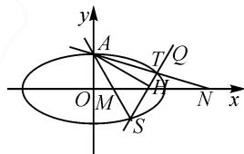

# 巧思维展开,妙方法应用:一道椭圆解答题的探究

# 江苏省张家港市塘桥高级中学 汤 鸿

涉及直线与圆锥曲线的综合应用的解答题,常常巧妙融入“动态”与“静态”的变化过程,交汇“动点”与“定点”的变形转化、“常值”与“最值”的合理过渡,同时有“数”的本质属性,又有“形”的几何特征,新颖多变,具有较高的区分度与较好的选拔性,是全面考查学生的“四基”与数学基本能力,以及培养数学核心素养的一个重要题型.

# 1 问题呈现

问题 在平面直角坐标系 $xOy$ 中，点 $F(-\sqrt{3},0)$ ， $P(x,y)$ 是平面内的动点。若以 $PF$ 为直径的圆与圆 $O: x^2 + y^2 = 4$ 内切，记点 $P$ 的轨迹为曲线 $E$ 。

(1) 求 E 的方程;

(2) 设 $A(0,1)$ , $M(t,0)$ , $N(4-t,0)$ ( $t \neq 2$ ), 直线 AM, AN 分别与曲线 E 交于点 S, T (S, T 异于 A), $AH \perp ST$ , 垂足为 H, 求 $|OH|$ 的最小值.

这是一道集多动点、多动直线于一体的试题，借助点、线段与圆的场景创设进行必要的、适度的“包装”，进而解决圆锥曲线的方程与基本性质问题.

# 2 问题破解

# 2.1 第(1)问的解答

解法 1: 定义法. 设 PF 的中点为 G, 依题意以 PF 为直径的圆与圆 $O: x^{2} + y^{2} = 4$ 内切, 所以 $|GO| = 2 - \frac{|PF|}{2}$ , 即 $|PF| = 4 - 2|GO|$ .

设 $F_{2}(\sqrt{3},0)$ ，又 $2|GO|=|PF_{2}|$ ，所以 $|PF|+|PF_{2}|=4>2\sqrt{3}=|FF_{2}|$ ，所以点 P 的轨迹是以 F， $F_{2}$ 为焦点，4 为长轴长的椭圆.

设 E 的方程为 $\frac{x^{2}}{a^{2}} + \frac{y^{2}}{b^{2}} = 1 (a > b > 0)$ ，则 $c = \sqrt{3}$ ，
a=2,b=1,所以点P的轨迹方程 $E:\frac{x^{2}}{4}+y^{2}=1$ .

解法 2: 设点法. 设 $P(x, y)$ ，则 PF 的中点为 $G\left(\frac{x - \sqrt{3}}{2}, \frac{y}{2}\right)$ . 依题意可得 $|GO| = 2 - \frac{|PF|}{2}$ ，即 $\sqrt{\left(\frac{x - \sqrt{3}}{2}\right)^{2} + \left(\frac{y}{2}\right)^{2}} = 2 - \frac{1}{2}\sqrt{(x + \sqrt{3})^{2} + y^{2}}$ .

整理，得 $\sqrt{(x - \sqrt{3})^2 + y^2} = 4 - \sqrt{(x + \sqrt{3})^2 + y^2}$ 化简可得点 $P$ 的轨迹方程 $E: \frac{x^2}{4} + y^2 = 1.$

解后反思: 解决此类动点的轨迹方程问题, 比较常见的思维方式就是从定义法入手, 依托问题条件合理挖掘几何关系式, 利用圆锥曲线的定义来确定轨迹类型, 进而求解轨迹方程; 另一种思维方式就是从设点法入手, 依托问题条件合理挖掘几何关系式, 利用解析几何的方法来数学运算或逻辑推理, 进而求解对应的轨迹方程.

# 2.2 第(2)问的解答

解析: 设点 $S(x_{1}, y_{1})$ , $T(x_{2}, y_{2})$ , $y_{1} \neq 1$ , $y_{2} \neq 1$ , 先证明直线 ST 恒过定点, 如图 1 所示, 理由如下.

text_image

y
A
T/Q
O M P N x
S

图 1

法 1: 设线法.

由对称性可知, 直线 ST 的斜率不为 0, 所以设直线 ST 的方程为 $x = my + n$ .

联立直线 $ST$ 与椭圆 $E$ 的方程 $\left\{ \begin{array}{l} x = my + n, \\ \frac{x^2}{4} + y^2 = 1, \end{array} \right.$ 消去 $x$ 可得 $(m^2 + 4)y^2 + 2mny + n^2 - 4 = 0$ .

由 $\Delta>0$ , 得 $4+m^{2}-n^{2}>0$ .

所以 $y_{1}+y_{2}=-\frac{2mn}{m^{2}+4},y_{1}y_{2}=\frac{n^{2}-4}{m^{2}+4}.$

由直线 AS 的方程为 $x=\frac{x_{1}}{y_{1}-1}(y-1)$ ，令 y=0，得点 M 的横坐标 $t=-\frac{x_{1}}{y_{1}-1}$ ，同理可得点 N 的横坐标 $4-t=-\frac{x_{2}}{y_{2}-1}$ ，所以 $-\frac{x_{1}}{y_{1}-1}-\frac{x_{2}}{y_{2}-1}=4$ 。将 $x_{1}=my_{1}+n, x_{2}=my_{2}+n$ 代入上式整理 $(2m+4)y_{1}y_{2}+(n-m-4)(y_{1}+y_{2})+4-2n=0$ 。

整理得 $m^{2}+2mn+n^{2}-2m-2n=0$ ，即 m, n 满足方程 $(m+n)(m+n-2)=0$ .

若 $m + n = 0$ ，即 $n = -m$ ，则直线 $ST$ 方程为 $x = m(y - 1)$ ，过点 $A(0,1)$ ，不合题意.

所以 $m+n-2=0$ ，此时 n=2-m，直线 ST 的方

程为 $x=m(y-1)+2$ ，所以直线 ST 过定点 Q(2,1).

因为直线 $ST$ 过定点 $Q(2,1)$ ，且与轨迹 $E$ 始终有两个交点，又 $A(0,1), AH \perp ST$ ，垂足为 $H$ ，故点 $H$ 的轨迹是以 $AQ$ 为直径的半圆（不含点 $A, Q$ ，在直线 $AQ$ 下方）.

设 AQ 的中点为 C，则圆心 $C(1,1)$ ，半径为 1。所以 $|OH| \geqslant |OC| - 1 = \sqrt{2} - 1$ ，当且仅当点 H 在线段 OC 上时，故 $|OH|$ 的最小值为 $\sqrt{2} - 1$ 。

法 2: 分类讨论法 1.

① 当直线 $ST$ 的斜率存在时，设直线 $ST$ 的方程为 $y = kx + m$ 。联立直线 $ST$ 与椭圆 $E$ 的方程 $\left\{ \begin{array}{l} y = kx + m, \\ \frac{x^2}{4} + y^2 = 1, \end{array} \right.$ 消去 $x$ ，可得

$$
(1 + 4 k ^ {2}) x ^ {2} + 8 k m x + 4 m ^ {2} - 4 = 0.
$$

由 $\Delta>0$ , 得 $4k^{2}+1-m^{2}>0$

所以 $x_{1}+x_{2}=-\frac{8km}{1+4k^{2}},x_{1}x_{2}=\frac{4m^{2}-4}{1+4k^{2}}.$

同证法1得 $t = -\frac{x_1}{y_1 - 1}, 4 - t = -\frac{x_2}{y_2 - 1}$ ，所以 $-\frac{x_1}{y_1 - 1} - \frac{x_2}{y_2 - 1} = 4$ ，即 $x_1(y_2 - 1) + x_2(y_1 - 1) = -4(y_1 - 1)(y_2 - 1)$ ，将 $y_1 = kx_1 + m, y_2 = kx_2 + m$ 代入上式，得 $(4k^2 + 2k)x_1x_2 + (1 + 4k)(m - 1)(x_1 + x_2) + 4(m - 1)^2 = 0.$

所以 $(4k^{2} + 2k)\frac{4m^{2} - 4}{1 + 4k^{2}} +(1 + 4k)(m - 1)\left(-\frac{8km}{1 + 4k^{2}}\right) + 4(m - 1)^{2} = 0.$

整理得 $2km-2k+m^{2}-2m+1=(m-1)(2k+m-1)=0$ ，所以 m=1-2k（其中 m=1 时，直线 ST: y=kx+1 过点 A，不符合题意，舍去）。所以直线 ST 的方程为 $y=kx+(1-2k)$ 。故直线 ST 恒过定点 Q(2,1)。

②当直线 $ST$ 的斜率不存在时，此时 $S(x_{1},y_{1})$ ， $T(x_{1}, - y_{1})$ ，同理可得 $-\frac{x_1}{y_1 - 1} -\frac{x_1}{-y_1 - 1} = 4$ ，即 $\frac{x_1}{2} = 1 - y_1^2$ ，又 $\frac{x_1^2}{4} +y_1^2 = 1$ ，解得 $x_{1} = 0$ 或 $x_{1} = 2$

若 $x_{1}=0$ ，则 S, T 中必有一点与 A 重合，不符合题意；若 $x_{1}=2$ ，则 M, N 重合，也不符合题意。

综上, 直线 ST 过定点 Q(2,1). 余略.

法 3: 分类讨论法 2.

①若直线 $AS, AT$ 的斜率均存在，即 $x_{1} \neq 0, x_{2} \neq 0$ ，则 $k_{AS} = \frac{y_{1} - 1}{x_{1}} = -\frac{1}{t}, k_{AT} = \frac{y_{2} - 1}{x_{2}} = \frac{1}{t - 4}$ ，所以

$$
\frac {x _ {1}}{y _ {1} - 1} + \frac {x _ {2}}{y _ {2} - 1} = - 4.
$$

依题意直线 $ST$ 不经过点 $A$ , 设直线 $ST$ 的方程为 $mx + n(y - 1) = 1$ , 椭圆 $E$ 的方程为 $0 = x^2 + 4y^2 - 4 = x^2 + 4[(y - 1) + 1]^2 - 4 = x^2 + 4(y - 1)^2 + 8(y - 1)$ .

联立 $\left\{\begin{aligned}mx+n(y-1)=1,\\ x^{2}+4(y-1)^{2}+8(y-1)=0,\end{aligned}\right.$ 齐次化可得 $x^{2}+4(y-1)^{2}+8(y-1)[mx+n(y-1)]=0$ ，整理得 $(4+8n)(y-1)^{2}+8m(y-1)x+x^{2}=0.$

除以 $(y-1)^{2}$ ，得 $(4+8n)+8m\frac{x}{y-1}+\left(\frac{x}{y-1}\right)^{2}=0$ ，因为 $S(x_{1},y_{1}),T(x_{2},y_{2})$ 满足上式，所以由韦达定理得 $\frac{x_{1}}{y_{1}-1}+\frac{x_{2}}{y_{2}-1}=-8m=-4$ ，解得 $m=\frac{1}{2}$ .

所以直线 $ST: \frac{1}{2} x + n(y - 1) = 1$ . 故直线 $ST$ 恒过定点 $Q(2,1)$ .

②若直线 AS 或 AT 的斜率不存在时, 易求得直线 $ST: y = x - 1$ , 故直线 ST 过点 $Q(2, 1)$ .

综上, 直线 ST 过定点 Q(2,1). 余略.

解后反思:对于此类直线与圆锥曲线的位置关系的综合问题,涉及直线斜率的存在性、参数取值对直线斜率的影响、参数是否有意义等问题时,经常要采用分类讨论思想,根据不同情况加以细化.当然不同的分类依据对应不同的分类讨论情况,从而加以多思维视角来分析与探究.

# 3 教学启示

# 3.1 创新设置,巧妙融合

以上直线与圆锥曲线的综合问题中，以多“动点”、多“动直线”的场景创设，带入点、直线、圆与圆锥曲线等众多解析几何元素，巧妙设置，借助“动直线”过“定点”的证明，结合“动点”的轨迹方程的确定来求解距离的最值问题，能够更加全面、细致地考查学生的“四基”与数学基本能力等.

# 3.2 模块核心,考查能力

圆锥曲线是平面解析几何的核心内容之一,也是每年高考必考的一道解答题,常以求解圆锥曲线的标准方程、研究直线与圆锥曲线的位置关系等为主,涉及题型多变,此类命题起点往往较低,具有一定的梯度.但在第(2)问中一般都有较为复杂的数学运算与繁杂的逻辑推理,对考生解决数学问题的基本能力要求较高,通常以压轴题的形式呈现,能够有效拉开不同层次考生之间的差距.Z