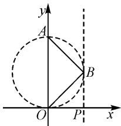

# 巧思维开拓思路,妙应用变式拓展

# 广东省深圳市艺术学校 林凌

作为平面向量模块中最重要的基本知识之一，平面向量的数量积及其综合应用问题成为近年高考试卷中的一个基本考点。特别是涉及平面向量数量积的求值与应用问题，以各种形式的场景创设，借助数量积的形式来变形与转化，基于平面几何，依托平面向量，融合函数与方程、三角函数、基本不等式等其他相关知识，成为该模块知识中考查的重中之重，也是课堂教学与复习备考中的一个基本专题，成为全面考查数学“四基”与“四能”的一个重要场所。本文中结合2024年一道高考试题的解法分析及变式拓展，给出相应的教学启示。

# 1 真题呈现

高考真题（2024年高考数学新高考Ⅰ卷·3）已知向量 $a=(0,1)$ ， $b=(2,x)$ ，若 $b\perp(b-4a)$ ，则 $x=$ （ ）.

A.-2 B.-1 C.1 D.2

此题以两个平面向量的坐标为问题场景,其中一个平面向量的坐标中含有参数,结合平面向量的线性运算与位置关系来设置条件,进而来确定对应的参数值.题目条件比较简单明了,难度也相应简单,属于基础题.

而此类平面向量及其综合应用问题,是高考中比较常见的考查方式.其依托平面向量的坐标运算、平面向量间位置关系(垂直)、平面向量的数量积等对应的基础知识,通过平面向量的坐标运算与逻辑推理,可以从坐标思维、几何思维以及间接思维等相关思维方式来切入与应用,结合函数与方程思维来分析与求解对应的参数值.

# 2 真题破解

# 2.1 坐标思维

解法 1: 坐标法 1.

依题, 结合 $\boldsymbol{a}=(0,1)$ , $\boldsymbol{b}=(2,x)$ , 可得 $\boldsymbol{b}-4\boldsymbol{a}=(2,x)-4(0,1)=(2,x-4)$ .

而 $\boldsymbol{b} \perp (\boldsymbol{b} - 4\boldsymbol{a})$ ，则有 $\boldsymbol{b} \cdot (\boldsymbol{b} - 4\boldsymbol{a}) = (2, x) \cdot (2, x - 4) = 4 + x(x - 4) = (x - 2)^2 = 0$ ，解得 x = 2.

故选 D.

解法 2: 坐标法 2.

依题,由于 $\boldsymbol{b}\perp(\boldsymbol{b}-4\boldsymbol{a})$ , 则有 $\boldsymbol{b}\cdot(\boldsymbol{b}-4\boldsymbol{a})=\boldsymbol{b}^{2}-4\boldsymbol{a}\cdot\boldsymbol{b}=0$ .

而 $\boldsymbol{a}=(0,1)$ , $\boldsymbol{b}=(2,x)$ ，可得 $b^{2}=4+x^{2}$ , $a\cdot b=(0,1)\cdot(2,x)=x$ .

所以 $4 + x^{2} - 4x = (x - 2)^{2} = 0$ ，解得 x = 2。

故选:D.

点评:依托题设条件中平面向量的坐标场景,直接通过平面向量的坐标运算来转化与应用,是解决此类平面向量问题中最常见的思维方式.利用各向量的坐标代入,结合平面向量的线性运算、数量积等,并利用平面向量间的位置关系来构建关系式,建立相应的方程,为参数的求解创造条件.

# 2.2 几何思维

解法 3: 几何法.

依题, 设 $\overrightarrow{OA}=4a,\overrightarrow{OB}=b$ , 如图 1 所示, 此时 $|OA|=4,|OP|=2.$

所以 $\overrightarrow{AB} = b - 4a$ ，结合 $b \perp (b - 4a)$ ，可得 $OB \perp AB$ ，则知点 B 在以 OA 为直径的圆上.

由 $\boldsymbol{b}=(2,x)$ ，可知点 B 在直线 PB:x=2 上.

text_image

y
A
B
O
P
x

图1

数形结合, 可知 PO, PB 以为 OA 为直径的圆的切线, 所以 $x = |PB| = |PO| = 2$ .

故选:D.

点评:依托题设条件中平面向量的线性运算场景,合理构建坐标系下的平面几何图形,结合平面向量间的位置关系来确定动点的轨迹,为进一步的分析与应用创造条件.几何法的本质就是借助几何图形直观切入,并利用直观想象与几何性质来转化与应用,实现直观形象解题与应用.

# 2.3 间接思维

解法 4: 逐一验证法.

对于选项 A, 当 x = -2 时, 则知 $\boldsymbol{b} = (2, -2)$ , 结合 $\boldsymbol{a} = (0, 1)$ , 可知 $\boldsymbol{b} \cdot (\boldsymbol{b} - 4\boldsymbol{a}) = \boldsymbol{b}^{2} - 4\boldsymbol{a} \cdot \boldsymbol{b} = (4 + 4) - 4 \times (-2) = 16 \neq 0$ , 不符合题设条件, 舍去;

对于选项 B, 当 x = -1 时, 则知 $b = (2, -1)$ , 结合 $a = (0, 1)$ , 可知 $\boldsymbol{b} \cdot (\boldsymbol{b} - 4\boldsymbol{a}) = \boldsymbol{b}^{2} - 4\boldsymbol{a} \cdot \boldsymbol{b} = (4 + 1) - 4 \times (-1) = 9 \neq 0$ , 不符合题设条件, 舍去;

对于选项 C, 当 x=1 时, 则知 $\boldsymbol{b}=(2,1)$ , 结合 $\boldsymbol{a}=(0,1)$ , 可知 $\boldsymbol{b}\cdot(\boldsymbol{b}-4\boldsymbol{a})=\boldsymbol{b}^{2}-4\boldsymbol{a}\cdot\boldsymbol{b}=(4+1)-4\times1=1\neq0$ , 不符合题设条件, 舍去;

因此只能是选项 D 中的 x=2 符号题设条件.

故选：D.

点评:基于此类答案确定的单项选择题,借助各选项中的对应数据来逐一验证与排除,也是解决问题的一种比较常用的技巧方法.在实际逐一验证应用时,只要通过各选项的逐一分析与排查,得到正确的结论后,往往就可以直接结束进一步验证的步骤.在时间有空余时再验证还没有验证的选项,取舍有度,合理把握.间接思维下的逐一验证法,看似繁杂,但也是处理此类问题中比较常用的一种基本技巧方法.

# 3 变式拓展

# 3.1 同源变式

根据以上高考真题及其解析,回归问题本质,借助参数值的求解与确定,通过平面向量的数量积的合理过渡与应用,对平面向量的数量积加以深入研究与应用,得到以下对应的变式问题.

变式 1 已知向量 $a=(0,1)$ , $b=(2,x)$ ，则 $b \cdot (b-4a)$ 的最小值为 \_\_\_\_.

解析:依题,由于 $\boldsymbol{a}=(0,1)$ , $\boldsymbol{b}=(2,x)$ , 则有 $b^{2}=4+x^{2}$ , $\boldsymbol{a}\cdot\boldsymbol{b}=(0,1)\cdot(2,x)=x$ .

所以 $\boldsymbol{b} \cdot (\boldsymbol{b} - 4\boldsymbol{a}) = \boldsymbol{b}^{2} - 4\boldsymbol{a} \cdot \boldsymbol{b} = 4 + x^{2} - 4x = (x - 2)^{2} \geqslant 0$ ，即 $\boldsymbol{b} \cdot (\boldsymbol{b} - 4\boldsymbol{a})$ 的最小值为 0.

故填答案:0.

其实,通过变式 1 及其解析过程,可以得到以下更一般的变式问题.

变式 2 已知向量 $a=(0,1)$ , $b=(2,x)$ ，则 $b \cdot (b-4a)$ 的取值范围是 \_\_\_\_.

答案: $[0,+\infty)$ .

# 3.2 类比变式

在 2024 年的新高Ⅱ卷中也有相应的考题,巧妙类比应用与拓展.

变式 3 （2024 年高考数学新高考Ⅱ卷·3）已知向量 a, b 满足 $\left|a\right|=1,\left|a+2b\right|=2$ ，且 $(b-2a)\perp b$ ，则 $\left|b\right|=(\quad)$ .

A. $\frac{1}{2}$

B. $\frac{\sqrt{2}}{2}$

C. $\frac{\sqrt{3}}{2}$

D.1

解析:依题,由 $(b-2a)\perp b$ ,可得 $(b-2a)\cdot b=b^{2}-2a\cdot b=0$ .

$$
\begin{array}{r l} & {\text {结合} | \pmb {a} | = 1, | \pmb {a} + 2 \pmb {b} | = 2, \text {可得} | \pmb {b} | ^ {2} = \pmb {b} ^ {2} = 2 \pmb {a} \cdot} \\ & {\pmb {b} = \frac {1}{2} (| \pmb {a} + 2 \pmb {b} | ^ {2} - | \pmb {a} | ^ {2} - 4 | \pmb {b} | ^ {2}) = \frac {1}{2} (4 - 1 - 4 | \pmb {b} | ^ {2}),} \end{array}
$$

整理可得 $|\pmb{b}|^2 = \frac{1}{2}$ , 解得 $|\pmb{b}| = \frac{\sqrt{2}}{2}$ .

故选：B.

# 3.3 深度变式

合理挖掘高考真题的内涵与实质,巧妙拓展思维与深入应用,加以进一步的深度学习与变式拓展.

变式 4 平面向量 a, b, c 满足 $\left|a\right| = \left|b\right| = a \cdot b = 2, \left|a + b + c\right| = 1$ ，则 $(a + c) \cdot (b + c)$ 的最小值是（）.

A.-3

B. $3-2\sqrt{3}$

C. $4-2\sqrt{3}$

D. $-2\sqrt{3}$

解析:由 $|a|=|b|=a\cdot b=2$ ，可得 $\cos\langle a,b\rangle=\frac{a\cdot b}{|a||b|}=\frac{1}{2}$ ，则有 $\langle a,b\rangle=\frac{\pi}{3}$ .

在平面直角坐标系中，令 $a = (2,0), b = (1,\sqrt{3})$ 设 $c = (x,y)$ ，则知 $|a + b + c| = |(3 + x,\sqrt{3} +y)| = 1$ ，即 $(x + 3)^2 +(y + \sqrt{3})^2 = 1$ ，其表示的是圆心为 $C(-3, - \sqrt{3})$ ，半径为 $r = 1$ 的圆.

$$
\begin{array}{r l} & {\text {而} (\pmb {a} + \pmb {c}) \bullet (\pmb {b} + \pmb {c}) = (x + 2, y) \bullet (x + 1, y + \sqrt {3}) =} \\ & {(x + 2) (x + 1) + y (y + \sqrt {3}) = x ^ {2} + 3 x + 2 + y ^ {2} + \sqrt {3}   y =} \\ & {\left(x + \frac {3}{2}\right) ^ {2} + \left(y + \frac {\sqrt {3}}{2}\right) ^ {2} - 1.} \end{array}
$$

其中代数式 $\left(x + \frac{3}{2}\right)^2 +\left(y + \frac{\sqrt{3}}{2}\right)^2$ 表示的是动点 $P(x,y)$ 与定点 $M\left(-\frac{3}{2}, - \frac{\sqrt{3}}{2}\right)$ 的距离的平方，

而 $|CM| = \sqrt{\left(-3 + \frac{3}{2}\right)^2 + \left(-\sqrt{3} + \frac{\sqrt{3}}{2}\right)^2} = \sqrt{3}$ ，则知 $|PM|_{\min} = \sqrt{3} - 1$ .

所以 $(a+c)\cdot(b+c)$ 的最小值是 $(\sqrt{3}-1)^{2}-1=3-2\sqrt{3}$ .

故选：B.

# 4 教学启示

在解决平面向量数量积的求值与应用问题时,借助平面几何图形与性质,从平面向量知识入手,合理构建与数量积有关的问题,进而从题设条件入手,合理寻觅并挖掘数量积的结构特征与题设条件,从“数”的代数属性或“形”的几何直观等视角切入与应用,合理进行恒等变形与转化.

求解平面向量数量积的求值与综合应用问题中，对于既涉及“数”的基本属性又涉及“形”的几何特征问题，解题时往往可以“数”或“形”单独切入与应用，也可以“数”“形”结合，从多个层面、多个视角来切入与应用，为问题的分析与解决提供更加多样的数学思维，更加有利于发散学生的数学思维。

特别在实际解题与应用过程中,合理借助平面向量数量积的求值与应用问题的解题经验的积累与技巧方法的应用,选取行之有效的数学思维方法与对应的技巧策略,实现平面向量数量积的求值与应用问题的求解,从而有效养成良好的数学思维品质,提升数学解题能力,拓展数学应用与创新思维.