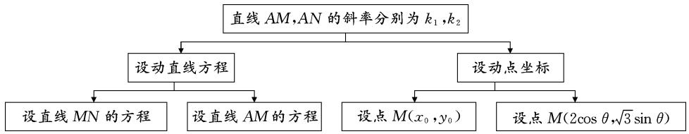
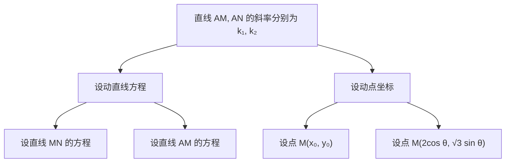
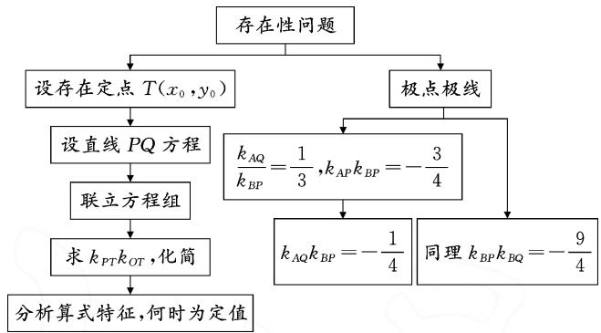
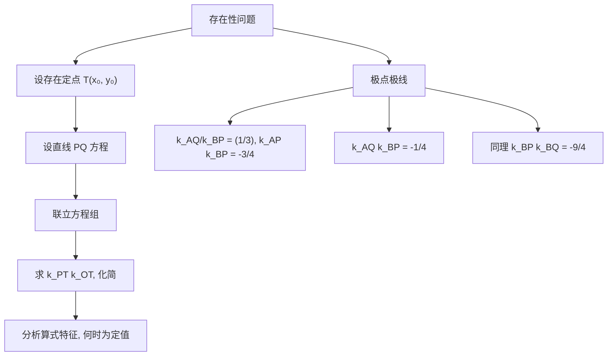
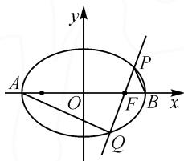

2023年命题比赛获奖论文之十三：

# 抓住本质,从一般到特殊命制试题

——以 2019 年人教 A 版“椭圆”为例

# ● 昆明市第十中学 钱见宝 郭子扬 白民尊

摘要: 圆锥曲线中有许多二级结论, 这些结论是教材知识的进一步延伸, 利用它们能快速解答问题, 也可以利用它们引入特殊化思想命制试题. 本文中以教材推导椭圆标准方程的过程为背景, 分析推导过程中一些式子的几何意义, 得出结论, 利用此结论命制了一个定值、定点问题.

关键词: 椭圆; 斜率; 定点; 定值

# 1 试题呈现

原题（人教A版选择性必修第一册第108页）设 $A, B$ 两点的坐标分别为 $(-5, 0), (5, 0)$ . 直线 $AM$ , $BM$ 相交于点 $M$ , 且它们的斜率之积是 $-\frac{4}{9}$ , 求点 $M$ 的轨迹方程. $\left[\frac{x^2}{25} + \frac{9y^2}{100} = 1 (x \neq \pm 5)\right]$

命题 已知椭圆 $C: \frac{x^{2}}{4} + \frac{y^{2}}{3} = 1$ 的左顶点为 A，右焦点为 F.

(1)(改编)设过椭圆中心的直线与椭圆的交点为M,N(与A不重合),记直线AM,AN的斜率分别为 $k_{1},k_{2}$ ,求证: $k_{1}k_{2}$ 为定值.  
(2)(原创)设过右焦点 F 的直线与椭圆的交点为 P, Q(与 A 不重合), 则在椭圆 C 上是否存在点 T, 使得 TP 和 TQ 的斜率之积为定值? 若存在, 求出点 T 的坐标; 若不存在, 请说明理由.

# 2 命题过程

# 2.1 发现本质

教材(选择性必修第一册第106页)在推导椭圆标准方程中得到 $(a^{2}-c^{2})x^{2}+a^{2}y^{2}=a^{2}(a^{2}-c^{2})$ ，即 $a^{2}y^{2}=(a^{2}-c^{2})(a^{2}-x^{2})$ 。当 $x\neq\pm a$ 时，可以化简为 $\frac{y}{x-a}\cdot\frac{y}{x+a}=\frac{c^{2}-a^{2}}{a^{2}}$ ，即 $\frac{y}{x-a}\cdot\frac{y}{x+a}=-\frac{b^{2}}{a^{2}}$ 。这事实上给出了椭圆的一条性质：连接椭圆 $\frac{x^{2}}{a^{2}}+\frac{y^{2}}{b^{2}}=1(a>b>0)$ 上的点（长轴的端点除外）与长轴的两个端点的两条直线的斜率之积为定值 $-\frac{b^{2}}{a^{2}}$ 。联系圆上一点与直径两端点的连线所成角为直角，对于上述性质，可以再做推广：椭圆 $\frac{x^{2}}{a^{2}}+\frac{y^{2}}{b^{2}}=1(a>b>0)$ 上任意一点

P 与过原点的弦 AB 的两端点 A, B 的连线 PA, PB (与坐标轴不平行) 斜率之积为定值 $-\frac{b^{2}}{a^{2}}$ . (证明: 设点 $P(x, y)$ , $A(x_{1}, y_{1})$ , 则 $B(-x_{1}, -y_{1})$ , 所以 $\frac{x^{2}}{a^{2}} + \frac{y^{2}}{b^{2}} = 1$ , $\frac{x_{1}^{2}}{a^{2}} + \frac{y_{1}^{2}}{b^{2}} = 1$ , 两式相减得 $\frac{y^{2} - y_{1}^{2}}{x^{2} - x_{1}^{2}} = -\frac{b^{2}}{a^{2}}$ , 即 $k_{PA} k_{PB} = -\frac{b^{2}}{a^{2}}$ , 为定值.)

# 2.2 命制试题

结合上述结论,可以选择椭圆上的一个定点和一条过原点的动直线命制一个定值的证明问题.根据本校学生实际情况,选择左顶点为定点命制了问题(1).

问题(1)中动直线经过椭圆的中心,若改为经过焦点,此时直线和椭圆的两个交点和椭圆上与它们不重合的任意点的连线斜率之积还是定值吗?计算发现只有左、右顶点满足,据此特征命制了问题(2).

上述两个问题,围绕斜率之积为定值展开,联系数的运算,可以再命制两直线斜率和、差、商为定值的问题,也可以把曲线变为双曲线、抛物线命制问题.比如,在问题(2)中,可以命制过焦点的直线与椭圆的两交点与左、右顶点连线斜率之比为定值.总之,在圆锥曲线问题中引入直线,与它产生交点,再把交点与其他特殊点相连形成新的直线,从而可以命制与此直线有关的问题(如2023年新课标Ⅱ卷第21题).

# 3 试题分析

# 3.1 考查意图

本题以椭圆为载体,考查圆锥曲线中的定值、定点问题,意在考查学生的逻辑推理能力、化归与转化能力、运算求解能力,特别体会到设点或设线不同会导致不同的运算量,应作出合理选择.考查了逻辑推理、数学运算、数学抽象等核心素养.

# 3.2 试题分析

问题(1): 若把图形变化的动因看成是直线 MN 绕坐标原点旋转引起的, 可考虑设直线 MN 或 AM 的方程, 与椭圆方程联立, 求出点 M, N 的坐标, 进而得

出问题所需量解答问题;引起图形变化的动因,也可看成是由点 M 的运动引起,可设点 M 的坐标为参数,由于点 N 与 M 对称,则可得点 N 坐标,从而可表示“问题所需”.思维导图如图 1 所示.

flowchart

图1

问题(2): 存在性问题, 应当先假设存在. 图形变化是由直线 PQ 绕焦点 F 旋转而引起的, 考虑设直线的横截距方程 $x = my + 1$ , 与椭圆方程联立. 本题的难点是对斜率乘积算式的化简和分析, 要使得斜率之积为定值, 应当与 m 无关, 得出对应方程, 给出点的坐标, 验证此点在椭圆上. 思维导图如图 2 所示.

flowchart

图2

# 4 规范解答

# 4.1 第(1)问的解答

法一（设线）：设直线 $MN$ 的方程为 $x = ty$ ， $M(x_{1},y_{1}), N(x_{2},y_{2})$

联立方程组 $\left\{\begin{aligned}x&=ty,\\ 3x^{2}&+4y^{2}=12,\end{aligned}\right.$ 消去x，得

$$
(3 t ^ {2} + 4) y ^ {2} = 1 2.
$$

解得 $y_{1} = 2\sqrt{\frac{3}{3t^{2} + 4}}, y_{2} = -2\sqrt{\frac{3}{3t^{2} + 4}}$ .

所以 $k_{1} \cdot k_{2} = \frac{y_{1}}{x_{1} + 2} \cdot \frac{y_{2}}{x_{2} + 2} = \frac{2\sqrt{\frac{3}{3t^{2} + 4}}}{2t\sqrt{\frac{3}{3t^{2} + 4}} + 2}$

$\frac{-2\sqrt{\frac{3}{3t^2 + 4}}}{-2t\sqrt{\frac{3}{3t^2 + 4}} + 2} = \frac{-12}{12t^2 - 12t^2 + 16} = -\frac{3}{4}$ ，为定值.

法二(设线): 设直线 AM 的方程为 $y = k_{1}(x + 2)$ , $M(x_{1}, y_{1})$ , $N(x_{2}, y_{2})$ .

联立方程组 $\left\{\begin{aligned}y&=k_{1}(x+2),\\ 3x^{2}&+4y^{2}=12,\end{aligned}\right.$ 消去y,得

$$
(3 + 4 k _ {1} ^ {2}) x ^ {2} + 1 6 k _ {1} ^ {2} x + 1 6 k _ {1} ^ {2} - 1 2 = 0. \tag {①}
$$

因为方程①的一个根为-2，所以 $-2\cdot x_{1}=\frac{16k_{1}^{2}-12}{3+3k_{1}^{2}}$ ，则 $x_{1}=\frac{6-8k_{1}^{2}}{3+4k_{1}^{2}}$ .

同理，可得 $x_{2}=\frac{6-8k_{2}^{2}}{3+4k_{2}^{2}}$ .

由点 M, N 关于原点对称, 可以得到 $\frac{6-8k_{1}^{2}}{3+4k_{1}^{2}} = -\frac{6-8k_{2}^{2}}{3+4k_{2}^{2}}$ , 整理得 $(k_{1}k_{2})^{2} = \frac{9}{16}$ .

因为 $k_{1}k_{2}<0$ ，所以 $k_{1}k_{2}=-\frac{3}{4}$ ，为定值。

法三(设点): 设 $M(x_{0}, y_{0})$ ，又点 N 与点 M 关于原点对称，所以 $N(-x_{0}, -y_{0})$ .

所以 $k_{1} = \frac{y_{0}}{x_{0} + 2}, k_{2} = \frac{-y_{0}}{-x_{0} + 2}$ ，则

$$
k _ {1} k _ {2} = \frac {y _ {0}}{x _ {0} + 2} \cdot \frac {- y _ {0}}{- x _ {0} + 2} = \frac {- y _ {0} ^ {2}}{4 - x _ {0} ^ {2}}.
$$

又点 $M(x_{0}, y_{0})$ 在椭圆上，所以 $\frac{x_{0}^{2}}{4} + \frac{y_{0}^{2}}{3} = 1$ ，即

$$
y _ {0} ^ {2} = \frac {3}{4} (4 - x _ {0} ^ {2}).
$$

故 $k_{1}k_{2} = \frac{-y_{0}^{2}}{4 - x_{0}^{2}} = \frac{-\frac{3}{4}(4 - x_{0}^{2})}{4 - x_{0}^{2}} = -\frac{3}{4}$ , 为定值.

法四(设点): 根据椭圆方程可以设 M 的坐标为 $(2\cos\theta,\sqrt{3}\sin\theta)$ ，则 $N(-2\cos\theta,-\sqrt{3}\sin\theta)$ .

所以 $k_{1}=\frac{\sqrt{3}\sin\theta}{2\cos\theta+2}, k_{2}=\frac{-\sqrt{3}\sin\theta}{-2\cos\theta+2}$ ，故 $k_{1}k_{2}=\frac{\sqrt{3}\sin\theta}{2\cos\theta+2}\cdot\frac{-\sqrt{3}\sin\theta}{-2\cos\theta+2}=\frac{-3\sin^{2}\theta}{4(1-\cos^{2}\theta)}=-\frac{3}{4}$ ，为定值.

# 4.2 第(2)问的解答

法一(设线): 设存在定点 $T(x_{0}, y_{0})$ 满足题意, 即 $k_{PT}k_{QT}$ 为定值.

设直线 PQ 的方程为 $x = my + 1$ , $P(x_{1}, y_{1})$ , $Q(x_{2}, y_{2})$ .

联立方程组 $\left\{\begin{aligned}x&=my+1,\\ 3x^{2}&+4y^{2}=12,\end{aligned}\right.$ 消去x，得

$$
(3 m ^ {2} + 4) y ^ {2} + 6 m y - 9 = 0,
$$

(下转第58页)

$y=\frac{y_{0}}{3}(x-3)$ ，直线AB方程为y=0，所以，过A,B,C,D的曲线系可设为 $(y_{0}x-9y+3y_{0})\cdot(y_{0}x-3y-3y_{0})+\lambda y(x-my-n)=0$ 。与椭圆 $x^{2}+9y^{2}-9=0$ 对比系数，得 $\left\{\begin{aligned}-12y_{0}+\lambda&=0,\\ 18y_{0}-n\lambda&=0,\end{aligned}\right.$ 解得 $n=\frac{3}{2}$ 。

故直线 CD 的方程为 $x=my+\frac{3}{2}$ .

所以直线 CD 过定点 $\left(\frac{3}{2},0\right)$ .

思维角度 3 和思维角度 4 提供的方法, 不仅适用于椭圆, 也适用于其他圆锥曲线, 尤其在证明有关圆锥曲线的极点极线问题 $^{[1-2]}$ 上非常有优势.

# 4 总结

本题主要考查了椭圆性质及方程思想,还考查了计算能力及转化思想、推理论证能力,属于偏难题,其中证明直线过定点是难点,本文中给出了四种思路.直接设点求出相关直线,然后与椭圆方程联立,求出所求直线的方程,进而求出定点;另一个方法是设出所求直线,利用韦达定理算出定点.这两种方法属于常规方法,易于掌握.本文中还提供了另外两种方法,一种是利用椭圆方程构造对偶式,通过圆曲不联立消参,巧妙地优化了计算;另一种是灵活运用二次曲线系方程表示含有公共交点的圆锥曲线,可以快速解答四点共圆、定值定点问题,以及有关斜率问题.在平时教学中,教师应多给学生总结一些解题规律,让学生见到更多的解题方法,开阔思路,提升解题能力.

# 参考文献：

[1] 王慧兴. 强基计划数学备考系列讲座(15)——圆锥曲线的极点、极线基本理论与应用 [J]. 高中数理化, 2023(7): 18-23.  
[2] 沈海英, 王树文. 圆锥曲线的极点与极线——2020 高考北京卷解析试题背景探究 [J]. 中学生数学, 2021(5): 41-42. Z

# (上接第53页)

则 $y_{1} + y_{2} = -\frac{6m}{3m^{2} + 4},y_{1}y_{2} = \frac{-9}{3m^{2} + 4}.$

结合 $x_{1} = my_{1} + 1, x_{2} = my_{2} + 1$ ，得

$$
\begin{array}{l} k _ {P T} k _ {Q T} \\ = \frac {y _ {1} - y _ {0}}{x _ {1} - x _ {0}} \cdot \frac {y _ {2} - y _ {0}}{x _ {1} - x _ {0}} \\ = \frac {y _ {1} y _ {2} - y _ {0} \left(y _ {1} + y _ {2}\right) + y _ {0} ^ {2}}{x _ {1} x _ {2} - x _ {0} \left(x _ {1} + x _ {2}\right) + x _ {0} ^ {2}} \\ = \frac {y _ {1} y _ {2} - y _ {0} \left(y _ {1} + y _ {2}\right) + y _ {0} ^ {2}}{m ^ {2} y _ {1} y _ {2} + m \left(1 - x _ {0}\right) \left(y _ {1} + y _ {2}\right) + x _ {0} ^ {2} - 2 x _ {0} + 1} \\ = \frac {- 9 + 6 m y _ {0} + y _ {0} ^ {2} (3 m ^ {2} + 4)}{3 m ^ {2} \left(x _ {0} ^ {2} - 4\right) + 4 \left(x _ {0} - 1\right) ^ {2}}. \\ \end{array}
$$

所以，当 $y_{0}=0$ 且 $x_{0}^{2}-4=0$ 时，此时，点 T 为椭圆的左、右顶点， $k_{PT}k_{QT}$ 为定值.

若 $T(-2,0)$ ，则 $k_{PT}k_{QT}=-\frac{1}{4}$ ; 若 $T(2,0)$ ，则 $k_{PT}k_{QT}=-\frac{9}{4}$ .

法二(极点极线): 如图 3, 设椭圆的右顶点为 B, 连接 AQ, BP.

根据题意, 可得 $\frac{k_{AQ}}{k_{BP}} = \frac{1}{3}$ , $k_{AP}k_{BP}=-\frac{3}{4}$ ，则 $k_{AP}k_{AQ}=-\frac{1}{4}$ .

同理, 可得 $k_{BP}k_{BQ}=-\frac{9}{4}$ .

text_image

y
A
O
F
B
x
P
Q

图3

所以，若 $T(-2,0)$ ，则 $k_{PT}k_{QT}=-\frac{1}{4}$ ；若 $T(2,0)$ ，则 $k_{PT}k_{QT}=-\frac{9}{4}$ .

# 5 实测情况

本题满分 12 分, 每小题 6 分, 全班共 52 人参加测试, 用时 15 分钟, 平均得分为 4.2 分, 满分仅有 2 人. 第(1)问大多数学生选择设直线方程解答, 少有学生抓住对称性特征通过设点解答问题; 第(2)问学生能完成一些运算, 但大多数不能坚持下去, 还有一部分学生无法分析斜率之积的算式, 找出定值需要满足的条件.

# 6 命题感悟

命题是为选拔人才服务,因此所命试题要符合课程标准要求,体现高中数学的育人价值和学科价值,培养科学精神和创新意识.

命题要精选素材,好的素材是命制好试题的基础.教材和高考真题是选择好素材的重要依据,对于其中的一些典型问题,应抓住其本质特征,发现变化中的不变性,通过特殊化、替换等思想命制试题,同时兼顾素养导向和能力考查.

命题要符合学情.命题要考虑到不同知识对应核心素养的考查内容及水平要求,符合学生的实际认知能力,通过一定的情境,融合相应的数学知识,注重基础性和应用性,兼顾综合性和创新性,难度恰当,尽量做到入口宽、方法多样.Z