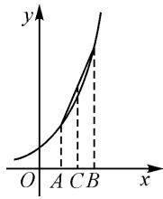

# 拓展数学思维,总结解题技巧

# ● 广西壮族自治区环江毛南族自治县高级中学 谭冠基

涉及函数值、参数值或代数式等的大小比较问题,是近年新高考数学中一类创新热点与基本考点.此类问题以各种创新新颖的方式加以设置,常考常新,形式多样,变化多端,而万变不离其宗,问题中都巧妙融合了幂函数、指数函数或对数函数,以及三角函数等基本初等函数模型,通过对应函数的图象与基本性质,以及不等式的基本性质等相关内容来交汇与融合,充分落实并贯彻新课标中“在知识交汇点处命题”的命题思想.同时此类问题,有时还创新渗透初等数学知识与高等数学知识的交汇与综合应用,是近年新高考数学命题中的一大亮点与难点.

# 1 真题呈现

高考真题（2024年高考数学北京卷·9）已知 $(x_{1},y_{1}),(x_{2},y_{2})$ 是函数 $y=2^{x}$ 图象上不同的两点，则下列正确的是()。

A. $\log_2\frac{y_1 + y_2}{2} >\frac{x_1 + x_2}{2}$   
B. $\log_2\frac{y_1 + y_2}{2} < \frac{x_1 + x_2}{2}$   
C. $\log_2\frac{y_1 + y_2}{2} >x_1 + x_2$   
D. $\log_2\frac{y_1 + y_2}{2} < x_1 + x_2$

这道题目以指数函数为问题场景,结合指数函数的图象上不同两点所对应纵坐标的平均值的对数值、两点所对应横坐标的平均值的大小比较来设置,合理加以分析与判断.其实,这也是高考中涉及大小比较关系的另一种考查方式,要加以高度关注.

该问题巧妙地运用了对数函数与指数函数模型，深入考查了基本不等式的综合应用。在历年高考数学北京卷中，基本不等式经常与其他数学知识点相互交汇与融合，而今年这一结合的方式显得尤为巧妙，题目不仅体现了数学公式的深度融合，还与函数的凹凸性等有着微妙的关联，为考生提供了一次综合运用数学知识与数学技能的机会。

在实际分析与判断时,可以抓住基本不等式的内涵加以放缩与应用,也可以利用函数的凹凸性的本质加以数形结合,还可以利用特殊值的巧妙选取加以验证排除等,都是处理该问题中比较常用的技巧与方法.

# 2 真题破解

解法 1: 基本不等式法.

依题，可知 $y_{1} = 2^{x_{1}} > 0, y_{2} = 2^{x_{2}} > 0$ ，利用基本不等式有 $y_{1} + y_{2} = 2^{x_{1}} + 2^{x_{2}} \geqslant 2\sqrt{2^{x_{1}} \times 2^{x_{2}}} = 2\sqrt{2^{x_{1} + x_{2}}}$ ，当且仅当 $x_{1} = x_{2}$ 时等号成立。由于 $(x_{1}, y_{1}), (x_{2}, y_{2})$ 是函数 $y = 2^{x}$ 图象上不同的两点，因此 $x_{1} \neq x_{2}$ ，所以 $\frac{y_{1} + y_{2}}{2} > 2^{\frac{x_{1} + x_{2}}{2}}$ 。以上不等式两边同时取对数，可得 $\log_2\frac{y_1 + y_2}{2} > \frac{x_1 + x_2}{2}$ 。

故选：A.

点评:根据指数函数建立对应变量之间的关系,合理利用基本不等式加以巧妙放缩与转化,进一步利用不等式的基本性质以及对数的运算来变形与转化,实现对应不等式的判定与应用.该问题中,基本不等式的应用隐藏得比较深,如果不进行相应的挖掘与分析,就无法直接加以联系,这也是数学基础知识与基本技能的综合与应用的充分体现.

解法 2: 函数凹凸性法.

依题,显然函数 $f(x)=2^{x}$ 是定义域 R 上的凹函数,如图 1. 设 $A(x_{1},0)$ ,

$$
\begin{array}{l} B (x _ {2}, 0), C \left(\frac {x _ {1} + x _ {2}}{2}, 0\right), y _ {1} = f (x _ {1}), \\ y _ {2} = f (x _ {2}). \end{array}
$$

数形结合, 可知

$$
\frac {y _ {1} + y _ {2}}{2} > f \left(\frac {x _ {1} + x _ {2}}{2}\right) = 2 ^ {\frac {x _ {1} + x _ {2}}{2}}.
$$

以上不等式两边同时取对数,可得

$$
\log_ {2} \frac {y _ {1} + y _ {2}}{2} > \frac {x _ {1} + x _ {2}}{2}.
$$

text_image

y
O A C B x

图 1

故选：A.

点评:根据指数函数的问题场景与函数模型,结合各选项中对应两点的横坐标、纵坐标的平均数,联想到对应的中点坐标公式,进而抓住函数图象的凹凸性,构建对应的函数图象,合理直观想象,巧妙数形结合,实现问题的突破与解决.该问题中,涉及函数的凹凸性问题,只是课堂教学与学习的深度探究与综合应用的产物,特别是参与竞赛的学生比较熟悉的一个基本知识点,而借助函数图象来直观分析,可以为大部分学生所接受与掌握.

解法 3: 特殊值验证法.

选取特殊值 $x_{1} = 0, x_{2} = 1$ ，可得 $y_{1} = 2^{x_{1}} = 1, y_{2} = 2^{x_{2}} = 2$ ，此时 $x_{1} + x_{2} = 1, \frac{x_{1} + x_{2}}{2} = \frac{1}{2}, \frac{y_{1} + y_{2}}{2} = \frac{3}{2}$ ，可得 $\log_2\frac{y_1 + y_2}{2} = \log_2\frac{3}{2} \in \left(\frac{1}{2}, 1\right)$ ，由此可以排除选项B，C.再选取特殊值 $x_{1} = -1, x_{2} = 0$ ，可得 $y_{1} = 2^{x_{1}} = \frac{1}{2}, y_{2} = 2^{x_{2}} = 1$ ，此时 $x_{1} + x_{2} = -1, \frac{x_{1} + x_{2}}{2} = -\frac{1}{2}, \frac{y_{1} + y_{2}}{2} = \frac{3}{4}$ ，得 $\log_2\frac{y_1 + y_2}{2} = \log_2\frac{3}{4} \in \left(-\frac{1}{2}, 0\right)$ ，由此可以进一步排除选项D.

故选：A.

点评: 回归问题的本质与内涵, 结合两组特殊值的选取, 以特殊性来解决一般性, 是解决此类答案确定且唯一问题中比较常用的一种“巧技妙法”. 特殊值的选取一般追求数字比较简洁, 方便进一步的求值与运算. 同时要注意的是, 若一次特殊值的选取无法直接确定答案, 往往可以进行第二次或第三次特殊值的选取, 直至最后一个. 特殊值验证法是大部分考生所追求的一种比较方便且有效的解题技巧与方法, 关键要结合题设条件选取合理且科学的特殊值, 这样才可以保证问题分析过程的简捷有效.

# 3 变式拓展

# 3.1 类比变式

变式 1 已知 $(x_{1},y_{1}),(x_{2},y_{2})$ 是函数 $y=\log_{2}x$ 图象上不同的两点，则下列正确的是()。

A. $2^{\frac{y_1 + y_2}{2}} > \frac{x_1 + x_2}{2}$

B. $2^{\frac{y_1 + y_2}{2}} < \frac{x_1 + x_2}{2}$

C. $2^{\frac{y_1 + y_2}{2}} > x_1 + x_2$

D. $2^{\frac{y_1 + y_2}{2}} < \frac{x_1 + x_2}{4}$

解析:依题, 可知 $y_{1}=\log_{2}x_{1}, y_{2}=\log_{2}x_{2}$ ，则有 $x_{1}=2^{y_{1}}>0, x_{2}=2^{y_{2}}>0$ ，利用基本不等式有 $x_{1}+x_{2}=2^{y_{1}}+2^{y_{2}}\geqslant2\sqrt{2^{y_{1}}\times2^{y_{2}}}=2\sqrt{2^{y_{1}+y_{2}}}$ ，当且仅当 $y_{1}=y_{2}$ 时等号成立.

由于 $(x_{1},y_{1}),(x_{2},y_{2})$ 是函数 $y=\log_{2}x$ 图象上不同的两点，此时 $y_{1}\neq y_{2}$ ，所以 $\frac{x_{1}+x_{2}}{2}>2^{\frac{x_{1}+x_{2}}{2}}$ 。故选项B正确。

同样地，借助特殊值验证法，可以用来排除选项C，D.选取特殊值 $x_{1} = 1, x_{2} = 2$ ，可得 $y_{1} = \log_{2}x_{1} = 0$ ， $y_{2} = \log_{2}x_{2} = 1$ ，此时 $x_{1} + x_{2} = 3$ ， $\frac{y_1 + y_2}{2} = \frac{1}{2}$ ，可得 $2^{\frac{y_1 + y_2}{2}} = \sqrt{2} < 3 = x_1 + x_2$ ，由此可以排除选项C；又 $2^{\frac{y_1 + y_2}{2}} = \sqrt{2} >\frac{3}{4} = \frac{x_1 + x_2}{4}$ ，由此可以排除选项D.

故选：B.

# 3.2 深度变式

变式 2 （2024 年河北省部分示范性高中高三下学期一模数学试卷)已知实数 $a, b \in (1, +\infty)$ ，且 $2(a + b) = \mathrm{e}^{2a} + 2\ln b + 1$ ，e为自然对数的底数，则（ ）.

A.1<b<a

B.a<b<2a

C.2a<b<a

D. $e^{a}<b<e^{2a}$

解析:依题,由 $2(a+b)=\mathrm{e}^{2a}+2\ln b+1$ , 可得 $e^{2a}-2a-1=2(b-\ln b-1)=2(\mathrm{e}^{\ln b}-\ln b-1)$ . 同构函数 $f(x)=\mathrm{e}^{x}-x-1,x>0$ , 则 $f'(x)=\mathrm{e}^{x}-1>0$ , 所以函数 $f(x)$ 在 $(0,+\infty)$ 上单调递增, 且 $f(0)=0$ . 而由于 $a,b\in(1,+\infty)$ , 有 $\ln b>0$ , 可得 $f(\ln b)>0$ , 则有 $f(2a)=2f(\ln b)>f(\ln b)$ , 即 $2a>\ln b$ , 亦即 $e^{2a}>b$ .

又由于 $e^{2a}-2a-1>2(e^{a}-a-1)$ ，则有 $f(2a)=2f(\ln b)>2f(a)$ ，即 $\ln b>a$ ，则 $b>e^{a}$ .

综上分析, 可得 $e^{a}<b<e^{2a}$ .

故选：D.

# 4 教学启示

# 4.1 方法归纳,知识总结

涉及函数值、参数值或代数式大小比较的高考数学试题,常见的解题技巧与策略主要有以下几个方面:(1)幂函数、指数函数、对数函数等基本性质(主要是单调性)的应用;(2)合理寻找中间值0,1等介值加以间隔与区分;(3)巧妙同构函数法来转化;(4)借助基本不等式等放缩分析处理等.

无论哪种技巧方法的应用,往往离不开函数的图象与基本性质,不等式的基本性质等基本知识点,以及函数与方程、化归与转化、特殊与一般等数学思想,抽象概括、推理论证、运算求解等能力,对于进一步落实数学基础知识、基本技能、基本思想、基本活动经验这“四基”有奇效.

# 4.2 开拓思维,深度学习

借助以上代数式的大小比较这一典型问题的“一题多解”，在数学教学与学习的基础上，进一步深入与研究，有效进行深度学习，在理解并掌握数学“四基”的基础上，全面掌握破解问题的常规思维、“通性通法”与“巧技妙法”，从而深化对相应的数学基础知识与数学基本思想方法等方面的掌握与提升.

在“一题多解”的基础上,全面开阔解题思路,发散解题思维,从而合理归纳与总结,寻找更加合理有效、简单快捷的破解方法,提升问题的综合性与解答的灵活性,进而不断深入,实现深度学习,达到“一题多得”“一题多用”“一题多变”等良好效果,数学思维和数学能力等方面都得到更好的拓宽和加强,举一反三,触类旁通.Z