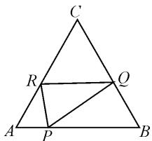
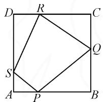

# 挖掘代数式结构,创新构造法应用

# 河北省邢台市浆水中学 刘为民

摘要: 含参不等式恒成立下的综合问题, 是新高考数学试卷中一类考查数学“四基”与“四能”的重要应用场景, 场景新颖, 知识交汇, 内涵丰富, 解法灵活. 结合一道高考模拟题, 就含参不等式恒成立问题中的参数取值范围的求解及其应用, 总结解题技巧, 归纳方法策略, 指导师生的数学教学与学习以及解题研究.

关键词: 不等式; 最值; 构造; 分类讨论; 性质

含参不等式恒成立问题,融入含参场景下的函数、方程或不等式等的综合应用,一直是高考命题的重点与热点之一.此类问题形式多样,变化多端,内涵丰富多彩,知识综合性强.同时,此类问题的解题技巧与方法灵活多变,是全面考查考生“四基”与“四能”的一个很好载体,具有较好的选拔性与区分度,备受各方关注.

# 1 问题呈现

问题（2024年河南省天一大联考高三考前模拟考试数学试卷·14）已知 $x, y, z \in (0,1)$ ，且 $x + y + z - xy - yz - zx < k$ ，则实数 $k$ 的最小值为 \_\_\_\_.

此题以限定条件下的三变元所对应的含参不等式恒成立为问题场景,利用代数式恒小于对应参数,进而来确定该参数的最小值.其中,对应的三变元代数式是三变元之和与三变元两两之积的差所对应的代数式,具有一定的对称性与轮换性,成为问题中的一大重要结构特征.

具体解题时,可以合理借助三变元代数式的结构特征构造模型,利用平面几何图形来切入与应用;也可以合理通过不等式的基本性质与函数性质等加以分类讨论,利用分类讨论思维来逻辑推理与应用;还可以直接利用不等式的基本性质加以合理创设与应用,通过不等式的恒等变形与转化来分析与推理.这些基本方法,都是解决该问题的基本思维方式,也是解决问题的基本策略.

# 2 问题破解

# 2.1 构造思维

解法 1: 构造法.

依题，由于 $x + y + z - xy - yz - zx = x(1 - y) + y(1 - z) + z(1 - x)$ ，并注意到 $x + 1 - x = y + 1 - y = z + 1 - z = 1$ .

如图 1 所示, 设边长为 1 的正三角形 ABC 的边 AB, BC, CA 上分别有点 P, Q, R (与顶点不重合), $AP + PB = BQ + QC = CR + RA = 1$ , 即 AP = x, PB = 1 - x, BQ = z, QC = 1 - z, CR = y, RA = 1 - y.

由于 $\triangle APR, \triangle BPQ, \triangle CQR$

text_image

C
R
Q
A
P
B

图1

面积之和小于 $\triangle ABC$ 的面积，则可得 $S_{\triangle APR} + S_{\triangle BPQ} + S_{\triangle CQR} < S_{\triangle ABC}$ ，即 $\frac{1}{2} x(1 - y)\sin \frac{\pi}{3} + \frac{1}{2} z(1 - x)\sin \frac{\pi}{3} + \frac{1}{2} y(1 - z) \cdot \sin \frac{\pi}{3} < \frac{1}{2} \times 1 \times 1 \times \sin \frac{\pi}{3}$ ，可得 $x(1 - y) + y(1 - z) + z(1 - x) < 1$ ，所以 $1 \leqslant k$ 。

所以实数 $k$ 的最小值为1.

点评:借助不等式中代数式的结构特征,合理构建正三角形这一平面几何图形,利用三角形的面积公式来转化与应用,进而确定对应的不等式,给含参不等式恒等式的解决创造条件,实现参数的最值的确定与求解.

# 2.2 不等式思维

解法 2: 分类讨论法.

依题，不妨设 $0 < x \leqslant y \leqslant z < 1$ ，令 $\omega = x + y + z - xy - yz - zx$ ，则 $\omega = z(1 - x - y) + x + y - xy$ .

根据 $0<x+y<2$ ，分两种情况讨论：

(1) 当 $0 < x + y \leqslant 1$ 时， $1 - x - y \geqslant 0, 0 < z < 1$ ，由不等式的基本性质，可得 $\omega < (1 - x - y) + x + y - xy = 1 - xy < 1$ ;

(2) 当 $1 < x + y < 2$ 时, $1 - x - y < 0, 0 < z < 1$ , 结合不等式的基本性质, 可得 $\omega < x + y - xy = x(1 - y) + y \leqslant y(1 - y) + y = 2y - y^2 = -(y - 1)^2 + 1 < 1$ .

所以,实数 k 的最小值为 1.

点评:借助不等式中代数式的整体构建与主元思维,结合不等式的基本性质,通过分类讨论思维,在不同条件下进行分类讨论,结合不等式的基本性质、二次函数的图象与性质等来巧妙应用,进而确定代数式的最值,给含参不等式恒成立问题的解决奠定基础,实现参数的最值的确定与求解.

解法 3: 不等式性质法.

依题，由于 $x, y, z \in (0,1)$ ，则 $1 - x, 1 - y, 1 - z \in (0,1)$ ，可得 $(1 - x)(1 - y)(1 - z) > 0$ 。展开可得 $(1 - x)(1 - y)(1 - z) = (1 - x - y + xy)(1 - z) = 1 - x - y + xy - z + xz + yz - xyz > 0$ ，即 $x + y + z - xy - yz - zx < 1 - xyz < 1$ ，所以 $1 \leqslant k$ 。

所以实数 k 的最小值为 1.

点评:借助不等式中代数式的结构特征,通过三变元所对应的差式的乘积恒为正,结合代数式的展开与变形来构建条件中的代数式,结合不等式的基本性质来放缩与应用,成为解决问题的一大思维方式.借助不等式的基本性质,合理创设与构建,结合代数式的恒等变形与转化,巧妙实现问题的突破.

# 3 变式拓展

# 3.1 类比拓展

变式 1 已知 $x_{1}, x_{2}, x_{3}, x_{4} \in (0,1)$ ，且 $x_{1} + x_{2} + x_{3} + x_{4} - x_{1}x_{2} - x_{2}x_{3} - x_{3}x_{4} - x_{4}x_{1} < k$ ，则实数 k 的最小值为 \_\_\_\_.

解析：依题，由于 $x_{1} + x_{2} + x_{3} + x_{4} - x_{1}x_{2} - x_{2}x_{3} - x_{3}x_{4} - x_{4}x_{1} = x_{1}(1 - x_{4}) + x_{2}(1 - x_{1}) + x_{3}(1 - x_{2}) + x_{4}(1 - x_{3})$ ，并注意到 $x_{1} + 1 - x_{1} = x_{2} + 1 - x_{2} = x_{3} + 1 - x_{3} = x_{4} + 1 - x_{4} = 1.$

如图2所示，设边长为1的正方形ABCD的边 $AB, BC, CD, DA$ 上分别有点 $P, Q, R, S$ （与顶点不重合）， $AP + PB = BQ + QC = CR + RD = DS + SA = 1$ ，即 $AP = x_1, PB = 1 - x_1, BQ = x_2, QC = 1 - x_2, CR = x_3, RD = 1 - x_3, DS = x_4$

text_image

D R C
S Q
A P B

图2

由于 $\triangle APS, \triangle BPQ, \triangle CQR, \triangle DRS$ 面积之和小于正方形 $ABCD$ 的面积，则有 $\frac{1}{2} x_1(1 - x_4) + \frac{1}{2} x_2 \cdot (1 - x_1) + \frac{1}{2} x_3(1 - x_2) + \frac{1}{2} x_4(1 - x_3) < 1 \times 1$ ，可得 $x_1(1 - x_4) + x_2(1 - x_1) + x_3(1 - x_2) + x_4(1 - x_3) < 2$ ，所以 $2 \leqslant k$ . 所以实数 $k$ 的最小值为 2.

其实,由原问题中的三变元所对应的含参不等式恒成立,拓展到四变元所对应的含参不等式恒成立,同样借助构造法来分析与处理,给问题的深入理解与创新应用创造了更加广阔的空间.在此基础上,还可以进一步加以深度学习与创新应用.

# 3.2 创新拓展

变式 2 已知正实数 a, b, c 满足 abc = 2，如果 $\max\{a, b, c\} \leqslant 2$ ，那么 $a + b + c - \frac{1}{a} - \frac{1}{b} - \frac{1}{c}$ 的最小

值为\_\_\_\_。

解析:依题正实数 a, b, c 满足 abc = 2, 设 $M = a + b + c - \frac{1}{a} - \frac{1}{b} - \frac{1}{c} = a + b + c - \frac{ab + bc + ca}{abc} = a + b + c - \frac{ab + bc + ca}{2}$ . 而利用基本不等式, 可得 $(a + b + c)^{2} = a^{2} + b^{2} + c^{2} + 2(ab + bc + ca) = \frac{1}{2}(2a^{2} + 2b^{2} + 2c^{2}) + 2(ab + bc + ca) \geqslant \frac{1}{2}(2ab + 2bc + 2ca) + 2(ab + bc + ca) = 3(ab + bc + ca)$ , 当且仅当 a = b = c 时等号成立.

所以 $ab + bc + ca \leqslant \frac{1}{3} (a + b + c)^2$ ，即 $M = a + b + c - \frac{ab + bc + ca}{2} \geqslant (a + b + c) - \frac{1}{6} (a + b + c)^2$ . 设 $t = a + b + c \geqslant 3\sqrt[3]{abc} = 3\sqrt[3]{2} > 3$ ，设 $f(t) = t - \frac{1}{6} t^2 = -\frac{1}{6} (t^2 - 6t) = -\frac{1}{6} (t - 3)^2 + \frac{3}{2}$ ，由于 $t > 3$ ，利用二次函数的图象与性质可知， $f(t)_{\max} = f(3\sqrt[3]{2}) = \frac{6\sqrt[3]{2} - 3\sqrt[3]{4}}{2}$ ，则有 $M \geqslant \frac{6\sqrt[3]{2} - 3\sqrt[3]{4}}{2}$ . 所以 $a + b + c - \frac{1}{a} - \frac{1}{b} - \frac{1}{c}$ 的最小值为 $\frac{6\sqrt[3]{2} - 3\sqrt[3]{4}}{2}$ ，当且仅当 $a = b = c = 2^{\frac{1}{3}}$ 时取得最小值.

以创新定义——最大值(max)为问题场景,借助正实数的三变元的定积条件来创设,进而确定三变元之和与三变元的倒数之和的差所对应的代数式的最值问题,巧妙融入代数式与创新定义,给代数式最值的求解渗透创新意识与应用意识.

# 4 教学启示

涉及多变元(双变元、三变元及以上)不等式的恒成立问题,往往比较繁杂,而借助恒成立不等式的等价变形与转化,给问题的切入与应用提供条件.在具体解题过程中,可合理进行消元或整体处理,也可合理构建函数来处理,还可合理进行参数取值的分类讨论处理等,这些都是破解此类问题的常见技巧方法与解题思路.

涉及多变元(双变元、三变元及以上)的综合问题,成为近年高考数学试卷中的热门与难点问题之一,形式多样,变化多端,同时交汇融合的数学基本知识点比较多,对数学思维与思想方法的要求比较高,具有较好的选拔性与区分度.同时,借助此类综合问题的考查与应用,可以很好地考查学生思维的发散性、创新性与开拓性,帮助学生养成良好的数学解题习惯,培养学生的数学核心素养.Z