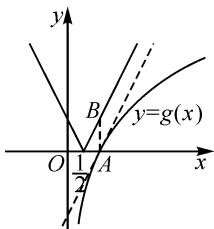

# 教学聚焦，“图”谋天下

● 杭州市塘栖中学 闫仕超

摘要: 在资源有限的情况下,我们应该聚焦整合资源,找准方向,作用于一个点.方向就是设计数学基本活动,引领学生理解数学本质.教学可以围绕“图”展开,只要抓住了作用点“图形”,帮助学生实现数学课程目标,学生定能“图”谋天下.

关键词: 聚焦; 图形; 备考; 教学

# 1 聚焦整合资源,找准方向

高考改革已进入深水区，对于高中教师只有认真研读“新课程、新教材、新高考”，才能引领学生“图”谋天下，取得更好的成绩。任正非讲：“我们只可能在针尖大的领域里领先美国公司，如果扩展到火柴头或小木棒这么大，就绝不可能实现这种超越。”显然他告诉我们一个道理，在资源有限的情况下，我们应该聚焦整合资源，找准方向，作用于一个点，才能有所突破。

# 1.1 研读课程标准

《普通高中数学课程标准(2017年版2020年修订)》中课程目标要求两通过一过程[1]，要完成课程目标，就要带领学生回归到数学课堂中，在数学课堂中让学生去落实教师精心设计的数学基本活动。数学基本活动所具有的多样性、过程性、实践性、发展性和主体性的特点必然能推动学生孕育素养、形成智慧、进行创新。显然也只有学生参与到数学基本活动中，才能获得必需的“四基四能”，才能发展数学六大核心素养，才能提高情感、态度和价值观。裴光亚说：“为了有效地进行教学就得把蜇伏在学生内心深处的愿望激发出来，就得把沉淀在学生生命世界中的经验激活。”所以在研读课程标准后可以找到我们的备考方向：精心设计数学基本活动。

# 1.2 研读高考蓝皮书《中国高考报告 2023》

在研读《中国高考报告 2023》后可以发现新高考的四大趋势:①落实立德树人,鲜明体现时代主题;②高考由“考知识”向“考能力”转变;③聚焦“关键能力”和“思维品质”的考查;④高考由“以纲定考”向“考教衔接”转变.在这些趋势下呈现出新高考的命题要求:无价值,不入题;无思维,不命题;无情境,不成题.因此我们可以很明确地把备考方向定为:无价值,不教学;无思维,不教学;无情境,不教学.

# 1.3 研读《高考调研会议纪要》

在《高考调研会议纪要》数学部分中共讨论了七个问题.但是七个问题中有四个问题的回复中,专家都强调回归教材,强调基础,理解本质,不盲目刷题.因此,我们的备考方向就是重视教材,从本质上理解数学,做有质量的题.

# 1.4 找准方向

根据《普通高中数学课程标准(2017年版2020年修订)》《中国高考报告2023》《高考调研会议纪要》三份资源,我们可以把备考方向整合为:设计有价值、有思维、有情境的数学基本活动,引领学生重视教材、落实活动,做高质量的题目,理解数学本质.

# 2 确定“图形”作用点

确立方向后,还需要找到作用点.笔者经研读2021—2023年新高考数学试卷有一个重大发现,六份试卷都有一个共同特点,即每套试卷22个题中有17个以上的题涉及图表.因此我们的备考就可以聚焦于“图”,教学就可以围绕“图”展开.只要抓住了这个作用点“图形”,我们怎么做都是正确的,都是有作用的,因为图形能给我们带来直观的感受.康德说:“人类的一切知识都是从直观开始,从那里进入到概念,而以理念结束.”徐利治也说:“直观能借助经验、观察、测试或类比联想产生对事物关系直接的感知与认识.”

在备考中我们以“图形”为抓手，围绕“识图、画图、用图”开展数学活动，争取达到课程标准中直观表现的三个水平，或达到李昌官所说的四个直观水平即水平一原型直观、水平二构图直观、水平三想象直观、水平四理性直观.

学生在参与教师精心设计的关于图形的数学活动中将形成一种思维方式——用图形解决问题.就像阿蒂亚所说:“几何并不只是数学的一个分支,而且是一种思维方式,它渗入数学的所有分支.”

学生在参与教师精心设计的关于图形的数学活动中知道图形是一种有用的工具。史宁中就非常善用这个工具，他说：“在大多数的情况下，数学的结果是看出来的，而不是证出来的。”英国数学家詹姆斯·约瑟夫·西尔维斯特认为图形是引路的工具，他说：“几何的先行分析只不过像一个仆人走在主人的前面一样，是为主人开路的。”

学生在参与教师精心设计的关于图形的数学活动中感受到图形方法是一种好玩、有趣、富有魅力、有用的学习方法和解决问题的方法。李昌官说：“它能有效地激发学生学习数学的兴趣，增强他们学好数学的信心，发展他们的思维能力，尤其是有助于他们学会学习数学、学会数学创造。”

# 3 “图”谋天下微专题

在备考中我们找到了发力点,找到了大有可为之处,那我们该怎么做?又该做些什么呢?可以做一些关于图形的微专题.

# (1)平面向量问题微专题

向量加法、减法的图形运算法则是三角形法则或平行四边形法则，所以对于平面向量问题都可以转化到图形中来求解.

例 1 （2022 年新高考Ⅱ卷第 4 题）已知向量 $a = (3, 4)$ , $b = (1, 0)$ , $c = a + tb$ , 若 $\langle a, c \rangle = \langle b, c \rangle$ , 则 t = ().

A.-6

B.-5

C.5

D.6

解法 1: 常规解法.

由题意, 得 $c=(3+t,4)$ .

由 $\cos\langle a,c\rangle=\cos\langle b,c\rangle$ , 得 $\frac{25+3t}{5|c|}=\frac{3+t}{|c|}$ .

解得 t=5.

故选：C.

解法 2: 图形解法.

作 $\overrightarrow{OA}=a$ ，作 $\overrightarrow{OB}=tb$ ，因为 $\langle a,c\rangle=\langle b,c\rangle$ ，则以OA，OB为邻边的平行四边形为菱形，所以 $|tb|=|a|=5$ 。

故选：C.

从这题中学生很容易体会到平面向量的运算的本质,它既有大小的运算又有方向的运算,采用图形解法,能很直观也很轻易地把问题解决掉.

# (2) 函数问题微专题

在平面直角坐标系中,函数自变量对应点的横坐标,因变量对应点的纵坐标,所以我们可以把函数问题转变为图形问题.

例 2 （2021 年新高考 I 卷第 15 题）函数 $f(x)=|2x-1|-2\ln x$ 的最小值为 \_\_\_\_.

解法 1: 常规解法.

由题设知, 函数 $f(x)$ 的定义域为 $(0, +\infty)$ .

当 $0 < x \leqslant \frac{1}{2}$ 时， $f(x) = 1 - 2x - 2\ln x$ ，此时 $f(x)$ 单调递减；

当 $\frac{1}{2} < x \leqslant 1$ 时， $f(x) = 2x - 1 - 2\ln x$ ，有 $f'(x) = 2 - \frac{2}{x} \leqslant 0$ ，此时 $f(x)$ 单调递减；

当 $x > 1$ 时， $f(x) = 2x - 1 - 2\ln x$ ，有 $f'(x) = 2 - \frac{2}{x} > 0$ ，此时 $f(x)$ 单调递增.

又 $f(x)$ 在各分段的界点处连续，则当 $0 < x \leqslant 1$ 时， $f(x)$ 单调递减，x > 1 时， $f(x)$ 单调递增.

故 $f(x) \geqslant f(1) = 1.$

故填答案:1.

解法 2: 图形解法.

把函数 $f(x)$ 看成两个函数 $h(x)=|2x-1|$ 和 $g(x)=2\ln x$ 的差，所以求函数 $f(x)$ 的最小值问题就转化为两个函数图象上的竖直距离 AB（如图 1）的最小值.

显然当点 A 为 $(1,0)$ 时，线段 AB 的最小值为 1.

故填答案:1.

text_image

y
B
y=g(x)
O 1/2 A x
A

图1

通过本题的研究,学生能很深刻地理解函数的本质,把复杂函数分拆成两个函数之差的形式,进而把原函数看成两个函数图象与直线 x=a 的两个交点之间的距离,即竖直距离的问题.这种图形解法定能激发学生对函数问题的深度兴趣,因为它不再是抽象的,不再是逻辑非常强的,对于数学素养不太好的学生也能有机会做对.

总之,我们在“无价值,不教学;无思维,不教学;无情境,不教学”理念下创设并落实“识图、画图、用图”数学活动,帮助学生实现数学课程目标,学生定能“图”谋天下.

# 参考文献：

[1]中华人民共和国教育部.普通高中数学课程标准(2017年版2020年修订)[S].北京:人民教育出版社,2020.Z