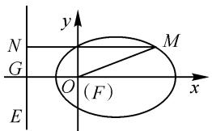
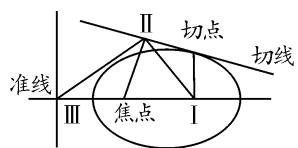
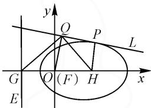
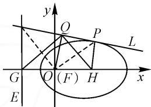
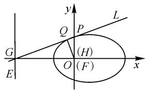
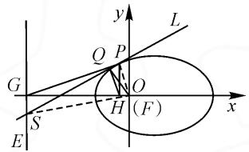
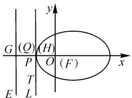

# 新发现的“三垂足定理”新的证明

# ● 华中师大一附中 朱仁发

文[1]遵循原始的发现过程,给出了笔者独立发现且命名为“三垂足定理”的分类证明,而今另辟蹊径,又找到定理新的证明,且对定理的表述有所改进.

先重温圆锥曲线的统一方程：

如图 1, 过点 M 作 $MN \perp$ 准线 EG 交于点 N, 设 F 为相应于准线的焦点, e 为离心率, 则 $M \in \{M \mid |FM| = e \mid MN|\}$ .

text_image

y
N
G
O (F)
x
M
E

图1

取过焦点 $F$ 且与准线垂

直的直线为 x 轴，点 $F(O)$ 为坐标原点，建立平面直角坐标系.

设点 M 的坐标为 $(x, y)$ ，则 $|OM| = \sqrt{x^{2} + y^{2}}$ 。设准线 EG 的方程为 x = -p，于是

$$
\sqrt {x ^ {2} + y ^ {2}} = e | x + p |.
$$

两边平方,化简得

$$
(1 - e ^ {2}) x ^ {2} + y ^ {2} - 2 p e ^ {2} x - p ^ {2} e ^ {2} = 0. \tag {①}
$$

三垂足定理:任取圆锥曲线上一点为切点作切线,过切点作焦点所在坐标轴的垂线得垂足Ⅰ,过焦点作切线的垂线得垂足Ⅱ,相应于焦点的准线与坐标轴的交点为垂足Ⅲ,则

(1)三个垂足以垂足Ⅱ为顶点张成直角；

(2)垂足Ⅱ到垂足Ⅰ、垂足Ⅲ、切点、焦点的距离成比例.

如图 2, 坐标系的建立如上所述.

text_image

II 切点
切线
准线
III 焦点 I

示意图

text_image

y
Q
P
L
G
O (F)
H
x
E

图2

任取圆锥曲线上的一点 P 作切线 PL，又作 $PH \perp x$ 轴于点 H（垂足Ⅰ），过焦点 F 作 $FQ \perp PL$ 于点 Q（垂足Ⅱ），准线 EG 交 x 轴于点 G（垂足Ⅲ）。求证：

(1) $\angle HQG=90^{\circ}$ ;   
(2) $|QH| : |QG| = |QP| : |QF|$ .

证明:设点 P 坐标为 $(x_{0},y_{0})$ ，对上述圆锥曲线方程①求导，得 $(1-e^{2})x+yy'-pe^{2}=0$ .

解得 $y'=\frac{pe^{2}-(1-e^{2})x}{y}$ .

于是，在点 $P(x_0, y_0)$ 处的切线 $PL$ 的斜率为 $k_{PL} = \frac{pe^2 - (1 - e^2)x_0}{y_0}$ ，所以切线 $PL$ 的方程为

$$
y - y _ {0} = \frac {p e ^ {2} - (1 - e ^ {2}) x _ {0}}{y _ {0}} (x - x _ {0}).
$$

整理，得

$$
\begin{array}{c} y _ {0} y = \left(p e ^ {2} - x _ {0} + e ^ {2} x _ {0}\right) x + \left(1 - e ^ {2}\right) x _ {0} ^ {2} + y _ {0} ^ {2} - \\ p e ^ {2} x _ {0}. \end{array} \tag {②}
$$

由点 $P$ 在圆锥曲线上，得 $(1 - e^2)x_0^2 + y_0^2 - 2pe^2x_0 - p^2e^2 = 0$ ，即

$$
(1 - e ^ {2}) x _ {0} ^ {2} + y _ {0} ^ {2} = 2 p e ^ {2} x _ {0} + p ^ {2} e ^ {2}. \tag {③}
$$

③代入②式,得切线方程为

$$
y _ {0} y = \left(p e ^ {2} - x _ {0} + e ^ {2} x _ {0}\right) x + p e ^ {2} x _ {0} + p ^ {2} e ^ {2}. \tag {④}
$$

将④式与准线方程联立,得

$$
\left\{ \begin{array}{l} x = - p, \\ y _ {0} y = \left(p e ^ {2} - x _ {0} + e ^ {2} x _ {0}\right) x + p e ^ {2} x _ {0} + p ^ {2} e ^ {2}. \end{array} \right.
$$

解得 $\left\{\begin{aligned}x&=-p,\\ y&=\frac{px_{0}}{y_{0}}.\end{aligned}\right.$

所以交点 S 的坐标为 $\left(-p, \frac{px_{0}}{y_{0}}\right)$ .

以下进行分类讨论：

(i) 当 $x_{0} > 0$ 时, 如图 3, 已知 $FQ \perp PL$ 于点 Q, 准线 $EG \perp x$ 轴于点 G.

已设 PQ 交 EG 于点 S，于是 $\angle SGF + \angle SQF = 180^{\circ}$ ，所以 G, S, Q, F 四点共圆，连接 $FS$ ，则 $\angle GQS = \angle GFS.$ 连接 $FP$ ，又 $PH\bot x$ 轴于点 $H$ ，则 $\angle PQF + \angle PHF = 180^{\circ}$ ，所以 $Q,P,H,F$ 四点共圆，则 $\angle HQF = \angle HPF.$

text_image

y
Q
P
L
G
O (F) H
x
E

图3

因为 $\tan \angle HPF = \frac{|FH|}{|PH|} = \frac{|x_0|}{|y_0|}$ 又 $\tan \angle GFS = \frac{|GS|}{|GF|} = \frac{\left|\frac{px_0}{y_0}\right|}{| - p|} = \frac{|x_0|}{|y_0|}$ ，且 $\angle HPF$ 与 $\angle GFS$ 均为锐

角，所以 $\angle HPF = \angle GFS.$

所以 $\angle HQF = \angle GQS$

所以 $\angle HQF + \angle FQG = \angle GQS + \angle FQG.$

所以 $\angle HQG = \angle FQS = 90^{\circ}$ ，结论(1)成立.

又由 Q, P, H, F 四点共圆，得 $\angle GHQ = \angle FPQ$ （同弧上的圆周角相等），于是 Rt△HQG ∽ Rt△PQF.

所以 $\left|QH\right|:\left|QP\right|=\left|QG\right|:\left|QF\right|$ .

故 $|QH| : |QG| = |QP| : |QF|$ .

（ii）当 $x_{0}=0$ 时，如图4，此时点 P 在 y 轴上，点 H 与点 F 重合.

将 $x_{0}=0$ 代入切线方程④, 得

text_image

y
L
Q
P
G
(H)
O
(F)
x
E

图4

$$
y _ {0} y = p e ^ {2} x + p ^ {2} e ^ {2}.
$$

所以点 $G(-p,0)$ 满足此方程，则切线过点 G.

由 $FQ \perp PL$ ，得 $\angle HQG = 90^{\circ}$ ，故结论(1)成立.

在 Rt△GFP 中, 根据射影定理, 可得 $\left|QF\right|^{2}=\left|QP\right|\cdot\left|QG\right|$ , 即 $\left|QH\right|:\left|QG\right|=\left|QP\right|:\left|QF\right|$ .

（iii）当 $x_{0}<0$ 时，如图 5, P 不是圆锥曲线的顶点.

由 $\angle SQF = \angle SGF = 90^{\circ}$ ，知 $S,G,Q,F$ 四点共圆.连接FS，有 $\angle GQS = \angle GFS.$

text_image

y
L
Q P
G O
H (F)
x
S
E

图5

又 $\angle PHF = \angle PQF = 90^{\circ}$ ，所以 $Q,P,F,H$ 四点共圆.连接 $FP$ ，则有 $\angle HQF = \angle HPF$

因为 $\tan\angle HPF=\frac{|FH|}{|PH|}=\frac{|x_{0}|}{|y_{0}|},\tan\angle GFS=$ $\frac{|GS|}{|FG|}=\frac{\left|0-\frac{px_{0}}{y_{0}}\right|}{|0-(-p)|}=\frac{|x_{0}|}{|y_{0}|}$ ，且 $\angle HPF$ 与 $\angle GFS$ 均为锐角，所以 $\angle HPF=\angle GFS$ .

所以 $\angle HQF = \angle GQS$

又 $\angle FQS=90^{\circ}$ ,则 $\angle HQG=90^{\circ}$ ,故结论(1)成立.

由 Q, P, F, H 四点共圆，得 $\angle GHQ = \angle FPQ$ （圆内接四边形的外角等于内对角）.

于是，Rt△HQG∽Rt△PQF.

所以 $\left|QH\right|:\left|QP\right|=\left|QG\right|:\left|QF\right|$ .

故 $|QH| : |QG| = |QP| : |QF|$ .

(iv) 若切点 P 是圆锥曲线的顶点, 如图 6, 则易知点 H, 点 Q 都与点 P 重合, 则 $\overrightarrow{QH} = 0$ .

因零向量的方向是任意的,即零向量可视为与任意一个非零向量共线，设点 T 在切线 PL 上，则零向量 $\overrightarrow{QH}$ 与非零向量 $\overrightarrow{PT}$ 共线，且 $\overrightarrow{QG} \perp \overrightarrow{PT}$ ，即 $\overrightarrow{QG} \perp \overrightarrow{QH}$ ，所以 $\angle HQG = 90^{\circ}$ ，故结论(1)成立.

又 $|QP|=|QH|=0$ ，且

text_image

G (Q) (H)
P O (F)
E L
x
y

图6

$|QF| \neq 0, |QG| \neq 0$ ，故欲证式(2)两边皆为零而依然成立.

上述定理的证明过程有一个鲜明的特征,那就是欧氏几何的综合法与笛卡儿的解析法渗透融合 $^{[2]}$ ,两种数学思想方法交互为用,相得益彰,相映成趣,同时,还有三角函数、导数的几何意义和向量的运用,从而使定理的证明臻于简洁、完美.

由于圆锥曲线是任意的,切点的选择也是任意的,故三垂足定理显示了它的普适性.仔细品味过后,还让人深切感受到:其普适性既深刻揭示了圆锥曲线统一的属性,又蕴含着数形结合的精巧美与和谐美.

发现新定理使我们得到如下启示:数学教师不仅是知识的传授者,也是数学宝库的探索者和发现者,试想,若中学和大学有万分之一的数学教师独自发现一个数学定理,则著名的钱学森之问的答案岂不就指日可待了吗?从单一角色到双重角色的转换,非常有利于教师在认知状态上贴近学生,避免有居高临下感的教师将学生的大脑当成装知识的容器.对于满怀好奇心的学生来说,任何未知的学问都极具探索意义和发现价值,当教师以这种创新的心理引导学生钻研时,强大的感染力与可贵的好奇心高度融合,使命感油然而生,学生的数学思维之花必将竞相绽放,在其潜意识里,一生的兴趣和追求或许已经构筑在数学的背景之下.

创新型人才的脱颖而出，有赖于一以贯之的发现思维能力的培养[3].教师在教学中从学生的实际出发，视教材为“发现读本”，精心设计并引导和激励学生发现、表述、探究数学问题，与学生一起分享发现的快乐，无疑是数学教学改革的一个突破口.这件事抓好了，诸如“题海战术”之类的教学现状就会有较大的改观.

# 参考文献：

[1]朱仁发.圆锥曲线的一个新发现——三垂足定理[J].中学数学,2014(9):67-68.  
[2]朱仁发.渗透数学思想 促进融会贯通——解析几何复习之我见[J].数学通讯(武汉),1993(11):18-21.  
[3]朱仁发.试谈发现思维能力的培养[J].中学数学,1992(11):5-6.Z