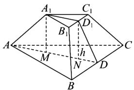
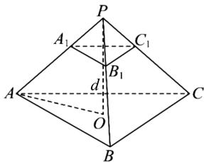
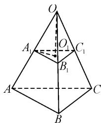

# 棱台场景创设,线面角求解

# 江苏省常熟市浒浦高级中学 刘健玲

摘要:立体几何中的空间角是历年高考试卷中的常客之一,备受高考命题者所垂青,成为新高考数学试卷中的一个基本考点.结合一道高考真题,以棱台场景创设,通过立体几何中的线面角的设置与求解,从不同数学思维角度切入,结合不同的数学方法来破解,总结规律,有效指导数学学习与教学.

关键词: 正三棱台; 体积; 线面角; 正切

立体几何中的空间角(异面直线所成的角、线面角、二面角等)，可以比较集中且有效地考查学生的空间想象能力、逻辑推理能力以及数学运算能力与核心素养等，是历年高考试卷中的常客，备受高考命题者垂青。特别在新课标、新教材、新高考的“三新”背景下，基于台体的综合应用问题，当然也包括空间角问题，更是其中考查的一个重要场景。由于背景创新新颖，设问角度丰富多彩，因此给问题的切入与求解创设了更加丰富的空间。本文中就2024年高考数学新高考Ⅱ卷第7题的解法进行探究。

# 1 真题呈现

高考真题 已知正三棱台 $ABC-A_{1}B_{1}C_{1}$ 的体积为 $\frac{52}{3}, AB=6, A_{1}B_{1}=2$ ，则 $A_{1}A$ 与平面 ABC 所成角的正切值为（）.

A. $\frac{1}{2}$

B.1

C.2

D.3

此题以正三棱台为问题背景,结合正三棱台的上、下底面的边长及其体积这些相关数据信息的给出,求解相应的侧棱与底面所对应的线面角的正切值问题.依托正三棱台的立体几何背景,合理通过空间几何体的结构特征与几何性质的应用,巧妙转化,空间想象,借助直接法思维、补形法思维、转化法思维等,进而结合线面角的定义来分析与求解,实现问题的求解与突破.

# 2 真题破解

解法 1: 直接法.

如图 1 所示, 分别取 $BC, B_{1}C_{1}$ 的中点 $D, D_{1}$ , 则

$$
A D = 3 \sqrt {3}, A _ {1} D _ {1} = \sqrt {3},
$$

$$
S _ {\triangle A B C} = \frac {1}{2} \times 6 \times 3 \sqrt {3} = 9 \sqrt {3},
$$

$$
S _ {\triangle A _ {1} B _ {1} C _ {1}} = \frac {1}{2} \times 2 \times \sqrt {3} = \sqrt {3}.
$$

text_image

A₁
C₁
B₁
D₁
A
M
h
N
D
B
C

图1

设正三棱台 $ABC-A_{1}B_{1}C_{1}$ 的高为 h，则其体积为 $V_{ABC-A_{1}B_{1}C_{1}}=\frac{1}{3}(9\sqrt{3}+\sqrt{3}+\sqrt{9\sqrt{3}\times\sqrt{3}})h=\frac{52}{3}$ ，解得 $h=\frac{4\sqrt{3}}{3}$ .

分别过 $A_{1}, D_{1}$ 作底面 ABC 的垂线，垂足分别为 M, N. 设 AM = x，则

$$
A A _ {1} = \sqrt {A M ^ {2} + A _ {1} M ^ {2}} = \sqrt {x ^ {2} + \frac {1 6}{3}},
$$

$$
D N = A D - A M - M N = 2 \sqrt {3} - x.
$$

易得 $DD_{1}=\sqrt{DN^{2}+D_{1}N^{2}}=\sqrt{(2\sqrt{3}-x)^{2}+\frac{16}{3}}$ 结合等腰梯形 $BCC_{1}B_{1}$ ，可得 $BB_{1}^{2}=\left(\frac{6-2}{2}\right)^{2}+DD_{1}^{2}$ ，即 $x^{2}+\frac{16}{3}=4+(2\sqrt{3}-x)^{2}+\frac{16}{3}$ ，解得 $x=\frac{4\sqrt{3}}{3}$ . 所以 $A_{1}A$ 与平面 ABC 所成角的正切值为 $\tan\angle A_{1}AD=\frac{A_{1}M}{AM}=1$ . 故选：B.

点评:借助直接法思维,通过正三棱台的体积公式来求解其高,结合空间几何体的结构特征,并根据线面角的定义来分析与求解.直接法思维的根本就是依托台体的结构特征,合理构建对应的辅助线,结合平面图形的基本性质与立体图形的基本性质等,利用相关数据信息来计算并求解对应元素的数值,为进一步分析与求解创造条件.

解法 2: 补形法.

依题,如图2所示,将正三棱台 $ABC-A_{1}B_{1}C_{1}$ 补成正三棱锥P-ABC,则 $A_{1}A$ 与平面ABC所成角即为PA与平面ABC所成角.因为 $\frac{PA_{1}}{PA}=\frac{A_{1}B_{1}}{AB}=\frac{1}{3}$ ,则$\frac{V_{P-A_{1}B_{1}C_{1}}}{V_{P-ABC}}=\frac{1}{27},V_{ABC-A_{1}B_{1}C_{1}}=\frac{26}{27}V_{P-ABC}=\frac{52}{3}$ ，所以 $V_{P-ABC}=$ 18.设正三棱锥 P-ABC 的高为 d，则 $V_{P-ABC}=\frac{1}{3}d\times\left(\frac{1}{2}\times6\times6\times\frac{\sqrt{3}}{2}\right)=18$ ，解得 $d=2\sqrt{3}$ . 取底面 ABC 的中心为 O，则 $PO \perp$ 底面 ABC，且 $AO=2\sqrt{3}$ .

text_image

P
A₁ C₁
B₁
d'
A O C
B

图2

余略.

点评:借助补形法思维,将对应的三棱台问题转化为三棱锥问题,使得问题更加熟知,操作起来更加方便.通过边长的比与体积比例关系的转化,利用补形后正三棱锥的高来求解.补形法思维的根本就是回归空间几何体的本质,利用逆向思维来分析与处理一些台体与锥体之间的结构特征与几何性质问题.

解法 3: 转化法.

设正三棱台 $ABC-A_{1}B_{1}C_{1}$ 的高为 h，三条侧棱延长后交点一点 O，如图 3 所示.

由 $AB=3A_{1}B_{1}$ ，可得 O 到上底面 $A_{1}B_{1}C_{1}$ 的距离为 $\frac{1}{2}h$ ，O 到下底面 ABC 的距离为 $\frac{3}{2}h$ 。所以 $A_{1}A$ 与平面 ABC 所成角即为 $OA_{1}$ 与平面 $A_{1}B_{1}C_{1}$ 所成角 $\angle OA_{1}O_{1}$ ，其中 $O_{1}$ 为正三角形 $A_{1}B_{1}C_{1}$ 的中心。

text_image

O
A₁ O₁ C₁
B₁
A B C

图 3

余略.

点评:借助转化法思维,将对应的三棱台问题转化为一个与之相关的三棱锥问题,实际与补形法思维基本类似,从而实现问题的转化与应用.转化法思维的根本就是利用空间几何体的结构特征与几何性质,合理进行边、角等信息的化与应用,给问题的分析与求解创造更加简单的应用,使得问题的分析与求解更加简捷易操作.

# 3 变式拓展

依托棱台的场景创设,结合对应数据信息的给出,保留原高考真题的问题背景,将空间几何体中的线面夹角问题变化为求解相应的二面角的角问题,得到如下对应的变式问题.

变式 已知正三棱台 $ABC-A_{1}B_{1}C_{1}$ 的体积为 $\frac{52}{3}, AB=6, A_{1}B_{1}=2$ ，则正三棱台的侧面与平面 ABC 所成角的正切值为 \_\_\_\_.

解析:以上部分同原高考真题中的方法1,解得 $h=\frac{4\sqrt{3}}{3},x=\frac{4\sqrt{3}}{3}$ ，则知 $DN=2\sqrt{3}-x=\frac{2\sqrt{3}}{3}$ .结合正三棱台的结构特征，可知正三棱台的侧面 $B_{1}BCC_{1}$ 与平面 ABC 所成角的二面角的平面角即为 $\angle D_{1}DN$ ,

则 $\tan\angle D_{1}DN=\frac{D_{1}N}{DN}=\frac{h}{\frac{2\sqrt{3}}{3}}=\frac{\frac{4\sqrt{3}}{3}}{\frac{2\sqrt{3}}{3}}=2.$

故填答案:2.

除了以上同原高考真题中的直接法,还可以借助补形法或转化法等其他思维方法来解决该变式问题,这里不多加以展开.

# 4 教学启示

# 4.1 方法指导

在立体几何中的空间几何体知识中,柱体、锥体、台体之间的关系是辩证统一的,特别是台体必须是由相应的锥体截得的.回归问题本质,因此台体的侧棱(或母线)延长之后交于一点,在解题时“台体还原为锥体”的补形法思维,是解决台体及其应用问题的常用方法之一.

同时，对于柱体、锥体、台体的侧面积、表面积和体积公式的计算与综合应用问题，要求准确记忆这些相应计算公式并加以灵活应用。特别，在教学与学习过程中，要注意体会这几类空间几何体所对应的计算公式之间的相互转化，以及与之对应的基本数学思想，并理解公式间的联系，加以合理综合与应用。

# 4.2 教学建议

在课堂教学与复习备考过程中,重视数学基础知识和“通性通法”的理解与掌握,重基础,重根本.以上涉及台体(棱台或圆台)的体积计算与应用问题,特别是涉及台体的体积计算公式,已经连续四年在新高考试卷中得以体现.例如:2021年高考数学新高考Ⅱ卷第5题基于正四棱台背景下的体积问题;2022年高考数学新高考Ⅰ卷第4题基于南水北调工程背景下的棱台的体积问题,新高考Ⅱ卷第7题基于正三棱台背景下的外接球的表面积问题;2023年高考数学新高考Ⅰ卷第14题基于正四棱台背景下的体积问题,新高考Ⅱ卷第14题基于正四棱台背景下的体积问题;2024年高考数学新高考Ⅱ卷第7题基于正三棱台背景下的线面角问题.这些都以看似“冷门”知识点来连续考查.

正是基于以上高考命题的信息,从涉及台体(棱台或圆台)的体积计算与应用问题这个点入手,可以由此及彼,推广到其他数学基础知识点,其实质正是通过对数学基础知识连续多次的深化考查,引导教学培养学生全面掌握数学主干知识、提升数学基本能力,灵活地整合知识解决问题. Z