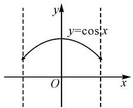

# 深挖命题内涵,多解变式应用

# ● 江苏省南京市建邺高级中学 姜 辣

摘要:数学解题不能只停留在问题解答上,合理挖掘命题的本质内涵,巧妙进行“一题多解”“一题多变”等,给解题拓展更加宽广的空间.本文中借助一道高考真题,结合两个含参的函数所对应曲线的交点个数情况,合理挖掘内涵,巧妙创新应用,归纳总结规律与性质,指导数学教学与复习备考.

关键词: 函数; 曲线; 交点; 偶函数; 数形结合

分析与解决数学问题的本质,就是合理探究问题的内涵与实质,化“生”为“熟”,巧妙变换,可以给问题的切入与应用创造更多的机会;同时结合问题的恒等变换,也为问题的多解分析提供更加丰富的数学解题思路,以及解题的技巧方法;在此基础上,剖析问题背景与本质属性,给问题的变式与拓展开拓更加宽广的空间.其实,这也是高中数学解题教学与学习中师生共同追求的良好习惯与优良品质.本文中结合2024年一道高考题,深挖命题内涵,多解变式应用.

# 1 真题呈现

高考真题（2024年高考数学新高考Ⅱ卷·6）设函数 $f(x) = a(x + 1)^2 - 1$ ， $g(x) = \cos x + 2ax$ （ $a$ 为常数），当 $x \in (-1, 1)$ 时，曲线 $y = f(x)$ 与 $y = g(x)$ 恰有一个交点，则 $a = (\quad)$ .

A.-1 B. $\frac{1}{2}$ C.1 D.2

此题以两个含参的函数为问题场景,结合自变量取值限制条件下的两曲线的交点情况,进而来确定参数的值.

借助两个函数所对应曲线的位置情况,可以合理变换函数的关系式,也可以化函数为方程,还可以化函数为图象等,这些都是切入问题的基本点,也是解决问题的思维方式,为问题的突破与求解创造更多的思维空间.

# 2 真题破解

解法 1: 分拆法.

依题，令 $f(x) = g(x)$ ，即 $a(x + 1)^2 - 1 = \cos x + 2ax$ ，可得 $ax^2 + a - 1 = \cos x$ .

令函数 $F(x) = ax^{2} + a - 1, G(x) = \cos x$ ，那么原题等价于“当 $x \in (-1, 1)$ 时，曲线 $y = F(x)$ 与 $y = G(x)$ 恰有一个交点”.

注意到函数 $F(x), G(x)$ 均为偶函数，可知该交点只能在 y 轴上, 可得 $F(0)=G(0)$ , 即 a-1=1, 解得 a=2.

若 a=2，令 $F(x)=G(x)$ ，可得 $2x^{2}+1-\cos x=0$ 。

由 $x \in (-1,1)$ ，得 $2x^{2} \geqslant 0, 1 - \cos x \geqslant 0$ ，当且仅当 x = 0 时等号成立，可得 $2x^{2} + 1 - \cos x \geqslant 0$ ，当且仅当 x = 0 时等号成立.

所以方程 $2x^{2} + 1 - \cos x = 0$ 有且仅有一个实根0，即曲线 $y = F(x)$ 与 $y = G(x)$ 恰有一个交点，所以 $a = 2$ 符合题意.

综上所述，a=2。

故选答案:D.

点评:根据题设条件构建两个函数相等的关系,合理进行归类分拆,借助两条曲线间的位置关系加以等价转化,利用偶函数的性质实现突破.解题过程中,随着问题的恒等转化,由陌生到熟知,由无法下手到水到渠成,这都是解题的基本过程,需要掌握相关的基础知识与基本技能.

解法 2: 整体法.

依题,令函数 $h(x)=f(x)-g(x)=a(x+1)^{2}-1-\cos x-2ax=ax^{2}+a-1-\cos x,x\in(-1,1)$ ，那么原题意等价于函数 $h(x)$ 有且仅有一个零点.

因为 $h(-x)=a(-x)^{2}+a-1-\cos(-x)=ax^{2}+a-1-\cos x=h(x)$ ，所以 $h(x)$ 为偶函数，根据偶函数的对称性可知， $h(x)$ 的零点只能为 0，即 $h(0)=a-1-1=0$ ，解得 a=2。

若 a=2，则 $h(x)=2x^{2}+1-\cos x, x\in(-1,1)$ .

由 $x \in (-1,1)$ ，得 $2x^{2} \geqslant 0, 1 - \cos x \geqslant 0$ ，当且仅当 x = 0 时等号成立，可得 $h(x) \geqslant 0$ ，当且仅当 x = 0 时等号成立，即 $h(x)$ 有且仅有一个零点 0，所以 a = 2 符合题意。

综上所述，a=2。

故选答案:D.

点评:根据题设条件中两个函数所对应曲线之间的关系,通过整体法的应用,构建两函数之差所对应的函数关系式,进而将问题转化为新函数的零点个数问题,为进一步的分析与求解创造条件.利用整体法处理两个函数、或两条曲线等问题时,经常可以通过对应关系式进行合理的数学运算,巧妙合二为一,为问题的突破与切入打下基础.

解法 3: 参变分离法.

依题，令 $f(x) = g(x)$ ，即 $a(x + 1)^2 - 1 = \cos x + 2ax$ ，可得 $a = \frac{1 + \cos x}{1 + x^2}$ .

令函数 $h(x) = \frac{1 + \cos x}{1 + x^2}, x \in (-1, 1)$ ，因为 $h(-x) = \frac{1 + \cos(-x)}{1 + (-x)^2} = \frac{1 + \cos x}{1 + x^2} = h(x)$ ，所以 $h(x)$ 为偶函数。

而当 $x \in (-1, 1)$ 时，曲线 $y = f(x)$ 与 $y = g(x)$ 恰有一个交点等价于直线 $y = a$ 与函数 $h(x)$ 的图象在 $x = 0$ 处相切.

将 x=0 代入, 可得 $a=h(0)=\frac{1+\cos 0}{1+0}=2$ .

故选答案:D.

点评:根据题设条件构建两个函数相等的关系,合理进行参变分离,这是解决含参的函数、方程、不等式等综合应用问题中最为常用的一种技巧方法.抓住条件进行合理的参变分离,进一步深入研究对应函数的关系式,结合函数的基本性质来分析与求解,为解决参数的求值、参数的最值(或取值范围)等问题创造条件.

解法 4: 数形结合法.

令 $f(x)=g(x)$ ，即 $a(x+1)^{2}-1=\cos x+2ax$ ，可得 $ax^{2}+a-1=\cos x$ .

如图 1, 作出函数 $y = \cos x$ , $x \in (-1, 1)$ 的图象.

设函数 $h(x)=ax^{2}+a-1, x\in(-1,1)$ .

当 a = -1 时， $h(x)_{\max} = h(0) = -2$ ，此时函数 $h(x)$ 的图象与图中的图象没有交点；

text_image

y
y=cos x
O
x

图 1

当 $a=\frac{1}{2}$ 时， $h(x)_{\max}=h(1)=0$ ，此时函数 $h(x)$ 的图象与图中的图象没有交点；

当 a=1 时， $h(x)_{\max}=h(1)=1$ ，结合对称性，此时函数 $h(x)$ 的图象与图中的图象有两个交点.

排除以上三个选项, 只能是选项 D 正确, 其实, 当 a=2 时, $h(x)_{\min}=h(0)=1$ , 此时函数 $h(x)$ 的图象与图中的图象有一个交点.

故选答案:D.

点评:根据题设条件构建两个函数相等的关系,合理分拆函数,转化为一个熟知的余弦函数与一个含参的二次(或一次)函数,为数形结合直观分析创造条件.依托选项中具体数值的信息,分类讨论,也是解决问题中非常不错的一种技巧方法.合理数形结合直观处理,巧妙排除实现问题突破.

# 3 变式拓展

基于原高考真题的分析与求解,合理深入探究与拓展,剖析问题的本质与内涵,给问题的进一步深度学习创造条件,得到以下相应的变式问题.

变式 1 设函数 $f(x)=a(x+1)^{2}-1$ , $g(x)=\cos x+2ax$ (a 为正实数), 若曲线 $y=f(x)$ 与 $y=g(x)$ 恰有一个交点, 则 a= \_\_\_\_.

答案:2.

变式 2 设函数 $f(x)=a(x+1)^{2}-1$ , $g(x)=\cos x+2ax$ (a 为正实数), 若曲线 $y=f(x)$ 与 $y=g(x)$ 恰有两个交点, 则 a 的取值范围为 \_\_\_\_.

答案:(0,2).

变式 3 设函数 $f(x)=a(x+1)^{2}-1$ , $g(x)=\cos x+2ax$ (a 为正实数), 若曲线 $y=f(x)$ 与 $y=g(x)$ 没有交点, 则 a 的取值范围为 \_\_\_\_.

答案:(2,+∞).

以上三个变式的解析过程这里不多加展开,可以参照原高考真题,借助参数为正实数进一步优化,数形结合来突破与求解.

# 4 教学启示

在实际数学解题与综合应用时,基于具体问题的分析与求解,只是解题教学与学习的一个基本起步.若只停留在这个环节,收益比比较少,创新意识与创新应用能力得不到很好的提升,只是停留在“刷题”的表层.

而基于数学问题的深入分析与挖掘,依托数学“四基”知识,合理借助“一题多解”来开拓解题思维,发散数学思维,进而合理深挖问题的内涵与实质,利用命题背景挖掘内容本质,实现“多题归一”,合理归类与综合,从而合理借助“一题多变”深入拓展应用,形成“解一题,通一片”的良好解题效果.

在实际数学解题与综合应用中,只有深入问题进行合理的探讨与研究,不停留在解题的表面,往往都可以实现数学解题的最优效益,这也是有效落实学生的数学“四基”知识,提升数学“四能”技巧,优化数学解题习惯,提高数学优良品质以及培养数学核心素养等.Z