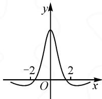

# 特殊值法巧用,高考真题妙解

# 江苏省无锡市洛社高级中学 胡雪东

特殊值法思维是解决数学问题中最为特殊的一种“巧技妙法”，是解决问题的“通性通法”的升华与提升。特别，在历年高考数学试卷的一些客观题的解答中，借助特殊值（不同场景，对特殊值有不同的类型变化）的选取，巧妙利用特殊值法，可以非常简捷地处理一些相关问题，真正达到“小题小做”“小题巧做”“小题快做”等良好解题效益，倍受师生喜欢与追求。本文中结合2023年高考数学真题，就一些客观题中特殊值法的合理选用与巧妙应用加以实例剖析。

# 1 函数图象的应用

例 1 函数 $f(x)$ 的图象如图 1 所示, 则 $f(x)$ 的解析式可能为().

A. $\frac{5(e^{x}-e^{-x})}{x^{2}+2}$

B. $\frac{5\sin x}{x^{2}+1}$

C. $\frac{5(e^{x}+e^{-x})}{x^{2}+2}$

D. $\frac{5\cos x}{x^{2}+1}$

分析:根据函数图象的变化情况,利用函数图象与坐标轴的交点等,通过特殊值的选取,借助对应

line

| x | y |
|---|---|
| -2 | 0 |
| 0 | Peak |
| 2 | 0 |

图1

图象中相应函数值的正负,排除相应不满足条件的选项,达到确定正确选项的目的.这比常规思维中利用函数的奇偶性及其应用来分析与判断更加简单,以“形”代“数”,处理起来方便快捷.

解析:依题中的函数图象,选取特殊值 x=0, 可得 $f(0)>0$ , 可以排除选项 A,B;

再选取特殊值 x=2（或 x=-2），可得 $f(2)<0$ （或 $f(-2)<0$ ），可以排除选项 C.

故选择答案:D.

点评:利用特殊值法解决函数的图象与性质问题时,要注重特殊值法与对应函数图象变化趋势的联系,深入体会特殊思维与一般思维的化归与转化,以及数学中有限与无限的思想方法等,从而形成解题思维与应用技巧.

# 2 参数值的确定

例 2 若 $f(x)=(x+a)\ln\frac{2x-1}{2x+1}$ 为偶函数，则 $a=(\quad)$ .

A.-1

B.0

C. $\frac{1}{2}$

D.1

分析:根据含参函数的奇偶性,在确定其定义域

的情况下,通过关于坐标原点对称的一组特殊值的选取,结合函数的奇偶性构建相应的特殊关系式,利用方程的求解来确定相应的参数值,是应用特殊值法时的一种常见模式.这比常规思维中利用偶函数的定义来分析与求解更加直接,数学运算更加简化.

解析:依题知 $\frac{2x-1}{2x+1}>0$ , 解得 $x<-\frac{1}{2}$ 或 $x>\frac{1}{2}$ ，则函数 $f(x)$ 的定义域为 $\left\{x\mid x<-\frac{1}{2},\text{或 }x>\frac{1}{2}\right\}$ ，其定义域关于坐标原点对称.

若 $f(x)=(x+a)\ln\frac{2x-1}{2x+1}$ 为偶函数，取特殊值，可知 $f(1)=f(-1)$ ，有 $(1+a)\ln\frac{1}{3}=(-1+a)\ln3$ ，即 $-(1+a)\ln3=(-1+a)\ln3$ ，则有 $-(1+a)=-1+a$ 恒成立，解得 a=0。故选择答案：B.

点评:巧妙利用特殊值法,借助函数奇偶性的定义来构建关系式,为特殊值法处理问题提供条件.从特殊思维入手,以特殊情况下满足的条件回归到一般情况中去,实现特殊到一般的转化与应用,符合辩证唯物主义思想,是解决一些相关问题中经常用到的一种思维方式.

# 3 取值范围的求解

例 3 设函数 $f(x)=2^{x(x-a)}$ 在区间 $(0,1)$ 单调递减，则 a 的取值范围是().

A. $(-∞,-2]$

B. $\left[-2,0\right)$

C.(0,2]

D. $[2,+\infty)$

分析:根据题设中函数在给定区间上的单调性,得到区间端点所对应的函数值之间的关系,确定参数的取值范围,是问题的一种特殊情况,也为验证排除法的应用提供一个直接的依据.

解析:依题意,函数 $f(x)=2^{x(x-a)}$ 在区间 $(0,1)$ 单调递减,则必满足 $f(0)>f(1)$ ,即 $2^{0}>2^{1-a}$ ,则 0>1-a,解得 a>1.

对比各选项加以验证,只有选项 D 满足.

故选择答案:D.

点评:参数取值范围的求解,可以借助特殊值法的应用,以特殊场景来验证并排除一些不满足条件的选项,给正确快捷判断与应用奠定基础,成为解决此类问题中一种比较特殊的技巧方法,也是辩证统一思维的一种具体形式,在一些相关选择题的应用中有奇效.特殊值法可以优化逻辑推理,减少数学运算,做到“小题小做”或“小题巧做”，快速实现问题的破解。

# 4 代数式的构建

例 4 已知向量 $a=(1,1)$ , $b=(1,-1)$ ，若 $(a+\lambda b)\perp(a+\mu b)$ ，则（）.

$$
\mathrm{A.} \lambda + \mu = 1
$$

$$
\mathrm{B}. \lambda + \mu = - 1
$$

$$
\mathrm{C}. \lambda \mu = 1
$$

$$
\mathrm{D}. \lambda \mu = - 1
$$

分析:根据平面向量两个含参的线性关系的变化情况,借助特殊值法思维,以特殊值来赋值其中的一个参数,进而求解其他相关的参数值,再结合选项加以合理排除与应用.这比常规思维中平面向量数量积的坐标运算更加优化,处理起来工作量相对减少.

解析:选取特殊值 $\mu=1$ , 依题知 $a+\lambda b=(1,1)+\lambda(1,-1)=(1+\lambda,1-\lambda)$ , $a+\mu b=a+b=(1,1)+(1,-1)=(2,0)$ .

由 $(a+\lambda b)\perp(a+\mu b)$ ，得 $(a+\lambda b)\cdot(a+b)=0$ ，
即 $(1+\lambda,1-\lambda)\cdot(2,0)=2+2\lambda=0$ ，解得 $\lambda=-1$ .

此时 $\lambda + \mu = 0, \lambda \mu = -1$ ，结合题目中的选项，故选择答案：D.

点评: 多变量代数式的定值问题, 其中一个变量取值的变化会导致另一个变量(或多个变量)取值的变化, 可以为特殊值的应用奠定基础. 当然, 随着特殊值选取的变化, 解题过程也随之改变, 但结果不会有改变, 这也是利用特殊思维解决选择题中比较常见的思维方式与理论基础.

# 5 向量模的求解

例 5 已知向量 a, b 满足 $\left|a - b\right| = \sqrt{3}$ , $\left|a + b\right| = \left|2a - b\right|$ , 则 $\left|b\right| =$ \_\_\_\_.

分析:抓住题设条件中平面向量之间的线性关系,根据条件中关系式的特殊结构形式,以特殊的零向量、特殊的数乘向量关系等代入满足的关系式,借此通过特殊值的应用来巧妙解决问题.这比常规思维中平面向量的模运算、数量积运算以及坐标运算等更加简化,处理起来更加优化.

解析 1: 特殊值法 1.

依题意 $|a+b|=|2a-b|$ ，显然当a=0这个特殊向量时，有 $|0+b|=|0-b|$ ，该关系式成立.

此时 $|\pmb{a} - \pmb{b}| = |- \pmb{b}| = |\pmb{b}| = \sqrt{3}$ . 故填答案: $\sqrt{3}$ .

解析 2: 特殊值法 2.

依题意 $|a+b|=|2a-b|$ ，显然当满足a=2b这个特殊关系式时，有 $|2b+b|=|4b-b|=3|b|$ ，该关系式成立.

此时 $|a-b|=|2b-b|=|b|=\sqrt{3}$ . 故填答案: $\sqrt{3}$ .

点评:这里选取的特殊向量及特殊关系式具有一定的目标性,是用两个平面向量的模之间的关系来构建,可以从不同特殊向量的选取来达到目的.这也对特殊值法的应用提出了一个要求,即不能盲目地选取特殊值,而是要根据题设条件,借助关系式的结构特征、图象的几何性质、变量的变化规律等加以合理选取.

# 6 探究判断

例 6 已知 $a \in R$ ，记 $y = \sin x$ 在 $[a, 2a]$ 的最小值为 $s_{a}$ ，在 $[2a, 3a]$ 的最小值为 $t_{a}$ ，则下列情况不可能的是（）.

$$
\mathrm{A.} s _ {a} > 0, t _ {a} > 0
$$

$$
\mathrm{B}. s _ {a} <   0, t _ {a} <   0
$$

$$
\mathrm{C.} s _ {a} > 0, t _ {a} <   0
$$

$$
\mathrm{D}. s _ {a} <   0, t _ {a} > 0
$$

分析:依据题设中含参区间及其对应的最小值,要探究判断各选项中最小值的正负取值情况,直接研究比较困难,没有头绪,可通过选取参数 a 的特殊值,确定对应的区间,结合正弦函数 $y=\sin x$ 的图象来确定函数的最值点情况,达到探究判断的目的.

解析:依题目给定的区间知 a>0, 而区间 $[a,2a]$ 与区间 $[2a,3a]$ 相邻, 且区间长度相同.

取特殊值 $a=\frac{\pi}{6}$ ，则区间 $[a,2a]=\left[\frac{\pi}{6},\frac{\pi}{3}\right]$ ，区间 $[2a,3a]=\left[\frac{\pi}{3},\frac{\pi}{2}\right]$ ，结合正弦函数 $y=\sin x$ 的图象，可知 $s_{a}>0,t_{a}>0$ ，故选项 A 可能；

取特殊值 $a = \frac{5\pi}{12}$ ，则区间 $[a, 2a] = \left[\frac{5\pi}{12}, \frac{5\pi}{6}\right]$ ，区间 $[2a, 3a] = \left[\frac{5\pi}{6}, \frac{5\pi}{4}\right]$ ，结合正弦函数 $y = \sin x$ 的图象，可知 $s_a > 0, t_a < 0$ ，故选项C可能；

取特殊值 $a=\frac{7\pi}{6}$ ，则区间 $[a,2a]=\left[\frac{7\pi}{6},\frac{7\pi}{3}\right]$ ，区间 $[2a,3a]=\left[\frac{7\pi}{3},\frac{7\pi}{2}\right]$ ，结合正弦函数 $y=\sin x$ 的图象，可知 $s_{a}<0,t_{a}<0$ ，故选项 B 可能.

综合以上特殊值分析, 可知不可能的是 $s_{a}<0$ , $t_{a}>0$ . 故选择答案: D.

点评: 解决此类探究判断或开放创新应用问题时, 特殊值法也是非常不错的一种技巧方法. 利用特殊值法的应用, 借助举例来确定不可能的情况, 回避复杂的逻辑推理与数学运算.

利用特殊值法解决一些具有确定结论的选择题或填空题时，借助特殊值(不同问题场景下，对特殊值的类型形式有不同的变化，如涉及特殊点、特殊函数、特殊向量、特殊图形、特殊角、特殊数列等)的应用，以特殊思维代替一般思维，又回归到一般情况，符合辩证唯物主义思想.

巧妙利用特殊值法破解数学客观题,有其特殊的优势与美妙的体验,是数学“四基”落实并上升到一定程度的特殊“产物”,是特殊思维与一般思维的转化与升华,在一定程度上可以简化繁杂的逻辑推理与复杂的数学运算等,合理降低数学知识的复杂层次,巧妙弱化数学基础的知识难度,全面强化数学思想与技巧方法,从而优化数学解题过程,提升数学解题效益,节省宝贵考试时间. Z