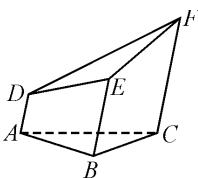
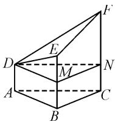

# 特殊思维巧应用,高考真题妙解答

# 山东省东营市胜利第一中学 聂景玺

摘要: 特殊思维与方法是解决数学问题“通性通法”的升华与提升, 成为快速简捷处理数学客观题的一种最为有效且灵活的基本思维方式. 结合 2024 年高考真题中的几个实例, 借助特殊思维与方法的巧妙应用, 从不同知识点与应用场面加以展开, 优化过程提升效益, 总结特殊思维与方法的解题技巧与规律, 指导高考数学的复习备考与优化解题.

关键词: 高考数学; 特殊思维; 函数; 数列

特殊思维与方法,是解决数学问题中最具特色的一种“巧技妙法”,是解决问题的“通性通法”的升华与提升.特别地,在历年高考数学试卷的一些相应客观题的解答中,经常可以借助特殊思维与方法(依托不同应用场景,对特殊思维可以有不同的类型与变化形式),巧妙利用特殊元素(数值、数列、点、向量、图形等)的选取与应用,更加简捷灵活地处理一些相关问题,真正达到“小题小做”“小题巧做”“小题快做”等良好解题效益,备受师生喜欢与追求.本文中结合2024年高考数学真题,就一些客观题中特殊思维与方法的合理选用与巧妙应用加以实例剖析.

# 1 函数或不等式问题中的特殊值

在函数或不等式应用问题中,经常借助特殊数值的选取与应用,合理确定函数的取值、函数的图象、不等式的关系等,给问题的突破与求解创造条件,更加简捷有效地处理相关的函数或不等式问题.

例 1 （2024 年高考数学北京卷·9）已知 $(x_{1}, y_{1})$ ， $(x_{2}, y_{2})$ 是函数 $y = 2^{x}$ 图象上不同的两点，则下列正确的是（）.

A. $\log_{2}\frac{y_{1}+y_{2}}{2}>\frac{x_{1}+x_{2}}{2}$   
B. $\log_{2}\frac{y_{1}+y_{2}}{2}<\frac{x_{1}+x_{2}}{2}$   
C. $\log_{2}\frac{y_{1}+y_{2}}{2}>x_{1}+x_{2}$   
D. $\log_2\frac{y_1 + y_2}{2} < x_1 + x_2$

分析: 回归函数与不等式问题的本质与内涵, 由一般到特殊, 利用对应函数的两个特殊数值的选取与应用, 以特殊性来解决一般性, 是解决此类答案确定且唯一问题中比较常用的一种“巧技妙法”.

解析:选取特殊值 $x_{1}=0, x_{2}=1$ , 可得 $y_{1}=2^{x_{1}}=1$ , $y_{2}=2^{x_{2}}=2$ , 此时 $x_{1}+x_{2}=1, \frac{x_{1}+x_{2}}{2}=\frac{1}{2}, \frac{y_{1}+y_{2}}{2}=\frac{3}{2}$ , 可得 $\log_{2}\frac{y_{1}+y_{2}}{2}=\log_{2}\frac{3}{2}\in\left(\frac{1}{2},1\right)$ , 由此可以排

除选项 B,C;

再选取特殊值 $x_{1} = -1, x_{2} = 0$ ，可得 $y_{1} = 2^{x_{1}} = \frac{1}{2}, y_{2} = 2^{x_{2}} = 1$ ，此时 $x_{1} + x_{2} = -1, \frac{x_{1} + x_{2}}{2} = -\frac{1}{2}, \frac{y_{1} + y_{2}}{2} = \frac{3}{4}$ ，可得 $\log_2 \frac{y_1 + y_2}{2} = \log_2 \frac{3}{4} \in \left(-\frac{1}{2}, 0\right)$ ，由此进一步排除选项D.

故选：A.

点评: 特殊数值的选取一般追求数字比较简捷, 方便进一步的求值与数学运算. 同时注意的是, 若一次特殊数值的选取无法直接确定答案, 往往可以进一步地第二次或第三次选取特殊值, 直至最后一个. 特殊数值法是大部分考生所追求的一种比较方便且有效的解题技巧与方法, 关键要结合题设条件加以合理且科学的特殊数值选取, 才可以保证问题分析过程的简捷有效.

# 2 数列问题中的特殊数列

在数列应用问题中,经常借助特殊数列的选取与应用,化一般数列问题为特殊数列(如常值数列、特殊的等差数列或等比数列等)问题,给数列中的通项、求和、参数等问题的应用提供条件,进而更加灵活快捷地处理相关的数列问题.

例 2 （2024 年高考数学全国甲卷文·4）等差数列 $\{a_{n}\}$ 的前 n 项和为 $S_{n}$ ，若 $S_{9}=1, a_{3}+a_{7}=()$ .

$$
\mathrm{A.} - 2 \quad \mathrm{B.} \frac {7}{3} \quad \mathrm{C.} 1 \quad \mathrm{D.} \frac {2}{9}
$$

分析: 解决此类问题时, 挖掘题目条件与内涵, 选取满足条件的特殊数列——常值数列, 进而利用常值数列的特征性质来分析、处理与解决问题, 经常可以达到“秒杀”的良好效果.

解析:根据 $S_{9}=1$ ，不妨选取等差数列 $\{a_{n}\}$ 为常值数列，此时等差数列的公差为 d=0, $a_{n}=a_{1}$ . 结合 $S_{9}=1=9a_{1}$ ，解得 $a_{1}=\frac{1}{9}$ ，则 $a_{3}+a_{7}=2a_{1}=\frac{2}{9}$ .

故选:D.

点评:根据等差数列或等比数列的基本题设场景,依托特殊数列——常值数列的选取与应用,有时也是解决问题的一种“巧技妙法”.特殊思维场景下突出一般,充分体现辩证唯物主义思想.特殊数列的选取与应用,特殊思维下要满足题设条件的一般性,不能脱离现实问题而进行盲目特殊化处理与应用.

# 3 平面几何问题中的特殊点

在平面几何、解三角形、平面向量、平面解析几何等应用问题中,经常借助特殊点的选取与应用,以特殊点带动相关平面几何图形的变化,可以更加简捷创新地处理相关的平面几何问题.

例 3 （2024 年高考数学新高考Ⅱ卷·5）已知曲线 $C: x^{2} + y^{2} = 16 (y > 0)$ ，从 C 上任意一点 P 向 x 轴作垂线段 $PP'$ ， $P'$ 为垂足，则线段 $PP'$ 的中点 M 的轨迹方程为（）.

A. $\frac{x^{2}}{16}+\frac{y^{2}}{4}=1(y>0)$

B. $\frac{x^2}{16} +\frac{y^2}{8} = 1(y > 0)$

C. $\frac{y^{2}}{16}+\frac{x^{2}}{4}=1(y>0)$

D. $\frac{y^{2}}{16}+\frac{x^{2}}{8}=1(y>0)$

分析:抓住选择题的结构特征,合理选取曲线上特殊动点,借助特殊点的选取与应用,回归问题中相应动点轨迹方程问题,结合选择题中各选项的具体情况来合理排除与验证.

解析:依题,取特殊点 $P(0,4)$ , 依题可知,此时点 $M(0,2)$ , 将点 $M(0,2)$ 代入各选项中的轨迹方程, 只有选项 A 满足, 其他选项都不满足.

故选：A.

点评:这里利用特殊点的巧妙选取与应用,更加简单快捷地确定正确的选择项,灵活解决问题.特殊思维与方法,对于一些选择题的解答起到非常好的效果,有时可以达到“秒杀”.在实际操作中,由于特殊值选取的不同,有时只要一次即可达到目的,有时要两到三次才能加以合理排除与验证,关键在于对数字的敏感性.

# 4 几何图形问题中的特殊形状

在解三角形、平面向量、立体几何等问题中,经常借助图形特殊形状的选取与应用,以特殊的平面图形(如直角三角形、矩形等)、特殊的立体图形等形式来代表一般形状,进而更加灵活多变地处理相关的几何图形问题.

例 4 （2024 年高考数学天津卷·9）一个五面体 ABC-DEF，已知 $AD \parallel BE \parallel CF$ ，且两两之间距离为 1。如图 1 所示，已知 AD = 1，BE = 2，CF = 3。则该五面体的体积为（）。

  
图 1

A. $\frac{\sqrt{3}}{6}$

B. $\frac{3\sqrt{3}}{4}+\frac{1}{2}$

C. $\frac{\sqrt{3}}{2}$

D. $\frac{3\sqrt{3}}{4}-\frac{1}{2}$

分析:结合空间几何体的结构特征,利用祖暅原理,可以将一般性的五面体以特殊的形式出现,而所对应的体积是一致的.不妨设 $AD \perp$ 底面 ABC,此时 AB = BC = CA = 1.这样操作起来就更加简捷有效,给问题的突破与求解创造更多的机会,也减少数学运算,优化解题过程.

解析:依题,借助特殊形状的立体几何图形的选取来分析与处理,不妨设 $AD \perp$ 底面 ABC,此时 $AB = BC = CA = 1$ ,如图 2.

  
图 2

在 BE, CF 上分别取点 M, N, 使得 BM = CN = 1, 连接 DM, MN, ND. 结合空间几何体的基本性质, 有

$$
V _ {A B C - D E F} = V _ {A B C - D M N} + V _ {D - M N F E}.
$$

结合 $AD \parallel BE \parallel CF$ ，且两两之间距离为 $1, AD = 1, BE = 2, CF = 3$ ，可知

$$
V _ {A B C - D M N} = \frac {\sqrt {3}}{4} \times 1 ^ {2} \times 1 = \frac {\sqrt {3}}{4},
$$

$$
V _ {D - M N F E} = \frac {1}{3} \times \frac {1}{2} (1 + 2) \times 1 \times \frac {\sqrt {3}}{2} = \frac {\sqrt {3}}{4}.
$$

所以 $V_{ABC-DEF}=\frac{\sqrt{3}}{4}+\frac{\sqrt{3}}{4}=\frac{\sqrt{3}}{2}.$

故选：C.

点评:依托立体几何的结构特征与祖暅原理,合理加以特殊图形的选取与应用,给问题的分析与求解创造更加灵活有效的场景.当然,基于特殊图形的选取,对于此类不规则的空间几何体的体积求解问题,比较常见的思维方式就是借助割补法来处理.其实,割补法可分为“补形法”与“分割法”这两种不同的处理方式,有时也采用“割补相结合”的求解思维方式.

巧妙利用特殊思维与方法来破解一些相关的数学客观题,是夯实数学基础知识与提升数学基本技能的综合体现,有其特殊的优势与美妙的体验,是数学“四基”落实并上升到一定程度的灵活、创新“产物”.

基于特殊思维与一般思维的转化与升华,特殊思维与方法在一定程度上可以简化繁杂的逻辑推理与复杂的数学运算等,将复杂问题简单化,将繁杂过程简捷化,从而全面强化数学思想与技巧方法,优化数学解题过程,提升数学解题效益,节省宝贵的考试时间. Z