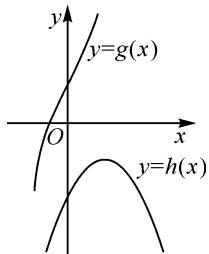

# 问题深入挖掘,思维合理发散

# ● 江苏省盐城市文峰高级中学 仓 琳

摘要: 涉及分段函数的综合应用问题是历年高考中的常考题型之一, 难度中等, 背景多变, 形式多样, 是数学基础知识与基本技能交汇与融合的一大重要载体. 结合一道高考真题, 借助分段函数的场景创设与函数单调性的应用, 合理剖析方法技巧, 总结规律策略, 有效指导数学教学与解题研究.

关键词: 分段函数; 单调性; 直接; 排除; 导数

涉及分段函数的综合应用问题,是历年高考中的热点与难点问题之一,也是高考试题中的一类常见题型.此类问题以分段函数为问题场景,借助函数的解析式、函数的基本性质、函数的图象与零点等众多相关的数学基础知识加以合理交汇融合,有较好的选拔性与较高的区分度,备受命题者青睐,时常在高考试题中“闪亮”登场,常考常新,形式各样,变化多端,不断变更分段函数的解析式背景与交汇条件,烹出一道道美味的分段函数的综合应用的美味“盛宴”.本文中就2024年高考数学新高考Ⅰ卷第6题加以分析.

# 1 真题呈现

高考真题 （2024年高考数学新高考Ⅰ卷·6）已知函数 $f(x)=\left\{\begin{aligned}-x^{2}-2ax-a,x&<0,\\ \mathrm{e}^{x}+\ln(x+1),&\geqslant0\end{aligned}\right.$ 在 R 上单调递增，则 a 的取值范围是（ ）.

A. $(-∞,0]$

B. $[-1,0]$

C. $[-1,1]$

D. $[0,+\infty)$

此题以含参的分段函数为问题背景,结合函数在实数集上的单调性,进而确定参数的取值范围.该问题重点体现了分类讨论思想与数形结合思想,考查了数学抽象、逻辑推理等数学核心素养.

该试题巧妙融合了分段函数、二次函数、指数函数与对数函数等相关的基本函数类型，借助函数的基本性质加以合理创设，题目难度中等，从而较好全面考查基本初等函数以及对应的基本性质等，实现问题的综合与应用.

在实际解决该分段函数的综合应用问题时,往往可以直接从问题中函数的单调性入手,结合各段对应的函数的解析式与基本性质来分析与处理;也可以通过选项中的数据信息逆向思维,合理利用特殊值思维与排除法处理;还可以借助函数与导数的应用,利用函数的单调性所对应的导函数的基本性质,并结合函数的图象与求值的变化规律加以合理的分析与推理等.

# 2 真题破解

解法 1: 直接法 1.

当 $x \geqslant 0$ 时，函数 $f(x) = \mathrm{e}^{x} + \ln(x + 1)$ 在 $[0, +\infty)$ 上单调递增.

结合分段函数的图象与性质,要保证当 x<0 时, 函数 $f(x)=-x^{2}-2ax-a$ 在 $(-∞,0)$ 上单调递增, 只须满足该二次函数的对称轴在 y 轴的右侧(包括 y 轴), 同时在 x=0 处的取值小于等于 $f(0)$ 即可, 即

$$
\left\{ \begin{array}{l l} { \frac {- 2 a}{2} \geqslant 0  ,} & {\text {解得} - 1 \leqslant a \leqslant 0.} \\ {- 0 ^ {2} - 2 a \times 0 - a \leqslant \mathrm{e} ^ {0} + \ln (0 + 1)  ,} & \end{array} \right.
$$

所以 a 的取值范围是 $[-1,0]$ . 故选: B.

解法 2: 直接法 2.

令函数 $h(x) = -x^{2} - 2ax - a$ ，函数 $g(x) = \mathrm{e}^{x} + \ln(x + 1)$ .

由于函数 $y=e^{x}$ 与 $y=\ln(x+1)$ 在 $[0,+\infty)$ 上均为增函数，则函数 $g(x)$ 在 $[0,+\infty)$ 上为增函数.

而函数 $h(x)$ 的对称轴为 x = -a，如图 1 所示.

而要满足函数 $f(x)$ 在 R 上单调递增，则有 $\left\{\begin{aligned}-a&\geqslant0,\\ h(0)&\leqslant g(0),\end{aligned}\right.$ 解得 $-1\leqslant a\leqslant0.$

所以 a 的取值范围是 $[-1,0]$ .

故选：B.

text_image

y
y=g(x)
O
x
y=h(x)

图1

点评: 直接法是解决此类分段函数问题时最为常用的一种方法, 通过直接分析函数在各段区间上的基本性质, 包括单调性、最值等, 以及函数图象的变化情况与规律等, 数形结合, 直观想象来分析与求解. 该问题中, 直接法的本质就是数形结合思维的直观应用, 需做到“胸中有数”“胸中有图”, 直观想象, 合理转化.

解法 3: 排除法.

观察各选项中的参数的取值范围的情况,不妨令a=1,则知当x<0时,函数 $f(x)=-x^{2}-2x-1=-(x+1)^{2}$ ,此时该函数与题设中函数 $f(x)$ 在 $(-∞,0)$ 上单调递增矛盾,则知 $a≠1$ ,由此排除选项C,D;

进一步,不妨令 a = -2, 则知当 x < 0 时, 函数 $f(x) = -x^{2} + 4x + 2 = -(x - 2)^{2} + 6 < 2$ , 此时 $f\left(-\frac{1}{8}\right) = -\left(-\frac{1}{8} - 2\right)^{2} + 6 = \frac{95}{64} > 1$ , 而 $f(0) = e^{0} + \ln(0 + 1) = 1$ , 此时该函数与题设中函数 $f(x)$ 在 R 上单调递增矛盾, 则知 $a \neq -2$ , 由此排除选项 A.

综上分析,故选:B.

点评: 排除法是解决选择题中比较常用的一种基本技巧方法, 而排除法的关键就是抓住各选项中数据的相似点与异同点, 合理通过特殊值的选取, 为相关选项的排除创造条件. 往往在实际运用排除法解题时, 有时一次特殊值的选取无法直接达到目的, 可以两次及三次选取特殊值来达到排除的目的.

解法 4: 导数 + 极限法.

易知当 $x \geqslant 0$ 时，由函数 $f(x) = \mathrm{e}^{x} + \ln (x + 1)$ 在 $[0, +\infty)$ 上单调递增.

而当 x<0 时，由函数 $f(x)=-x^{2}-2ax-a$ 在 $(-∞,0)$ 上单调递增，可知 $f'(x)=-2x-2a≥0$ ，解得 $a≤-x$ ，结合 x<0，则有 $a≤0$ 。

而当 $x \to 0^{-}$ 时， $f(x) \to -a$ ，而当 $x = 0$ 时， $f(0) = \mathrm{e}^{0} + \ln (0 + 1) = 1$ ，则有 $-a \leqslant 1$ ，解得 $a \geqslant -1$ .

综上分析可知， $-1 \leqslant a \leqslant 0$ .

所以 a 的取值范围是 $[-1,0]$ .

故选：B.

点评: 导数法是解决含参函数的单调性问题中最为常用的一种思维方式, 借助含参函数的求导运算并利用其在相应区间上的单调性, 合理构建对应的不等式来巧妙确定参数的取值范围; 而通过分段函数在界点处的取值变化情况, 巧妙通过极限法思维来转化与应用, 给参数的取值范围的确定创造条件. 两种技巧方法加以巧妙融合, 实现问题的创新应用与合理突破.

# 3 变式拓展

# 3.1 类比变式

变式 1 已知函数 $f(x)=\left\{\begin{aligned}x^{2}+2ax-a,x&<0,\\ \mathrm{e}^{-x}-\ln(x+1),&x\geqslant0\end{aligned}\right.$ 在 R 上单调递减，则 a 的取值范围是（）.

A. $(-∞,-1]$

B. $[-1,0]$

C. $[-1,1]$

D. $\left[1,+\infty\right)$

解析: 令函数 $h(x)=x^{2}+2ax-a, x<0$ , 函数

$$
g (x) = \mathrm{e} ^ {- x} - \ln (x + 1), x \geqslant 0.
$$

由于函数 $y = \mathrm{e}^{-x}$ 与 $y = -\ln (x + 1)$ 在 $[0, +\infty)$ 上均为减函数，则知函数 $g(x)$ 在 $[0, +\infty)$ 上为减函数.

易知函数 $h(x)$ 的对称轴为 $x=-\frac{2a}{2}=-a$ .

如果要满足函数 $f(x)$ 在 R 上单调递减, 那么有 $\left\{\begin{aligned}-a&\geqslant0,\\ h(0)&\geqslant g(0),\end{aligned}\right.$ 解得 $a\leqslant-1$ .

所以 a 的取值范围是 $(-∞, -1]$ .

故选：A.

在变式 1 中, 还可以从不同思维视角来变换分段函数中对应各段函数的解析式, 进而加以合理的变式与应用.

# 3.2 拓展变式

变式 2 已知函数 $f(x)=\left\{\begin{aligned}a^{x},&x<0,\\ ax+a,&x\geqslant0\end{aligned}\right.$ 在 R 上单调递增，则 a 的取值范围是（）.

A. $(0,+\infty)$

B.(0,1)

C. $(1,+\infty)$

D. $[1,+\infty)$

解析:依题,要满足函数 $f(x)$ 在 R 上单调递增,
则必须满足 $\left\{\begin{aligned}a&>1,\\ 0+a&\geqslant a^{0}=1,\end{aligned}\right.$ 解得a>1.

所以 a 的取值范围是 $(1, +\infty)$ .

故选：C.

# 4 教学启示

# 4.1 技巧方法总结

涉及分段函数的综合应用问题,要抓住函数中各段的解析式及其对应函数的基本属性,以及整体函数的结构特征与基本性质等,合理把握整体与细节之间的区别与联系,特别抓住其中的一些节点(如端点处的函数值等),根据函数的图象、性质等合理进行数形结合与直观想象,从直观思维切入并根据题设条件合理构建对应的方程(组)、不等式(组)等,实现问题的突破与求解.

# 4.2 破解基本思路

解决涉及分段函数的综合应用问题的基本思路是,根据函数的解析式与基本性质等,合理加以化归与转化,将整体的分段函数问题转化为两个或多个易于操作的基本初等函数的图象与性质问题等,借助函数基本性质法的逻辑推理,或函数图象法的直观想象等,从而合理逻辑推理或数形结合.该类题型对分析问题的能力与作图能力以及逻辑推理能力等的要求比较高,一理掌握了破解思路和处理方法,则可顺利解决.Z