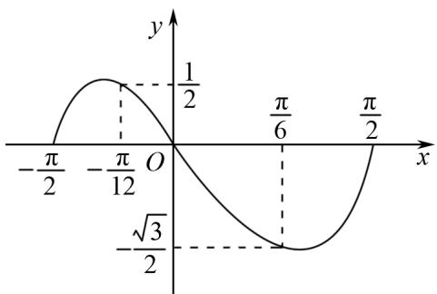

# 三角函数最值问题解题方法分析

蒋开鸿(重庆市永川萱花中学校 402160)

【摘 要】 三角函数最值问题是高考中的常见题型. 掌握三角函数最值问题的求解方法, 能够提高学生运用数学知识解决实际问题的能力. 本文借助例题系统总结和分析数形结合法、换元法、辅助角公式法在解题中的应用, 以供学生参考.

【关键词】三角函数;最值;高中数学;解题

三角函数最值问题作为三角函数知识的重要应用,是函数思想的具体体现,它综合考查了三角函数的概念、图象、性质及各类公式的运用,对学生的综合应用能力有着较高要求.因此,系统总结和分析三角函数最值问题的常见解题方法,有助于学生更好地掌握这一知识点.

# 1 数形结合法

数形结合法作为解答数学问题的常用方法, 在三角函数最值问题中同样适用. 在此类问题中, 数形结合法可以通过单位圆、三角函数图象等几何图形辅助分析. 如当涉及三角函数的周期性、振幅、相位等参数的最值问题时, 便可以借助数形结合法, 通过图形直观地找到最大值或最小值.

例 1 已知函数 $f(x)=\sin3\left(\omega x+\frac{\pi}{3}\right)(\omega>0)$ 的最小正周期为 $\pi$ ，函数 $f(x)$ 在 $\left[-\frac{\pi}{12},\frac{\pi}{6}\right]$ 的最小值为（）

(A) $\sqrt{2}$ . (B) $\frac{1}{2}$ . (C) $-\frac{\sqrt{3}}{2}$ . (D) $\frac{\sqrt{2}}{2}$ .

line

| x         | y     |
| --------- | ----- |
| -π/2      | 1/2   |
| -π/12     | 1/2   |
| O         | 0     |
| π/6       | -√3/2 |
| π/2       | -√3/2 |

图1

解析 $f(x) = \sin 3\left(\omega x + \frac{\pi}{3}\right) = \sin (3\omega x + \pi)$

$$
= - \sin 3 \omega x,
$$

由 $T = \frac{2\pi}{3\omega} = \pi$ ，得 $\omega = \frac{2}{3}$

则 $f(x) = -\sin 2x$

由 $x \in \left[-\frac{\pi}{12}, \frac{\pi}{6}\right]$ ,

得 $2x \in \left[-\frac{\pi}{6}, \frac{\pi}{3}\right]$ ,

画出 $y = -\sin 2x$ 的图象, 如图 1 可知, $f(x)$ 在 $\left[-\frac{\pi}{12}, \frac{\pi}{6}\right]$ 上单调递减,

所以当 $x = \frac{\pi}{6}$ 时，

$f(x)_{\min}=-\sin\frac{\pi}{3}=-\frac{\sqrt{3}}{2}$ ，答案为(C).

点评 借助数形结合法进行解题,首先要结合相关公式对原式进行化简,将其转化为含单一三角函数的二次函数或分式,并将三角函数表达式映射到几何图形;而后通过图象确定最值位置,并借助导数法等解题方法求解最值.

# 2 换元法

换元法是求解三角函数最值问题的一种重要方法,其核心原理是利用正弦函数与余弦函数的有界性,将复杂的三角函数问题转化为相对简单的代数函数问题,通常是转化为一次函数或二次函数来求解最值.

例 2 求函数 $f(x)=\left|\sin x-a\right|-\cos^{2}x(a\in\mathbf{R})$ 的最小值.

解析 因为 $f(x) = \sin^2 x + |\sin x - a| - 1$ ，

令 $t = \sin x (t \in [-1, 1])$ ,

则 $f(x) = g(t) = t^2 + |t - a| - 1 (t \in [-1, 1])$ ，

当 $a \geqslant 1$ 时, $g(t) = t^2 - t + a - 1$ , $g(t)$ 在 $\left(-1, \frac{1}{2}\right)$ 上单调递减, 在 $\left(\frac{1}{2}, 1\right)$ 上单调递增, 此时 $f(x)$ 的最小值为 $g(t)_{\min} = g\left(\frac{1}{2}\right) = a - \frac{5}{4}$ ;

当 $a \leqslant -1$ 时， $g(t) = t^2 + t - a - 1$ ，可得 $f(x)$ 的最小值为 $g(t)_{\min} = g\left(-\frac{1}{2}\right) = -a - \frac{5}{4}$ ；

当 $-1 < a < 1$ 时，

有 $g(t)=\left\{\begin{aligned}t^{2}-t+a-1,-1&\leqslant t<a,\\ t^{2}+t-a-1,a&<t\leqslant1,\end{aligned}\right.$

当 $\frac{1}{2}<a<1$ 时， $g(t)$ 在 $\left(-1,\frac{1}{2}\right)$ 上单调递减，在 $\left(\frac{1}{2},a\right),(a,1)$ 上单调递增，所以 $f(x)$ 的最小值为 $g(t)_{\min}=g\left(\frac{1}{2}\right)=a-\frac{5}{4}$ ;

同理, 当 $-1 < a < -\frac{1}{2}$ 时, $f(x)$ 的最小值为 $g(t)_{\min}=g\left(-\frac{1}{2}\right)=-a-\frac{5}{4};$

当 $-\frac{1}{2} \leqslant a \leqslant \frac{1}{2}$ 时， $f(x)$ 的最小值为

$$
g (t) _ {\min} = g (a) = a ^ {2} - 1;
$$

综上 $f(x)_{\min} = \left\{ \begin{array}{l} -a - \frac{5}{4}, a < -\frac{1}{2}, \\ a^2 - 1, -\frac{1}{2} \leqslant a \leqslant \frac{1}{2}, \\ a - \frac{5}{4}, a > \frac{1}{2}. \end{array} \right.$

点评 对于含有 $\sin x, \cos x$ 的二次式, 可以借助 $\sin^{2}x + \cos^{2}x = 1$ , 通过灵活换元, 令 $t = \sin x$ 或 $t = \cos x$ 将其转化为关于新变量的二次函数, 进而根据函数定义域确定最值. 这种转化思想的优势在于将陌生的三角函数最值问题转化为熟悉的代数函数最值问题, 利用代数函数的性质和方法进行求解, 降低问题的难度, 提高解题的效率和准确性.

# 3 辅助角公式法

辅助角公式是求解三角函数最值问题的重要工具,它的推导基于三角函数的两角和公式.对于函数 $y=a\sin x+b\cos x$ ,将其化简为 $y=R\sin(\omega x+\varphi)$ 的形式是解题的关键,此时便可以借助辅助角,其中 $R=\sqrt{a^{2}+b^{2}}$ 且 $\tan\varphi=\frac{b}{a}$ ,借助此法可以将复杂的函数形式简单化,使问题更易求解.

例3 求函数 $f(x) = \sin x - \sqrt{3}\cos x$ 在 $[0, \pi]$ 上的最大值.

解析 确定参数 $R, R = \sqrt{a^{2} + b^{2}} = \sqrt{1 + 3} = 2;$

确定角度 $\varphi$ ，由 $\tan\varphi=\frac{b}{a}=-\sqrt{3}$ ，

得 $\varphi = -\frac{\pi}{3}$

$$
f (x) = \sin x - \sqrt {3} \cos x = 2 \sin \left(x - \frac {\pi}{3}\right),
$$

当 $x \in [0, \pi]$ 时， $x - \frac{\pi}{3} \in \left[-\frac{\pi}{3}, \frac{2\pi}{3}\right]$ ，

故当 $x - \frac{\pi}{3} = \frac{\pi}{2}$ 即 $x = \frac{5\pi}{6}$ 时，

$$
f (x) _ {\max} = 2.
$$

点评 借助辅助角公式法解题时,首先要将原式整理为 $y=a\sin x+b\cos x$ 的形式,而后计算振幅 $R=\sqrt{a^{2}+b^{2}}$ 、相位角 $\varphi=\arctan\frac{b}{a}$ ,进而将其转化为单一三角函数 $y=R\sin(x+\varphi)$ 或 $y=R\cos(x-\varphi)$ ,最后利用正弦或余弦函数的有界性,求解最大值.

# 4 结语

综上所述,不同解题方法适用题型、计算难度等也不尽相同,因此,在日常学习中学生要积极总结各解题方法的特点和优势,在实际解题中灵活选择解题方法,从而快速解答问题.

# 参考文献：

[1] 陈华. 2024 年高考三角函数五类经典问题揭秘 [J]. 中学生数理化 (高一数学), 2025(1): 47-48.  
[2] 王玉林. 三角函数的值域(或最值) 题型例析 [J]. 中学生数理化(高一数学), 2024(12): 9.