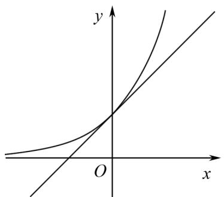
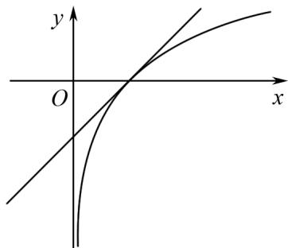

# 两个重要的切线不等式及其应用

赵永刚(甘肃省天水市秦安县第五中学 741600)

【摘 要】 本文深入探讨指数函数与对数函数的两个经典切线不等式及其变形在解决函数不等式问题中的应用,强调“化曲为直”思想在简化复杂问题时的关键作用,为解决涉及指数函数与对数函数的不等式问题提供高效解题方法.

【关键词】切线不等式;高中数学;解题方法

# 1 引言

切线放缩是解决不等式问题的一种重要方法，这一方法体现了“化曲为直”的教学思想。灵活运用切线放缩可以降低问题难度，快速解决一些用其他方法难以高效处理的不等式问题。本文重点介绍两个与指数函数、对数函数直接相关的经典切线不等式及其在解题中的应用。

# 2 两个切线不等式及其变形

# 不等式 1

例 1 设 $x \in R$ ，则 $e^{x} \geqslant x + 1$ ，当且仅当 x = 0 时，等号成立.

证明 令 $f(x) = \mathrm{e}^{x} - x - 1$

求导得 $f'(x)=\mathrm{e}^{x}-1$ .

所以当 x > 0 时， $f'(x) > 0$ ，则 $f(x)$ 在 $(0, +\infty)$ 上递增；

当 x<0 时， $f'(x)<0$ ，则 $f(x)$ 在 $(-∞,0)$ 上递减，

所以 $f(x)$ 的最小值为 $f(0)=\mathrm{e}^{0}-0-1=0$ ,
故 $f(x) \geqslant 0$ ，即 $e^{x} \geqslant x + 1$ ，

当且仅当 x=0 时, 等号成立.

text_image

y
O
x

图1

易知直线 $y = x + 1$ 为曲线 $y = e^{x}$ 在点 $(0,1)$ 处的切线,不等式1表明曲线 $y=e^{x}$ 位于切线 $y=x+1$ 的上方,如图1所示.

不等式 1 有如下变形: 将 x 替换为 x - 1,

可得 $\mathrm{e}^{x - 1}\geqslant x$ ，即 $\mathrm{e}^x\geqslant \mathrm{e}\cdot x$

两边同时除以 $e^{x-1}$ ,

得 $\frac{1}{e}\geqslant\frac{x}{e^{x}}$ ，即 $\frac{x}{e^{x}}\leqslant\frac{1}{e}$ .

# 不等式 2

例 2 设 x > 0，则 $\ln x \leqslant x - 1$ ，当且仅当 x = 1 时，等号成立.

证明 令 $f(x) = \ln x - x + 1$

求导得则 $f'(x)=\frac{1}{x}-1,x>0.$

所以当 0 < x < 1 时， $f'(x) > 0$ ，则 $f(x)$ 在 $(0,1)$ 上递增；

当 x > 1 时， $f'(x) < 0$ ，则 $f(x)$ 在 $(0, +\infty)$ 上递减，

所以 $f(x)$ 的最大值为 $f(1)=\ln1-1+1=0$ ,

故 $f(x)\leqslant 0$ ，即 $\ln x\leqslant x - 1$

当且仅当 x=1 时, 等号成立.

易知直线 y = x - 1 为曲线 $y = \ln x$ 在点 $(1,0)$ 处的切线，不等式 2 表明曲线 $y = \ln x$ 位于切线 y = x - 1 的下方，如图 2 所示.

text_image

y
O
x

图2

不等式2有如下变形:(1)将x替换为 $x+1$ ,可得 $\ln(x+1)\leqslant x(x>-1)$ ;(2)将x替换为 $\frac{x}{e}$ ,可得 $\ln\frac{x}{e}\leqslant\frac{x}{e}-1(x>0)$ ,即 $\ln x\leqslant\frac{x}{e}(x>0)$ ,两

边同时除以 $x$ ，得 $\frac{\ln x}{x} \leqslant \frac{1}{\mathrm{e}} (x > 0)$

# 3 两个切线不等式在解题中的应用

在解决与指数函数和对数函数有关的不等式问题时,合理利用以上两个不等式及其变形可以缩短解题长度,提高解题效率.运用以上两个切线不等式解题的一般步骤如下:

(1) 分析题目中所给的函数, 判断是否含有指数函数或对数函数;  
(2) 根据函数的特点,选择合适的切线不等式进行放缩;  
(3) 通过放缩将原函数转化为较简单的形式,以便进行后续的计算、化简或证明工作;  
(4) 根据具体问题的要求, 结合其他方法(例如导数法)进行进一步推理和证明.

例 3 已知函数 $f(x)=a\mathrm{e}^{x}-\ln x-1$ ，证明：当 $a \geqslant \frac{1}{e}$ 时， $f(x) \geqslant 0$ .

证明 因为 $a \geqslant \frac{1}{\mathrm{e}}$

所以 $f(x)\geqslant \frac{\mathrm{e}^x}{\mathrm{e}} -\ln x - 1.$

根据不等式1的变形 $\mathrm{e}^x\geqslant \mathrm{e}\cdot x$

可得 $\frac{e^{x}}{e}\geqslant x;$

根据不等式 $2\ln x \leqslant x - 1$

可得 $-\ln x \geqslant -x + 1.$

所以 $f(x) \geqslant \frac{\mathrm{e}^{x}}{\mathrm{e}} - \ln x - 1 \geqslant x - x + 1 - 1 = 0$ ，故结论成立.

点评 在本题中, 函数 $f(x)$ 含有指数函数和对数函数, 于是使用不等式 1 和不等式 2 (或它们的变形) 进行切线放缩, 使得问题快速得到解决. 具体来说, 我们利用不等式 1 的变形得到 $\frac{e^{x}}{e} \geqslant x$ , 利用不等式 2 得到 $-\ln x \geqslant -x + 1$ , 从而将 $f(x)$ 放缩为较简单的形式, 进而证明 $f(x) \geqslant 0$ .

例 4 已知函数 $f(x)=\ln x-x$ , $g(x)=\mathrm{e}^{x}-x$ , 令 $h(x)=g(x)-f(x)$ , 证明: $h(x)>2$ .

证明 因为 $f(x)=\ln x-x$ , $g(x)=\mathrm{e}^{x}-x$ ,

所以 $h(x)=\mathrm{e}^{x}-\ln x$ .

根据不等式1的 $\mathrm{e}^x\geqslant x + 1$ 和不等式2的 $\ln x\leqslant x - 1$ ，且两个不等式的等号不同时成立，

可得 $e^{x}-\ln x>x+1-(x-1)=2$ ,

故 $h(x)>2.$

点评 本题与例1类似,通过使用不等式1和不等式2进行放缩,快速解决了问题.具体而言,我们利用不等式1得到 $e^{x}\geqslant x+1$ ,利用不等式2得到 $\ln x\leqslant x-1$ ,从而得出 $e^{x}-\ln x>2$ ,即 $h(x)>2$ .

例 5 已知函数 $f(x)=\frac{1+\ln x}{\mathrm{e}^{x}}, g(x)=(x^{2}+x)f'(x)$ ，证明：当 x>0 时， $g(x)<1+\mathrm{e}^{-2}$ .

证明 求导得 $f'(x)=\frac{\frac{1}{x}-\ln x-1}{\mathrm{e}^{x}}$ ,

所以 $g(x)=(x^{2}+x)\frac{\frac{1}{x}-\ln x-1}{\mathrm{e}^{x}}=x(x+1)$ $\frac{\frac{1}{x}-\ln x-1}{\mathrm{e}^{x}}=x\left(\frac{1}{x}-\ln x-1\right)\frac{x+1}{\mathrm{e}^{x}}=(1-x\ln x-x)\frac{x+1}{\mathrm{e}^{x}}.$

根据不等式中的 $1\mathrm{e}^{x}\geqslant x + 1$

可知 $g(x)\leqslant 1 - x\ln x - x$

令 $h(x)=1-x\ln x-x$

则 $h'(x) = -(1 + \ln x) - 1 = -\ln x - 2.$

令 $h'(x) > 0$ ，

解得 $0 < x < e^{-2}$ .

所以当 $0 < x < e^{-2}$ 时， $h(x)$ 单调递增；

当 $x > e^{-2}$ 时, $h(x)$ 单调递减.

故 $g(x)\leqslant h(x) <   h(\mathrm{e}^{-2}) = 1 + \mathrm{e}^{-2}.$

点评 在解答本题时,我们先根据不等式1对 $g(x)$ 进行放缩,将其转化为较简单的函数 $1-x\ln x-x$ ,接着再用求导法求出该函数的最值,从而证明了 $g(x)<1+e^{-2}$ .

# 4 结语

总之，在解决与函数有关的不等式问题时，若涉及指数函数、对数函数，可以先构造出切线，再根据切线与曲线的位置关系，利用切线方程对原不等式进行放缩，将较复杂的不等式问题转化为较简单的不等式问题，进而高效完成求解或证明.

# 参考文献：

[1] 刘根祥. 例谈切线不等式的前世今生 [J]. 数理天地 (高中版), 2023(23): 16-17.  
[2] 龚小敏. 关注两个切线不等式的解题应用 [J]. 中学数学, 2024(23): 33-35.