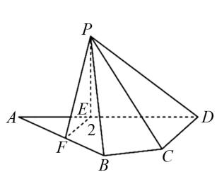
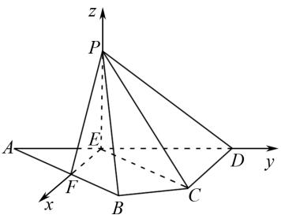
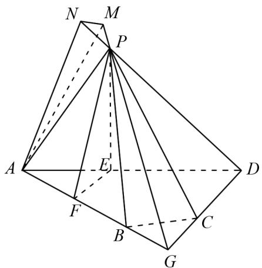

# 例析二面角问题的两种常用解题方法

王冠(福建省泉州实验中学 362000)

【摘 要】 在历年高考数学试卷中,立体几何二面角问题始终占据着重要位置,是考查学生数学能力与素养的重要题型.本文结合实际问题,对解答二面角问题常用的两种方法进行分析,阐述不同解题方法的应用情境与解题步骤.

【关键词】 立体几何;二面角;向量法

在高中数学知识体系中,立体几何占据着至关重要的地位,是高考重点考查的内容之一.而二面角问题作为立体几何的核心考点,考查频率极高,更是每年高考数学的热点与难点.在实际考试中,二面角问题往往作为核心考点,与线面垂直、面面垂直、几何体的体积等知识点相结合,综合考查学生的逻辑推理能力、空间想象能力、计算能力及对知识的综合运用能力.

# 经典例题

如图1所示,平行四边形ABCD中, $AB=8,CD=3,AD=5\sqrt{3},\angle ADC=90^{\circ},\angle BAD=30^{\circ}$ ,点E,F满足 $\overrightarrow{AE}=\frac{2}{5}\overrightarrow{AD},\overrightarrow{AF}=\frac{1}{2}\overrightarrow{AB}$ ,将 $\triangle AEF$ 沿EF对折至 $\triangle PEF,PC=4\sqrt{3}$ ,且 $EF\perp PD$ .求面PCD与面PBF所成的二面角的正弦值.

text_image

P
A
E
2
F
B
C
D

图1

text_image

z
P
A
F
E
x
B
C
D
y

图2

# 1 向量法

向量法是解答二面角问题最为常用的方法,能够解答大多数情况下的二面角问题,尤其是题目中存在正方体、长方体等规则图形或能够确定三条两两垂直的直线时,借助向量法往往可以快速解题.相较于其他解题方法,向量法具有较为明晰的解题步骤,即解题时首先根据图形特点,建立起合适的空间坐标系,这是后续解题的基础.建系时需要注意坐标系的合理性,合适的坐标系会降低后续计算的难度,否则会起到相反作用.而后需要确定相关点的坐标,如二面角的两个面内相关点的坐标.在此基础上,设出两个面的法向量,根据法向量与面之间的关系,列式求解,分别得到二面角两个面的法向量,最后通过公式 $\cos\theta=\pm\frac{n\cdot m}{|n|\cdot|m|}$ 计算出二面角的余弦值,再根据图形判断二面角是锐角还是钝角,从而确定二面角的大小.

解析 因为 $DE = 5\sqrt{3} - 2\sqrt{3} = 3\sqrt{3}, CD = 3,$ $\angle CDE=90^{\circ}$ ，所以 $CE^{2}=36, CE=6,$

因为 $PE = AE = 2\sqrt{3}$ ，所以 $PE^{2} + CE^{2} = PC^{2}$ ，
所以 $PE \perp CE$ ，

由题意可得 $PE \perp EF, EF \cap CE = E, EF,$ $CE \subset$ 面 DEF，所以 $PE \perp$ 面 DEF，

又 $DE \subset$ 面 $DEF$ , 所以 $PE \perp ED$ ,

所以 EF, ED, EP 两两垂直, 可建立如图 2 所示坐标系.

则 $P(0,0,2\sqrt{3}), D(0,3\sqrt{3},0), F(2,0,0)$ ， $A(0,-2\sqrt{3},0), B(4,2\sqrt{3},0), C(3,3\sqrt{3},0)$ ,

所以 $\overrightarrow{PD} = (0,3\sqrt{3}, - 2\sqrt{3}),\overrightarrow{CD} = (-3,0,0),$ $\overrightarrow{PB} = (4,2\sqrt{3}, - 2\sqrt{3}),\overrightarrow{BF} = (-2, - 2\sqrt{3},0),$

设平面 PCD 的法向量 $\boldsymbol{n}_{1}=(x_{1},y_{1},z_{1})$ ,

则有 $\left\{\begin{aligned}\boldsymbol{n}_{1}&\cdot\overrightarrow{PD}=3\sqrt{3}y_{1}-2\sqrt{3}z_{1}=0,\\ \boldsymbol{n}_{1}&\cdot\overrightarrow{CD}=-3x_{1}=0.\end{aligned}\right.$

设 $y_{1}=2$ ，则 $z_{1}=3, x_{1}=0$ ，所以 $\boldsymbol{n}_{1}=(0,2,3)$ .

同理平面 PBF 的法向量 $\boldsymbol{n}_{2}=(\sqrt{3},-1,1)$ .

设平面 PCD 与平面 PBF 所成二面角为 $\alpha$ ,

$$
\cos \langle \boldsymbol {n} _ {1} \cdot \boldsymbol {n} _ {2} \rangle = \frac {\boldsymbol {n} _ {1} \cdot \boldsymbol {n} _ {2}}{| \boldsymbol {n} _ {1} | \cdot | \boldsymbol {n} _ {2} |} = \frac {1}{\sqrt {6 5}} = \frac {\sqrt {6 5}}{6 5},
$$

所以 $\sin \alpha = \sqrt{1 - \left(\frac{\sqrt{65}}{65}\right)^2} = \frac{8\sqrt{65}}{65}$ .

点评 在本题中借助向量法,难点在于准确、合理地建立空间直角坐标系,且在确定各点及法向量的确定时,能够规范解答.

# 2 定义法

定义法是求解二面角问题最基本的方法,其原理直接基于二面角的平面角定义,当二面角的棱比较明确,且在图形中容易找到或作出二面角的平面角时,适合使用定义法.运用定义法求解二面角时,首先要仔细观察题目所给的立体图形,在二面角的棱上找到一个便于后续作垂线的特殊点.这个点的选取通常要考虑图形的对称性、已知条件及是否便于与其他元素建立联系等因素.而后从在棱上所取的点出发,分别在二面角的两个半平面内作垂直于棱的直线.这一步需要学生具备较强的空间想象能力和熟练掌握几何图形的性质,能够准确地判断出在每个半平面内作垂线的方向和方法.得到二面角的平面角后,将问题转化为求解平面三角形中角的问题.此时,需要运用平面几何中的相关知识,如三角形全等、相似、勾股定理、三角函数等,计算平面角的大小.

解析 如图 3 所示, 延长 DC, AB 交于点 G, 连接 PG.

text_image

N M
P
A E D
F C
B G

图3

所以二面角 A - PG - D 为面 PCD 与面 PBF 所成的二面角，

在 Rt△ADG 中，∠BAD = 30°, AD = 5√3，

所以 AG = 10, DG = 5,

过点 A 作 $AN \perp PD$ 交 DP 的延长线于点 N，过点 A 作 $AM \perp PG$ 交 GP 的延长线于点 M，连接 MN.

因为 $EF \perp$ 平面 PAD, $EF \parallel DG$ ,

所以 $DG \perp$ 平面 PAD，

因为 $AN \subset$ 平面 PAD，所以 $DG \perp AN$ ，

又 $DG \cap PD = D$ ，所以 $AN \perp$ 平面 PMN，所以 $AN \perp PG$ ，

又 $AM \perp PG, AM \cap AN = A,$

所以 $PG \perp$ 平面 $AMN$ ,

所以 $PG \perp MN$ ，即 $\angle AMN$ 为二面角 A - PG - D 的平面角或其补角，

$$
\begin{array}{r l} & {\text {在} \triangle A D N \text {中}, A N = A D \times \sin \angle P D A =} \\ & {\frac {A D \times P E}{P D} = 5 \sqrt {3} \times \frac {2}{\sqrt {1 3}} = \frac {1 0 \sqrt {3}}{\sqrt {1 3}} = \frac {1 0 \sqrt {3 9}}{1 3}.} \end{array}
$$

在 $\triangle APG$ 中, $AP = 2\sqrt{6}$ , PG = 8, AG = 10,

所以 $\cos\angle PGA=\frac{8^{2}+10^{2}-24}{2\times8\times10}=\frac{7}{8}$ ,

所以 $\sin \angle PGA = \sqrt{1 - \left(\frac{7}{8}\right)^2} = \frac{\sqrt{15}}{8}$

$$
\begin{array}{r l} & {\text {所以} A M = A G \times \sin \angle P G A = 1 0 \times \frac {\sqrt {1 5}}{8} =} \\ & {\frac {5 \sqrt {1 5}}{4}, \text {所以} \sin \angle A M N = \frac {A N}{A M} = \frac {1 0 \sqrt {3 9}}{1 3} \times \frac {4}{5 \sqrt {1 5}} =} \\ & {\frac {8 \sqrt {6 5}}{6 5},} \end{array}
$$

所以其二面角的正弦值为 $\frac{8\sqrt{65}}{65}$ .

点评 本题在借助定义法解答时,首先要确定二面角的棱,随后借助三垂线法确定二面角的平面角.在实际解题中,准确判断二面角的平面角是解题的关键点,也是难点,需要学生拥有较强的空间思维能力.

# 3 结语

综上所述,本文总结了解答二面角问题常用的两种方法,分别为向量法和定义法,其中向量法思路直接、计算规范,能降低思维难度,但计算量大且对图形建系条件有要求;定义法虽能直观体现概念,但在复杂图形中操作难度大.因此,在实际解题中,学生应结合实际考题背景,灵活选择解题方法.