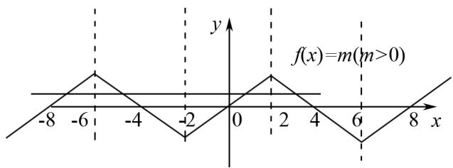

# 例谈高中数学抽象函数问题的常见题型

冯增艳(山东省滕州市第一中学 277500)

【摘 要】 本文围绕高中数学抽象函数问题展开,详细例谈三种常见题型,包括定义域问题、值域问题及不等式问题,旨在帮助学生深入理解抽象函数问题的特点与求解方法.

【关键词】高中数学;抽象函数;解题技巧

函数作为高中数学的核心内容,贯穿于整个高中数学知识体系,是连接代数、几何等多个数学分支的桥梁.而抽象函数作为函数中的特殊类型,更是高中数学教学中的重点和难点,相关题型不仅是对学生函数知识掌握程度的深度考查,更是对学生抽象思维能力、逻辑推理能力和综合运用知识能力的全面检验.因此,本文深入分析高中数学抽象函数问题的常见题型,通过对常见题型的分类整理和解题策略的归纳总结,帮助学生更好地理解抽象函数的本质和特点,掌握解决抽象函数问题的方法和技巧,提高学生的解题能力和数学成绩.

# 1 奇偶性问题

奇偶性问题作为核心考点,通常以“不给出具体解析式,仅通过函数性质或运算关系描述”的形式出现,常见命题情境有定义域对称性、函数方程关系、运算与复合、图象对称性等.在面对相关问题时,情境不同解题方法也不尽相同,常用解题方法有定义法、赋值法(特殊值法)、图象法、运算性质法等.解题时需先检查定义域是否关于原点对称,否则直接判定为非奇非偶;特殊值法仅能辅助验证,不能替代严格证明;复合函数奇偶性需分层判断.

例 1 函数 $g(x)$ , $f(x)$ 均为奇函数, $F(x)=af(x)+bg(x)+4(a,b\in\mathbf{R})$ , 且 $F(-1)=5$ , 则 $F(1)=(\quad)$

(A)-5. (B)-1. (C)3. (D)4.

分析 本题主要考查函数奇偶性的理解和运用,根据函数奇偶性特点对原 $g(x)$ 、 $f(x)$ 变形,得到与其等价的函数,结合已知条件代入 x=1 即可求解.

解析 设 $h(x)=af(x)+bg(x)$ ,

因为 $h(-x) = af(-x) + bg(-x) = -[af(x) + bg(x)] = -h(x)$ ，

所以 $h(x)$ 为奇函数，

因为 $F(-1)=5$ ，

所以 $F(-1)=h(-1)+4=5$ ,

可得 $h(-1)=1$ ，

故 $F(1)=h(1)+4=-1+4=3.$

# 2 周期性问题

抽象函数的周期性与对称性常以隐含条件形式出现,需通过函数关系式挖掘性质.周期性问题中,可以通过识别周期模式:根据 $f(x+T)=f(x)$ 或其变形(如 $f(x+a)=-f(x)$ ) 直接确定周期.或是利用对称性推导周期:若函数有两条对称轴或对称中心,通过距离关系计算周期.同时可以借助赋值法简化计算:通过代入特定值(如 x=0)验证周期性,减少计算量.对称性问题中,则需要掌握判断对称轴/中心的方法,如根据 $f(x+a)=f(a-x)$ 或 $f(a-x)+f(x+a)=0$ 确定对称性.同时可以借助图象变换:利用对称性平移或翻转函数图象,辅助解题.最后可以结合奇偶性:奇函数关于原点对称,偶函数关于 y 轴对称,联合其他性质求解.解题时需要注意,周期函数定义域需无界,否则周期性可能不成立,并且对称轴与对称中心不能混淆.综上,解决相关问题的关键在于准确识别隐含条件,从函数关系式中挖掘周期或对称性线索;熟练掌握公式变形,如掌握周期性公式和对称性表达式,并在解题中灵活运用.

例 2 $f(x)$ 为 R 上的奇函数, $f(x-4)=-f(x)$ 恒成立, 该函数在区间 $[0,2]$ 上单调递增, 如果在区间 $[-8,8]$ 上 $f(x)=m(m>0)$ 有 4 个不等根 $x_{1}, x_{2}, x_{3}, x_{4}$ , 则 $x_{1}+x_{2}+x_{3}+x_{4}=$ \_\_\_\_.

分析 解答本题的关键在于利用周期和对称轴显示出 $x_{1}, x_{2}, x_{3}, x_{4}$ 任意两数之间的和，函数 $f(x)$ 的周期为8，对称轴为 $x = 2$ ，且在区间 $[0, 2]$ 上单调递增，如图1所示，则有 $x_{1} + x_{2} = -12, x_{3} +$

$x_{4}=4$ , 进而求解.

解析 $f(x)$ 为奇函数, 且 $f(x-4)=-f(x)$ 恒成立,

所以 $f(x-4)=f(-x)$ ,

所以函数关于直线 x=2 对称，且 $f(0)=0$ ，

因为 $f(x-4)=-f(x)$ ,

则 $f(x-8)=f(x)$ ,

所以函数 $f(x)$ 的周期为 8，

因为函数在区间 $[0,2]$ 上单调递增，

所以在区间 $[-2,0]$ 上也单调递增，如图1所示.

line

| x  | y  |
|----|----|
| -8 | 0  |
| -6 | 1  |
| -4 | 0  |
| -2 | -1 |
| 0  | 0  |
| 2  | 1  |
| 4  | 0  |
| 6  | -1 |
| 8  | 0  |

图 1

所以当 $f(x)=m(m>0)$ 有 4 个不等根 $x_{1}$ ， $x_{2},x_{3},x_{4}$ 时，

令 $x_{1} < x_{2} < x_{3} < x_{4}$

由函数对称性, 可得 $x_{1} + x_{2} = -12, x_{3} + x_{4} = 4$ ,

综上， $x_{1} + x_{2} + x_{3} + x_{4} = -8.$

# 3 不等式问题

抽象函数与不等式结合的问题,是高中数学中综合性较强的题型,需要学生熟练掌握抽象函数的性质,并能运用这些性质对不等式进行转化和求解.解决此类问题的关键在于利用函数的单调性、奇偶性等性质去掉函数符号,将抽象不等式转化为普通的代数不等式组进行求解.面对此类问题时,首先要对不等式进行整理、变形;而后构造出新的函数,将不等式问题转化为新函数最值间的问题,此过程需要借助相关函数的基本性质,将抽象函数不等式逐步转化为代数不等式组;最后通过求解不等式(组),确定不等式的解集.解题时要注意函数定义域对不等式的限制,确保求解过程的准确性.

例 3 函数 $f(x)$ 的定义域为 R, $f(1)=1$ 且对任意 $x \in R$ 均有 $f'(x) < \frac{1}{2}$ ，则不等式 $f(\log_{2}x) > \frac{\log_{2}x + 1}{2}$ 的解集为（）

(A) $\{x\mid0<x<2\}$ .   
(B) $\{x\mid0<x<1\}$ .   
(C) $\{x\mid0<x\leqslant1\}$ .   
(D) $\{x\mid0<x\leqslant2\}$ .

分析 本题为抽象函数与不等式结合的问题, 解题时可运用单调性脱去不等式中的函数符号. 结合 $f'(x) < \frac{1}{2}$ 构造函数并判断单调性, 根据单调递增或单调递减脱去函数符号, 使问题中的原不等式只含自变量 x, 进而解不等式即可得到最终答案.

解 由题意,构造函数 $g(x)=f(x)-\frac{x}{2}$ ,

则 $g'(x)=f'(x)-\frac{1}{2}<0,$

故函数 $g(x)$ 在 $(-∞, +∞)$ 上单调递减，

因为不等式 $f(\log_{2}x) > \frac{\log_{2}x + 1}{2} \Leftrightarrow g(\log_{2}x) - \frac{1}{2} > 0,$

$$
g (1) = f (1) - \frac {1}{2} = \frac {1}{2},
$$

所以 $g(\log_{2}x) > g(1)$ ,

则有 $\log_2x < 1$

可得 0 < x < 2,

则不等式的解集为 $\{x \mid 0 < x < 2\}$ ，正确答案为(A).

# 4 结语

综上所述,高中数学中的抽象函数问题类型多样,定义域、值域与不等式问题均为常见且关键的题型.深入剖析这些题型,掌握对应的解题策略.能让学生在解题时更加游刃有余,有效提升学生的数学解题能力与思维水平.

# 参考文献：

[1] 陈泓. 抽象函数常见题型及解题策略 [J]. 数理天地 (高中版), 2022(18): 14-15.  
[2] 鲁和平. 好风凭借力——例谈高考数学抽象函数大小比较的解题策略 [J]. 高中数理化, 2022(23): 36-38.  
[3] 陈惟前. 例谈求导法则在抽象函数问题中的应用 [J]. 高中数学教与学, 2022(3): 16-18.