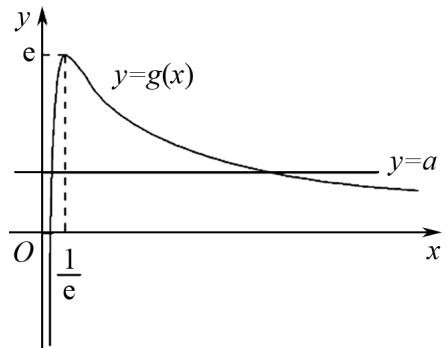

# 借助导数应用,探究函数零点

仲玉红(山东省龙口第一中学 265700)

【摘 要】 导数作为高中数学中的一个重要知识点与重要工具,是高考数学试卷命题的一个热点与难点.而利用导数应用来研究一些与函数零点相关的问题,是考查的一个重要方向与场景,从三个不同问题场景与分类,结合实例剖析,总结解题技巧与策略,为解题研究与复习备考提供引领与指导.

【关键词】导数;函数;高中数学;解题技巧

函数与导数的综合应用,是高中阶段处理函数、方程或不等式等相关问题时常用的知识与工具,借助它可解决众多综合应用问题.特别在解决一些复杂的函数零点及其综合应用问题时,往往也离不开函数与导数的综合应用,巧妙借助导数应用,可解决与函数零点相关的问题(如探求函数零点的个数、确定参数的取值范围(或最值)、证明不等式的成立等),是突破考生学习难点与瓶颈的一个关键节点,也是高考考查的基本场景,备受师生关注.

# 1 探求函数零点的个数

借助导数法探求函数零点的个数问题,是解决复杂函数零点个数问题时最常用的方法;或通过函数与导数的应用,结合图象法加以判断;或通过函数与导数的应用,分析函数单调性、极值等性质,再利用函数零点存在性定理转化求解.

例 1 已知函数 $f(x)=ax-\ln x-2$ .

(1) 当 a=1 时, 求函数 $f(x)$ 的极值;  
(2) 讨论函数 $f(x)$ 的零点个数.

解析 (1) 当 $a = 1$ 时, $f(x) = x - \ln x - 2(x >$

$$
0), f ^ {\prime} (x) = 1 - \frac {1}{x} = \frac {x - 1}{x} (x > 0).
$$

令 $f'(x) < 0$ ，则 0 < x < 1；

令 $f'(x) > 0$ ，则 x > 1，

故 $f(x)$ 的递减区间为 $(0,1)$ ，递增区间为 $(1,$

$$
+ \infty).
$$

所以当 x = 1 时, 函数取得极小值 $(1) = 1 - \ln 1 - 2 = -1$ , 无极大值.

(2) 令 $f(x)=ax-\ln x-2=0$ ，而 x>0，分离参数有 $a=\frac{\ln x+2}{x}$ .

即 $g(x)=\frac{\ln x+2}{x}$ ，则 $f(x)$ 的零点个数为 y=a 与 $y=g(x)$ 图象的交点个数.

而 $g'(x)=\frac{-1-\ln x}{x^{2}}$ ,

令 $g'(x) > 0$ ，则 $0 < x < \frac{1}{e}$ ;

令 $g'(x) < 0$ ，则 $x > \frac{1}{e}$ ，

故 $g(x)$ 在 $\left(0, \frac{1}{\mathrm{e}}\right)$ 上单调递增，在 $\left(\frac{1}{\mathrm{e}}, +\infty\right)$ 上单调递减.

从而 $g(x)_{\max}=g\left(\frac{1}{e}\right)=e,$

当 $x \to 0$ 时, $g(x) \to -\infty$ ;

当 $x \to +\infty$ 时, $g(x) \to 0$ , 作出 $y = g(x)$ 的大致图象, 如图 1 所示.

text_image

y
e
y=g(x)
O
1/e
x
y=a

图1

因此当 $a > \mathrm{e}$ 时， $y = a$ 与 $y = g(x)$ 的图象没有交点；

当 a=e 或 $a \leqslant 0$ 时, y=a 与 $y=g(x)$ 的图象有 1 个交点;

当 $0 < a < e$ 时, y = a 与 $y = g(x)$ 的图象有 2 个交点.

综上, 当 a > e 时, $f(x)$ 没有零点;

当 $a = \mathrm{e}$ 或 $a\leqslant 0$ 时， $f(x)$ 有1个零点；

当 0 < a < e 时, $f(x)$ 有 2 个零点.

# 2 确定参数的取值范围(或最值)

借助导数法确定参数的取值范围(或最值)问题,是解决含参函数零点综合应用问题时最常用的方法.解决此类问题时,比较常用的方法有分离参数法(包括全分离、半分离两种形式),即利用函数零点存在性定理,转化为两个熟悉的函数图象的交点问题,通过直观分析求解的方法等.有时是多种方法并用,综合处理.

例 2 已知函数 $f(x)=\mathrm{e}^{x}-2ax-\mathrm{e}+1$ .

(1) 若 a=2，求 $f(x)$ 的最小值；

(2) 若 $f(x)$ 的图象与直线 $y = -a$ 在区间 $(0, 1)$ 上有两个不同交点，求实数 $a$ 的取值范围。参考数据： $\sqrt{\mathrm{e}} \approx 1.65$ 。

解析 (1) 当 $a = 2$ 时，

$$
f (x) = \mathrm{e} ^ {x} - 4 x - \mathrm{e} + 1,
$$

则 $f'(x)=\mathrm{e}^{x}-4.$

令 $f'(x) < 0$ ，则 $x < \ln 4$ ;

令 $f'(x) > 0$ ，则 $x > \ln 4$ ，

所以 $f(x)$ 在 $(-∞, \ln4)$ 上单调递减，在 $(\ln4, +∞)$ 上单调递增.

故当 $x = \ln 4$ 时， $f(x)$ 取极小值也是最小值，

故 $f(x)_{\min}=f(\ln4)=5-\mathrm{e}-8\ln2.$

(2) 由于 $f'(x)=\mathrm{e}^{x}-2a$ ,

当 $-2a\geqslant0$ ，即 $a\leqslant0$ 时， $f'(x)>0$ 恒成立，此时 $f(x)$ 在 $(0,1)$ 上单调递增，所以 $f(x)$ 的图象与y=-a在区间 $(0,1)$ 上至多有1个交点，不符合题意；

当 a > 0 时，令 $f'(x) = 0$ ，则 $x = \ln 2a$ ，所以当$x < \ln 2a$ 时， $f'(x) < 0, f(x)$ 单调递减；当 $x > \ln 2a$ 时， $f'(x) > 0, f(x)$ 单调递增.

要使 $f(x)$ 的图象与 y = -a 在区间 $(0,1)$ 上有两个不同的交点，则 $f(x)$ 在 $(0,1)$ 上不单调，故需满足 $0 < \ln 2a < 1$ ，即 $\frac{1}{2} < a < \frac{e}{2}$ ，故 $f(x)$ 在 $(0, \ln 2a)$ 上单调递减，在 $(\ln 2a, 1)$ 上单调递增.

而 $f(0) = 2 - \mathrm{e} <   0,f(1) = 1 - 2a$

$$
f (\ln 2 a) = 2 a - 2 a \ln 2 a - e + 1,
$$

所以 $\left\{\begin{aligned}-a&<f(0),\\ -a&<f(1),\\ -a&>f(\ln2a)\end{aligned}\right.$

化简得 $\left\{\begin{aligned}a&>e-2,\\ a&<1,\\ 0&>3a-2a\ln2a-e+1,\end{aligned}\right.$

记 $g(a) = 3a - 2a\ln 2a - \mathrm{e} + 1(\mathrm{e} - 2 <   a <   1)$

则 $g'(a)=3-2\ln2a-2=1-2\ln2a.$

令 $g'(a) > 0$ ，有 $a < \frac{\sqrt{e}}{2}$ ，

故当 $e-2<a<\frac{\sqrt{e}}{2}$ 时， $g(a)$ 递增；

当 $\frac{\sqrt{e}}{2}<a<1$ 时， $g(a)$ 递减，

所以 $g(a)\leqslant g\left(\frac{\sqrt{e}}{2}\right) = \sqrt{e} +1 - e <   0.$

故对任意的 $e-2<a<1,0>3a-2a\ln2a-e+1$ 恒成立，故 $e-2<a<1$ .

综上,可得 a 的取值范围为 $(e-2,1)$ .

# 3 结语

基于此,运用导数法研究函数的零点及其综合应用问题时,关键在于深挖题设条件的内涵与实质,从具体问题场景入手,选择适配的解题策略,抓住“一个定理(函数零点存在性定理)”,构造“一类函数(新函数)”,借助“一种性质(函数的单调性)”.或分类讨论,或数形结合.合理整合多种方法、巧妙综合应用,合理转化与化归,利用函数与方程思想,综合逻辑推理与数学运算等.探究函数零点的规律与解法,从而巧妙破解问题.