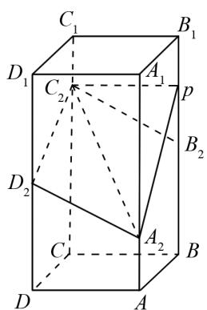
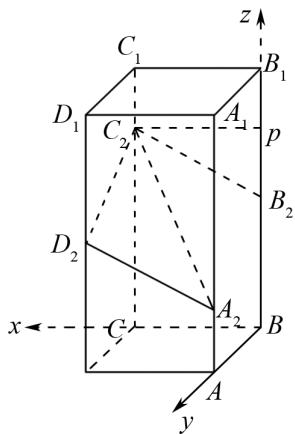
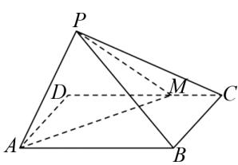
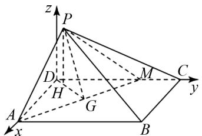

# 向量法在解答立体几何问题中的应用

谭莉(湖北省利川市第二中学 445409)

【摘 要】 空间立体几何是高考数学中的一类必考题型,它既是对学生空间想象能力的深度考验,也是检验学生综合运用数学知识解决问题能力的关键板块.本文结合实际问题,用向量法对立体几何二面角问题、动态问题进行分析,以期提高学生运用向量法的能力.

【关键词】 向量法;二面角;高中数学

在高考立体几何常见题型的求解过程中,向量法提供了一种全新的视角与思路,极大地改变了传统的解题模式.它让原本复杂抽象、需要经过大量逻辑推导和空间想象的立体几何问题,得以转化为相对简洁、有章可循的向量运算,有效降低了问题的难度,同时提高了解题效率.本文旨在系统地梳理向量法在高考立体几何各类常见题型中的具体运用方式,帮助广大考生熟练掌握向量法的解题技巧.

# 1 二面角问题

二面角是每年必考的问题. 借助向量法解答二面角问题的基本步骤为: 先选择几何体中两两垂直的三条直线作为坐标轴, 建立空间直角坐标系; 再根据已知的几何体棱长、边长、角度等条件, 确定构成二面角的两个半平面上关键顶点的坐标; 而后求解两个半平面的法向量; 最后进行求解, 进而判断二面角与法向量夹角的关系.

例 1 如图 1 所示，正四棱柱 ABCD - $A_{1}B_{1}C_{1}D_{1}$ 中，AB = 2, $AA_{1} = 4$ ，点 $A_{2}, B_{2}, C_{2}, D_{2}$ 分别在棱 $AA_{1}, BB_{1}, CC_{1}, DD_{1}$ 上， $AA_{2} = 1, BB_{2} = DD_{2} = 2, CC_{2} = 3$ .

(1) 证明: $B_{2}C_{2} \parallel A_{2}D_{2}$ ;

(2) 点 P 在棱 $BB_{1}$ 上, 当二面角 $P-A_{2}C_{2}-D_{2}$ 为 $150^{\circ}$ 时, 求 $B_{2}P$ .

解析 (1) 略.

(2) 如图 2 所示, 建立空间直角坐标系.

text_image

C₁
D₁
C₂₁
A₁
p
B₁
D₂
C
A₂
B
D
A

图1

text_image

C₁
D₁
C₂
A₁
p
B₁
D₂
x ←
C
A₂
B
A
y
z

图2

设 $P(0,0,t)$ ，由 $C_{2}(2,0,3)$ , $A_{2}(0,2,1)$ , $D_{2}(2,2,2)$ ,

得 $\overrightarrow{A_{2}D_{2}}=(2,0,1),\overrightarrow{A_{2}C_{2}}=(2,-2,2),\overrightarrow{A_{2}P}=(0,-2,t-1)$ ,

设平面 $A_{2}C_{2}D_{2}$ 的一个法向量为 $\boldsymbol{m}=(x_{1},y_{1},z_{1})$ ,

则 $\left\{\begin{aligned}m & \cdot\overrightarrow{A_{2}D_{2}}=0,\\ m & \cdot\overrightarrow{A_{2}C_{2}}=0,\end{aligned}\right.$

即 $\left\{\begin{aligned}&2x_{1}+z_{1}=0,\\ &2x_{1}-2y_{1}+2z_{1}=0.\end{aligned}\right.$

令 $z_{1} = -2$

则 $x_{1}=1, y_{1}=-1$ ,

故 $\boldsymbol{m}=(1,-1,-2)$ ,

同理, 平面 $PA_{2}C_{2}$ 平面法向量 $\boldsymbol{n}=(t-3,t-1,2)$ ,

因二面角 $P-A_{2}C_{2}-D_{2}$ 的平面角为 $150^{\circ}$ ,

所以 $|\cos < m \cdot n >| = \frac{|m \cdot n|}{|m| \cdot |n|} = \frac{6}{\sqrt{6} \cdot \sqrt{(t - 3)^2 + (t - 1)^2 + 4}} = \frac{\sqrt{3}}{2}$ ,

解得 t=1 或 3，

则 $B_{2}P = 1$

评注 借助向量法解答二面角问题,解题步骤较为固定,需要学生在日常学习中总结经验,提高计算速度与准确性,进而快速解答问题.

# 2 动态问题

立体几何动态问题也是一类常见题型,常见的命题情境有动点问题、翻转问题及旋转问题等.在借助向量法解答动态问题时,首先要依据几何体的初始静态结构,选取合适的两两垂直的直线作为坐标轴,建立空间直角坐标系.而后设出动点坐标,如对于动点问题,根据动点的运动范围和条件,设出其坐标.对于翻折和旋转问题,分析翻折或旋转前后点的位置变化规律,结合几何关系,用参数表示变化后的点坐标.在此基础上,根据所求问题,确定需要的向量,利用向量运算求解.最后根据动点坐标中参数的变化范围,或者翻折、旋转过程中参数的变化,分析所求角度、距离等的变化情况.

例 2 如图 3 所示, 长方形 ABCD 中, AD = 2, AB = 3, $CM = \frac{1}{3}CD$ , 将 $\triangle ADM$ 沿 AM 翻折到 $\triangle PAM$ , 连接 PB, PC 得 P - ABCM, 设二面角 P - AM - D 的大小为 $\theta$ , 若 $\theta \in \left(0, \frac{\pi}{2}\right]$ , 求平面 PAM 与 PBC 夹角余弦值的最小值.

text_image

P
D
M
C
A
B

图 3

text_image

z
P
D
H
G
M
C
y
A
x
B

图 4

解析 取 AM 中点 G，连接 DG, PG，有 $DG \perp AM, PG \perp AM$ ，即 $\angle PGD$ 为 $\theta$ .

建立如图 4 的坐标系, 则 A(2,0,0), M(0,2,0), C(0,3,0), B(2,3,0),

过 P 作 $PH \perp DG$ 于 H，

得 $PH \perp$ 平面 ABCM.

设 $P(x_{0}, y_{0}, z_{0})$ ,

则 $x_0 = y_0 = \sqrt{2}(1 - \cos \theta) \times \frac{\sqrt{2}}{2} = 1 - \cos \theta, z_0 = \sqrt{2}\sin \theta,$

则 $P(1-\cos\theta,1-\cos\theta,\sqrt{2}\sin\theta)$ ,

故 $\overrightarrow{AM}=(-2,2,0)$ ,

$$
\overrightarrow {P A} = (1 + \cos \theta , \cos \theta - 1, - \sqrt {2} \sin \theta).
$$

设平面 PAM 一个法向量为 $\boldsymbol{n}=(x_{1},y_{1},z_{1})$ ,

则 \( \left\{\begin{aligned}-2x\_{1}+2y\_{1}&=0,\\(1+\cos\theta)x\_{1}+(\cos\theta-1)y\_{1}-\sqrt{2}z\_{1}\sin\theta&=0,\end{aligned}\right. \)

令 $z_{1}=\sqrt{2}\sin\theta$ ,

得 $\boldsymbol{n}=(\sin\theta,\sin\theta,\sqrt{2}\cos\theta)$ ,

设平面 PBC 一个法向量为 $\boldsymbol{m}=(x_{2},y_{2},z_{2})$ ,

可得 $\boldsymbol{m}=(0,\sqrt{2}\sin\theta,2+\cos\theta)$ ,

则 $\cos\alpha=\frac{\left|\boldsymbol{n}\cdot\boldsymbol{m}\right|}{\left|\boldsymbol{n}\right|\cdot\left|\boldsymbol{m}\right|}=\frac{\left|2\cos\theta+1\right|}{\sqrt{-\cos^{2}\theta+4\cos\theta+6}}.$

令 $t = 2 \cos \theta + 1 \left( \theta \in \left( 0, \frac{\pi}{2} \right] \right)$ ,

所以 $t \in [1,3]$ ,

则 $\cos\theta=\frac{t-1}{2}$ ,

即 $\cos\alpha=\frac{1}{\sqrt{\frac{15}{4}\left(\frac{1}{t}+\frac{1}{3}\right)^{2}-\frac{2}{3}}}$ ,

当 t=1 时, $\cos\alpha$ 有最小值 $\frac{\sqrt{6}}{6}$ ,

故平面 PAM 与 PBC 夹角余弦值的最小值为 $\frac{\sqrt{6}}{6}$ .

评注 借助向量法解答翻转问题时,前部分解题步骤与二面角相似,不同的是动态问题需要注意参数的范围,除此之外,还要注意动态过程的分析及特殊位置的考虑.

# 3 结语

综上所述,向量法为解答空间向量常见题型提供了一套系统且高效的解题策略.向量法解题有着规范的通用步骤,构建合理坐标系是基础,直接影响着点坐标的确定与后续运算的复杂程度.准确算出点坐标后,求出关键向量,再代入公式进行运算,最终依据运算结果即可得出几何结论.

# 参考文献：

[1] 庞德艳. 空间向量在解答立体几何问题中的运用 [J]. 高中数理化, 2024(5): 39-40.  
[2] 马应雄. 向量方法在立体几何问题中的常见应用 [J]. 中学数学, 2022(23): 64-65.