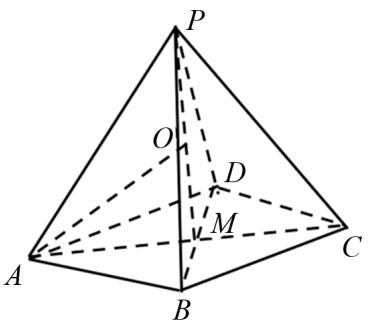

# 四招破解锥体外接球问题

莫仕坤(湖北省十堰市房县第一中学 442100)

【摘 要】 球是高中数学立体几何知识体系中的核心知识点之一. 在对球的考查中, 锥体的外接球问题是近几年高考的热点题型. 本文根据近几年高考的题型总结出处理锥体外接球的四种方式, 并以例题的形式展开讨论, 提炼出具体的解题方法.

【关键词】高中数学;锥体;外接球;解题方法

锥体的外接球问题是高考的热点题型,也是难点,主要原因是球心位置不好确定.本文通过对近几年高考对锥体外接球问题的考查情况进行全面梳理,并分析总结题型,根据题型总结出四种处理锥体外接球问题的方法,分别是作高定球心、作面的垂线确定球心、特殊形状确定球心和利用球周角确定球心,这四种方法分别针对四种不同且常见的题型,下面一一进行例题讲解.

# 1 作高确定球心

这种方法主要是针对正多棱锥的外接球问题，通过寻找(或作出)正多棱锥的高,其外接球的球心必在高上,再构造一个直角三角形则可以求出外接球的半径,进而解决锥体外接球问题.

例 1 已知四棱锥 P-ABCD 中, PA=PB=PC=PD= $\sqrt{5}$ , 底面是边长为 $\sqrt{2}$ 的正方形, 求四棱锥 P-ABCD 外接球的表面积.

解 如图 1 所示, 过点 P 作四棱锥的高, 垂足记为 M, 则四棱锥 P-ABCD 的外接球球心必在 PM 上. 设 PM 上一点 O 为球心, 连接 OA. 设四棱锥 P-ABCD 的外接球半径为 R.

text_image

P
O
D
M
A
B
C

图 1

已知 PA = PB = PC = PD = $\sqrt{5}$ ，底面是边长为$\sqrt{2}$ 的正方形，

所以 $AM=\frac{1}{2}AC=\sqrt{AB^{2}+BC^{2}}=1$ ，

所以 $PM = \sqrt{PA^{2} - AM^{2}} = 2.$

因为 PO = OA = R，

所以在 $\triangle OAM$ 中，有 $(PM-R)^{2}+AM^{2}=R^{2}$ ，
即 $(2-R)^{2}+1^{2}=R^{2}$

解得 $R=\frac{5}{4}$ ,

所以四棱锥 P-ABCD 外接球的表面积为 V=4×π× $R^{2}=\frac{25}{4}\pi$ .

评注 该题是求正四棱锥的外接球的表面积，解决这类问题的关键是确定球心，然后根据所确定的球心构造一个三角形，通过这个三角形求出外接球的半径，利用公式求表面积即可。在确定外接球的球心时，因为底面为正方形，且侧棱相等，所以四棱锥的外接球球心在锥体的高线上，所有正多棱锥的外接球球心均在其高线上。

# 2 作垂线确定球心

该方法主要针对特定类型的三棱锥,即三棱锥中存在一条棱与某一个表面垂直,且该表面的外接圆圆心容易找出的题型,则该三棱锥的外接球球心一定在这条垂直于表面的棱所在的直线上.

例 2 已知三棱锥 A-BCD 中, $AB \perp$ 平面 BCD, AB = 4, BC = 2, $\angle BDC = \frac{\pi}{6}$ , 求三棱锥 A-BCD 的外接球半径.

解 因为 $BC = 2, \angle BDC = \frac{\pi}{6}$ ,

所以 $\triangle BCD$ 的外接圆直径

$$
2 r = \frac {B C}{\sin \angle B D C} = 4,
$$

则 $\triangle BCD$ 的外接圆半径 r=2.

过 $\triangle BCD$ 的外接圆圆心作平面 BCD 的垂线，垂足记为 M，则三棱锥 A-BCD 的外接球球心必在垂线上，球心记为 O，三棱锥 A-BCD 的外接球记

为R.

因为 $AB \perp$ 平面 BCD，

所以 $OM \parallel AB$ .

连接OA, OB, 所以OA = OB = R, 则 $\triangle OAB$ 为等腰三角形,

所以 $OM = \frac{1}{2} AB = 2$ ,

所以 $R=\sqrt{r^{2}+OM^{2}}=2\sqrt{2}$ .

评注 该题是一般的三棱锥,其中满足 $AB \perp$ 平面 BCD, $BC = 2, \angle BDC = \frac{\pi}{6}$ , 所以在确定球心位置时, 是先确定平面 BCD 的外接圆圆心位置, 过平面 BCD 的外接圆圆心作平面 BCD 的垂线, 则三棱锥 A - BCD 的外接球球心必在垂线上, 记为 O, 然后构造直角三角形即可求出外接球半径.

# 3 特殊形状确定球心

在求三棱锥的外接球问题中,有一种比较常见的题型是:可将三棱锥外形还原为一个长方体或正方体,则三棱锥的外接球问题可转化为该长方体或正方体的外接球问题.这种题型的主要特征是三棱锥的三组对棱分别相等.

例 3 已知三棱锥 P-ABC 中, $PA=BC=\sqrt{5}$ , $PB=AC=\sqrt{3}$ , $PC=AB=\sqrt{6}$ , 求三棱锥 P-ABC 的外接球的体积.

解 已知三棱锥 P-ABC 的各棱都是一长方体的面对角线，设该长方体的长，宽，高分别为 a, b, c，

则有 $a^2 + b^2 = 5, b^2 + c^2 = 6, a^2 + c^2 = 3,$

解得 a=2, b=1, $c=\sqrt{2}$ ,

所以三棱锥 $P - ABC$ 的外接球直径

$$
2 R = \sqrt {a ^ {2} + b ^ {2} + c ^ {2}} = \sqrt {7},
$$

则半径 $R=\frac{\sqrt{7}}{2}$ ,

所以三棱锥 P-ABC 的外接球体积为

$$
V = \frac {4}{3} \pi R ^ {3} = \frac {4}{3} \times \pi \times \frac {7 \sqrt {7}}{8} = \frac {7 \sqrt {7} \pi}{6}.
$$

评注 该题是求三棱锥的外接球体积, 其中 $PA = BC = \sqrt{5}$ , $PB = AC = \sqrt{3}$ , $PC = AB = \sqrt{6}$ , 因此满足“三组对棱分别相等”的特征, 可将该三棱锥补形放入一个长方体中进行求解, 则三棱锥外接球问题转化为长、宽、高分别为 a、b、c 的长方体外接球问题,其直径为长方体的体对角线,求出长方体的长、宽、高,进而计算出外接球半径,即可解决原问题.

# 4 利用球周角确定球心

该方法主要针对三棱锥中存在一条棱,该棱所对的两个面内的角均为直角,求其外接球的表面积和体积问题.根据“直径所对的圆周角为直角”的性质,同样适用于球面上.

例 4 已知三棱锥 P-ABC 中, $\angle PBA=\frac{\pi}{2}$ , PC ⊥ 平面 ABC, PA=4, 求三棱锥 P-ABC 的外接球的表面积.

解 已知 $PC \perp$ 平面 ABC,

所以 $PC \perp AC$ ,

所以 $\angle PCA = \frac{\pi}{2}.$

又 $\angle PBA = \frac{\pi}{2}$

所以 PA 就是三棱锥 P-ABC 的外接球直径，则半径 $R=\frac{1}{2}PA=2$ ，

所以三棱锥 P-ABC 的外接球的表面积 $S = 4\pi R^{2} = 16\pi$ .

评注 该题是求三棱锥的外接球表面积,其中棱 PA 所对的角都是直角,因此根据球的性质,PA 就是三棱锥 P-ABC 的外接球直径,则其中点为球心,再利用球的表面积公式即可求出外接球的表面积.

# 5 结语

锥体的外接球问题是高考的热点题型,也是难点题型、易错题型.文章通过对高考题型的梳理分析,大致可以分为正多棱锥的外接球问题、一条棱垂直一个面的三棱锥外接球问题、一条棱所对的角均为直角的三棱锥的外接球问题、由正方体或长方体面对角线构成的三棱锥外接球问题等常见类型,针对不同类型的问题,需用不同的方法,本文总结了四种处理锥体外接球问题的方法.

# 参考文献：

[1] 张晓玲. 三法求锥体外接球的半径 [J]. 中学生数学, 2020(9):48.  
[2] 沈清臣. 几类特殊的多面体的外接球问题 [J]. 数理化解题研究, 2020(28): 61-63.  
[3] 张微微. 补形法秒解三棱锥外接球问题 [J]. 高中数理化, 2017(10): 23.