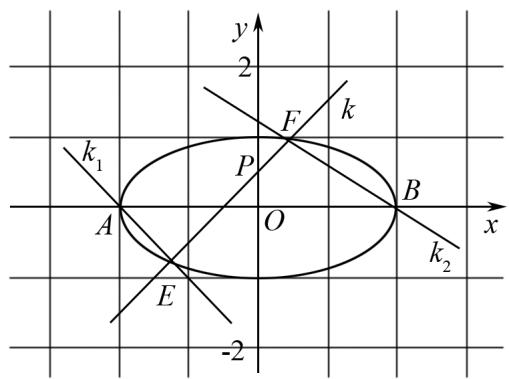
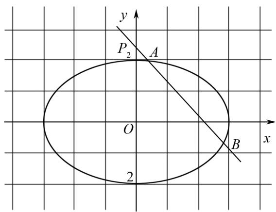
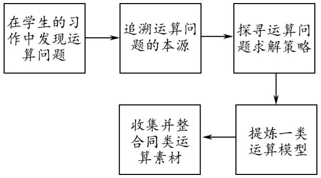
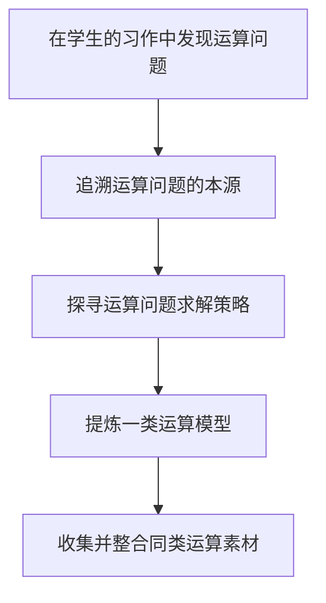

# 基于新高考情境下的数学运算问题教法探究

# ——以圆锥曲线中韦达定理应用为例

张俊畅(广东省大埔县虎山中学 514247)

【摘 要】 本文是在新高考试题改革的情境下,从一道直线与圆锥曲线位置关系的运算问题出发,探讨非对称韦达定理问题的求解模型,并以此模型的发现、分析和提炼过程为基础,探索数学运算类问题教学的“五环节”模式.

【关键词】 问题模型;高中数学;课堂教学

在解析几何的考查中, 直线与圆锥曲线的位置关系一直是其中的一个热点, 也是一个难点问题, 许多学生面对此类问题时, 难以跳出“三板斧”, 即设出直线方程, 联立方程并化简, 写出韦达定理. 但接下来怎么做, 如何算, 却是一头雾水, 特别是遇到一些复杂的代数式化简, 常常束手无策, 找不到问题解决的本质. 为此我们将从学生试题中的一道题出发, 从此类问题的形成、解法及运算问题教学等方面展开研究.

# 1 问题的形成

# 1.1 问题呈现

例1 已知椭圆 $\frac{x^2}{a^2} + \frac{y^2}{b^2} = 1 (a > b > 0)$ 的离心率为 $\frac{\sqrt{2}}{2}$ , 右准线方程为 $x = 2\sqrt{2}$ .

text_image

y
2
F
k
k₁
P
A
O
B
x
k₂
E
-2

图1

(1) 求椭圆的标准方程;

(2) 设 $P(0,1)$ , A, B 为椭圆的左右顶点, 过 A 作斜率为 $k_{1}$ 的直线交椭圆于点 E, 连接 EP 并延长交椭圆于点 F, 如图 1 所示, 记直线 BF 的斜率为 $k_{2}$ , 若 $k_{1}=3k_{2}$ , 求直线 EF 的方程.

# 1.2 运算疑问

问题第一问,所求椭圆方程为 $\frac{x^{2}}{4}+\frac{y^{2}}{2}=1$ ,对于第二问,由题意知,直线的斜率显然存在,设直线EF的方程为 $y=kx+1,E(x_{1},y_{1}),F(x_{2},y_{2})$ ,联立直线EF与椭圆C的方程, $\left\{\begin{aligned}\frac{x^{2}}{4}+\frac{y^{2}}{2}&=1,\\ y=kx+1,\end{aligned}\right.$ 得 $(2k^{2}+1)x^{2}+4kx-2=0$ ,所以 $x_{1}+x_{2}=\frac{-4k}{2k^{2}+1}$ , $x_{1}\cdot x_{2}=\frac{-2}{2k^{2}+1}$ ,因为 $k_{1}=3k_{2}$ ,所以 $\frac{y_{1}}{x_{1}+2}=\frac{3y_{2}}{x_{2}-2}$ ,又 $y_{1}=kx_{1}+1,y_{2}=kx_{2}+1$ ,代入上式,化简得, $2kx_{1}x_{2}+(2k+3)x_{1}+(6k-1)x_{2}+8=0①$ .

此时,发现上式无法由韦达定理 $x_{1} + x_{2}, x_{1}x_{2}$ 直接得到,如果 $x_{1}$ 与 $x_{2}$ 前面的系数相同,则能顺利代入韦达定理,问题得以解决,这里我们把这类 $x_{1}$ 与 $x_{2}$ 前面的系数不相等的情况,称之为圆锥曲线的“非对称问题”,那么,这个问题该怎么解决呢?

# 2 运算问题求解探析

多角度探寻该运算问题的求解办法.

角度 1 借助求根公式,突破运算障碍.

由求根公式可知 $x = \frac{-2k\pm\sqrt{8k^2 + 2}}{2k^2 + 1}$ ，代入 $①$ 式，得 $(2k + 3)(-2k + \sqrt{8k^2 + 2}) + (6k-$ $1)(-2k - \sqrt{8k^2 + 2}) - 4k + 8(2k^2 +1) = 0$ ，化简得$(k-1)(\sqrt{8k^{2}+2}+2)=0$ ，所以 k=1，所以直线 EF 的方程为 $y=x+1$ .

评注 通过求根公式, 把方程 $(2k^{2}+1)x^{2}+4kx-2=0$ 的两个根求出来, 达到消除 $x_{1}$ 与 $x_{2}$ 前面系数不对称问题的目的, 显然这种做法运算量较大, 比较考验学生的数式运算化简能力, 解题的效率比较低.

角度 2 发掘对象关系,降低运算难度.

将式子 $\frac{y_{1}}{x_{1}+2}=\frac{3y_{2}}{x_{2}-2}$ ,

两边平方得 $\frac{y_{1}^{2}}{(x_{1}+2)^{2}}=\frac{9y_{2}^{2}}{(x_{2}-2)^{2}}$ ,

因为 $y_{1}^{2}=2-\frac{1}{2}x_{1}^{2},y_{2}^{2}=2-\frac{1}{2}x_{2}^{2}$

将其代入上式化简，得 $\frac{2 - x_1}{x_1 + 2} = \frac{9(2 + x_2)}{2 - x_2}$

即 $2x_{1}x_{2}+5(x_{1}+x_{2})+8=0$ ,

将 $x_{1} + x_{2} = -\frac{4k}{2k^{2} + 1}, x_{1} \cdot x_{2} = -\frac{2}{2k^{2} + 1}$ ,

代入化简得 $4k^{2}-5k+1=0$ ，

解得 $k=\frac{1}{4}$ 或 k=1，经检验 $k=\frac{1}{4}$ 不符合题意，所以 k=1，所以直线 EF 的方程为 $y=x+1$ .

评注 在解决直线与椭圆的位置关系的运算问题时,通常借助于直线方程进行消元,常常忽视了椭圆方程也可以起到消元的效果,而借助椭圆方程消元,恰好能实现将非对称结构转化为对称结构,利用韦达定理快速求解,突破了学生的解题认知局限.

角度 3 发现联系,不破不立.

由 $2kx_{1}x_{2} + (2k + 3)x_{1} + (6k - 1)x_{2} + 8 = 0①$

又 $x_{1} + x_{2} = \frac{-4k}{2k^{2} + 1}, x_{1} \cdot x_{2} = \frac{-2}{2k^{2} + 1}$ ,

两式相除, 得 $2kx_{1} \cdot x_{2} = x_{1} + x_{2}$ ,

所以 ① 式可化为 $(k+2)x_{1}+3x_{2}+4=0$ ，

由 $\left\{\begin{aligned}(k+2)x_{1}+3x_{2}+4=0,\\ x_{1}+x_{2}&=\frac{-4k}{2k^{2}+1},\end{aligned}\right.$

消去 $x_{2}$ , 得 $(k - 1)x_{1} = \frac{-2(k^{2} - 1)}{2k^{2} + 1}$ ,

所以 $(k-1)\left[x_{1}+\frac{2(k^{2}-1)}{2k^{2}+1}\right]=0,$

所以 k=1 或 $x_{1}+\frac{2(k^{2}-1)}{2k^{2}+1}=0$ (舍去)，

所以直线 EF 的方程为 $y = x + 1$ .

评注 利用联系的视角看待数学运算对象, 发现韦达定理的两根之和与两根之积之间, 蕴含着 $2kx_{1}x_{2}=x_{1}+x_{2}$ 这一关系, 把这一关系代入方程①, 化积为和, 结合韦达定理 $x_{1}+x_{2}=-\frac{4k}{2k^{2}+1}$ , 通过消掉 $x_{2}$ , 对式子因式分解后, 即可得到结果.

# 3 运算问题模型的提炼

# 3.1 以点带面,探寻问题的本源

在一元二次方程 $ax^{2} + bx + c = 0 (a \neq 0)$ 中，若 $\Delta = b^{2} - 4ac > 0$ ，设它的两个根分别为 $x_{1}, x_{2}$ ，根据韦达定理，我们有 $x_{1} + x_{2} = -\frac{b}{a}, x_{1} \cdot x_{2} = \frac{c}{a}$ ，借此我们能够快速处理比如 $x_{1}^{2} + x_{2}^{2}, (x_{1} - x_{2})^{2}, \frac{1}{x_{1}} + \frac{1}{x_{2}}, \frac{x_{2}}{x_{1}} + \frac{x_{1}}{x_{2}}, \frac{1}{x_{1}^{2}} + \frac{1}{x_{2}^{2}}, x_{1}x_{2}^{2} + x_{1}^{2}x_{2}, (x_{1} + m)(x_{2} + m), |x_{1} - x_{2}|, |x_{1}| + |x_{2}|$ 等结构，但涉及不同系数的代数式的运算，比如求 $\frac{x_{1}}{x_{2}}, \frac{ax_{1}x_{2} + \lambda_{1}x_{1} + \mu_{1}x_{2}}{bx_{1}x_{2} + \lambda_{2}x_{1} + \mu_{2}x_{2}} (\lambda_{1} \neq \mu_{1}, \lambda_{2} \neq \mu_{2}), ax_{1} + bx_{2} + c = 0 (a \neq b), ax_{1}x_{2} + bx_{1} + cx_{2} + d = 0 (b \neq c)$ 等之类的结构，相对比较难以转化到应用韦达定理来处理，主要原因是 $x_{1}, x_{2}$ 的系数不对称，无法直接转化为韦达定理，我们称之为“非对称韦达定理问题”.

数学运算教学的前提是明确运算对象,发现学生在问题求解过程中存在的运算疑问,因此对疑问进行本源性的追溯,理解运算对象包括:数字,变量表达式,数据结构的含义,提炼运算问题模型,寻找相关的问题素材,为运算教学的开展做好铺垫.

# 3.2 提炼本质,探寻问题解决办法

非对称韦达定理问题,通常有三种解法.

# 3.2.1 直接求解

直接利用一元二次方程的求根公式解出 $x_{1} =$

$\frac{-b-\sqrt{b^{2}-4ac}}{2a},x_{2}=\frac{-b+\sqrt{b^{2}-4ac}}{2a}$ ，但由于形式过于复杂，后续的求解过程中可能会出现计算量过大的情况，不予推荐.

# 3.2.2 解多元方程组

遇到 $\frac{x_{1}}{x_{2}}=\lambda,\lambda x_{1}+\mu x_{2}(\lambda\neq\mu)$ 等结构,可以将其与 $x_{1}+x_{2}=-\frac{b}{a},x_{1}\cdot x_{2}=\frac{c}{a}$ 联立得到关于 $x_{1},x_{2},\lambda,\mu$ 的多元方程组,从而解出 $x_{1},x_{2},\lambda,\mu$ 的具体值或者关于参数的表达式.

# 3.2.3 和积互化

遇到以下非对称结构： $\frac{ax_{1}x_{2}+\lambda_{1}x_{1}+\mu_{1}x_{2}}{bx_{1}x_{2}+\lambda_{2}x_{1}+\mu_{2}x_{2}}$ $(\lambda_{1}\neq\mu_{1},\lambda_{2}\neq\mu_{2}),\frac{kx_{1}\cdot x_{2}+\lambda x_{2}}{kx_{1}\cdot x_{2}+\mu x_{2}},ax_{1}x_{2}+bx_{1}+cx_{2}+d=0(b\neq c)$ ，则需要先求出 $x_{1}+x_{2}$ 与 $x_{1}\cdot x_{2}$ 之间的数量关系，如 $x_{1}\cdot x_{2}=\frac{3}{2}(x_{1}+x_{2})$ ，然后利用此数量关系将所求式子中的两根之积 $x_{1}\cdot x_{2}$ 全部替换成 $x_{1}+x_{2}$ ，从而达到化简计算的目的.

# 4 同类问题的素材收集与整合

例 2 过点 $P(0,3)$ 的直线 l 与椭圆 $\frac{x^{2}}{9} + \frac{y^{2}}{4} = 1$ 依次交于 A, B 两点，如图 2 所示，求 $\frac{AP}{PB}$ 的取值范围.

text_image

y
P₂ A
O
2
x
B

图 2

解 设 $A(x_{1},y_{1})$ , $B(x_{2},y_{2})$ ，当直线 l 垂直于 x 轴时，可求得 $\frac{AP}{PB} = \frac{1}{5}$ ; 当直线 l 与 x 轴不垂直时，设直线 $l$ 的方程为 $y = kx + 3$ ，由 $\left\{ \begin{array}{l}y = kx + 3,\\ \frac{x^2}{9} +\frac{y^2}{4} = 1, \end{array} \right.$ 消 $y$ 化简，得 $(9k^{2} + 4)x^{2} + 54kx+$ $45 = 0,\Delta = (54k)^{2} - 4\times 45\times (9k^{2} + 4) =$ $144(9k^{2} - 5) > 0$ ，得 $k^2 >\frac{5}{9}$ ，由韦达定理，得 $x_{1}+$ $x_{2} = -\frac{54k}{9k^{2} + 4},x_{1}\cdot x_{2} = \frac{45}{9k^{2} + 4}$ 设 $\frac{AP}{PB} = \frac{x_1}{x_2} =$ $\lambda (0 <   \lambda <  1)$ ，则 $x_{1} = \lambda x_{2}$ ，所以 $x_{1} + x_{2} = \lambda x_{2}+$ $x_{2} = (\lambda +1)x_{2} = -\frac{54k}{9k^{2} + 4},x_{1}\cdot x_{2} = \lambda x_{2}^{2} =$ $\frac{45}{9k^2 + 4}$ ，由 $\left\{ \begin{array}{ll}(\lambda +1)x_2 = -\frac{54k}{9k^2 + 4}\\ \lambda x_2^2 = \frac{45}{9k^2 + 4}\end{array} \right.$ $①,$ $\frac{①^2}{②}$ 得 $\lambda +$ $\frac{1}{\lambda} +2 = \frac{324k^2}{5(9k^2 + 4)} = \frac{324}{5}\times \frac{1}{9 + \frac{4}{k^2}}.$ 因为 $k^2 >\frac{5}{9},$ 所以 $4 <   \lambda +\frac{1}{\lambda} +2\leqslant \frac{36}{5}$ 即 $4 <   \lambda +\frac{1}{\lambda} +2\leqslant \frac{36}{5},$ 所以 $2 <   \lambda +\frac{1}{\lambda}\leqslant \frac{26}{5}$ 所以 $\frac{1}{5}\leqslant \lambda <  1$ ，综上可知， $\frac{AP}{PB}$ 的取值范围为 $\left[\frac{1}{5},1\right)$

评注 联立 $x_{1} = \lambda x_{2}, x_{1} + x_{2} = -\frac{54k}{9k^{2} + 4},$ $x_{1} \cdot x_{2} = \frac{45}{9k^{2} + 4}$ , 通过解多元方程组, 消去 $x_{2}$ , 得到 $\lambda$ 与 $k$ 的关系式, 进而求得参数 $\lambda$ 的取值范围, 该素材可以整合到问题模型的解法 2 中.

# 5 运算问题教法探究

根据《普通高中数学课程标准(2017年版2020年修订)》对数学运算的定义,数学运算问题解决主要包括:理解运算对象⇒掌握运算法则⇒探究运算思路⇒选择运算方法⇒设计运算程序⇒求得运算结果,这六个环节.

数学运算教学,主要就是围绕数学运算问题解决的几个关键环节来展开,精心挑选学生学习中暴露的热点难点问题作为教学内容,合理设计教学方案,选择适当的教学方法,组织好教学活动或课后实践活动等的一种教学形式. 为此笔者总结了数学运算问题教学的“五环节”模式, 如图 3 所示.

flowchart

图3

第一环节: 发现典型的运算问题. 收集学生在平时的学习、作业和考试中, 暴露出来的典型性的运算问题, 并进行分析与整理, 在课堂上展示该类问题, 老师启发学生从多角度、多层面解读运算求解对象.

第二环节:追溯运算问题的本源.师生合作共同追溯该运算问题的本源,哪里算不下去?为什么算不下去?这个问题要怎么解决?为什么可以这样解决?探寻运算问题解决的底层逻辑,也就是运算的算理,即在对运算对象实施数学运算的过程中,对运算的原理、法则、公式等背后的数学道理和逻辑关系的理解与把握.

第三环节:探寻运算问题求解的策略.师生基于第一环节中对运算对象进行的多角度、多层次解读,从多方位探寻该运算问题的求解策略,老师进行启发引领,学生进行思考探索,并对各种解法进行优化,设计科学的运算求解程序.

第四环节: 提炼一类运算模型. 师生共同分析该运算问题的特征, 根据问题的共性提炼出一类问题模型, 并结合问题的特征, 从多角度总结该类问题的求解策略.

第五环节: 收集并展示同类运算素材, 在课堂教学中这一环节可以由学生来完成, 同学们可以利用课后的时间, 按照老师的要求, 上网收集同类的问题, 按问题模型的不同角度进行分类整理, 把学生的优秀成果展示出来, 由学生组织讲解, 合作完成.

# 6 结语

这一轮高考综合改革,要打破投入全部精力训练出来的传统应试教育模式下的刷题技能,要实现从“考知识”向“考能力素养”的转变,通过规范系统的信息加工、逻辑推理、合理论证、科学探究、思维建模、理性精神、批判性思维等训练,培养适应终身发展和社会发展需要的可迁移能力.传统那套基于知识简单占有的“死记硬背”与“题海战术”在新高考中将逐渐失效,只有通过规范、系统、有针对性的关键能力训练和学科素养提升,才能应对新高考的要求.

数学运算问题“五环节”教学模式,正是基于这一理念的产物,是对高中数学核心素养在一线教学中落地的一种有益尝试.高中数学教改一直在改,一直在发展,唯一不变的是其持续优化的方向,教师要在不断的变化中成长,在反复的实践中提升自我.

【本文系广东省教育科学规划领导小组办公室2025年度中小学教师教育科研能力提升计划项目一般课题《基于结构化教学的高中数学运算素养培养研究》研究成果,课题编号:2025YQJK0990】

参考文献：

[1] 中华人民共和国教育部．普通高中数学课程标准(2017年版2020年修订)[S]. 北京：人民教育出版社，2020.