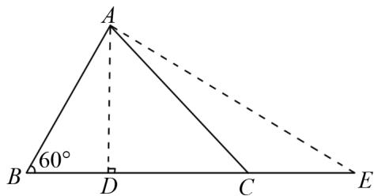
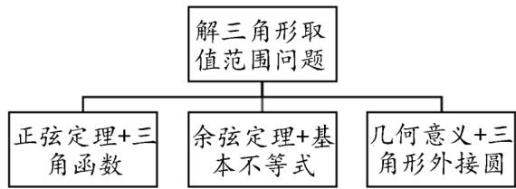
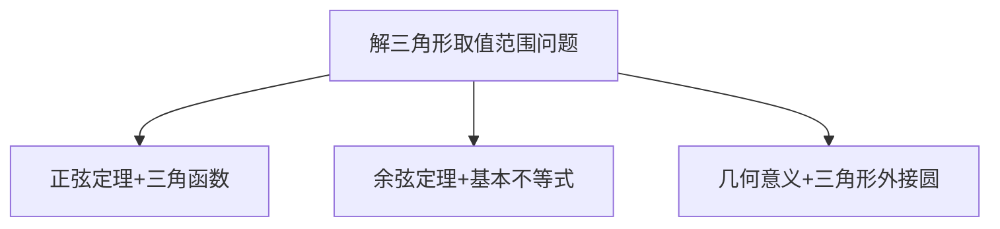

# 基于问题驱动的高中数学“一例式”教学情境设计

# ——以解三角形中取值范围问题为例

王慧(广东肇庆中学 526060)

【摘 要】 在“三新”教育理念指导下,高中数学教学聚焦于学生数学学科核心素养的培养,致力于通过构建优质教学环境、激发深度思维、展现数学本质等方式推动教学实践革新,这已成为当前教学改革的关键议题.本文以“三角形最值与范围问题求解”课程为例,采用问题驱动教学模式,实施“一例式”情境教学设计,旨在引导学生在自主探究中提升思维能力,培养理性分析问题与反思解题策略的能力.

# 【关键词】解三角形;情境教学;高中数学

问题驱动式教学法由苏联教育学家马丘什金与马赫穆托夫率先提出,其核心在于通过以问题为导向的教学设计,有效激发学生的主动学习意愿.“一例式”场景教学作为情境教学的实际应用模式,强调以单一情境贯穿课堂始终,在连贯的情境背景下整合探究活动,有计划、有目的地引导学生深度参与学习.本文依据问题驱动式教学理念,利用一道高考解三角形求最值问题,帮助学生深入理解并掌握解三角形最值问题的核心知识点.

例题 （2020 年全国 Ⅱ 卷文科数学）△ABC 中， $\sin^{2}A - \sin^{2}B - \sin^{2}C = \sin B \sin C.$

(1) 求角 A;

(2) 若 BC = 3，求 $\triangle ABC$ 周长的最大值.

分析 此题第(1)问中由正余弦定理易得 $A = \frac{2\pi}{3}$ ，在第(2)问中已知边 a = 3，相当于已知三角形一边及其对角，求周长的最大值，即求 $b + c + 3$ 的最大值.

问题 1 能否用多种方法解出第(2)问?

数学问题的解答常需要多角度探索,解题者应积极寻求多样化的解题策略,并对其进行分类整理.整理过程中,需明确每种方法的适用范围、核心步骤及易犯错误,以便系统掌握.通过系统梳理解题策略,可助力学生构建系统化的知识体系,贯通不同方法间的脉络联系,从而在解题过程中迅速定位并应用最佳方案,显著增强解题效能与结果精确度.在高中数学中,针对求取值范围或最值问题,通常的方法包含三种解题思路:一是转换为函数求值域问题;二是运用基本不等式求最值;三是借助几何意义,采用数形结合的方法分析.此题可运用下面三种常规的解题方式展开求解.

解法 1 根据正弦定理 $\frac{a}{\sin A} = \frac{b}{\sin B} = \frac{c}{\sin C} = 2R$ (R 为 $\triangle ABC$ 外接圆的半径)，

可知 $\frac{a}{\sin A}=\frac{3}{\frac{\sqrt{3}}{2}}=2\sqrt{3}=2R$ ，

所以 $b + c = 2R(\sin B + \sin C) =$

$$
2 \sqrt {3} \left[ \sin \left(\frac {\pi}{3} - C\right) + \sin C \right]
$$

$$
= 2 \sqrt {3} \left(\frac {1}{2} \sin C + \frac {\sqrt {3}}{2} \cos C\right)
$$

$$
= 2 \sqrt {3} \sin \left(C + \frac {\pi}{3}\right),
$$

因为 $C \in \left(0, \frac{\pi}{3}\right)$ ,

所以 $C + \frac{\pi}{3} \in \left( \frac{\pi}{3}, \frac{2\pi}{3} \right)$ ,

所以 $\sin\left(C+\frac{\pi}{3}\right)\in\left(\frac{\sqrt{3}}{2},1\right]$ ,

即当 $C = B = \frac{\pi}{6}$ 时 $\triangle ABC$ 周长可以取得最大值, 最大值为 $3 + 2\sqrt{3}$ .

解法2 根据余弦定理 $\cos A = \frac{b^2 + c^2 - a^2}{2bc} = \frac{b^2 + c^2 - 9}{2bc} = -\frac{1}{2}$ ,

得 $b^{2}+c^{2}=9-bc$ ，

所以 $(b + c)^2 = 9 + bc \leqslant 9 + \left(\frac{b + c}{2}\right)^2,$

则 $(b + c)^2 \leqslant 12$ ，所以 $b + c \leqslant 2\sqrt{3}$ ，

当且仅当 $b=c=\sqrt{3}$ 时， $b+c$ 取得最大值，此时周长可取得最大值，最大值为 $3+2\sqrt{3}$ .

解法 3 由于 $\triangle ABC$ 的外接圆半径 $R = \sqrt{3}$ ，由几何知识知当三角形为等腰三角形时周长最大，即 $\triangle ABC$ 中 $b = c = \sqrt{3}$ 时周长能够取得最大值，最大值为 $3 + 2\sqrt{3}$ .

问题 2 求 $\triangle ABC$ 周长的取值范围.

分析 如果求周长的取值范围,从上述解法1可知角C存在明确的取值范围,因此可以求出周长的取值范围;在解法2中,根据三角形两边之和大于第三边可以求出下限,从而求出周长范围;解法3中利用数形结合也可以求出周长的取值范围.

问题 3 求 $\triangle ABC$ 面积的最大值.

分析 由三角形面积公式知 $S = \frac{1}{2} bc\sin A = \frac{\sqrt{3}}{4} bc$ ，求面积的最大值，即求 $bc$ 的最大值.

根据解法1,利用正弦定理有 $bc=4R^{2}\sin B\sin C$

$$
= 1 2 \sin B \sin C = 6 \left[ \cos \left(\frac {\pi}{3} - 2 C\right) - \frac {1}{2} \right],
$$

即当 $C = B = \frac{\pi}{6}$ 时 $\triangle ABC$ 的面积能够取得最大值.

在解法2中 $b^{2} + c^{2} = 9 - bc\geqslant 2bc$ ，所以 $bc\leqslant$ 3，

当且仅当 $b=c=\sqrt{3}$ 时等号成立, 此时面积取得最大值.

在解法3中， $\triangle ABC$ 的外接圆半径 $R = \sqrt{3}$ ，由几何知识可知，当三角形为等腰三角形时面积最大，即 $\triangle ABC$ 中当 $b = c = \sqrt{3}$ 时面积取得最大值.

问题4 求 $\triangle ABC$ 中 $b^{2} + c^{2}$ 的最大值或 $2b + c$ 的取值范围.

分析 $b^{2}+c^{2}$ 可以利用上述解法1中正弦定理和三角函数通过角范围计算得出,也可利用基本不等式算得,但是针对 $2b+c$ 就不能利用基本不等式求最值,只能利用解法1中角范围计算求得.

“一例式”情境并非仅展示单一例证便终止,而是应将其内涵贯穿于整个教学流程.因此,应在典型例题的框架下,开发多样化训练题并构建拓展探究活动,让学生能够深入挖掘问题.同时,让学生在面对问题时,能迅速分析题目条件,精准选择解题方法,进而提升解题思维能力.能否尝试调整上述例题的条件,例如改为已知一边及其相邻角的情况?

变式 （2019年全国Ⅲ卷理改编）已知 $\triangle ABC$ 为锐角三角形， $B=\frac{\pi}{3}, c=1$ ，求 $\triangle ABC$ 面积的取值范围.

解法 1 根据正弦定理得 $\frac{a}{\sin A} = \frac{b}{\sin B} = \frac{c}{\sin C} = 2R$ (R 为 $\triangle ABC$ 外接圆的半径)，

得 $a=\frac{c\sin A}{\sin C}=\frac{\sin\left(\frac{2\pi}{3}-C\right)}{\sin C}$

$$
= \frac {\frac {\sqrt {3}}{2} \cos C + \frac {1}{2} \sin C}{\sin C} = \frac {\sqrt {3}}{2 \tan C} + \frac {1}{2},
$$

因为 $\triangle ABC$ 为锐角三角形，

所以 $0 < A = \frac{2\pi}{3} - C < \frac{\pi}{2}$ .

则 $C \in \left( \frac{\pi}{6}, \frac{\pi}{2} \right)$ ,

所以 $\tan C \in \left(\frac{\sqrt{3}}{3}, +\infty\right)$ ,

所以 $a \in \left(\frac{1}{2}, 2\right), S_{\triangle ABC} \in \left(\frac{\sqrt{3}}{8}, \frac{\sqrt{3}}{2}\right)$ .

解法2 根据余弦定理得 $\cos B = \frac{a^2 + c^2 - b^2}{2ac}$

$$
= \frac {a ^ {2} + 1 - b ^ {2}}{2 a c} = \frac {1}{2},
$$

得 $b^{2}=a^{2}-a+1$ ，

又因为 $\triangle ABC$ 为锐角三角形, 根据余弦定理易知 $\left\{\begin{aligned}a^{2}+b^{2}>c^{2},\\ a^{2}+c^{2}>b^{2},\\ b^{2}+c^{2}>a^{2},\end{aligned}\right.$

所以 $a \in \left(\frac{1}{2}, 2\right) S_{\triangle ABC} \in \left(\frac{\sqrt{3}}{8}, \frac{\sqrt{3}}{2}\right)$ .

解法 3 如图 1 所示, 可以将此题转化为点 C 移动过程中, 当 $C=90^{\circ}, A=30^{\circ}$ 时 $\triangle ABC$ 的面积取最小值时的临界状态 (取不到最小值, 参考图中 D 点位置), 此时 $a=\frac{1}{2}$ ; 当 $A=90^{\circ}, C=30^{\circ}$ 时 $\triangle ABC$ 的面积取最大值时的临界状态 (取不到最大值, 参考图中 E 点位置), 此时 a=2; 因此 $S_{\triangle ABC} \in \left(\frac{\sqrt{3}}{8}, \frac{\sqrt{3}}{2}\right)$ .

text_image

A
60°
B D C E

图 1

点评 上述变式我们也可以参照例题后面的问题,针对一边及邻角展开深度思考.通过综合分析上述三种解题方法,可发现在求解“已知一边一角”型三角形取值范围问题时,可以整理出如图2所示的思维建构网络.

flowchart

图 2

# 结语

本文围绕“一例式”情境训练，通过问题驱动教学方式，引导学生以多种方法解答问题，使学生能从众多方法中筛选出最优方案，并深入分析其合理依据与优势所在。同时，引导学生通过分析比较变式与例题的联系和区别，深化对该知识体系的深刻理解。此外，这种问题启发式教学模式可显著提升教师的教学设计能力；教师通过利用“一例式”情境教学的实施策略与操作步骤，能全面增强教学组织与协调能力；通过精准评估学习成效、实时反馈教学状况并灵活调整教学策略等措施，能进一步提升教学能力。

# 参考文献：

[1] 李吉林. 情境课程的操作与案例 [M]. 北京: 教育科学出版社, 2010.  
[2] 陈伟. 问题驱动法在高中数学教学中的应用实践探索 [J]. 学周刊, 2025(17): 143-145.  
[3] 初世庆. 高中数学教学中问题驱动教学法的应用策略浅析 [J]. 高考, 2024(15): 74-76.  
[4] 吴静. 指向思维进阶的高中数学“一例式”教学情境设计——以“解三角形中的最值与范围问题”为例[J]. 中学数学月刊, 2024(8):37-40.