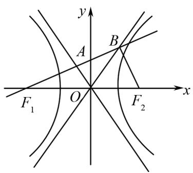

# 学会解题

# ——指向高阶思维的圆锥曲线解题

何瑞林(福建省厦门市同安实验中学 361100)

【摘 要】 本文介绍指向高阶思维的圆锥曲线解题方法,具体包括四种策略:使用设而不求法简化问题;借助数形结合法直观理解题意;先猜想后验证,培养数学直觉与验证能力;逆向思考,打破常规思维模式.旨在通过这些策略,帮助学生提升解题能力和思维水平.

【关键词】高中数学;圆锥曲线;解题策略

圆锥曲线解题不仅是对知识的应用,更是对高阶思维的锻炼.本文旨在探讨指向高阶思维的圆锥曲线解题方法,通过四种策略,帮助学生构建更加灵活的解题思路.文中所阐述的方法不仅能够简化复杂计算,还能培养学生的直观理解、直觉验证和逆向推理等能力,为学生在圆锥曲线乃至整个数学学习中打开新的视角.

# 1 使用设而不求法解题

设而不求法的核心在于基于整体框架进行调整,以及在解题全过程中贯彻整体性思维.该方法的精华之处在于,运用科学手段降低计算复杂度.实际操作时,通常的策略是选取恰当的变量,巧妙转换问题条件,利用变量作为桥梁,间接求解.

例 1 椭圆 $C: \frac{x^{2}}{2} + y^{2} = 1$ 的右焦点为 F, l 为过点 F 的直线，与椭圆 C 交于 A, B 两点。M 点的坐标为 $(2,0)$ ，O 为坐标原点，求证： $\angle OMB = \angle OMA$ 。

解析 本题的核心在于将角度相等的问题转化为斜率之和的计算. 尽管计算过程中设定了点 A, B 的坐标, 但实际上并不需要求出其具体的值.

解 设 $A(x_{1},y_{1})$ , $B(x_{2},y_{2})$ ，直线 l 的方程为 $x=my+1$ 。将直线方程代入椭圆方程 $\frac{x^{2}}{2}+y^{2}=1$ ，可得 $\frac{(my+1)^{2}}{2}+y^{2}=1$ ，展开并整理得 $(m^{2}+2)y^{2}+2my-1=0$ 。

根据韦达定理, $y_{1}+y_{2}=\frac{-2m}{m^{2}+2},y_{1}y_{2}=\frac{-1}{m^{2}+2}.$

计算直线 $MA$ 与 $MB$ 的斜率之和: $k_{MA} + k_{MB} = \frac{y_1}{x_1 - 2} + \frac{y_2}{x_2 - 2}$ ,

整理可得： $\frac{2my_1y_2 - (y_1 + y_2)}{m^2y_1y_2 - m(y_1 + y_2) + 1}$ 将 $y_{1}+$ $y_{2} = \frac{-2m}{m^{2} + 2},y_{1}y_{2} = \frac{-1}{m^{2} + 2}$ 代入其中得： $k_{MA}+$ $k_{MB} = 0$ ，即 $\angle OMB = \angle OMA.$

# 2 借助数形结合法解题

在处理涉及圆锥曲线的某些问题时,众多数学表达式往往蕴含着特定的几何意义.一旦深入挖掘表达式的潜在含义,并借助代数与几何之间的内在联系,便能找到解决问题的有效途径.

例 2 $F_{1}, F_{2}$ 分别为双曲线 $C: \frac{x^{2}}{a^{2}} - \frac{y^{2}}{b^{2}} = 1 (a > 0, b > 0)$ 的左右焦点，直线 l 过点 $F_{1}$ ，与双曲线 C 的渐近线交于 A, B 两点，若 $\overrightarrow{F_{1}A} = \overrightarrow{AB}, \overrightarrow{F_{1}B} \cdot \overrightarrow{F_{2}B} = 0$ ，试求双曲线 C 的离心率.

解析 在解决此类圆锥曲线问题时,可使用数形结合的方法,将模糊的问题条件直观化,以便快速解答问题.

text_image

y
A
B
F₁ O F₂ x

图1

解 如图1所示，由 $\overrightarrow{F_1A} = \overrightarrow{AB}$ ，可得 $|F_{1}A| = |AB|$ 又 $|OF_1| = |OF_2|$ ，则 $OA$ 是 $\triangle F_1F_2B$ 的中位线，

即 $BF_{2} \parallel OA, |BF_{2}| = 2 |OA|$ .

由 $\overrightarrow{F_1B} \cdot \overrightarrow{F_2B} = 0$ ，得 $F_1B \perp F_2B, OA \perp F_1A$

则 $|OB| = |OF_1|$ ，于是 $\angle AOB = \angle AOF_1$ 。又由 $OA$ 与 $OB$ 都是渐近线，得 $\angle BOF_2 = \angle AOF_1$ 。

因为 $\angle BOF_{2} + \angle AOF_{1} + \angle AOB = \pi$ ,

所以 $\angle BOF_{2} = \angle AOF_{1} + \angle BOA = 60^{\circ}$

因为渐近线 OB 的斜率为 $\frac{b}{a} = \tan 60^{\circ} = \sqrt{3}$ ，所以该双曲线的离心率为 $e = \frac{c}{a} = \sqrt{1 + \left(\frac{b}{a}\right)^{2}} = 2$ .

# 3 先猜想后验证解题

面对圆锥曲线中复杂的计算难题,可以尝试大胆假设参数值,随后将其代入相关公式进行验证,以此达到简化计算流程的目的.对于难以着手的问题,从特殊情形入手不失为一种策略,将普遍问题特殊化处理,能使解决复杂问题的路径更加直观简洁,同时对具体问题进行归纳概括,从整体上把握问题的一般规律,有助于实现批量求解.

例 3 几何学中存在“蒙日圆”的著名定理. 该定理为: 椭圆上两条互相垂直的切线的交点必在一个与椭圆同心的圆上, 该圆称为原椭圆的“蒙日圆”. 若椭圆 $C: \frac{x^{2}}{a+1} + \frac{y^{2}}{a} = 1 (a > 0)$ 的离心率 $e = \frac{1}{2}$ , 求椭圆的蒙日圆方程.

解析 因为椭圆 $C: \frac{x^{2}}{a+1} + \frac{y^{2}}{a} = 1 (a > 0)$ 的离心率 $e = \frac{1}{2}$ ，所以 $\frac{1}{\sqrt{a+1}} = \frac{1}{2}$ ，解得 a = 3。选取椭圆上的两个特殊点，即上顶点 $A(0, \sqrt{3})$ ，右顶点 $B(2, 0)$ ，经过 A, B 两点的切线方程分别为 $y_{A} = \sqrt{3}, x_{B} = 2$ ，所以两条切线的交点坐标为 $(2, \sqrt{3})$ 。由于过 A, B 两点的切线互相垂直，根据几何性质，它们的交点必然位于一个与椭圆 C 同心的圆上，通过计算，可以得到该圆的半径 $r = \sqrt{2^{2} + (\sqrt{3})^{2}} = \sqrt{7}$ ，所以椭圆 C 的蒙日圆方程为 $x^{2} + y^{2} = 7$ 。

# 4 逆向思考解题

通过识别同构性,并运用反向思考的策略,可以解决以下问题:两个几何对象满足相同的条件,则可以认为它们具有相同的结构.在直角坐标系中,两个对象的坐标会满足相同的方程. 此时, 可以通过构建同构方程来求解问题. 在处理圆锥曲线中涉及具有轮换对称性的点或线问题, 利用同构性和逆向思维, 可以有效地简化计算过程.

例 4 已知 F 为抛物线 $C: x^{2} = 2py (p > 0)$ 的焦点，且 F 到圆 $M: x^{2} + (y + 4)^{2} = 1$ 的最小距离为 4, P 为圆 M 上一点，PA, PB 为圆 M 的两条切线，A, B 为切点，求 $\triangle PAB$ 面积的最大值.

解析 已知抛物线 $C: x^2 = 4y$ ，对该函数求导得 $y' = \frac{x}{2}$ ，设点 $A(x_1, y_1), B(x_2, y_2), P(x_0, y_0)$ ，直线 $PA: y - y_1 = \frac{x_1}{2}(x - x_1)$ ，整理得 $x_1x - 2y_1 - 2y = 0$ 。同理可知，直线 $PB$ 的方程为 $x_2x - 2y_2 - 2y = 0$ 。由于点 $P$ 为两条直线的公共点，联立方程 $\left\{ \begin{array}{l} x_1x_0 - 2y_1 - 2y_0 = 0, \\ x_2x_0 - 2y_2 - 2y_0 = 0, \end{array} \right.$ 所以点 $A, B$ 的坐标满足方程 $x_0x - 2y - 2y_0 = 0$ ，所以直线 $AB$ 的方程为 $x_0x - 2y - 2y_0 = 0$ ，联立，可得 $x^2 - 2x_0x + 4y_0 = 0$ 。由韦达定理可得 $x_1 + x_2 = 2x_0, x_1x_2 = 4y_0$ ，所以有 $|AB| = \sqrt{1 + \left(\frac{x_0}{2}\right)^2} \cdot \sqrt{(x_1 + x_2)^2 - 4x_1x_2}$ ①，点 $P$ 到直线 $AB$ 的距离为 $d = \frac{|x_0^2 - 4y_0|}{\sqrt{x_0^2 + 4}}$ ②，所以 $S_{\triangle PAB} = \frac{1}{2}|AB| \cdot d$ ，将①②代入该式，整理得 $S_{\triangle PAB} = \frac{1}{2} \cdot (x_0^2 - 4y_0)^{\frac{3}{2}}$ ，因为 $x_0^2 - 4y_0 = 1 - (y_0 + 4)^2 - 4y_0 = -(y_0 + 6)^2 + 21$ ，由已知可得 $-5 \leqslant y_0 \leqslant -3$ ，所以当 $y_0 = -5$ 时， $\triangle PAB$ 的面积取最大值，为 $S_{\triangle PAB} = \frac{1}{2} \times 20^{\frac{3}{2}} = 20\sqrt{5}$ 。

# 5 结语

指向高阶思维的圆锥曲线解题方法为学生提供了更为深入的解题路径. 通过灵活运用设而不求、数形结合、猜想验证、逆向思考等策略, 学生不仅能够更高效地解决圆锥曲线问题, 还能在此过程中锻炼和提升自身的数学思维能力. 上述方法不仅适用于圆锥曲线的学习, 也能够迁移到其他数学领域, 为学生的全面发展奠定坚实基础.