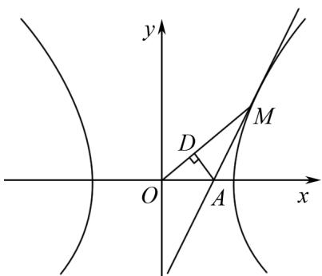

# 巧思维解题,妙变式拓展

# ——一道双曲线离心率题的求解

周郁文(江苏省苏州市吴县中学 215151)

【摘 要】 圆锥曲线中相应曲线的离心率及其综合应用问题,一直是历年高考数学的重点与热点,考查形式多样,场景变化多端.本文以一道双曲线离心率模拟题的求解为例,运用不同思维方式应用,合理进行逻辑推理与数学运算,归纳总结解题技巧,巧妙变式与拓展,引领并指导数学教学与解题研究.

【关键词】 双曲线;离心率;高中数学

圆锥曲线(主要是椭圆或双曲线)中离心率求值或最值(或取值范围)问题,一直是高考、竞赛与自主招生考试中数学命题的重点与热点.此类问题非常契合高考数学试卷“在知识交汇点处”命题的指导思想,常能巧妙融合平面几何与平面向量、函数与方程、不等式及三角函数等相关知识,全面地考查多种数学思维方式与应用,是数学命题与创新应用的重要场景,备受各方关注.

# 1 问题呈现

(2024年江西省新余市高三第二次模拟考试数学试卷)如图1所示,已知M为双曲线 $E:\frac{x^{2}}{a^{2}}-\frac{y^{2}}{b^{2}}=1(a>0,b>0)$ 上一动点,过点M作双曲线E的切线交x轴于点A,过点A作 $AD\perp OM$ 于点D, $|OD|\cdot|OM|=2b^{2}$ ,则双曲线E的离心率为()

text_image

y
D
M
O
A
x

图1

(A) $\sqrt{2}$ . (B) $\frac{\sqrt{6}}{2}$ . (C) $\sqrt{3}$ . (D) $\frac{\sqrt{5}}{2}$ .

此题以双曲线为问题应用场景,结合双曲线中的动点、切线、交点及垂线等条件的设置,以及对应线段的乘积,进而确定双曲线的离心率.解题时,通常可根据题设条件,设出相应的动点,求出对应的切线方程,结合切线与x轴的交点求出相应点的坐标,再根据距离之积建立关系式,联立题设中的关系式,即可确定双曲线的离心率.当然,实际求解过程中,可以借助多种思维方式,实现问题的多视角展开与求解.

# 2 问题破解

方法 1(几何法)

设点 $M(m,n)$ ，则 $\frac{m^{2}}{a^{2}} - \frac{n^{2}}{b^{2}} = 1$ .

对方程 $\frac{x^{2}}{a^{2}}-\frac{y^{2}}{b^{2}}=1$ 两边关于x求导，可得 $\frac{2x}{a^{2}}-\frac{2yy'}{b^{2}}=0$ ，则 $y'=\frac{b^{2}x}{a^{2}y}$ .

根据导数的几何意义, 可知点 M 处的切线方程为 $y - n = \frac{b^{2}m}{a^{2}n} (x - m)$ ，整理可得 $\frac{mx}{a^{2}} - \frac{ny}{b^{2}} = \frac{m^{2}}{a^{2}} - \frac{n^{2}}{b^{2}} = 1$ ，即点 M 处的切线方程为 $\frac{mx}{a^{2}} - \frac{ny}{b^{2}} = 1$ 。

令 y=0，可得点 $A\left(\frac{a^{2}}{m},0\right)$ .

过点 M 作 $MM_{1} \perp x$ 轴于点 $M_{1}$ ，结合 $AD \perp OM$ ，可知 A、 $M_{1}$ 、M、D 四点共圆，利用圆的割线定理，可得 $|OD| \cdot |OM| = |OA| \cdot |OM_{1}| = \frac{a^{2}}{m} \cdot m = a^{2}$ 。 $|OD| \cdot |OM| = 2b^{2}$ ，则 $a^{2} = 2b^{2}$ ，即 $\frac{b^{2}}{a^{2}} = \frac{1}{2}$ 。所以双曲线 E 的离心率 $e = \frac{c}{a} = \sqrt{1 + \frac{b^{2}}{a^{2}}} = \frac{\sqrt{6}}{2}$ 。

点评 在平面解析几何问题中,对于曲线上切线方程,可以利用导数法处理,也可以通过联立方程和判别式进行处理,还可以直接利用曲线切线的基本性质确定过曲线上一点的切线方程等.运用导数法处理时,要注意求导运算的规则与变化.而涉及平面解析几何问题中距离的计算,可以回归平面几何本质,利用平面几何中圆的割线定理进行转化与解决,在得到参数a与b的关系后,结合离心率的计算公式,即可分析与求解双曲线的离心率.

# 方法 2(向量数量积法)

设点 $M(m,n)$ ，结合双曲线切线的基本性质，可知点 M 处的切线方程为 $\frac{mx}{a^{2}} - \frac{ny}{b^{2}} = 1$ .

令 y=0，可得点 $A\left(\frac{a^{2}}{m},0\right)$ .

$$
\begin{array}{r l} & {\mid O D \mid \bullet \mid O M \mid = \mid \overrightarrow {O A} \mid \cos \langle \overrightarrow {O A}, \overrightarrow {O M} \rangle \bullet \mid \overrightarrow {O M} \mid =} \\ & {\overrightarrow {O A} \bullet \overrightarrow {O M} = \left(\frac {a ^ {2}}{m}, 0\right) \bullet (m, n) = a ^ {2}. \text {又} \mid O D \mid \bullet \mid O M \mid =} \\ & {2 b ^ {2}, \text {则} a ^ {2} = 2 b ^ {2}, \text {即} \frac {b ^ {2}}{a ^ {2}} = \frac {1}{2}. \text {所以双曲线} E \text {的离心率}} \\ & {e = \frac {c}{a} = \sqrt {1 + \frac {b ^ {2}}{a ^ {2}}} = \frac {\sqrt {6}}{2}.} \end{array}
$$

点评 涉及平面解析几何问题中距离的计算，可以联想平面向量的数量积及其运算，结合向量的投影、数量积的定义等进行转化。在实际应用过程中，逆向思维利用数量积公式进行转化与应用，也是一种独特技巧。

# 方法 3(特殊值法)

借助特殊值思维, 取 M 为双曲线 E 的右顶点, 则点 D、M、A 重合, 此时 $\left|OD\right|=\left|OM\right|=a$ , 所以 $\left|OD\right|\cdot\left|OM\right|=a^{2}$ . 又 $\left|OD\right|\cdot\left|OM\right|=2b^{2}$ , 则 $a^{2}=2b^{2}$ , 即 $\frac{b^{2}}{a^{2}}=\frac{1}{2}$ . 所以双曲线 E 的离心率 $e=\frac{c}{a}=\sqrt{1+\frac{b^{2}}{a^{2}}}=\frac{\sqrt{6}}{2}$ .

点评 在解决平面解析几何中涉及任意点的有关结论问题时,常可以借助特殊值思维,考虑取条件允许下的特殊值、特殊位置、特殊点等进行特殊化处理,这一方式能极大简化解题过程,减少数学运算量,提升解题效率.应用特殊值思维时,往往只涉及相应的定值问题或确定性的结论问题.

# 3 变式拓展

# 3.1 同类变式

变式 1 [2024 年重庆市拔尖强基联盟(西南大学附中、重庆育才中学、万州中学)高考数学联考试卷] 已知 M 为双曲线 $E: \frac{x^{2}}{a^{2}} - \frac{y^{2}}{b^{2}} = 1 (a > 0, b > 0)$ 上一动点，过点 M 作双曲线 E 的切线交 x 轴于点 A，过点 A 作 $AD \perp OM$ 于点 D，则 $|OD| \cdot |OM|$ 的值是（）

(A) $a^{2}$ . (B) $b^{2}$ . (C) $c^{2}$ . (D)不确定.

# 3.2 类比变式

依托双曲线的应用场景,合理加以类比拓展,将双曲线中的相关应用问题类比到椭圆中,便可得到对应的变式问题.

变式 2 已知 M 为椭圆 $E: \frac{x^{2}}{a^{2}} + \frac{y^{2}}{b^{2}} = 1 (a > b > 0)$ 上一动点，过点 M 作椭圆 E 的切线交 x 轴于点 A，过点 A 作 $AD \perp OM$ 于点 D，则 $|OD| \cdot |OM|$ 的值是（）

(A) $a^{2}$ . (B) $b^{2}$ . (C) $c^{2}$ . (D)不确定.

变式 3 已知 M 为椭圆 $E: \frac{x^{2}}{a^{2}} + \frac{y^{2}}{b^{2}} = 1 (a > b > 0)$ 上一动点，过点 M 作椭圆 E 的切线交 x 轴于点 A，过点 A 作 $AD \perp OM$ 于点 D， $|OD| \cdot |OM| = 2b^{2}$ ，则椭圆 E 的离心率为（）

(A) $\frac{1}{2}.$

(B) $\frac{\sqrt{2}}{2}.$

(C) $\frac{\sqrt{3}}{2}.$

(D) $\frac{\sqrt{5}}{3}.$

# 4 结语

解决圆锥曲线离心率问题的关键在于剖析椭圆或双曲线对应的实际应用场景，借助题设条件及隐含关系等，正确寻找并构建基本量 $a, b, c$ 满足的关系式或不等式，以及对应不同的椭圆或双曲线中基本量之间的确定关系。在实际寻找并构建椭圆或双曲线中基本量 $a, b, c$ 所满足的关系式或不等式时，往往可以从“数”或“形”两个视角展开：或从“数”的代数视角切入，利用代数思维，结合函数与方程等建立对应等量的关系式；或从“形”的几何视角切入，利用几何思维，结合平面几何图形直观寻找相关图形中的几何关系。当然，有时还可以借助特殊值思维，提升解题的效益与应用。