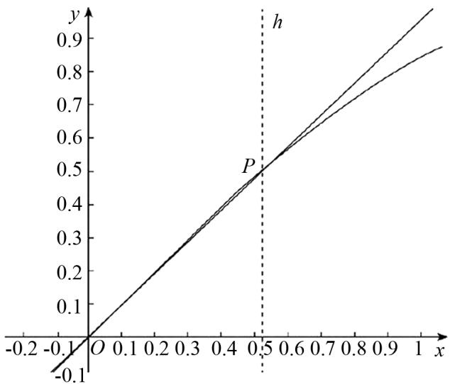

# 巧用转化思想突破高中数学解题困境

陈宇佳(安徽省望江县第二中学 246299)

【摘 要】转化作为一种十分重要的解题思想,属于基本思维策略的一种,也是相当有效的思维方式之一,它指的是在分析与处理问题时,运用某种手段把原问题进行变换,继而促进问题的解决.在高中数学解题训练中,有的题目较为复杂、常量、静态和陌生,教师可引领学生巧妙使用转化思想剖析题目内容,将原问题变得简单、变量、动态与熟悉,使其通过转化找到解题的切入点,让学生轻松解答试题,走出解题困境,增强学习数学的自信心.

【关键词】 转化思想;高中数学;解题技巧

# 1 巧用转化思想把复杂问题转化为简单问题

例 1 已知 $A=\frac{3}{2\pi}, B=\sin\frac{1}{2}, C=\frac{9}{4\pi^{2}}$ ，那么 A, B, C 之间的关系是（）

(A) $C < A < B$ .

(B)A < C < B.

(C)A<B<C.

(D)C<B<A.

详解 根据题意可设函数 $f(x)=\sin x-\frac{3x}{\pi}$ ,
且 $x \in \left(0, \frac{\pi}{6}\right)$ ,

可选取含有 $\frac{1}{2}$ 的较小区间,那么

$$
f ^ {\prime} (x) = \cos x - \frac {3}{\pi} > \cos \frac {\pi}{6} - \frac {3}{\pi} = \frac {\sqrt {3}}{2} - \frac {3}{\pi},
$$

然后进行近似计算可以得到 $\frac{\sqrt{3}}{2}-\frac{3}{\pi}<0$ ，

因为函数 $y = \cos x$ 在区间 $\left(0, \frac{\pi}{6}\right)$ 内单调递减，那么 $f'(x)=\frac{\sqrt{3}}{2}-\frac{3}{\pi}$ 也在区间 $\left(0,\frac{\pi}{6}\right)$ 内具有单调递减性，

$$
f ^ {\prime} (x) = \cos 0 - \frac {3}{\pi} > 0,
$$

据此能够得到 $f'(x)=\frac{\sqrt{3}}{2}-\frac{3}{\pi}=0$ 在区间

$\left(0,\frac{\pi}{6}\right)$ 内有唯一零点 $x_{0}$ ,

而且当 $x\in(x,x_{0})$ 时，函数 $f(x)=\sin x-\frac{3x}{\pi}$ 单调递增；

当 $x \in \left(x_{0}, \frac{\pi}{6}\right)$ 时，函数 $f(x) = \sin x - \frac{3x}{\pi}$ 单调递减，

但是依然无法确定 $x_0$ 的具体值，同样难以对 $x_0$ 和 $\frac{1}{2}$ 两者之间的大小关系进行比较，

虽然研究函数 $f(x)=\sin x-\frac{3x}{\pi}$ 有困难，

不过可转化为研究函数 $g(x) = \sin x g$ 与 $h(x) = \frac{3x}{\pi}$ 在区间 $\left(0, \frac{\pi}{6}\right)$ 内的大小关系，

此时可在同一个平面直角坐标系中把这两个函数的图象给画出来,如图1所示.

line

| x    | y     |
| ---- | ----- |
| 0.0  | 0.0   |
| 0.5  | 0.5   |
| 1.0  | 0.9   |

图1

结合图象能够发现函数 $g(x)=\sin xg$ 与 $h(x)=\frac{3x}{\pi}$ 均经过点 $(0,0)$ 和 $\left(\frac{\pi}{6},\frac{1}{2}\right)$ ,

由于函数 $g(x)=\sin x$ 的图象在区间 $\left(0,\frac{\pi}{6}\right)$ 内

为凸出的，

那么函数 $g(x) = \sin x$ 在区间 $\left(0, \frac{\pi}{6}\right)$ 内恒有 $g(x) > h(x)$ ,

也就是 $g\left(\frac{1}{2}\right) > h\left(\frac{1}{2}\right)$ ，由此得到 $\sin \frac{1}{2} > \frac{3}{\pi}$ ，

即为 A < B，

综合起来就是 C < A < B. 所以本题正确答案是(A)选项.

# 2 巧用转化思想把常量问题转化为变量问题

例 2 有 a 与 b 两个实数, 集合 $A = \{(x, y) \mid x = n, y = na + b, n \in \mathbf{Z}\}$ , 集合 $B = \{(x, y) \mid x = m, y = 3m^{2} + 15, m \in \mathbf{Z}\}$ , 集合 $C = \{(x, y) \mid x^{2} + y^{2} \leqslant 144\}$ , 请问是否存在 a, b 让 $A \cap B \neq \varnothing$ 和 $(a, b) \in \mathbf{C}$ 均能够成立.

详解 假如有 $(x, y) \in A \cap B$ 存在，

那么相应的直线 $y=ax+b$ 与抛物线 $y=3x^{2}+15$ 有公共点存在，

也就是 $ax + b = 3x^{2} + 15$ ，

通过转换得到 $ax + b - (3x^{2} + 15) = 0$ ，

将该式视为以 a 与 b 为变量的一个直线方程，

由于 $(a,b)\in C,x^{2}+y^{2}\leqslant144$ 也可以视为以a与b为变量的圆，以及圆内的点，

根据直线和圆之间的位置关系可以得到圆心与直线之间的距离是

$$
d = \frac {3 x ^ {2} + 1 5}{\sqrt {x ^ {2} + 1}} = 3 \left(\sqrt {x ^ {2} + 1} + \frac {4}{\sqrt {x ^ {2} + 1}}\right) \geqslant 1 2,
$$

不过只有当 $\sqrt{x^2 + 1} = \frac{4}{\sqrt{x^2 + 1}}$ 时，也就是 $x = \pm \sqrt{3}$ 时可以取等号，

因为 $x \in Z$ ，而 $x = \pm\sqrt{3} \notin Z$ ，

所以不存在符合条件的 a 与 b.

# 3 巧用转化思想把静态问题转化为动态问题

例 3 设已知椭圆 $\frac{x^{2}}{9} + \frac{y^{2}}{4} = 1$ 的 2 个焦点分别是 $F_{1}$ 与 $F_{2}$ ，点 P 是这个椭圆上的一点，而且焦点 $F_{1}, F_{2}$ 与点 P 为一个直角三角形的 3 个顶点，其中 $\left|F_{1}F_{1}\right| = 2\sqrt{5}$ ， $\left|PF_{1}\right| > \left|PF_{2}\right|$ ， $\left|PF_{1}\right| + \left|PF_{2}\right| = 6$ ，求 $\frac{PF_{1}}{PF_{2}}$ 的具体值.

详解 根据题意需要对直角三角形中直角的位置进行分类讨论,可能出现以下两种情况:

(1) 当 $\angle PF_{2}F_{1}=90^{\circ}$ 时，

则有 $|PF_1|^2 = |PF_2|^2 + |F_1F_2|^2$ ,

因为 $|PF_{1}| + |PF_{2}| = 6, |F_{1}F_{1}| = 2\sqrt{5}$ ,

那么 $|PF_{1}| = \frac{14}{3}, |PF_{2}| = \frac{4}{3}$ ,

则 $\frac{PF_{1}}{PF_{2}}=\frac{\frac{14}{3}}{\frac{4}{3}}=\frac{7}{2}.$

(2) 当 $\angle F_{1}PF_{2}=90^{\circ}$ 时，

则有 $|F_1F_2|^2 = |PF_1|^2 + |PF_2|^2$ ,

根据 $\left|PF_{1}\right|+\left|PF_{2}\right|=6,\left|F_{1}F_{1}\right|=2\sqrt{5}$

可以得到 $20 = \left|PF_{1}\right|^{2} + (6 - PF_{1})^{2}$

据此能够求得 $\left|PF_{1}\right|=4$ ，

则 $|PF_{2}| = 2$ ,

那么 $\frac{PF_{1}}{PF_{2}}=\frac{4}{2}=2.$

综上, $\frac{PF_{1}}{PF_{2}}$ 的具体值为 $\frac{7}{2}$ 或2.

# 4 巧用转化思想把陌生问题转化为熟悉问题

例 4 有一条直线 $3x + 4y + m = 0$ 和一个圆 $(x = 1 + \cos\theta, y = -2 + \sin\theta)$ ，两者图象没有交点，存在请求出实数 m 的具体取值范围.

详解 根据题意可直接将圆 $(x=1+\cos\theta, y=-2+\sin\theta)$ 代入直线 $3x+4y+m=0$ ,

得到一个等式 $3\cos\theta + 4\sin\theta = 5 - m$ ，

由于直线与圆不存在交点，

则表明 $-5 \leqslant 3\cos\theta + 4\sin\theta \leqslant 5$ ,

即 $-5 \leqslant 5 - m \leqslant 5$ ,

据此求得 $m \leqslant 0$ 或者 $m \geqslant 10$ ,

所以实数 m 的具体取值范围为 $m \leqslant 0$ 或者 $m \geqslant 10$ .

# 5 结语

总的来说,在高中数学解题训练活动中,不仅需关注数学理论知识的应用,还要学会灵活运用一些数学思想.教师除传授一些常规解题方法外,还需格外关注转化思想的应用,据此创新解题思路,引领学生根据具体试题巧妙采用转化思想进行解题,使其掌握转化思想的本质和使用技巧,辅助他们顺畅解决数学试题,真正摆脱解题困境.