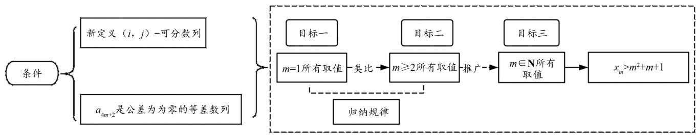
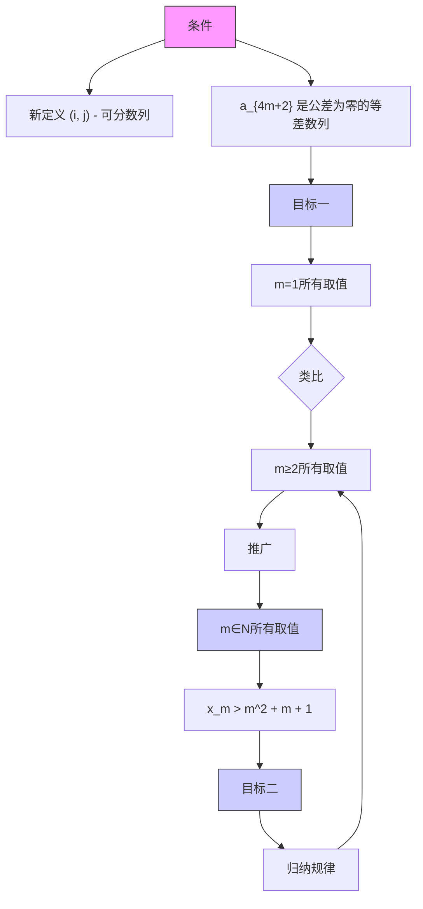

# 应用波利亚解题思想解析高考数学新定义问题

# ——以 2024 年全国Ⅰ卷第 19 题为例

马心怡 程学汉(鲁东大学数学与统计科学学院 264025)

【摘 要】 近年来高考题目形式灵活,注重对数学核心素养的考查.“新定义”类问题在教学中常存在学生难以理解题意,无法选择合适的解题策略等问题.在探索这类问题的过程中,波利亚解题思想有利于挖掘“新定义”背后的数学概念和数学思想,以培养学生的解题能力,进一步提升其数学素养.

【关键词】 波利亚解题表;高中数学;解题策略

# 1 引言

《普通高中数学课程标准(2017年版2020年修订)》提出：“高中数学教学以发展学生数学学科核心素养为导向，创设合适的教学情境，启发学生思考，引导学生把握数学内容的本质。”因此，对题目进行理解和转换，把握题目本质在数学解题过程中尤为重要。

本文基于波利亚解题思想,提出了针对“新定义”类题目的解题步骤:理解问题—转化问题—制定解决问题的方案—执行方案—解题反思四个步骤,有助于教师把控形式新颖类型的题目.

# 2 波利亚“怎样解题表”在高考解题中的应用分析

本文以 2024 年数学全国新高考 I 卷第 19 题为例进行波利亚解题表的应用分析.

设 m 为正整数, 数列 $a_{1}, a_{2}, \cdots, a_{4m+2}$ 是公差不为 0 的等差数列, 若从中删去两项 $a_{i}$ 和 $a_{j} (i < j)$ 后剩余的 4m 项可被平均分为 m 组, 且每组的 4 个数都能构成等差数列, 则称数列 $a_{1}, a_{2}, \cdots, a_{4m+2}$ 是 $(i, j)$ — 可分数列.

(1) 写出所有的 $(i,j)$ ， $1\leqslant i<j\leqslant6$ ，使数列 $a_{1},a_{2},\cdots,a_{6}$ 是 $(i,j)$ —可分数列；  
(2) 当 $m \geqslant 3$ 时, 证明: 数列 $a_{1}, a_{2}, \cdots, a_{4m+2}$ 是

# (2,13) — 可分数列；

（3）从 $a_{1}, a_{2}, \cdots, a_{4m+2}$ 中一次任取两个数 i 和 j (i < j)，记数列 $a_{1}, a_{2}, \cdots, a_{4m+2}$ 是 $(i, j)$ — 可分列的概率为 $p_{m}$ ，证明： $p_{m} > \frac{1}{8}$ .

# 2.1 明确概念,理解问题

理解问题是波利亚解题法的第一步,也是解决任何数学问题的基石.此步骤需要考虑的问题有:已知是什么?未知是什么?条件是什么?结论是什么?题目的概念是什么?能否进一步转化为熟悉的题目?已知条件是数列 $a_{1},a_{2},\cdots,a_{4m+2}$ 是公差不为零的等差数列,且m为正整数.第一问中需证明数列 $a_{1},a_{2},\cdots,a_{6}$ 是 $(i,j)$ —可分数列,即去掉两项后仍然是等差数列;第二问则推广到 $m\geqslant3$ 时,证明数列 $a_{1},a_{2},\cdots,a_{4m+2}$ 是 $(2,13)$ —可分数列;第三问继续由特殊到一般,证明数列 $a_{1},a_{2},\cdots,a_{4m+2}$ 是 $(i,j)$ —可分数列的概率 $p_{m}>\frac{1}{8}$ .

# 2.2 转化问题,把问题转化为熟悉的问题

转化题目后得出:(1)找出所有的i和j使得 $a_{6}$ 是等差数列;(2) $m\geqslant3$ 时,证明数列 $a_{1},a_{2},\cdots,a_{4m+2}$ 是等差数列.(3)在等差数列中任取两项i和 $j(i<j)$ ,则数列是 $(i,j)$ —可分数列的次数与总次数的比值大于 $\frac{1}{8}$ .总的所有 $(i,j)$ 所取的可能数为 $C_{4m+2}=8m^{2}+6m+1$ ,设所有可分数列的取值为,则 $x_{m}>\frac{1}{8}(8m^{2}+6m+1)(m\geqslant2)$ 通过放缩可以得出 $x_{m}>m^{2}+m+1(m\geqslant2)$ ,因此我们需要执果索因,一步步得出证明.

flowchart

图1

# 2.3 制定解决问题的方案

拟订方案主要是通过转化和划归的方式寻找解题思路.

方案 1 第一问中的 $a_{1}, a_{2}, \cdots, a_{6}$ ，即 m = 1 的情况，因为数列中只有 6 项，因此可以根据定义找出所有 $(i, j)$ 的可能组合。第二问的重点在于证明 m = 3 时 $a_{14}$ 满足 $(2, 13)$ — 可分数列。第三问在第二问的基础上继续证明，且 m 的取值范围更广，因此需要根据找出的规律进一步证明所有满足可分数列的 $(i, j)$ 取值与总取值，从而得出概率。

方案2 此方案的前两问解题思路与方案1相似,第三问则在形式上有些不同,根据前面分析的“从特殊到一般”的问题走向,采用数学归纳法进行推理.而数学归纳法的本质是通过“有限步骤”证明“无限命题”,其核心逻辑——“若 $P(k)$ 成立可推出 $P(k+1)$ 成立,且 $P(1)$ 成立,则对所有 $n\in N^{*}$ , $P(n)$ 成立”,难点在于学生需接受“从单个案例的递推关系推导出全体成立”的思维范式.

# 2.4 执行方案

# 方案 1

(1) 由于 $\{a_{6}\}$ 是等差数列, 可以代入特殊值如 $1,2,3,4,5,6$ 进行分析, 学生很容易发现, 6 项去除两项 $(i,j)$ 后还剩余 4 项, 只需剩余 4 项满足公差为 1 的等差数列, “掐头去尾” 能满足这一条件, 答案为 $(1,2),(5,6),(1,6)$ .  
(2) 此时, m 的取值范围由 m=1 扩大到了 $m \geqslant 3$ , 学生有了第一问的经验, 将会尝试验证 m=3 时是否满足 $(2,13)$ — 可分数列.

此时,学生将 m=3 时公差为 1 的等差数列设为 1,2,3,4,5,6,7,8,9,10,11,12,13,14,每 4 个为一组,可以分为 3 组且余两个数,因此学生可以 3 个数为一列进行分组:

$$
\begin{array}{c c c c c} 1 & 4 & 7 & 1 0 & 1 3 \\ 2 & 5 & 8 & 1 1 & 1 4 \\ 3 & 6 & 9 & 1 2 \end{array}
$$

第三行已经出现了公差为3的等差数列,但是项数不符合定义规定,需要进行删减.去除2,13后,剩余1,3,4,5,6,7,8,9,10,11,12,14,共12项,因此在分组中去除(2,13)两项后符合所证明的可分数列定义.

$$
\begin{array}{c c c c} 1 & 4 & 7 & 1 0 \\ 2 & 8 & 1 1 & 1 4 \\ 3 & 6 & 9 & 1 2 \end{array}
$$

而 $m$ 每增加1，总项数增加 $4m$ 项，因此总会增加 $m$ 项公差为1，含有4项的等差数列.因此 $m\geqslant 3$ 时，也满足(2,13）一可分数列的定义.此时教师提问：你见过类似的题目吗？分组后的每一行都是一个新的等差数列，类似于第一问中的 $\{a_6\}$ 数列去掉两项，需要“掐头去尾”.可以根据这个规律继续探索其他符合的 $(i,j)$ 序列，其中一个数是被四除余一的数，另一个数是被四除余二的数.可以设 $(4p + 1,4s + 2)$ 所有数列列举出如下形式：

$$
\begin{array}{c} 1, 2, 3 \dots , 4 p + 1, 4 p + 2, \dots , 4 s + 1, 4 s + 2, \dots , \\ 4 n + 1, 4 n + 2. \end{array}
$$

设 $0 \leqslant p \leqslant s \leqslant m$ . 当 $p$ 和 $s$ 不相等时, 可有 $\mathrm{C}_{m+1}^{2}$ 种取法, 当 $p = s$ 时则有 $m + 1$ 种取法, 因此可写为 $\mathrm{C}_{m+1}^{2} + m + 1$ 种取法. 例如 (6,13) 的序列, 是以 $(4p + 2, 4s + 1)$ 的顺序进行排列的, 设 $0 \leqslant p \leqslant s \leqslant m$ ① (中间不取等号的原因要注意).

删去这两项后， $(1,2,\cdots,4p+1)$ 是4的倍数项，后面 $(4s+2,4s+3,\cdots,4n+2)$ 个数是4的倍数，中间为 $4k+2$ 项重新分组，我们可以将其分为4列k行，具体分组如下：

$$
\begin{array}{l} 1 k + 1 2 k + 1 3 k + 1 4 k + 1 \\ 2 k + 2 2 k + 2 3 k + 2 4 k + 2 \\ 3 k + 3 2 k + 3 3 k + 3 \\ \begin{array}{c c c c} \vdots & \vdots & \vdots & \vdots \\ k & 2   k & 3   k & 4   k \end{array} \\ \end{array}
$$

这里所有 $k$ 的取值都满足吗？学生经检查不难发现，如果 $k = 1$ 时，仅仅有6项，不满足第二个项数，因此 $k$ 的取值范围限定在 $(2, +\infty)$ 上， $4s + 1 - (4p + 2) \geqslant 7, s \geqslant p + 2$ ②.

同时满足 ① 和 ② 的个数共有 $C_{m+1}^{2}-m$ 种. 将两种 p 和 s 的取值的所有个数相加, 结果共有 $2C_{m+1}^{2}+1=m^{2}+m+1$ , 猜想得证.

# 方案 2

有关数学归纳法的教学,最核心的价值是掌握由简到繁的思维方式,经历数学的“再创造”.

(3) 证明满足 $a_1, a_2, \cdots, a_{4m+2}$ 是 $(i, j)$ — 可分数列的个数 $x_m > m^2 + m + 1 (m \geqslant 2)$ .

(1) 当 m=1 时, $x_{1}=3$ .  
(2) 当 $m \geqslant 2$ 时，记 $a_{1}, a_{2}, \cdots, a_{4m+2}$ 为 $A_{m}, a_{1}, a_{2}, \cdots, a_{4m+6}$ 为 $A_{m+1}$ .

若 $A_{k}$ 为 $(i,j)$ — 可分数列，则 $A_{k + 1}$ 也是 $(i,j)$ — 可分数列，这样的 $(i,j)$ 共有 $s$ 组：

设 $m = k, (i,j)$ 排列数为 $s$ ，则当 $m = k + 1$ 时，排列数相应增加了 $x$ 项。也就是说，当 $m = k$ 时， $\frac{s}{(2k + 1)(4k + 1)} > \frac{1}{8}$ ，

当 $m=k+1$ 时， $\frac{s}{(2k+3)(4k+5)}>\frac{1}{8}$ 成立.

根据前面两问得出的规律， $(i,j)$ 可分为 $(4a+1)(4n+2)$ 和 $(4a+2)(4n+1)$ 两种形式。当 $(i,j)$ 为 $(4a+1,4n+2)$ 时， $m+1$ 比 m 项增加了 $k+2$ 项，需要证明 $k+2$ 项也成立所需的 x 数目不足，还缺 k 项，这个 k 从哪里来？也就是第二种情况 $(4a+2,4n+1)$ ，对其进行进一步分析和分组，可以得出： $n>a+1,(1,2,\cdots4a)$ 和 $(4n+3,4m+2)$ 的项数是 4 的倍数，因此可以分为 4 个一组的等差数列 $(4a+1,4a+3,4a+4,\cdots,4n,4n+2)$ ：

$$
\begin{array}{l} 4 a + 1 \quad 4 a + 1 + d \quad 4 a + 1 + 2 d \quad 4 a + 1 + 3 d \\ 4 a + 3 \quad 4 a + 3 + d \quad 4 a + 3 + 2 d \quad 4 a + 3 + 3 d \\ 4 n + 2 + \quad 4 n + 2 - 2 d \quad 4 n + 2 - d \quad 4 n + 2 \\ (n - a) \\ \end{array}
$$

最后将所有项数整合即可得证.那么 $n > a + 1$ 时共有多少种情况呢？

$$
\begin{array}{l} 1 \leqslant 1 + a <   n \leqslant k + 1, \mathrm{C} _ {k + 1} ^ {2} = \frac {(k + 1) k}{2}; \\ 1 \leqslant a + 1 <   n <   k, \mathrm{C} _ {k} ^ {2} = \frac {k}{2} (k - 1). \\ \end{array}
$$

二者相减就是前面我们所寻找的 k.

# 3 波利亚解题思想在高考新定义类题目中的应用策略

# 3.1 彻底理解新定义

学生需要耐心且细致地阅读题目,确保对新定义的内容、性质、条件及适用范围有清晰地理解.教师可以引导学生尝试构造一些简单的例子来验证新定义,这有助于更直观地理解其含义.

# 3.2 转化与关联

尝试将新定义与已学过的知识点、定理或解题方法相联系,看是否有相似之处或可以利用的共通点.如果应用新定义难以入手,就要“回到定义中”,尝试将问题转化为更熟悉或更易解决的形式.

# 3.3 制定解题计划

学生要清晰地确定解题目标,即题目要求解什么、证明什么或判断什么,将解题过程分解为一系列可操作的小步骤,每个步骤都应有明确的目标和预期的结果.

# 3.4 执行与调整

按照制定的计划逐步执行解题步骤,确保每一步都准确无误.如果在执行过程中遇到难题或发现原计划不可行,应及时调整策略,重新规划解题路径.

# 4 结语

通过上述步骤,可以有条不紊地拆解新定义问题,将其转化为基于定义规则的严密逻辑推演,最终形成“理解—转化—执行—提炼”的高效解题范式,助力考生从容应对高考中的新定义问题.

# 参考文献：

[1] 中华人民共和国教育部. 普通高中数学课程标准(2017年版 2020 年修订)[M]. 北京: 人民教育出版社, 2020.  
[2]G·波利亚. 怎样解题 [M]. 上海: 上海科技教育出版社, 2002.  
[3] 董玉轩. 解决新定义型问题困难成因及对策 [J]. 高中数理化, 2018(4): 4.