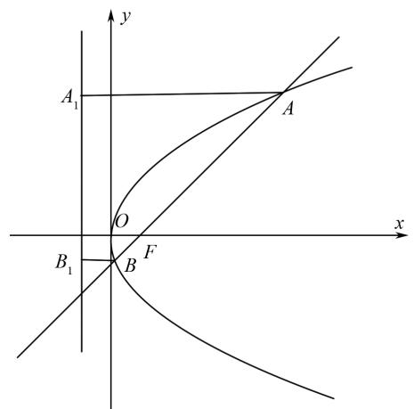
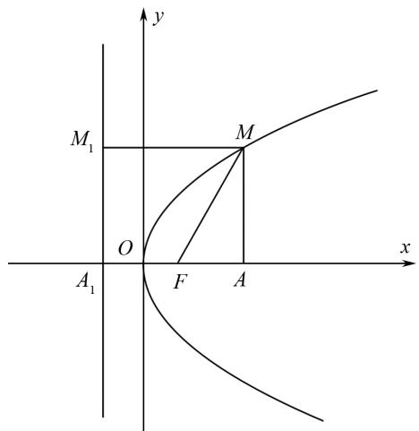
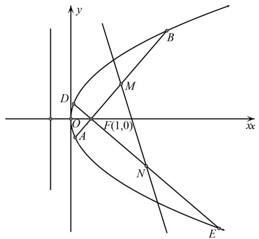
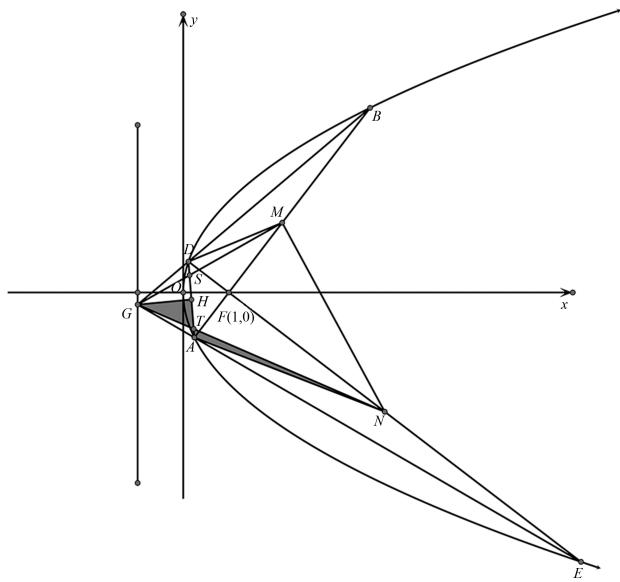
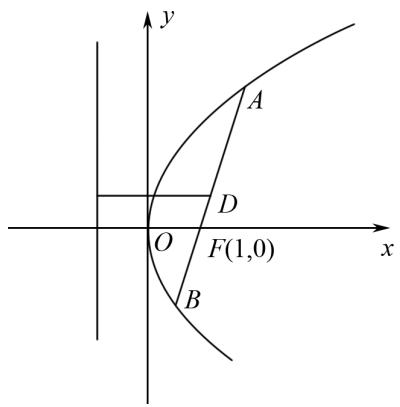

# 抛物线焦半径公式及推广与应用

寻桂生(广东省深圳市第三高级中学 518000)

【摘 要】 抛物线是高中数学学科重点研究的圆锥曲线之一,在直线与抛物线的位置关系问题中,过抛物线焦点的弦的问题十分常见.本文立足于教材,利用数形结合思想,从抛物线的方程和图形两个方面对抛物线焦点弦的性质进行初步探究.

【关键词】高中数学;抛物线;焦点弦弦长

当直线与抛物线相交时,连接两个交点的线段叫作抛物线的弦,交点与焦点的连线段叫作焦半径.经过抛物线焦点的弦的相关性质,常常是高考命题的切入点,也是高频考点,题型既有灵活小巧的客观题,又有综合性较强的主观题.下面对有关抛物线焦点弦的弦长性质进行初步探究.

例 1 （人教版数学选择性必修第一册教材 135 页例 4）斜率为 1 的直线 l 经过抛物线 $y^{2}=4x$ 的焦点 F，且与抛物线相交于 A, B 两点，求线段 AB 的长.

方法1 由已知直线 $l$ 过焦点 $F(1,0)$ ，斜率为1，可得直线 $l$ 的方程为： $y = x - 1$ ；与抛物线方程联立，得 $\left\{ \begin{array}{l} y = x - 1, \\ y^2 = 4x, \end{array} \right.$ 消 $y$ 得 $x^2 - 6x + 1 = 0$ ，解出 $x_{1,2} = 3 \pm 2\sqrt{2}$ ，所以 $A, B$ 两点的坐标为 $A(3 + 2\sqrt{2}, 2 + 2\sqrt{2}), B(3 - 2\sqrt{2}, 2 - 2\sqrt{2})$ ；所以 $|AB| = \sqrt{\left[3 + 2\sqrt{2} - (3 - 2\sqrt{2})\right]^2 + \left[2 + 2\sqrt{2} - (2 - 2\sqrt{2})\right]^2} = 8.$

text_image

y
A₁
O
B₁
F
x
A

图1

方法 2 如图 1 所示, 过 A, B 两点分别作准线的垂线, 垂足分别为 $A_{1}, B_{1}$ .

因为 $\left|AF\right|=\left|AA_{1}\right|=x_{1}+\frac{p}{2},\quad\left|BF\right|=$ $\left|BB_{1}\right|=x_{2}+\frac{p}{2}$ ，由方法1可得 $x_{1}+x_{2}=6$ ，

所以 $\left|AB\right|=\left|AF\right|+\left|BF\right|=x_{1}+x_{2}+p$ ，从而求出 $\left|AB\right|=6+2=8$ 。

两种方法相比较,方法 2 的计算量较小,且很好地利用了抛物线的定义解题.

性质 1 焦半径长及焦点弦弦长公式: 设抛物线方程为 $y^{2}=2px$ (p>0)，过焦点 $F\left(\frac{p}{2},0\right)$ 的直线 l 与抛物线相交于 $A(x_{1},y_{1})$ ， $B(x_{2},y_{2})$ 两点，AB 的中点为 $C(x_{0},y_{0})$ ，则有： $|AF|=x_{1}+\frac{p}{2}$ ， $|BF|=x_{2}+\frac{p}{2}$ ， $|AB|=x_{1}+x_{2}+p=2x_{0}+p$ .

特别地,当弦垂直于抛物线的对称轴时,可得到抛物线 $y^{2}=2px$ (p>0) 的通径 $\left|AB\right|=2p$ .

例 2 （人教版数学选择性必修第一册教材 138 页习题 3.3 第 5 题）如图 2 所示，M 是抛物线 $y^{2}=4x$ 上的一点，F 是抛物线的焦点，以 Fx 为始边、FM 为终边的角 $\angle xFM=60^{\circ}$ ，求 $|FM|$ .

text_image

y
M₁ M
O
A₁ F A x

图2

方法1 由题意可知焦点坐标 $F(1,0)$ ，因为 $\angle xFM = 60^{\circ}$ ，所以 $MF$ 的方程为： $y = \sqrt{3}(x - 1)$ ，将其与抛物线方程联立消 $y$ 得 $3x^{2} - 10x + 3 = 0$ ，解得 $x_{1} = \frac{1}{3}, x_{2} = 3$ ，由图2可得 $M(3,2\sqrt{3})$ ，

所以 $\left|FM\right|=\sqrt{(3-1)^{2}+\left(2\sqrt{3}-0\right)^{2}}=4$ 或者由定义得 $\left|FM\right|=x_{M}+\frac{p}{2}=3+1=4.$

方法2 如图2所示，过 $M$ 作准线的垂线，设垂足为 $M_{1}$ ，作 $x$ 轴的垂线，垂足为 $A$ ，设准线与 $x$ 轴的交点为 $A_{1}$ ，由抛物线的定义有 $|FM| = |MM_{1}|$ ，在 $\triangle MFA$ 中， $|AF| = |FM| \cos 60^{\circ}$ ，又 $|AA_{1}| = |MM_{1}|$ ，所以 $|FM| = |MM_{1}| = |AA_{1}| = |A_{1}F| + |AF| = p + |AF| = p + |FM| \cos 60^{\circ}$ ，所以 $|FM| = \frac{p}{1 - \cos 60^{\circ}} = \frac{2}{1 - \frac{1}{2}} = 4.$

例 3 （2024 年新高考适应性测试第 18 题）如图 3 所示，已知抛物线 $C: y^{2} = 4x$ 的焦点为 F，过 F 的直线 l 交 C 于 A, B 两点，过 F 与 l 垂直的直线交 C 于 D, E 两点，其中 B, D 在 x 轴上方，M, N 分别为 AB, DE 的中点.

(1) 证明 MN 过定点；  
(2) 设 G 为直线 AE 与 BD 的交点, 求 $\triangle GMN$ 面积的最小值.

text_image

y
B
D
M
O
F(1,0)
A
x
N
E

图 3

解析 （1）设 $A(x_{1},y_{1})$ , $B(x_{2},y_{2})$ ，且 $x_{1}<x_{2}$ . 直线 l: x=my+1，则 m>0. 由 $\left\{\begin{aligned} y^{2}&=4x,\\ x&=my+1\end{aligned}\right.$ 得 $y^{2}-4my-4=0$ ，故 $y_{1}+y_{2}=4m$ , $y_{1}y_{2}=-4$ , $\frac{y_{1}+y_{2}}{2}=2m$ , $\frac{x_{1}+x_{2}}{2}=\frac{m(y_{1}+y_{2})+2}{2}=2m^{2}+1$ ,

所以 $M(2m^{2}+1,2m)$ ，同理可得 $N\left(\frac{2}{m^{2}}+1,-\frac{2}{m}\right)$ .

若 $m \neq 1$ ，则直线 MN: $y = \frac{m^{2}}{m^{2} - 1}(x - 2m^{2} - 1) + 2m = \frac{m^{2}}{m^{2} - 1}(x - 3)$ ，MN 过点 $(3,0)$ ;

若 m=1，则直线 MN:x=3,MN 过点(3,0)，所以直线 MN 过定点(3,0).

(2) 如图 4 所示, 设 H 为 AD 的中点, S 为直线 GM 与 AD 的交点.

text_image

y
B
M
D
S
H
F(1,0)
G
x
A
N
E

图4

由 M, H 分别为 AB, AD 的中点知 $MH \parallel DG$ ,

所以 $S_{\triangle GHD}=S_{\triangle MGD}$ ，故 $S_{\triangle GSH}=S_{\triangle MSD}$ 。设 T 为直线 GN 与 AD 的交点，

同理可得 $S_{\triangle GHT} = S_{\triangle TAN}$ ，所以 $S_{\triangle GMN} = S_{\text{四边形}ADMN}$ . 由(1)得 $\left|AB\right| = \sqrt{1 + m^2}\left|y_1 - y_2\right| = 4(m^2 + 1)$ ，同理可得 $\left|DE\right| = 4\left(\frac{1}{m^2} + 1\right)$ ，所以

$$
S _ {\triangle G M N} = \frac {1}{2} \times | D N | \times | A M | = \frac {1}{8} \times | A B | \times
$$

$|DE|=2(m^{2}+1)\left(\frac{1}{m^{2}}+1\right)\geqslant8$ ，当且仅当 $m^{2}=1$ 时等号成立. 因此 $\triangle GMN$ 面积的最小值为 8.

性质 2 焦半径长公式及性质: 设抛物线方程为 $y^{2}=2px$ (p>0), 过焦点 $F\left(\frac{p}{2},0\right)$ 的直线 l 与

抛物线相交于 $A(x_{1},y_{1}),B(x_{2},y_{2})$ 两点， $\alpha$ 为直线 $AB$ 的倾斜角（不妨设 $\alpha$ 为锐角， $A$ 在 $x$ 轴上方， $B$ 在 $x$ 轴下方），则有： $|AF| = \frac{p}{1 - \cos\alpha},|BF| = \frac{p}{1 + \cos\alpha},\frac{1}{|AF|} +\frac{1}{|BF|} = \frac{2}{p},|AB| = \frac{2p}{\sin^2\alpha}$ 倾斜角 $\alpha$ 为直角或钝角时同理可推.

例 4 （2019 年教育部新高考适应性测试第 15 题）直线 l 过抛物线 $C: y^{2} = 2px (p > 0)$ 的焦点 $F(1, 0)$ ，且与 C 交于 A, B 两点，则 p = \_\_\_\_， $\frac{1}{|AF|} + \frac{1}{|BF|} =$ \_\_\_\_ .

解析 由题意知 $\frac{p}{2}=1$ ，从而p=2，利用性质2，直接得到 $\frac{1}{|AF|}+\frac{1}{|BF|}=\frac{2}{p}=1$ .

例 5 如图 5 所示, 已知以 F 为焦点的抛物线 C: $y^{2} = 4x$ 上的两点 A, B, 满足 $\overrightarrow{AF} = \lambda \overrightarrow{FB} \left( \frac{1}{3} \leqslant \lambda \leqslant 3 \right)$ , 则弦 AB 的中点 D 到 C 的准线的距离的最大值是()

text_image

y
A
D
O
F(1,0)
x
B

图 5

(A)2.

(B) $\frac{8}{3}.$

(C) $\frac{10}{3}.$

(D)4.

方法1 由题意可知抛物线 $y^{2} = 4x$ 的焦点坐标为(1,0)，准线方程为 $x = -1$ ，设 $A(x_{1},y_{1})$ ， $B(x_{2},y_{2})$ ，则因为 $|AF| = \lambda |BF|$ ，所以 $x_{1} + 1 = \lambda (x_{2} + 1)$ ①，所以 $x_{1} = \lambda x_{2} + \lambda - 1$ ，又因为 $\overrightarrow{AF} = \lambda$

$\overrightarrow{FB}$ , 所以 $(1 - x_{1}, -y_{1}) = \lambda (x_{2} - 1, y_{2})$ , 即 $1 - x_{1} = \lambda (x_{2} - 1)$ ②, 由 ① ② 可得: $x_{1} = \lambda, x_{2} = \frac{1}{\lambda}$ , 所以 $|AB| = |AF| + |BF| = (x_{1} + 1) + (x_{2} + 1) = \lambda + \frac{1}{\lambda} + 2$ . 因为 $\frac{1}{3} \leqslant \lambda \leqslant 3$ , 所以 $\left(\lambda + \frac{1}{\lambda} + 2\right)_{\max} = \frac{16}{3}$ , 则弦 $AB$ 的中点到准线的距离 $d = \frac{|AB|}{2}$ 的最大值是 $\frac{8}{3}$ .

方法2 弦 $AB$ 的中点到 $C$ 的准线的距离 $d = \frac{|AB|}{2} = \frac{\frac{2p}{\sin^2\theta}}{2} = \frac{p}{\sin^2\theta} = \frac{2}{\sin^2\theta}$ , 根据结论 $|\cos \theta| = \left|\frac{\lambda - 1}{\lambda + 1}\right| = \left|1 - \frac{2}{\lambda + 1}\right| \in \left[0, \frac{1}{2}\right]$ , $\sin^2\theta = 1 - \cos^2\theta \in \left[\frac{3}{4}, 1\right]$ , $d = \frac{2}{\sin^2\theta} \in \left[2, \frac{8}{3}\right]$ .

性质3 焦半径长公式的性质: 设抛物线方程为 $y^{2}=2px$ (p>0)，过焦点 $F\left(\frac{p}{2},0\right)$ 的直线 l 与抛物线相交于 $A(x_{1},y_{1})$ ， $B(x_{2},y_{2})$ 两点， $\alpha$ 为直线 AB 的倾斜角（不妨设 $\alpha$ 为锐角，A 在 x 轴上方，B 在 x 轴下方），则有： $\frac{|AF|}{|BF|}=\frac{1+\cos\alpha}{1-\cos\alpha}$ ，设 $\frac{|AF|}{|BF|}=\lambda$ ，则 $\cos\alpha=\frac{\lambda-1}{\lambda+1}$ 。倾斜角 $\alpha$ 为直角或钝角时同理可推。

以上都是以抛物线焦点在 x 轴为例, 当抛物线焦点在 y 轴上时, 同样可以得出相应的结论.

# 结语

抛物线焦点弦的性质有很多,以上仅仅是对其的初步探究,灵活运用抛物线焦点弦弦长相关性质,能够帮助学生解决与此相关的计算和证明问题.

# 参考文献：

[1] 折军飞. 抛物线焦点弦的九条性质及其应用 [J]. 西北成人教育学报, 2012(6): 119-121.