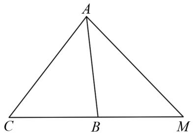
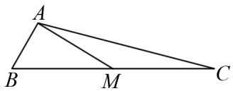

# 正、余弦定理在几何中的应用分析

冉琳(四川省广元市川师大万达中学 628000)

【摘 要】 三角形是几何学的基础图形,其边角关系的探索贯穿数学发展的历程.正、余弦定理作为解三角形的核心工具,突破了勾股定理仅适用于直角三角形的限制,将三角形边角关系的普适性规律推广至任意三角形,为解决实际几何问题提供系统化的方法论.本文从正、余弦定理的基本形式出发,通过具体实例分析其在几何问题中的应用.

【关键词】正弦定理;余弦定理;几何

正弦定理通过外接圆半径将三角形的边长与对角正弦值建立定量关联,揭示了任意三角形边角比例的统一性规律;余弦定理则以代数形式刻画边长的平方与其他边及夹角的函数关系,实现了从三角形边角关系的几何直观到代数运算的转化.二者相辅相成,覆盖从简单角度、边长计算到复杂边角混合求解的广泛场景,在工程测量、物理力学、计算机图形学等领域均有广泛且重要的应用.

# 1 正余弦定理介绍

正弦定理指出，在任意三角形中，各边与其对角的正弦之比相等，且等于外接圆直径，即公式表达为 $\frac{a}{\sin A}=\frac{b}{\sin B}=\frac{c}{\sin C}=2R$ ，其中R为外接圆半径。这一特性使得正弦定理特别适用于已知两角及一边或两边及一对非夹角的情况。相较于正弦定理，余弦定理更注重边与角的直接代数关系，其表达式为 $a^{2}=b^{2}+c^{2}-2bc\cos A$ ，本质上是勾股定理在一般三角形中的延伸与推广。这两种定理在实际应用中具有互补性：正弦定理擅长处理角度相关的边长比例计算，而余弦定理则在已知边角混合条件时更具优势。例如，在工程测量中，若需计算不可达两点间的距离，可先通过已知角度和部分边长利用正弦定理构建比例，再结合余弦定理完成最终计算。

# 2 正余弦定理在几何问题中的具体应用

例 1 如图 1 所示, 在 $\triangle ABC$ 中的内角 A, B, C 所对的边分别为 a, b, c, 已知 $b(1 + \cos C) = \sqrt{3}c \sin \angle ABC$ , 且 $\triangle ABC$ 的外接圆面积为 $\frac{49\pi}{3}$ .

text_image

A
C B M

图1

(1) 求边 c 的长;  
(2) 若 a=5，延长 CB 至 M，使得 $\cos\angle AMC=\frac{\sqrt{21}}{7}$ ，求 BM.

解析 （1）利用正弦定理和已知条件求解角 C 和边 c.

根据题目条件 $b(1 + \cos C) = \sqrt{3} \sin \angle ABC$ ,

通过正弦定理可得

$$
\sin \angle A B C (1 + \cos C) = \sqrt {3} \sin C \sin \angle A B C,
$$

化简得到 $1 + \cos C = \sqrt{3} \sin C$ ,

从而求得 $C=\frac{\pi}{3}$ ，求得 $R=\frac{7\sqrt{3}}{3}$ ，

最后利用正弦定理 $c=2R\sin C$ ，得到 c=7。

(2) 利用余弦定理和正弦定理求解 BM 的长度.

已知 $a = 5, c = 7, C = \frac{\pi}{3}$ ,

利用余弦定理 $c^{2}=a^{2}+b^{2}-2ab\cos C$ ,

求得 b=8.

再根据 $\cos\angle AMC=\frac{\sqrt{21}}{7}$ ,

求得 $\sin \angle AMC = \frac{2\sqrt{7}}{7}$ .

在 $\triangle ACM$ 中, 利用正弦定理求得 CM=10,

因此 $BM = CM - BC = 10 - 5 = 5$

小结 在多三角形组合图形中,研究或求解与角相关的边长、角度、面积问题时,通常是将问题转换到单个或多个三角形中,利用正、余弦定理通过运算解决.在解决某些具体问题时常先引入变量,如边长、角度等,然后把要解三角形的边或角用所设变量表示出来,再利用正、余弦定理列出方程,再解方程即可.

例 2 如图 2 所示, 在 $\triangle ABC$ 中, $\angle B = 60^{\circ}$ , AB = 2, M 是 BC 的中点, $AM = 2\sqrt{3}$ , 那么 AC = \_\_\_\_; $\cos \angle MAC =$ \_\_\_\_ .

text_image

A
B M C

图2

解析 由题意可得,已知 $\angle B = 60^{\circ}$ ,

所以 $\cos\angle B=\frac{1}{2}$ ,

已知 AB = 2, AM = $2\sqrt{3}$ ,

在 $\triangle ABM$ 中,由余弦定理可得:

$$
\frac {A B ^ {2} + B M ^ {2} - A M ^ {2}}{2 A B \cdot B M} = \frac {1}{2},
$$

解得 BM = 4，

因为 M 是 BC 的中点, 所以 BC = 2BM = 8,

在 $\triangle ABC$ 中,由余弦定理可得:

$$
\frac {A B ^ {2} + B C ^ {2} - A C ^ {2}}{2 A B \cdot B C} = \frac {1}{2},
$$

解得 $AC = 2\sqrt{13}$ ,

所以, $\cos\angle MAC=\frac{AM^{2}+AC^{2}-CM^{2}}{2AM\cdot AC}$

$$
= \frac {(2 \sqrt {3}) ^ {2} + (2 \sqrt {1 3}) ^ {2} - 4 ^ {2}}{2 \times 2 \sqrt {3} \times 2 \sqrt {1 3}} = 2 \frac {\sqrt {3 9}}{1 3}.
$$

小结 本题通过余弦定理与中点性质相结合，先在 $\triangle ABM$ 中利用已知角度和边长求出 $BM$ ，再由 $M$ 是 $BC$ 的中点推出 $BC$ 的长度，进而在 $\triangle ABC$ 中再次运用余弦定理求出 $AC$ ，最后在 $\triangle AMC$ 中通过余弦定理求得 $\cos \angle MAC$ . 整个解题过程层层推进，体现了利用几何性质建立方程、逐步求解的数学思维方法，强调了余弦定理在解三角形问题中的多角度灵活运用.

# 3 教学启示

正、余弦定理不仅是解决三角形中边角关系问题的重要工具，更是连接几何直观与代数运算的桥梁。在实际教学中，教师要帮助学生建立清晰的应用情境意识。正、余弦定理的选用并非依赖机械记忆，而是需基于具体题设条件的结构特征进行判断。如已知两边及夹角、三边或边角混合条件时，应引导学生主动联想到使用余弦定理；若已知两角及一边，或角边比例关系，应鼓励学生尝试使用正弦定理。教师要重视公式背后的几何意义与推理逻辑。如余弦定理的本质是勾股定理在一般三角形中的推广，而正弦定理反映的是三角形外接圆的对称性质。教师在讲授时应通过图形演示、向量投影、坐标法等方式帮助学生理解定理的来源，避免“套公式”式机械运算。此外，正余弦定理也为数学建模提供了基础支撑。在物理、工程等实际问题中，许多力的合成、位移分析、结构计算都涉及三角形的边角关系。可在教学中设计跨学科问题情境，如测量建筑物高度、确定物体运动路径、计算力的合成等，增强学生的综合应用意识。

# 参考文献：

[1] 杨莉. 用余弦定理解答两类三角形问题的思路 [J]. 语数外学习 (高中版上旬), 2025(3): 46.  
[2] 郭秀云. 余弦定理的巧妙应用 [J]. 高中生学习, 2025(3): 50-51.  
[3] 张佳成. 如何用正余弦定理解答三角形问题 [J]. 语数外学习 (高中版上旬), 2025(1): 40-41.