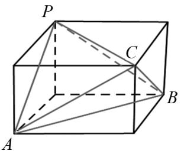

# 突破关键节点,构建创新路径

余可(杭州师范大学信息科学与技术学院 311100)

【摘 要】 问题是数学的心脏,试题是问题的载体.波利亚解题理论对数学解题具有重要指导意义,而解题时注重“切入点”的正确选择,对学生思路拓展与数学学科核心素养提升同样具有重要价值.

【关键词】 波利亚解题理论;切入点;高中数学

学习数学离不开解题,波利亚在《怎样解题》一书中指出:“关于解题,需找出已知数据与未知量之间的联系,如果找不到直接的联系,你也许不得不去考虑辅助信息.”而解题时“切入点”的正确选择,不仅能快速找准解题方向,更能优化解题过程.本文从以下几方面阐述寻找“切入点”的途径.

# 1 由特殊到一般的思想寻找“切入点”

由特殊到一般,再由一般到特殊的反复认识过程是人们认识世界的基本过程之一,数学研究也不例外,所以特殊与一般的思想在高考与竞赛中都占有重要的位置.在数学问题中,特殊化方法对解决问题具有重要的导向作用.从特殊情况出发展开联想,能快速明确解决问题的方向.

例 1 （2024 年全国中学生奥林匹克数学竞赛浙江赛区初赛试题第 8 题）若对所有大于 2024 的正整数 n，成立 $n^{2024} = \sum_{i=0}^{2024} a_i C_n^i, a_i \in N^*$ ，则 $a_1 + a_{2024} = \_\_\_\_$ .

分析 本题可以通过特殊情况 $n=C_{n}^{1}, n^{2}=2!$ $C_{n}^{2}+C_{n}^{1}, n^{3}=3!$ $C_{n}^{3}+6C_{n}^{2}+C_{n}^{1}$ ，从中找到切入点，发现规律，然后利用这一规律解决问题.

解 因为 $n=C_{n}^{1}, n^{2}=2!$ $C_{n}^{2}+C_{n}^{1}, n^{3}=3!$ $C_{n}^{3}+6C_{n}^{2}+C_{n}^{1}$ ,

设 $n^{k}=k!\ C_{n}^{k}+a_{k-1}C_{n}^{k-1}+\cdots+a_{2}C_{n}^{2}+C_{n}^{1},n>k,a_{2},\cdots,a_{k-1}$ 为正整数.

那么 $n^{k+1}=k!$ $nC_{n}^{k}+a_{k-1}nC_{n}^{k-1}+\cdots+a_{2}nC_{n}^{2}+$ $nC_{n}^{1}$ ,

以及 $nC_{n}^{i}=(i+1)C_{n}^{i+1}+iC_{n}^{i}$ ,

则 $n^{k+1}=(k+1)!\mathrm{C}_{n}^{k+1}+b_{k}\mathrm{C}_{n}^{k}+\cdots+b_{2}\mathrm{C}_{n}^{2}+\mathrm{C}_{n}^{1},b_{2},\cdots,b_{k}$ 为正整数.

所以 $a_{1}=1, a_{2024}=2024!$ ,

则 $a_1 + a_{2024} = 1 + 2024!$ .

# 2 由式子的结构特点寻找“切入点”

在解题时,要善于观察、分析题目中式子的结构,许多时候从试题的结构中能发现解题的“切入点”,能获得独到的解法.

例 2 已知数列 $\{a_{n}\}$ 满足 $a_{1}=2, a_{n+1}=\frac{1+a_{n}}{1-a_{n}}$ ，则 $a_{2024}=$ \_\_\_\_.

分析 观察式子 $a_{n+1}=\frac{1+a_{n}}{1-a_{n}}$ 的结构, 联想到公式 $\tan\left(\alpha+\frac{\pi}{4}\right)=\frac{1+\tan\alpha}{1-\tan\alpha}$ , 进而可通过直线的斜率求解.

解 设直线 $l_{n}$ 的倾斜角为 $\theta_{n}$ ，斜率为 $k_{n}$ ，

则 $a_{n} = k_{n} = \tan \theta_{n}$

令 $k_{n+1}=\tan\left(\theta_{n}+\frac{\pi}{4}\right)$ , $a_{1}=k_{1}=\tan\theta_{1}=2$ ，所以直线 $l_{n+1}$ 是由直线 $l_{n}$ 逆时针旋转 $45^{\circ}$ 得到的.

则数列 $\{a_{n}\}$ 以4为周期，故 $a_{2024}=\frac{1}{3}$ .

# 3 借助模型寻找“切入点”

立体几何是研究现实世界中物体形状、大小与位置关系的数学学科. 在解立体几何时, 可以聚焦长方体这一模型, 从模型中寻找“切入点”, 能获得意想不到的效果.

例 3 （2018 年浙江预赛第 10 题）四面体 P —

ABC 中， $PA = BC = \sqrt{6}$ ， $PB = AC = \sqrt{8}$ ， $PC = AB = \sqrt{10}$ ，则该四面体外接球的半径为 \_\_\_\_.

分析 解本题时,若能联系到长方体的相对两个面的体对角线相等,则就能借助长方体这一模型快速解决.

解 可将四面体 P-ABC 放入长方体中，设长方体的长、宽、高分别为 a, b, c，则该长方体的外接球就是该四面体的外接球，且 $a^{2} + b^{2} = 6, b^{2} + c^{2} = 8, c^{2} + a^{2} = 10$ .

所以 $a^{2}+b^{2}+c^{2}=12$ ，该四面体外接球的半径为 $\sqrt{3}$ .

text_image

P
C
A
B

图 1

# 4 借助位置特征寻找“切入点”

许多与几何相关联的试题都具有一些特定的位置特点,借助位置特征寻找“切入点”,可快速找准解题方向,明确解题思路.

例 4 对勾函数 $y = x + \frac{1}{x}$ 本质上也是一种双曲线, 其渐近线为 y 轴和直线 y = x, 则其离心率是 \_\_\_\_.

分析 本题只需确定双曲线两条渐近线之间的夹角与离心率的位置关系. 设渐近线与实轴之间的夹角为 $\theta$ ，求出 $\tan \theta = \sqrt{2} - 1$ ，结合 $\tan \theta = \sqrt{e^2 - 1}$ ，即可解决问题.

解 由题意知双曲线 $y=x+\frac{1}{x}$ 的两条渐近线之间的夹角为 $\frac{\pi}{4}$ ,

若其等价于标准形式 $\frac{x^{2}}{a^{2}}-\frac{y^{2}}{b^{2}}=1(a>0,$

$$
b > 0),
$$

则其两条渐近线之间的夹角为 $\frac{\pi}{4}$ ，设渐近线与实轴之间的夹角为 $\theta$ ，

则 $2\theta = \frac{\pi}{4}$ ，所以 $\theta = \frac{\pi}{8}$

则 $\tan \theta = \frac{b}{a} = \sqrt{\frac{c^2 - a^2}{a^2}} = \sqrt{e^2 - 1}$

由 $\tan2\theta=\tan\frac{\pi}{4}=\frac{2\tan\theta}{1-\tan^{2}\theta}=1$ ,

解得 $\tan\theta=\sqrt{2}-1$ (负值舍去),

故 $\sqrt{e^{2}-1}=\sqrt{2}-1$ ,

结合 e > 1，则离心率 $e = \sqrt{4 - 2\sqrt{2}}$ .

解后反思 数学解题时,解题方向是否合理,解题过程是否简洁,很大程度上取决于“切入点”选择是否得当.因此,在解题时要注重灵活运用所学知识,从不同角度寻找关键“切入点”,从而找到提出解决问题的新思路、新方法、新路径,培养创新意识和创新精神.

# 5 结语

对关键“切入点”选择能力的持续训练,能够有效提升逻辑思维的系统性和严谨性,培养对复杂问题的抽象概括与模型构建能力.在尝试构建新路径的过程中,更能发展创新思维的发散性、深刻性.同时,这种对问题本质的洞察训练,还能强化数学运算的策略性、直观想象的延展性及数据分析的结构化思维,最终形成自主探究、灵活应变的核心素养与终身受益的解决实际问题的关键能力.

# 参考文献：

[1] G·波利亚. 怎样解题 [M]. 上海: 上海科技教育出版社, 2011.  
[2] 单導. 我怎样解题 [M]. 哈尔滨: 哈尔滨工业大学出版社, 2013.