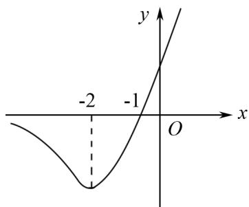

# · 例题精讲 ·

# 解锁函数难题,多角度深入分析导数的作用

# ——以一道多选题为例讨论解题逻辑与思维拓展

张蕊蕊(江苏省南京市六合区程桥高级中学 211500)

【摘 要】 函数问题是高考数学的重点考查部分. 导数作为解决函数问题的主要工具, 在多种函数相关问题求解中均有体现. 本文以一道函数多选题为例, 针对不同选项内容, 从方程解的得出、函数零点问题、不等式恒成立及函数参数范围确定等角度体会导数对于函数问题求解的重要性, 明确如何利用导数求解不同的函数问题, 加强导数与函数表达式、性质之间的联系.

【关键词】 函数;导数;高中数学;解题技巧

# 1 引言

函数问题作为高考试题的必考部分,在选择题、填空题及解答题中均有涉及.随着对学生核心素养要求的不断提升,函数问题不再局限于针对某一部分内容进行考查,以避免学生根据特殊值或者选项数值反推题目答案时缺乏科学性,而是结合新高考多选题型进行多方面的综合考查,需要学生对题目条件展开逻辑分析,利用导数与函数性质进行解题,展现具体的思维过程,重点关注学生的实践能力.下面以一道典型的复合含参函数相关问题中导数的综合应用过程为例,引导学生突破对函数问题的畏难情绪,提升逻辑推理能力,培养实践型人才.

# 2 试题呈现与分析拓展

（多选题）已知函数 $f(x) = x(\mathrm{e}^{x} - a)$ ，则（ ）

(A) 当 $a = 1$ 时, 方程 $f'(x) = x + \ln(1 + x)$ 无解.  
(B) 当 $a = 2$ 时, 存在实数 $k$ 使得函数 $h(x) = f(x) + k(x + 1)^2$ 有两个零点.  
(C) 若 $1 + x + \ln x \leqslant f(x)$ 恒成立, 则 $a \leqslant 0$ .  
(D) 若方程 $\left[f'(x)\right]^{2}-5f'(x)+6=0$ 有 3 个不等的实数解，则 $-2-\mathrm{e}^{-2}<a<-2$ .

考点分析 观察本题中的函数表达式,可以发现函数 $f(x)$ 为复合函数,同时函数中存在可变参数 a,因此,在求解过程中,学生必须考虑参数对函数整体的影响.前两个选项中,参数数值已经给出,题目难度有所降低,后两个选项则是集中于不同条件下的参数范围求解.四个选项分别体现出导数在函数问题中主要的应用领域,第一种,方程解的存在性,函数与方程存在着紧密联系,通过利用函数求导,根据导函数大小可知原函数的单调性及图象交点,从而判断是否存在结果;第二种,构造函数零点问题,通常会出现一个复杂函数,观察函数表达式,利用极值或零点定理求解;第三种,不等式恒成立时的参数限制,利用分离参数法,结合导数,发现构造函数的极值,寻找满足题意的参数范围;第四种,复合方程解的个数与参数范围确定,条件中出现一个与导函数相关的二次方程,求解时可以观察二次方程解的数值及不同方程解的个数,结合导数画出构造函数草图,求解参数范围.

解题指导 当参数 a=1 时，原函数变化为 $f(x)=x\left(\mathrm{e}^{x}-1\right)$ ，对其进行求导， $f'(x)=\mathrm{e}^{x}-1+x\mathrm{e}^{x}=(1+x)\mathrm{e}^{x}-1$ ，方程变化为 $(1+x)(\mathrm{e}^{x}-1)-\ln(1+x)=0$ ，令 $g(x)=(1+x)(\mathrm{e}^{x}-1)-\ln(1+x)$ ，观察新函数与 x 轴是否存在交点，即方程解的存在性， $g'(x)=\mathrm{e}^{x}-1+(1+x)\mathrm{e}^{x}-\frac{1}{1+x}=(2+x)\mathrm{e}^{x}-\frac{2+x}{1+x}, x>0, g'(x)>0, g(x)$ 单调递增， $x<0, g'(x)<0, g(x)$ 单调递减，所以 $g(x)\geqslant g(0)=0$ ，即 $g(x)=0$ 有解，选项(A)错误.

当参数 a=2 时，原函数变化为 $f(x)=x\left(\mathrm{e}^{x}-2\right)$ ， $h(x)=f(x)+k(x+1)^{2}$ ，是否存在实数 k 满足条件,可以根据选项内容进行反推,只要 $h(x)$ 中的两部分数值均为 0 即可,实数取 0,后半部分为 0,f(x)=0,存在 x=0,x= $\ln2$ 两个零点,所以选项(B)正确.

问题类型为函数恒成立问题, 将 $f(x)$ 代入不等式中, 同时需要求参数的取值范围, 所以可以使用分离参数法, 通过将新函数的最值与恒成立关系进行转化, 发现满足条件的参数范围. 因此, $1 + x + \ln x \leqslant f(x)$ 恒成立, 即 $a \leqslant \frac{x e^{x} - 1 - x - \ln x}{x}$ 恒成立, 设函数 $g(x) = \frac{x e^{x} - 1 - x - \ln x}{x} (x > 0)$ , 求 $g(x)$ 的最小值.

方法1 利用同构法, 将 x 转化为 $\mathrm{e}^{\ln x}$ , 将 $g(x)$ 化简, 则 $g(x)=\frac{\mathrm{e}^{\ln x+x}-1-x-\ln x}{x}$ . 使用切线放缩法, $e^{x}\geqslant x+1$ , 当 x=0 时取等号, 故 $e^{x+\ln x}\geqslant x+\ln x+1$ , $g(x)=\frac{\mathrm{e}^{\ln x+x}-1-x-\ln x}{x}\geqslant\frac{x+\ln x+1-1-x-\ln x}{x}=0$ , 所以 $a\leqslant0$ 时不等式恒成立, 当 $x+\ln x=0$ 时取等号.

方法2 同样使用导数进行求解. $g^{\prime}(x) = \frac{x^{2}\mathrm{e}^{x} + \ln x}{x^{2}} (x > 0)$ , 令 $h(x) = x^{2}\mathrm{e}^{x} + \ln x(x > 0)$ , 讨论 $h(x)$ 的大小. $h^{\prime}(x) = \mathrm{e}^{x}(x^{2} + 2x) + \frac{1}{x} > 0 + \frac{1}{x} > 0$ 恒成立, 所以 $h(x)$ 在 $(0, +\infty)$ 上为增函数. 利用零点定理, $h(1) = \mathrm{e} > 0$ , $h\left(\frac{1}{\mathrm{e}}\right) = \mathrm{e}^{\frac{1}{\mathrm{e}} - 2} - 1 < 0$ , 所以存在 $x_{0} \in \left(\frac{1}{\mathrm{e}}, 1\right)$ , 使得 $h(x_{0}) = 0$ , 当 $x \in (0, x_{0}), h(x) < 0$ , 即 $g^{\prime}(x) < 0$ , $g(x)$ 单调递减, $x \in (x_{0}, +\infty), h(x) > 0$ , 即 $g^{\prime}(x) > 0$ , $g(x)$ 单调递增, 所以 $g(x)_{\min} = g(x_{0}) = \frac{x_{0}\mathrm{e}^{x_{0}} - 1 - x_{0} - \ln x_{0}}{x_{0}}$ . $h(x_{0}) = x_{0}^{2}\mathrm{e}^{x_{0}} + \ln x_{0} = 0$ ,

使用同构法,转化为 $x_{0}e^{x_{0}}=\ln\frac{1}{x_{0}}\cdot e^{\ln\frac{1}{x_{0}}}$ . 设 $\varphi(x)=$ $x\mathrm{e}^{x}$ ，所以 $\varphi(x_{0})=\varphi\left(\ln\frac{1}{x_{0}}\right)$ ，可知 $\varphi(x)$ 在 $(0,+\infty)$ 上为增函数，所以 $x_{0}=\ln\frac{1}{x_{0}}$ ，将其代入 $g(x)_{\min}$ ，化简得 $g(x)_{\min}=0$ ，所以 $a\leqslant0$ 时不等式恒成立.

综上所述,选项(C)正确.

出现了一个与导函数相关的二次方程，可以先求解二次函数，知道导函数的数值。已知方程为 $[f'(x)]^2 - 5f'(x) + 6 = 0$ ，解得 $f'(x) = 2$ 或 $f'(x) = 3, f'(x) = (1 + x)e^x - a$ ，所以 $(1 + x)e^x = a + 2$ 或 $(1 + x)e^x = a + 3$ ，这两个方程有3个解才能满足题意。

令 $F(x)=(1+x)\mathrm{e}^{x}, F'(x)=(2+x)\mathrm{e}^{x}$ ， $F'(x)>0, x>-2$ ，所以 $F(x)$ 在 $(-2,+\infty)$ 上单调递增， $F'(x)<0, x<-2$ ，所以 $F(x)$ 在 $(-∞,-2)$ 上单调递减。同时， $F(-1)=0$ ，尝试画出函数草图（图1）。

line

| x | y |
|---|---|
| -2 | -1 |
| 0 | 0 |
| 2 | -1 |

图1

要满足两个方程有 3 个不等的实数解，则 $\left\{\begin{aligned}F(-2)&<a+2<0,\\ a+3&>0,\end{aligned}\right.$ 即 $\left\{\begin{aligned}-\mathrm{e}^{-2}&<a+2<0,\\ a+3&>0,\end{aligned}\right.$ 解得 $-2-\mathrm{e}^{-2}<a<-2.$ 所以选项(D)正确.

# 3 结语

通过对多选题中选项的逻辑分析,或使用不同的方法解题,学生均可以发现导数在函数问题中具有举足轻重的地位,利用导数能明确函数的单调性、极值及画出草图.因此,导数是解决函数问题的核心基础.同时,同构法、放缩法及分离常数法也是函数问题常用的解题方法,这些方法能够帮助学生简化解题步骤,优化解题思维.