# 2023 年全国乙卷第 20 题的源题和变式推广

# 广东省茂名市第一中学 吴荣俏 丁文宇

摘要:本文中主要简述2023年全国乙卷解析几何大题的命题背景、命题的源题和变式,探究中点弦问题和极点极线、调和点列的一些性质相结合的问题,得到一些推论.

关键词: 极点; 极线; 调和点列; 调和线束; 中点弦; 定点; 共点

纵观历年高考的解析几何大题,可以发现诸多试题都有极点极线的背景.如果学生掌握了极点极线的相关知识,就可以从“高观点下”看待高中圆锥曲线相关内容,特别是在高考有限的时间内,可以快速看清试题的命题本质,一眼找到答案.本文中试图通过2023年全国乙卷解析几何大题谈谈其命题背景、命题的源题和变式,得到一些结论和推广.为了说明2023年全国乙卷第20题的命题背景,下面先给出极点极线和调和点列的一些概念和性质.

# 1 极点极线与调和点列概念和性质

# 1.1 极点与极线的定义

定义 1 $^{[1]}$ （几何定义）: 如图 1, 设 P 是圆锥曲线外的一点, 过点 P 引两条割线依次交圆锥曲线于 E, F, G, H 四点, 连接 EG, FH 交于点 M, 连接 EH, FG 交于 N, 则点 P 对应的极线为直线MN. 若 P 是圆锥曲线上的点，则点 P 对应的极线为圆锥曲线在点 P 处的切线，由图 1，同理可知，点 N 对应的极线为直线 PM，点 M 所对应的极线为直线 PN.

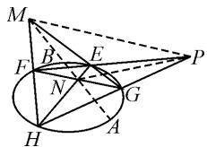  
图1

定义 $2^{[1]}$ （代数定义）：已知圆锥曲线 $\Gamma: Ax^{2} + Cy^{2} + 2Dx + 2Ey + F = 0$ ，若称 $P(x_{0}, y_{0})$ 为极点，则其对应的极线是直线 $l: Ax_{0}x + Cy_{0}y + D(x + x_{0}) + E(y + y_{0}) + F = 0$ 。在圆锥曲线方程中，点 $P(x_{0}, y_{0})$ 的极线方程可以由以 $x_{0}x$ 替换 $x^{2}$ ，以 $\frac{x_{0} + x}{2}$ 替换 x（另一变量 y 也如此）得到。

# 1.2 调和点列和调和线束的定义

定义 $3^{[2-3]}$ : 如图 2,
在直线 l 上有两基
图 2点 A, B，则在 l 上存在两点 C, D 到 A, B 两点的距离比值为定值，即 $\frac{AC}{BC} = \frac{AD}{BD} = \lambda$ ，则称顺序点列 A, C, B，D 四点构成调和点列（易得调和关系 $\frac{2}{AB} = \frac{1}{AC} +$

$\left.\frac{1}{AD}\right)$ . 同理, 也可以 C, D 为基点, 则顺序点列 A, C, B, D 四点仍构成调和点列. 所以称 A, B 和 C, D 为调和共轭.

定义 $4^{[2-3]}$ : 如图 3, 若 A, C, B, D 构成调和点列, O 为直线 AB 外任意一点, 则直线 OA, OC, OB, OD 称为调和线束. 若另一直线 m截调和线束,则截得的四点 $A', C', B', D'$ 仍构成调和点列.

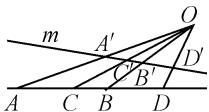  
图3

性质 $1^{[2]}$ : 设点 P 关于圆锥曲线 $\Gamma$ 的极线为 l，过点 P 任作一割线交 $\Gamma$ 于点 A, B，交 l 于点 Q，则 $\frac{PA}{PB} = \frac{QA}{QB}$ ; 反之，若有 $\frac{PA}{PB} = \frac{QA}{QB}$ 成立，则称点 P, Q 调和分割线段 AB，或称点 P, Q 关于 $\Gamma$ 调和共轭.

性质 $2^{[2-3]}$ : 已知调和线束 PA, PC, PB, PD, 若有一条直线 m 平行于调和线束中的一条, 且与其他三条分别交于三点, 则这三点中的内点平分该线段.

# 2 2023 年全国乙卷第 20 题命题背景

(2023年全国乙卷·20)已知椭圆 $C: \frac{y^2}{a^2} + \frac{x^2}{b^2} = 1$ $(a > b > 0)$ 的离心率是 $\frac{\sqrt{5}}{3}$ , 点 $A(-2,0)$ 在 $C$ 上.

(1) 求 C 的方程；  
(2) 过点 $(-2,3)$ 的直线交 C 于 P, Q 两点, 直线 AP, AQ 与 y 轴的交点分别为 M, N, 证明: 线段 MN 的中点为定点.

命题背景分析:(1)椭圆 C 的方程为 $\frac{y^{2}}{9}+\frac{x^{2}}{4}=1$ . (2) 如图 4 所示, S 是椭圆 C 的上顶点, 点 B(-2,3) 关于椭圆 $\frac{y^{2}}{9}+\frac{x^{2}}{4}=1$ 的极线方程为恰为 AS, PQ 交 AS 于点 R, 由性质 1 可知 B, P, R, Q 四点为调和点列, 则 AB,AP, AR, AQ 为调和线束. 由于 $AB \parallel y$ 轴, 则由性质 2

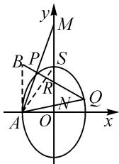  
图4

可得，S 为线段 MN 的中点.

# 3 源题分析

下面来看一下 2022 年之前的一些高考题, 是不是可以找到 2023 年全国乙卷第 20 题的影子?

例 1 （2017 年北京理·18）已知抛物线 $C: y^{2} = 2px$ 过点 $P(1,1)$ . 过点 $D\left(0, \frac{1}{2}\right)$ 作直线 l 与抛物线 C 交于不同的两点 M, N, 过点 M 作 x 轴的垂线分别与直线 OP, ON 交于点 A, B, 其中 O 为原点. (1) 略; (2) 求证: A 为线段 BM 的中点 $^{[4]}$ .

命题背景分析:(2)如图5,C: $y^{2}=x$ ,由定义2知点 $D\left(0,\frac{1}{2}\right)$ 的极线方程为y=x,而直线OP的方程为y=x,故 $D\left(0,\frac{1}{2}\right)$ 为极点,直线OP为其极线.设MN交OP于点 G，由性质 1 知 D, M, G, N 成调和点列，OD, OM, OG, ON 成调和线束。而直线 OD 平行于 BM，由性质 2 可知 A 为线段 BM 的中点。2023 年全国乙卷第 20 题，实质就是新瓶装旧酒，把 2017 年的北京理科第 18 题的抛物线背景换成椭圆背景所得。

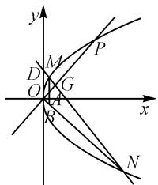

text_image

y
D M P
O G
A x
B N

图5

例 2 （2020 年高考北京卷·20）已知椭圆 $C: \frac{x^{2}}{a^{2}} + \frac{y^{2}}{b^{2}} = 1$ 过点 A (-2, -1) 且 a = 2b. (1) 略；(2) 过点 B (-4, 0) 的直线 l 交椭圆 C 于点 M, N，直线 MA，NA 分别交直线 x = -4 于点 P, Q，求 $\frac{|PB|}{|BQ|}$ 的值 $^{[5]}$ .

命题背景分析:(2)由(1)知椭圆 $C:\frac{x^{2}}{8}+\frac{y^{2}}{2}=1$ . 如图6, 设直线 MN 与直线 x=-2 交于点 H, 因为点 $B(-4,0)$ 关于椭圆 C 的极线为直线 AH: x=-2,所以 $B, M, H, N$ 为调和点列， $AB, AM, AH, AN$ 为调和线束。又因为直线 $x = -4$ 与直线 $AH$ 平行，与直线 $AM, AN, AB$ 分别交于点 $P, Q, B$ ，由性质2知 $|PB| = |BQ|$ ，即 $\frac{|PB|}{|BQ|} = 1$ 。此时 $B$ 为 $PQ$ 的中点。若把问题(2)改为证 $PQ$ 的中点为定点，再把极点 $B$ 的位置和椭圆方程改变一下，这样就得到2023年全国乙卷第20题，它们命题背景都是性质2。

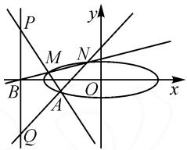

text_image

P
M
N
B
A
O
x
y
Q

图6

# 4 2023 年全国乙卷第 20 题变式探究和推广

高考难题往往是多个知识点汇聚在一起组成的，从 2023 年全国乙卷第 20 题及其题源分析, 可知性质 2 是高考的高频考点. 而圆锥曲线里的中点弦问题也是常考知识点, 它们的碰撞会产生怎样的火花呢?

(2023 年全国乙卷)题目见上文(2023 年全国乙卷第 20 题命题背景)

变式 1 S 是椭圆 C 上顶点, 过点 P 作 PT // AB, 交 AS 于点 G, 交 AQ 于点 T, 证明: 直线 QG 过定点. (如图 7)

变式 2 过点 P 作 $PT \parallel AB$ , S 是椭圆 C 上顶点, PT 交 AS 于点 G, 交 AQ 于点 T, 直线 QG 交 AB 于点 H, 证明: A, H, B 三点的纵坐标成等差数列. (如图 8)

变式 3 过点 Q 作斜率为 $\frac{3}{2}$ 的直线 QH，交椭圆于点 H，证明：直线 PH 过定点。（如图 9）

变式 4 过点 Q 作斜率为 $\frac{3}{2}$ 的直线 QH，交椭圆于点 H，证明直线 PH, OB 与 AS 三线共点。(如图 10)

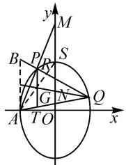

text_image

y
M
B P R S
G N Q
A T O x

图 7

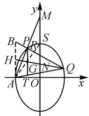

text_image

y
M
B P R S
H G N Q
A T O x

图8

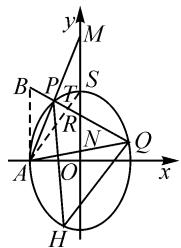

text_image

y
M
B P T S
R
N Q
A O x
H

图9

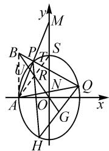

text_image

y
M
B P T S
u R N Q
A O x
G
H

图10

变式 1～4 证明省略, 变式 1 与变式 2 其证明方法可以参考以下推论 1 的证明, 变式 3 与变式 4 参考以下推论 4 的证明.

把上面的变式推广到一般情况,可以得到以下推论:

推论 1: 已知椭圆 $E: \frac{x^{2}}{a^{2}} + \frac{y^{2}}{b^{2}} = 1 (a > b > 0)$ ，过椭圆 E 外一点 $P(x_{0}, y_{0})$ 向 E 引两条切线，切点记为 A, B，再过 P 作直线 l 交 E 于 M, N 两点，过 M 作平行于 PA 的直线 MT，交直线 AB 于点 T，则直线 TN 过定点，此定点为 PA 的中点.

简证: 如图 11, 因为 PA, PB 为椭圆 E 的两条切线, 所以当 P 为极点时, 直线 AB 为点 P 对应的极线. 设 MN 交 AB 于点 G, 延长 MT 交 AN 于点

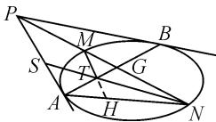  
图11

H, 设 NT 与 PA 交于点 S, 则 P, M, G, N 为调和点列, 所以 AP, AM, AG, AN 为调和线束. 由性质 2 知 $|MT| = |TH|$ . 又因为 MT 平行于 PA, 所以 $\frac{|MT|}{|PS|} = \frac{|NT|}{|NS|} = \frac{|TH|}{|AS|}$ , 从而 $|PS| = |AS|$ , 即 S 为 PA 的中点. 所以直线 TN 过定点 S.

把推论 1 中的椭圆换成双曲线和抛物线也可以得到同样的结论, 即是推论 2, 推论 3, 其证明类似于推论 1.

推论 2: 已知双曲线 $C: \frac{x^{2}}{a^{2}} - \frac{y^{2}}{b^{2}} = 1$ ，过双曲线 C 外一点 $P(x_{0}, y_{0})$ 向 C 引两条切线，切点记为 A, B，再过点 P 作直线 l 交双曲线 C 于 Q, D 两点，过点 Q 作平行于 PA 的直线 QR 与直线 AB 交于点 R，则直线 RD 过定点，此定点为 PA 的中点.

推论 3: 已知抛物线 $C: y^{2} = 2px$ ，过抛物线 C 外一点 $P(x_{0}, y_{0})$ 向 C 引两条切线，切点记为 A, B，再过点 P 作直线 l 交 C 于 M, N 两点，过点 M 作平行于 PA 的直线 MT 与直线 AB 交于点 T，则直线 TN 过定点，此定点为 PA 的中点.

圆锥曲线中斜率为定值的弦的中点轨迹问题是一类很典型的问题,当弦的斜率为某一个特殊值的时候会与调和点列产生什么新碰撞?为此得到推论4、推论5和推论6.

推论 4: 已知椭圆 $E: \frac{x^{2}}{a^{2}} + \frac{y^{2}}{b^{2}} = 1 (a > b > 0)$ ，过椭圆 E 外一点 $P(x_{0}, y_{0})$ 向 E 引两条切线，切点分别记为 A, B，再过点 P 作直线 l 交椭圆 E 于两点 M, N，过点 N 作直线 NH 平行于 AB 交椭圆 E 于点 H，则直线 MH 过定点，此定点为 PO 与 AB 的交点（O 为原点）.

证明: 如图 12, 由定义 2 可知, 直线 AB 的方程为 $\frac{xx_{0}}{a^{2}} +$ $\frac{yy_{0}}{b^{2}}=1.$ 设 $N(x_{1},y_{1}),H(x_{2},y_{2})$ ,

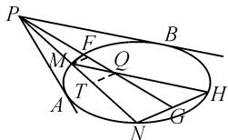  
图12

NH 的中点为 G, PG 交 MH 于点 Q ( $x_{3}, y_{3}$ ) 则有$\left\{ \begin{array}{l} \frac{x_1^2}{a^2} + \frac{y_1^2}{b^2} = 1, \\ \frac{x_2^2}{a^2} + \frac{y_2^2}{b^2} = 1, \end{array} \right.$ 两式相减，得

$$
\frac {(x _ {1} - x _ {2}) (x _ {1} + x _ {2})}{a ^ {2}} + \frac {(y _ {1} - y _ {2}) (y _ {1} + y _ {2})}{b ^ {2}} = 0. \tag {①}
$$

当直线 AB 的斜率存在且不为 0 时， $k_{AB} = \frac{y_{1} - y_{2}}{x_{1} - x_{2}} = -\frac{b^{2}x_{0}}{a^{2}y_{0}}$ ，将 $x_{1} + x_{2} = 2x_{3}, y_{1} + y_{2} = 2y_{3}$ 代

入①式得 $k_{AB} = -\frac{b^{2}}{a^{2}} \frac{x_{3}}{y_{3}}$ ，而 $k_{OP} = \frac{y_{0}}{x_{0}}, k_{OG} = \frac{y_{3}}{x_{3}}$ ，则 $k_{OP} = k_{OG}$ ，故 O, P, G 三点共线.

当直线 AB 的斜率不存在或者为 0 时, 易证 O, P, G 三点共线. 故 O, P, G 三点共线.

过点 Q 作 QT 平行于 HN，交 PN 于点 T，过点 M 作 MF 平行 HN，交 PG 于点 F. 则有

$$
\frac {| M F |}{| H G |} = \frac {| M Q |}{| H Q |} = \frac {| M T |}{| N T |}, \frac {| M F |}{| G N |} = \frac {| P M |}{| P N |},
$$

而 $|HG| = |GN|$ ，则 $\frac{|MT|}{|NT|} = \frac{|PM|}{|PN|}$ ，故 $P, M, T, N$ 为调和点列，当 $P$ 为极点时，点 $T$ 在点 $P$ 的极线 $AB$ 上。因为 $QT$ 平行于 $HN$ ，而 $HN$ 平行于 $AB$ ，所以点 $Q, T$ 在直线 $AB$ 上。故 $AB, PG, HM$ 三线共点于 $Q$ ，直线 $MH$ 过定点 $Q$ （ $Q$ 为 $PO$ 与 $AB$ 的交点）。

把推论 4 中的椭圆换成双曲线或者抛物线也可以得到相同的结论, 即是推论 5, 推论 6.

推论 5: 已知双曲线 $C: \frac{x^{2}}{a^{2}} - \frac{y^{2}}{b^{2}} = 1$ ，过双曲线 C 外一点 $P(x_{0}, y_{0})$ 向 C 引两条切线，切点分别记为 A, B，再过点 P 作直线 l 交 C 于 M, N 两点，过点 N 作直线 NH 平行于 AB 交双曲线 C 于点 H，则直线 MH 过定点，此定点为 PO 与 AB 的交点（O 为原点）.

推论 6: 已知抛物线 $C: y^{2} = 2px$ ，过抛物线 C 外一点 $P(x_{0}, y_{0})$ 向 C 引两条切线，切点分别记为 A, B，再过点 P 作直线 l 交 C 于 M, N 两点，过点 N 作直线 NH 平行于 AB 交抛物线 C 于点 H，则直线 MH 过定点，此定点为 PO 与 AB 的交点 (O 为原点).

（注:以上推论中的圆锥曲线的外部是指不包含焦点的区域。）

推论 5 和推论 6 的证明类似于推论 4, 不再详述.

从近十年高考全国卷的解析几何试题来看,其命题背景均是调和点列和极点极线的一些性质,调和点列性质与中点弦问题的结合可作为高考命题的一个新方向.

# 参考文献：

[1] 王文彬. 极点、极线与圆锥曲线试题的命制 [J]. 数学通讯, 2015(8): 62-66.

[2]朱德祥.高等几何[M].北京:高等教育出版社,1998.

[3]郑春筱.调和点列的一个特殊性质及应用[J].数学通讯,2017(7):53-55.

[4]曾建国.调和点列:一道2017年北京高考题的背景分析及应用[J].数学通讯,2017(24):59-60.

[5]晏乾.从调和结构的视角看2020年北京卷解几题[J].高中数学教与学,2021(7):35-36.Z