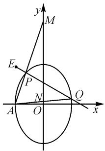

# 2023 年高考乙卷椭圆“定点”问题的多解探究

# 江苏省海安市实验中学 王丽丽

摘要: 对 2023 年全国乙卷理科圆锥曲线解答题第二问进行多思路探究, 结合多种不同解法, 帮助学生进一步理解、认识处理此类“定点”问题的常用解题思维方法, 进而不断提高学生直观想象、数学运算及逻辑推理核心素养.

关键词:2023年;高考;椭圆;定点

“定点”问题在圆锥曲线试题中经常考查,应引起我们的高度重视.关注此类问题的常用解题思维方法,有利于提高对直线和圆锥曲线相关知识的综合运用能力,有利于强化数形结合能力和运算求解能力,进而提升直观想象、数学运算及逻辑推理核心素养 $^{[1]}$ .

# 1 真题呈现

高考真题 （2023年全国乙卷理科第20题）已知椭圆 $C: \frac{y^{2}}{a^{2}} + \frac{x^{2}}{b^{2}} = 1 (a > b > 0)$ 的离心率为 $\frac{\sqrt{5}}{3}$ ，点 A(-2,0) 在 C 上.

(I) 求 C 的方程；

（Ⅱ）过点 $(-2,3)$ 的直线交C于P,Q两点，直线AP,AQ与y轴的交点分别为M,N，证明：线段MN的中点为定点.

# 2 多解探究

对于第（I）问，由椭圆的离心率为 $\frac{\sqrt{5}}{3}$ 可得 $e = \frac{c}{a} = \frac{\sqrt{a^2 - b^2}}{a} = \frac{\sqrt{5}}{3}$ ，所以 $3\sqrt{a^2 - b^2} = \sqrt{5} a$ 。又由点 $A(-2,0)$ 在 $C$ 上知 $b = 2$ ，从而有 $3\sqrt{a^2 - 2^2} = \sqrt{5} a$ ，解得 $a = 3$ 。故所求 $C$ 的方程为 $\frac{y^2}{9} + \frac{x^2}{4} = 1$ 。

下面重点对第(Ⅱ)问进行多思路探究,如图1所示,为了便于理清题意,也为了便于叙述,将点 $(-2,3)$ 记作点E.

思路一:由于本题是先经过点E作直线EQ,再作直线AM,AN,所以容易想到从直线EQ入手分析.设出直线EQ的方程,并代入椭圆的方程可得关于“x”(或“y”)的一元二次方程,进而可得根与系数的关系.另

text_image

y
M
E
P
N
A
O
Q
x

图1

一方面,根据 A, P, M 三点共线可得点 M 的坐标表示,根据 A, N, Q 三点共线可得点 N 的坐标表示,进而可得线段 MN 的中点的坐标表示.最后,通过适当的化简、运算即可顺利获证.

证法 1: 易知直线 EQ 的斜率存在, 所以可设直线 EQ 的方程为 $y - 3 = k(x + 2)$ , 将 $y = k(x + 2) + 3$ 代入 $\frac{y^{2}}{9} + \frac{x^{2}}{4} = 1$ , 整理得

$$
(9 + 4 k ^ {2}) x ^ {2} + (1 6 k ^ {2} + 2 4 k) x + 1 6 k ^ {2} + 4 8 k = 0.
$$

设点 $P(x_{1},y_{1})$ , $Q(x_{2},y_{2})$ , 则

$$
x _ {1} + x _ {2} = - \frac {1 6 k ^ {2} + 2 4 k}{9 + 4 k ^ {2}}, x _ {1} x _ {2} = \frac {1 6 k ^ {2} + 4 8 k}{9 + 4 k ^ {2}}.
$$

因为 A, P, M 三点共线，所以 $k_{AP} = k_{AM}$ ，则 $\frac{y_{1}}{x_{1} + 2} = \frac{y_{M}}{0 + 2}$ ，可得 $y_{M} = \frac{2y_{1}}{x_{1} + 2}$ ，所以点 M 的坐标为 $\left(0, \frac{2y_{1}}{x_{1} + 2}\right)$ ；同理，由 A, N, Q 三点共线可得点 N 的坐标为 $\left(0, \frac{2y_{2}}{x_{2} + 2}\right)$ 。所以线段 MN 的中点坐标为 $\left(0, \frac{y_{1}}{x_{1} + 2} + \frac{y_{2}}{x_{2} + 2}\right)$ 。

于是，可得

$$
\begin{array}{l} \frac {y _ {1}}{x _ {1} + 2} + \frac {y _ {2}}{x _ {2} + 2} \\ = \frac {k (x _ {1} + 2) + 3}{x _ {1} + 2} + \frac {k (x _ {2} + 2) + 3}{x _ {2} + 2} \\ = \frac {(4 k + 3) \left(x _ {1} + x _ {2}\right) + 2 k x _ {1} x _ {2} + 8 k + 1 2}{x _ {1} x _ {2} + 2 \left(x _ {1} + x _ {2}\right) + 4} \\ = \frac {- \frac {(4 k + 3) (1 6 k ^ {2} + 2 4 k)}{9 + 4 k ^ {2}} + \frac {2 k (1 6 k ^ {2} + 4 8 k)}{9 + 4 k ^ {2}} + 8 k + 1 2}{\frac {1 6 k ^ {2} + 4 8 k}{9 + 4 k ^ {2}} - \frac {2 (1 6 k ^ {2} + 2 4 k)}{9 + 4 k ^ {2}} + 4} \\ = \frac {1 0 8}{3 6} = 3, \\ \end{array}
$$

所以线段 MN 的中点坐标为 $(0,3)$ .

故线段 MN 的中点为定点.

证法2:设直线 EQ 的方程为 $x=my+n$ ，因为该直线过点 $(-2,3)$ ，则 $-2=3m+n$ ，即 n=-2-3m，所以直线 EQ 的方程为 x=my-2-3m，将之代入 $\frac{y^{2}}{9}+\frac{x^{2}}{4}=1$ ，整理得 $(4+9m^{2})y^{2}-18m(2+3m)y+108m+81m^{2}=0$ 。设点 $P(x_{1},y_{1}), Q(x_{2},y_{2})$ ，则有 $y_{1}+y_{2}=\frac{18m(2+3m)}{4+9m^{2}}, y_{1}y_{2}=\frac{108m+81m^{2}}{4+9m^{2}}$ 。

由 A, P, M 三点共线，知 $k_{AP} = k_{AM}$ ，则 $\frac{y_{1}}{x_{1} + 2} = \frac{y_{M}}{0 + 2}$ ，解得 $y_{M} = \frac{2y_{1}}{x_{1} + 2}$ ，所以可得点 M 的坐标为 $\left(0, \frac{2y_{1}}{x_{1} + 2}\right)$ ；同理，由 A, N, Q 三点共线可得点 N 的坐标为 $\left(0, \frac{2y_{2}}{x_{2} + 2}\right)$ 。因此，可知线段 MN 的中点坐标为 $\left(0, \frac{y_{1}}{x_{1} + 2} + \frac{y_{2}}{x_{2} + 2}\right)$ 。于是，可求得 $\frac{y_{1}}{x_{1} + 2} + \frac{y_{2}}{x_{2} + 2} = \frac{y_{1}}{my_{1} - 3m} + \frac{y_{2}}{my_{2} - 3m} = \frac{2y_{1}y_{2} - 3(y_{1} + y_{2})}{m[y_{1}y_{2} - 3(y_{1} + y_{2}) + 9]} =$

$$
\frac {\frac {2 (1 0 8 m + 8 1 m ^ {2})}{4 + 9 m ^ {2}} - \frac {5 4 m (2 + 3 m)}{4 + 9 m ^ {2}}}{m \left[ \frac {1 0 8 m + 8 1 m ^ {2}}{4 + 9 m ^ {2}} - \frac {5 4 m (2 + 3 m)}{4 + 9 m ^ {2}} + 9 \right]} = \frac {1 0 8}{3 6} = 3, \text {所以}
$$

线段 MN 的中点坐标为 $(0,3)$ .

故线段 MN 的中点为定点.

评注:遇到直线与曲线相交,往往需要先设出直线的方程,再通过代入,可由根与系数的关系灵活分析.若直线的斜率存在,则可利用点斜式设出直线的方程(如证法1);若直线的斜率不存在或直线的斜率存在且非零,则可将直线的方程设为 $x=my+n$ (如证法2).

思路二:由于点 A 在 x 轴上,坐标比较特殊(纵坐标为零),因此可考虑从直线 AP,AQ 入手进行分析.设出直线 AP 的方程,并代入椭圆的方程可得关于“x”(或“y”)的一元二次方程,进而利用根与系数的关系求出点 P 的坐标;同理求出点 Q 的坐标.然后,根据 E,P,Q 三点共线可获得一个具体的结论.据此,即可顺利证明线段 MN 的中点为定点.

证法 3: 易知直线 AP 的斜率必存在, 又点 A(-2,0), 所以可设直线 AP 的方程为 $y = k(x + 2)$ , 将之代入 $\frac{y^{2}}{9} + \frac{x^{2}}{4} = 1$ , 整理得 $(9 + 4k^{2})x^{2} + 16k^{2}x + 16k^{2} - 36 = 0$ . 于是, 可知 $-2 + x_{P} = -\frac{16k^{2}}{9 + 4k^{2}}$ , 所以 $x_{P} = \frac{18 - 8k^{2}}{9 + 4k^{2}}$ , 所以 $y_{P} = k(x_{P} + 2) = \frac{36k}{9 + 4k^{2}}$ , 因此点P 的坐标为 $\left(\frac{18-8k^{2}}{9+4k^{2}},\frac{36k}{9+4k^{2}}\right)$ .

同理,设直线 AQ 的方程为 $y=t(x+2)$ , 可得点 Q 的坐标为 $\left(\frac{18-8t^{2}}{9+4t^{2}},\frac{36t}{9+4t^{2}}\right)$ .

于是，根据 E, P, Q 三点共线可得 $k_{EP} = k_{EQ}$ ，即 $\frac{\frac{36k}{9 + 4k^{2}} - 3}{\frac{18 - 8k^{2}}{9 + 4k^{2}} + 2} = \frac{\frac{36t}{9 + 4t^{2}} - 3}{\frac{18 - 8t^{2}}{9 + 4t^{2}} + 2}$ ，化简得 $3k - k^{2} = 3t - t^{2}$ ，

再变形得 $(t-k)(t+k-3)=0.$

又易知 $t \neq k$ ，所以 $t + k = 3$ .

又根据直线 AP, AQ 的方程, 易得点 $M(0, 2k)$ , $N(0, 2t)$ .

因此线段 MN 的中点坐标为 $(0, t + k)$ ，即 $(0, 3)$ .

故线段 MN 的中点为定点.

评注:该证法从特殊点 $A(-2,0)$ 出发,充分利用点斜式分别设出直线 AP, AQ 的方程,有利于迅速求得点 P,Q 的坐标表示,然后由 E,P,Q 三点共线可顺利获证.

思路三: 注意到点 A 在 x 轴上, 点 M 在 y 轴上, 所以可利用截距式得到直线 AM 的方程(需要先设出点 M 的坐标), 将之代入椭圆方程可得关于“x”(或“y”)的一元二次方程, 再利用根与系数的关系求出点 P 的坐标; 同理出点 Q 的坐标. 最后, 根据 E, P, Q 三点共线, 即可顺利证明线段 MN 的中点为定点.

证法4:设点 $M(0,m)$ , 则结合点 $A(-2,0)$ 可得直线 $AM$ 的方程为 $\frac{x}{-2} + \frac{y}{m} = 1$ , 即 $y = m\left(1 + \frac{1}{2} x\right)$ , 将之代入 $\frac{y^2}{9} + \frac{x^2}{4} = 1$ , 整理得 $(9 + m^2)x^2 + 4m^2x + 4m^2 - 36 = 0$ . 于是, 可知 $-2 + x_P = -\frac{4m^2}{9 + m^2}$ , 得到 $x_P = \frac{18 - 2m^2}{9 + m^2}$ , 所以 $y_P = m\left(1 + \frac{1}{2} x_P\right) = \frac{18m}{9 + m^2}$ , 因此可得点 $P$ 的坐标为 $\left(\frac{18 - 2m^2}{9 + m^2}, \frac{18m}{9 + m^2}\right)$ . 同理, 设点 $N(0,n)$ , 则可求得点 $Q$ 的坐标为 $\left(\frac{18 - 2n^2}{9 + n^2}, \frac{18n}{9 + n^2}\right)$ . 于是, 根据 $E, P, Q$ 三点共线可得 $k_{EP} = k_{EQ}$ , 即 $\frac{\frac{18m}{9 + m^2} - 3}{\frac{18 - 2m^2}{9 + m^2} + 2} = \frac{\frac{18n}{9 + n^2} - 3}{\frac{18 - 2n^2}{9 + n^2} + 2}$ , 化简得 $6m - 6n = m^2 -$ $n^{2}$ ，再变形得 $(m-n)(m+n-6)=0$ 。又易知 $m\neq n$ ，所

(下转第110页)

避免路径依赖,抓住问题本质是在高三解题教学中应该特别注意的.

# 3 自命题、自成长

课程标准指出，教师应激发学生学习积极性，向学生提供充分从事数学活动的机会，帮助他们在学习的过程中真正理解和掌握基本知识与技能。学生只有通过自我认同、自我体验、自我发现，才能实现自我发展，进而实现自主成长。讲解完压轴题后，让学生学会对解题的关键内容进行概括总结，重要的一环就是指导学生独立思考后自主命题，促使他们真正感悟数学知识的本质，培养创造性思维，提高学习效率，激发学习兴趣。本道题重点提到不等式的变形技巧是将 $\mathrm{e}^x$ 置于分母之中，目的是优化函数结构，减少求导次数。有学生提到2021年八省联考第22题中，对于不等式 $\frac{2x + 2 - \cos x - \sin x}{\mathrm{e}^x}\leqslant 1$ ，将其变形得 $\mathrm{e}^x\geqslant 2x + 2-$ $\cos x - \sin x$ ，教师指导学生尝试在该不等式中嵌入参数。有的学生利用 $\mathrm{e}^x >0$ 和 $\frac{x}{\mathrm{e}^x} < 1$ 的属性，构造以 $m$

为主元开口向上的二次函数 $G(m) = \mathrm{e}^{x}m^{2} - 2xm - (2 - \cos x - \sin x)$ ，故 $G(m)$ 在 $[1, +\infty)$ 单调递增，则 $G(m) \geqslant G(1) = \mathrm{e}^{x} - 2x - (2 - \cos x - \sin x) \geqslant 0$ 。鼓励学生适当隐藏参数，有学生令 $\frac{1}{b} = m$ ，当 $0 < b \leqslant 1$ 时， $\frac{1}{b}\mathrm{e}^{x} - 2x \geqslant b(2 - \cos x - \sin x)$ 恒成立。综合各小组讨论意见，命制出如下高质量导数压轴题：

已知函数 $g(x) = \frac{1}{b}\mathrm{e}^x -2x$ ，若关于 $x$ 的不等式 $g(x)\geqslant b(2 - \cos x - \sin x)$ 恒成立，求 $b$ 的取值范围.

高三压轴题的教学需要教师在教学实践中以数学学科核心素养为依托，不断总结经验，根据高三学生的认知规律，以往年高考题为载体，认真分析题目背后的深意，除对题目中蕴含的数学知识和数学结构作出清晰的梳理外，还需要准确理解背后蕴含的数学思想，解题运用通性通法，避免路径依赖，抓住数学本质，激发学生学习兴趣，这样才能在有效的时间内高效备考，才能让素养在课堂中真正落地.

# (上接第85页)

以 $m+n=6$ . 因此, 可以得到线段 MN 的中点坐标为 $\left(0, \frac{m+n}{2}\right)$ , 即 $(0,3)$ . 故线段 MN 的中点为定点.

评注:该证法注意到点 A, M, N 均在坐标轴上, 所以灵活运用“截距式”分别设出直线 AM, AN 的方程, 从而便于求得点 P, Q 的坐标表示, 最后根据 E, P, Q 三点共线可获证.

思路四: 注意到定点 A 在 x 轴上, 动点 M, N 在 y 轴上, 所以可通过新建坐标系(让定点 A 成为坐标原点), 灵活运用“齐次化”解题技巧, 实现目标问题的巧思妙解.

证法5: 将 y 轴向左平移 2 个单位, 且以 A 为坐标原点可建立新坐标系, 则在新坐标系下点 A(0,0), E(0,3), 椭圆方程为 $\frac{y^{2}}{9} + \frac{(x-2)^{2}}{4} = 1$ , 即 $4y^{2} + 9x^{2} - 36x = 0$ . 依据题意设直线 EP 的方程为 $y = kx + 3$ (k < 0), 变形得 $\frac{y - kx}{3} = 1$ . 于是, 椭圆方程可变形为 $4y^{2} + 9x^{2} - 36x \cdot \frac{y - kx}{3} = 0$ , 整理得 $(9 + 12k)x^{2} + 4y^{2} - 12xy = 0$ , 再变形得 $4\left(\frac{y}{x}\right)^{2} - 12 \cdot \frac{y}{x} + 9 + 12k = 0$ . 设点 $P(x_{1}, y_{1}), Q(x_{2}, y_{2})$ , 则根据上述关于 “ $\frac{y}{x}$ ” 的二次方程可得 $\frac{y_{1}}{x_{1}} + \frac{y_{2}}{x_{2}} = -\frac{-12}{4} = 3$ . 易知直线

$AM$ 的方程为 $y = \frac{y_1}{x_1} x$ ，又注意到点 $M$ 在直线 $x = 2$ 上，所以可得点 $M\left(2, \frac{2y_1}{x_1}\right)$ ；同理，可得点 $N\left(2, \frac{2y_2}{x_2}\right)$ 。于是，在新坐标系下可知线段 $MN$ 的中点坐标为 $M\left(2, \frac{y_1}{x_1} + \frac{y_2}{x_2}\right)$ ，即（2，3）。因此，在原坐标系下线段 $MN$ 的中点坐标为（0，3）。故线段 $MN$ 的中点为定点。

评注:该证法比较创新,解题切入点是建立新坐标系进行分析,关键是获得关于“ $\frac{y}{x}$ ”的二次方程,并加以灵活运用.显然,该证法简捷、明了,值得我们去品味、深思.

以上，侧重对2023年全国乙卷理科圆锥曲线解答题第二问进行了多思路探究，给出了多种不同解法，有利于帮助我们进一步理解、认识处理此类“定点”问题的常用解题思维方法，进而不断提高解题的综合能力[2].

# 参考文献：

[1] 王永山. 引导深度学习 探寻素养培育——例谈圆锥曲线定值定点问题 [J]. 中学数学月刊, 2023(9): 37-40.

[2] 黄强. “问题引领” 下的一类圆锥曲线定点问题的探究 [J]. 中学数学, 2022(23): 74-75. Z