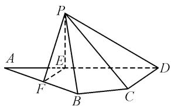

# 2024 年新高考Ⅱ卷第 17 题的探究

# 江苏省苏州实验中学 许钰娟

# 1 真题呈现

(2024年新高考Ⅱ卷第17题)如图1,平面四边形ABCD中,AB=8,CD=3, $AD=5\sqrt{3}$ , $\angle ADC=90^{\circ}$ , $\angle BAD=30^{\circ}$ ,点E,F满足 $\overrightarrow{AE}=\frac{2}{5}\overrightarrow{AD},\overrightarrow{AF}=\frac{1}{2}\overrightarrow{AB}$ ,

text_image

Geometric diagram of a pyramid with labeled vertices and auxiliary points, used in spatial geometry problems.

图 1

将 $\triangle AEF$ 沿 EF 对折至 $\triangle PEF$ ，使得 $PC=4\sqrt{3}$ .

(1) 证明: $EF \perp PD$ ;

(2) 平求面 PCD 与平面 PBF 所成的二面角的正弦值.

(1)证明:由题意可得 $AE=PE=\frac{2}{5}AD=2\sqrt{3}$ ， $AF=\frac{1}{2}AB=4,\angle FAE=\angle BAD=30^{\circ}$ ，则 $EF=\sqrt{AE^{2}+AF^{2}-2AE\cdot AF\cdot\cos30^{\circ}}=2$ ，所以 $EF^{2}+AE^{2}=AF^{2}$ ，即 $AE\perp EF$ ，亦即 $PE\perp EF$ 。又 $PE\cap AE=E,PE,AE\subset$ 平面 PAE，所以 $EF\perp$ 平面 PAE。又 $PD\subset$ 平面 PAE，所以 $EF\perp PD$ 。

(2) 解: $CD = 3, DE = 3\sqrt{3}, \angle ADC = 90^{\circ}$ ，则 $EC = \sqrt{DE^{2} + CD^{2}} = 6$ 。又 $PE = 2\sqrt{3}, PC = 4\sqrt{3}$ ，则 $EC^{2} + PE^{2} = PC^{2}$ ，故 $EC \perp PE$ 。又 $PE \perp EF, EC \cap EF = E, EC, EF \subset$ 平面 EFC，所以 $PE \perp$ 平面 EFC。又 $DE \subset$ 平面 EFC，则 $PE \perp DE, EF, ED, PE$ 两两垂直。所以以 E 为原点， $\overrightarrow{EF}, \overrightarrow{ED}, \overrightarrow{EP}$ 方向分别为 x, y, z 轴正方向建立空间直角坐标系，则 $A(0, -2\sqrt{3}, 0)$ ， $P(0, 0, 2\sqrt{3}), F(2, 0, 0), D(0, 3\sqrt{3}, 0), C(3, 3\sqrt{3}, 0)$ ， $B(4, 2\sqrt{3}, 0)$ 。易知 $\overrightarrow{PF} = (2, 0, -2\sqrt{3}), \overrightarrow{FB} = \overrightarrow{AF} = (2, 2\sqrt{3}, 0), \overrightarrow{DP} = (0, -3\sqrt{3}, 2\sqrt{3}), \overrightarrow{DC} = (3, 0, 0)$ 。设 $m = (x_{1}, y_{1}, z_{1}), n = (x_{2}, y_{2}, z_{2})$ 分别为平面 PBF、平面 PCD 的法向量。由 $\left\{\begin{aligned}\boldsymbol{m} & \cdot \overrightarrow{PF} = 2x_{1} - 2\sqrt{3}z_{1} = 0, \\ \boldsymbol{m} & \cdot \overrightarrow{FB} = 2x_{1} + 2\sqrt{3}y_{1} = 0,\end{aligned}\right.$ 不妨取 $x_{1} = \sqrt{3}$ ，于是可得向量 $m = (\sqrt{3}, -1, 1)$ ；由 $\left\{\begin{aligned}\boldsymbol{n} & \cdot \overrightarrow{DP} = -3\sqrt{3}y_{2} + 2\sqrt{3}z_{2} = 0, \\ \boldsymbol{n} & \cdot \overrightarrow{DC} = 3x_{2} = 0,\end{aligned}\right.$ 取 $y_{2} = 2$ ，可得 n = (0, 2, 3)。所以 $\cos\langle\boldsymbol{m}, \boldsymbol{n}\rangle = \frac{\boldsymbol{m} \cdot \boldsymbol{n}}{|\boldsymbol{m}| |\boldsymbol{n}|} = \frac{1}{\sqrt{5} \times \sqrt{13}} =$

$\frac{1}{\sqrt{65}}.$ 设平面 $PCD$ 与 $PBF$ 所成的二面角的大小为 $\theta$ ，则 $\sin \theta = \frac{8\sqrt{65}}{65}$ .

# 2 多种讲题策略分析

# 2.1 以“知识点整合与迁移”为核心的讲题策略

老师:同学们,今天我们来讲解2024年新高考Ⅱ卷第17题.它的特点是对基础知识的整合和灵活运用,涉及到线面位置关系向量运算和二面角的计算.我们先看第(1)小问,证明 $EF\perp PD$ .你们觉得本问考查了哪些知识点?

学生 A: 有点像立体几何的题型, 应该是垂直关系和向量知识吧.

老师:很好! 这里涉及平面的垂直和向量的计算. 根据题意,我们知道 $AE = PE = \frac{2}{5}AD = 2\sqrt{3}$ , $AF = \frac{1}{2}AB = 4$ , 且 $\angle FAE = \angle BAD = 30^{\circ}$ . 那么我们如何计算 EF 的长度?

学生 B: 可以用余弦定理吧?

老师: 对! 用余弦定理计算 EF 的长度, 得出 EF=2. 接着, 我们通过分析, $EF^{2}+AE^{2}=AF^{2}$ , 得到 $AE\perp EF$ , 也就是 $PE\perp EF$ . 因为 PE 和 AE 都在平面 PAE 内, 所以 $EF\perp$ 平面 PAE 而 PD 也在平面 PAE 内, 我们可以得出 $EF\perp PD$ .

通过这一步,我们解决了第(1)问.这一步的关键是什么?

学生 C: 需要知道如何利用平面内的垂直关系去推导其他几何关系.

老师:对! 这个过程体现了立体几何中的基础推理.我们继续看第(2)问,求平面 PCD 与平面 PBF 所成的二面角的正弦值.如果利用向量法求解,涉及两个平面的法向量的计算.我们该如何入手?

学生 A: 是不是先找两个面的法向量, 再求它们的夹角?

老师:对的.为了更方便,我们可以 E 点为原点建立空间直角坐标系,分别求出平面 PCD 和平面 PBF 的法向量.根据向量运算,平面 PBF 的一个法向量是 $(\sqrt{3}, -1, 1)$ , 平面 PCD 的一个法向量是 $(0, 2, 3)$ .那么我们接下来怎么求二面角的正弦值呢?

学生 B: 用两个法向量的数量积公式.

老师:对,利用点积公式计算这两个法向量的夹角 $\cos\langle m,n\rangle$ , 再根据正弦公式得出 $\sin\theta=\frac{8}{\sqrt{65}}=\frac{8\sqrt{65}}{65}$ . 这个结果就是两平面所成二面角的正弦值.

点评:这道题通过立体几何和向量运算的结合,考查学生对知识点的整合与迁移能力.通过这种题型的讲解,学生能更好地理解不同数学知识之间的联系.

# 2.2 以“逻辑思维能力培养”为核心的讲题策略

师:今天我们来看一道几何题,通过对题目的深入分析,帮助大家提升逻辑思维能力.首先,阅读题目,明确已知条件和平面位置关系.四边形ABCD中,给出了部分边长和角度,同时涉及折叠、垂直关系和平面角的计算.题目的核心在于几何关系的分析和推理.

生:老师,这题应该从哪里入手?

师:首先要明确求证的对象.第(1)问要求证明 $EF\perp PD$ ,我们需要找到EF和PD的空间关系.思考步骤应该是先计算AE和AF的长度,然后求出EF的长度并证明它与PD垂直.

生:好的,怎么证明 EF 和 PD 垂直呢?

师:看直线与平面的位置关系.我们知道 AE = PE, 计算出 EF 的长度, 使用余弦定理可以求出 EF = 2. 接下来, 利用几何关系, 知道 $EF \perp PE$ , 这也就意味着 $EF \perp$ 平面 PAE, 而 PD 在平面 PAE 内, 所以 $EF \perp PD$ . 通过这种向量分析的方法, 你能看到空间中不同点和线之间的关系. 这就是逻辑推理的过程.

生:原来是这样! 那第(2)问怎么做?

师:第(2)问是求二面角的正弦值,这涉及两个平面的法向量.先求平面PBF和平面PCD的法向量,通过两点确定向量后,利用数量积公式计算二者的夹角,再通过三角函数求解正弦值.关键在于法向量的正确构造和运算.

点评:通过这道题的讲解,学生能够有效理解空间几何中向量的应用,提升了几何推理能力.在解题过程中,教师引导学生逐步推导,强化了逻辑思维训练.同时,构造向量和进行数量积运算的过程,也帮助学生掌握了几何中解决二面角问题的常用技巧,实践指导性强.

# 3 教学反思

# 3.1 如何在有限时间内实现知识点的整合与迁移

在策略一中,笔者强调了“知识点整合与迁移”对学生学习的必要性.然而,在实际教学中,有限的课时与学生的个体差异,往往限制了这一策略的实施效果.如何在有限的时间内有效地实现知识点的整合与迁移,成为一个亟待解决的问题.

首先,教师需要精准把握教学的核心内容,并合理安排教学节奏.在处理立体几何问题时,不可能逐一讲解所有相关知识点.因此,教师应着重讲解那些对解题有关键作用的知识点.其次,教师需要重视学生知识结构的构建.除了课堂教学,教师还可以通过布置适量的复习与巩固作业,帮助学生在课后继续进行知识点的整合与迁移.作业的设计可以侧重知识点之间的联系与应用.最后,教师可以通过课堂讨论与互动,帮助学生实现知识点的迁移.在讨论过程中,教师可以通过启发式提问,引导学生思考不同的解题思路,从而进一步加深对知识点的理解.

# 3.2 如何在解题过程中培养学生的逻辑思维能力

立体几何题目涉及较为复杂的空间关系和推理过程,如何通过有效的教学方式,帮助学生在解题过程中培养逻辑思维能力,是教学中的一个重要挑战.教师应注重引导学生逐步形成逻辑思维的框架.在解决 $EF\perp PD$ 的问题时,教师可以通过一个层层递进的推理过程,带领学生一步步完成逻辑推导.在此过程中,教师应避免直接给出结论,而是通过提问引导学生自己思考推理过程,从而帮助他们形成清晰的逻辑思维链条;其次,在课堂教学中,教师可以先从简单的几何推理题目入手,帮助学生掌握基本的推理方法.此外,教师还应注重在教学过程中培养学生的空间想象能力.立体几何题目的推理,往往依赖于对空间图形的理解.通过几何软件或模型,教师可以帮助学生更直观地理解空间中的几何关系,从而为后续的逻辑推理打下坚实的基础.

# 3.3 如何有效传授解题技巧并提升学生的应试策略

在实际的高考中,考生不仅需要掌握知识,还需要能够迅速、准确地解答问题.如何在教学中有效传授解题技巧并提升学生的应试策略,是教师面临的一个重要课题.因此,教师应当合理分配课时,确保学生在有限的时间内能够掌握高频的解题技巧.在处理复杂的立体几何题目时,解题技巧如坐标法的应用、对称性的利用等,往往能够帮助学生快速找到突破口.在课堂上,教师可以通过对典型题目的分析,帮助学生总结常用的解题技巧,并通过练习加以巩固.例如,在解答平面PCD与平面PBF所成二面角的问题时,教师可以重点讲解如何通过平面法向量的计算快速求解二面角的正弦值,并通过类似题型的练习帮助学生掌握这一技巧.教师还应注重培养学生的应试策略.高考中的立体几何题目往往难度较大,学生在解题时需要合理分配时间,并根据题目难度调整解题顺序,教师可以通过模拟考试或限时练习,帮助学生在真实考场环境中锻炼应试能力.教师可以通过多种方式提升学生的自信心.立体几何题目的解题过程通常较为复杂,学生容易产生畏难情绪.教师可以通过正向激励与鼓励,帮助学生在解题过程中保持积极的心态,并通过反复练习提高其对解题技巧的熟练程度,从而增强应试信心.Z